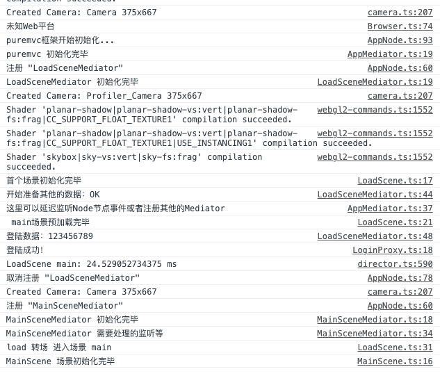
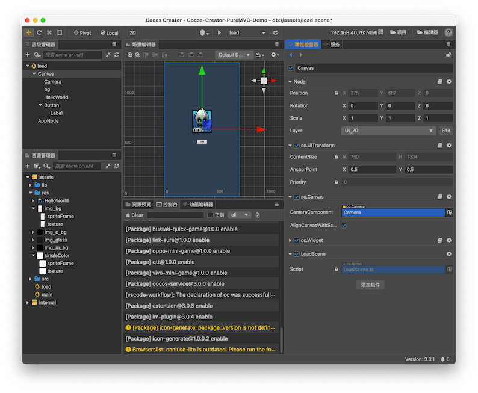

前面文章已经写过PureMVC 如何在LayaBox 里面使用 和 如何在 `Cocos Creator 2.x`版本使用，距离`Cocos Creator3.0` 版本发布已经有半年时间，这里继续老生常谈，继续说说在3.0和3.0.1如何 使用。
<!--more-->
关于PureMVC框架的介绍，这里不在赘述，关于 Cocos Creator 这样的ECS系统的引擎开发需要不需要框架，仁者见仁，智者见智，论坛里大家都曾热烈讨论，因我个人经历，我说比较偏向于使用框架的那类人，框架，其实就是团队代码规范手册，或者约束手册，通过框架的学习可以大家风格尽可能的一致，便于彼此熟悉代码（团队就自己一个人的可以忽略）另外大多数的框架都做到了模块的低耦合，信息或者事件传递的一对多的机制，便于信息发布和订阅（订阅模式）

对框架的看法文章后会再说，现在先看看如何配置吧， 源码在文末放出。

## 核心思想

### 类库从插件修改为ts文件

1. [Cocos Creator 3.0](https://www.cocos.com/docs) 开始 官方不在推荐使用插件模式，这次我们为了更好的向后兼容，这里我们采用纯`Typescript`的`PureMVC`的版本（官网也提供了对应版本）
2. 这里对版本略微改造，把多个`Typescript`文件放到了一个叫做`puremvc.ts`的文件里，对于类库或者框架来说，后期我们很少改动，稳定性比较高，所以放到一个叫做lib的文件夹里，这样避免多个文件分散开发者的心思。
3. 官方的源码除去注释大概只有不到800行 核心代码大概500行左右，算得上是一个极简的框架，如果稍有点耐心的人，读读源码便理解了框架到底解决了什么问题。
4. 引入框架的目的肯定是要解决一些问题或者通过框架的约束避免一些问题的，这一点，希望用框架的人一定要谨记，框架是官方给的一种思想的具体表现，如果自己觉得某个地方不太好，可以修改为更适合自己项目的方式，前提是自己必须了解修改后有没有引入问题和解决问题。

### 启动文件挂在常驻节点

常驻节点可以成为场景之间切换后存在的全局变量，一些常用的UI容器，或者不想伴随场景销毁而被回收的脚本或者变量可以借助常驻节点的设计挂在这个节点上。

### Cocos Creator组件周期和框架灵活结合

首先我们知道 Typescript是单继承 如果想让脚本挂在在节点上就必须继承 `Component` 这样 如果想结合`puremvc` 大概有下面几种情况

1. 脚本继承`Component`类 实现 `IMediator`，`INotifier`接口
2. 脚本继承`Mediator`类实现`Component`类的对应接口
3. 脚本继承`Mediator`类修改`Mediator`类 让 `Mediator`类 和 `Notifier`类 中间 插入一个套件 类 
4. 脚本继承`Mediator`类修改`Mediator`类 `Notifier` 类 继承`Component`类
5. 两个脚本，其中一个继承`Component`类 另外一个继承 `Mediator`类 然后进行动态或者挂载 同一个节点绑定
6. 其他模式

上面列举了几种实现结合的方法，各有优劣，弊端，这里我选择了第5个方案，其他方案大家可以自行尝试，比较他们各自的优劣。

项目研发中，一般来说方法使命唯一，或者说职责唯一，本来PureMVC 的view可以主动控制UI层的，但是[Cocos Creator](https://www.cocos.com/docs)是节点树的渲染方式控制节点和节点上组件的生命周期（`onLoad`，`onEnable`，`start`，update，`lateUpdate`，`onDisable`，`onDestroy`），基于引擎已经提供的这些，结合`Mediator` 和`Node`进行绑定，让一个功能的模块（这里模块是指功能相对独立，需要和外部其他Node或者预置体通信）

## 实现

### 效果如下


日志输出如下：




### 新建场景

1. 新建两个场景 一个叫做load（游戏的首个加载场景）另外一个叫做main（游戏主场景）一般来说如果游戏比较复杂一点都会首先让用户看到一个加载场景，然后加载用户进入游戏中需要的基本素材，这样可以缓解游戏黑屏的时间，让用户看到加载进度等，更有耐心等等待游戏加载和数据准备，避免用户过早的流失。
2. 项目结构如下

```bash
/Cocos-Creator-PureMVC-Demo/assets
├── .DS_Store
├── lib
|  ├── puremvc.ts
|  └── puremvc.ts.meta
├── lib.meta
├── load.scene
├── load.scene.meta
├── main.scene
├── main.scene.meta
├── res
|  ├── HelloWorld.png
|  ├── HelloWorld.png.meta
|  ├── img_bg.png
|  ├── img_bg.png.meta
|  ├── img_c_bg.png
|  ├── img_c_bg.png.meta
|  ├── img_glass.png
|  ├── img_glass.png.meta
|  ├── img_m_bg.png
|  ├── img_m_bg.png.meta
|  ├── singleColor.png
|  └── singleColor.png.meta
├── res.meta
├── src
|  ├── AppMediator.ts
|  ├── AppMediator.ts.meta
|  ├── AppNode.ts
|  ├── AppNode.ts.meta
|  ├── Browser.ts
|  ├── Browser.ts.meta
|  ├── base
|  |  ├── BaseMediator.ts
|  |  ├── BaseMediator.ts.meta
|  |  ├── BaseScene.ts
|  |  ├── BaseScene.ts.meta
|  |  ├── BaseUI.ts
|  |  ├── BaseUI.ts.meta
|  |  ├── BaseView.ts
|  |  └── BaseView.ts.meta
|  ├── base.meta
|  ├── com
|  |  ├── BaseProxy.ts
|  |  ├── BaseProxy.ts.meta
|  |  ├── LoadScene.ts
|  |  ├── LoadScene.ts.meta
|  |  ├── LoadSceneMediator.ts
|  |  ├── LoadSceneMediator.ts.meta
|  |  ├── LoginCmd.ts
|  |  ├── LoginCmd.ts.meta
|  |  ├── LoginProxy.ts
|  |  ├── LoginProxy.ts.meta
|  |  ├── MainScene.ts
|  |  ├── MainScene.ts.meta
|  |  ├── MainSceneMediator.ts
|  |  └── MainSceneMediator.ts.meta
|  ├── com.meta
|  ├── config
|  |  ├── MsgConst.ts
|  |  └── MsgConst.ts.meta
|  ├── config.meta
|  ├── core
|  |  ├── AppFacade.ts
|  |  ├── AppFacade.ts.meta
|  |  ├── ControllerCmd.ts
|  |  ├── ControllerCmd.ts.meta
|  |  ├── ModelPrepCmd.ts
|  |  ├── ModelPrepCmd.ts.meta
|  |  ├── StartupCmd.ts
|  |  ├── StartupCmd.ts.meta
|  |  ├── ViewPrepCmd.ts
|  |  └── ViewPrepCmd.ts.meta
|  ├── core.meta
|  ├── data
|  |  ├── Inters.ts
|  |  └── Inters.ts.meta
|  └── data.meta
└── src.meta

directory: 8 file: 69
```




最后老规矩，解释再好不如源码香：源码地址：[点击前往](https://github.com/jsroads/Cocos-Creator-PureMVC-Demo.git)

## 相关链接

- [Layabox2.0引入puremvc框架](https://blog.asroads.com/post/b9cefc56.html)
- [Cocos Creator游戏开发|PureMVC](https://blog.asroads.com/post/492e8cf3.html)
- [PureMVC-Typescript框架如何编译](https://blog.asroads.com/post/a484008f.html)

