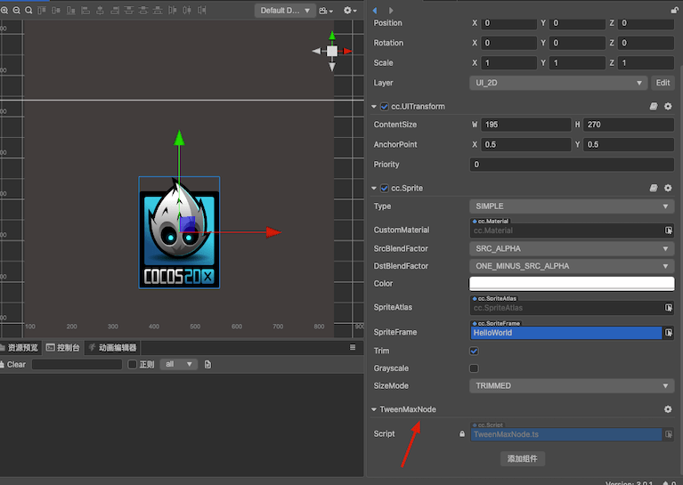

**TweenLite/TweenMax**是[GreenSock](https://greensock.com/) 动画平台中的核心动画工具，Cocos Creator 官方给出的Tween动画只能解决日常使用的一些单个物体缓动的动画，比如 `yoyo`、`staggerTo`方法、`reverse`这些方法都没有，多个物体移动做起来特别费劲。如何面对复杂些的2d动画制作，就要引入新的做法，**TweenMax**是个不错的方法，很多API 和官方的API都相似，上手容易而且这个类库体积也很小。前面已经讲过Cocos Creator 2.x如何引入游戏，这里说说3.0的用法。

<!--more-->

## 背景

[Cocos Creator 3.0](https://www.cocos.com/docs) 开始 Node的很多属性和方法都修改了。[Cocos Creator 3.0 升级指南](https://docs.cocos.com/creator/3.0/manual/zh/release-notes/upgrade-guide-v3.0.html)

比如：常用 的 `opacity`，`color`，`scale`  `x`,`y` `size` `width`, `height`等 其中一部分变成只读，属性的子属性不能直接写入

```typescript
TweenMax.to(this.logo, 2, {
   position:v3(300,500)
});
```

上面代码动画异常，但是也无报错，是过了2秒后确实 位置变了，但动画没有正常播放。

 [Cocos Creator3.0](https://www.cocos.com/docs) 项目里 可以找到  `cc.d.ts` 文件下 Node 属性项目 好多属性都是 ReadOnly 这样的属性 只能整体替换 无法单独写入属性。按照正常的方法导入项目，发现无法使用，应该angle 这个改变的动画应该是可以的，其他的比如`position`、 `opacity`、`scale` 都无法正常生效，如果想改变 `width`和`height` 还必须对`Node`节点的`UITransform`组件来设置，做个动画特别费劲，那怎么办呢？老规矩去论坛看看吧，无果，那网上搜索看看。

### 不生效不报错

现象：3.0 使用是不生效也不报错

### 一点线索

1. 首先英文不好的我，找到了一个 TweenMax 中文网站，这个是学习者的福音。https://www.tweenmax.com.cn/

2. 这个是之前的文章里已经说过的一个站点，里面详细了说明了这个动画类库的历史和用法以及官方的不少例子的中文翻译。
3. 第二个自然而然去官方网站转转，发现现在这个类库升级了叫 gsap 他们有两个版本 一个[3.x](https://greensock.com/docs/)一个[2.x](https://greensock.com/docs/v2)

4. 于是我有个想法 如果Tween Max不能用 用 gsap 是不是也可以呢，很快结果告诉我，依然是失败的。
5. 但是这次我从 官方的代码里找到了一些线索

### 猜测

首先因为TweenMax 代码写了几千行，而自己没有什么耐心，阅读完，这个还是JavaScript写的，具体参数传入后，做了什么，为什么没报错，也不生效呢。但是gsap不同 官方给出了对应的Typescript的声明文件地址这里。https://greensock.com/docs/v3/Installation

GitHub 地址 https://github.com/greensock/GSAP

项目下面 有个这个文件 https://github.com/greensock/GSAP/blob/master/types/gsap-core.d.ts

里面有 vars: TweenVars 这样的写法 意味着  里面很多参数 都是 TweenValue 类型

```typescript
	type FunctionBasedValue<T> = (index: number, target: any, targets: any[]) => T;
  type ArrayValue = any[] | FunctionBasedValue<any[]>;
  type BooleanValue = boolean | FunctionBasedValue<boolean>;
  type NumberValue = number | FunctionBasedValue<number>;
  type StringValue = string | FunctionBasedValue<string>;
  type ElementValue = Element | FunctionBasedValue<Element>;
  type TweenValue = NumberValue | StringValue;
```

看了这些声明文件 这里大概有个理解，仅供大家参考，就是传入的参数类型必须是 `number` 或者 `string`类型 或者是`Function`比如上面传入的 `Vec3`、`Size` 这样的复杂类型是无法正常使用。故而我们的动画展示失败。

### 解决方案

既然猜测的线索有了，那么我们传入人家需要的类型不就可以了吗？答案是不行！为什么？？？

上面已经说了，我们无法像以前2.x版本写动画了比如：

```typescript
 TweenMax.to(this.role, 5, {
       x: 500,
       onComplete:function(){
          console.log(`666666`);
       }
 });
```

因为 x y 这样属性 不是node 的可以修改的属性，那怎么办呢？下面我提供一个解决的思路，大家如果有更好的解决方案，希望分享出来。

Cocos Creator 是基于组件的，那么我们就写一个中间转换的组件。这里名字叫做TweenMaxNode.ts,大家可以拓展更多的属性，这里我只拓展了几个常用的属性。

```typescript
/**
 * Created by jsroads on 2021/4/29.1:01 下午
 * Note:jsroads@163.com
 */
import {_decorator, Color, Component, Node, Renderable2D, UIOpacity, UITransform} from "cc";

const {ccclass} = _decorator;
@ccclass("TweenMaxNode")
export default class TweenMaxNode extends Component {
    get x(): number {
        return this.node.position.x;
    }

    set x(value: number) {
        this.node.setPosition(value, this.node.position.y, this.node.position.z)
    }

    get y(): number {
        return this.node.position.y;
    }

    set y(value: number) {
        this.node.setPosition(this.node.position.y, value, this.node.position.z)
    }

    get scale(): number {
        return this.node.scale.x;
    }

    // get pos(): Vec2 {
    //     return v2(this.node.position.x, this.node.position.y);
    // }
    //
    // set pos(value: Vec2) {
    //     this.node.setPosition(v3(value.x, value.y));
    // }

    set scale(value: number) {
        this.node.setScale(value, value, 1);
    }

    get scaleX(): number {
        return this.node.scale.x;
    }

    set scaleX(value: number) {
        this.node.setScale(value, this.node.scale.y, 1);
    }

    get scaleY(): number {
        return this.node.scale.y;
    }

    set scaleY(value: number) {
        this.node.setScale(this.node.scale.x, value, 1);
    }

    get width(): number {
        const transform = <UITransform>this.node.getComponent(UITransform);
        return transform.width;
    }

    set width(value: number) {
        const transform = <UITransform>this.node.getComponent(UITransform);
        transform.width = value;
    }

    get height(): number {
        const transform = <UITransform>this.node.getComponent(UITransform);
        return transform.height;
    }

    set height(value: number) {
        const transform = <UITransform>this.node.getComponent(UITransform);
        transform.height = value;
    }

    get opacity(): number {
        const render = this.node.getComponent(Renderable2D);
        if (render !== null) {
            return render.color.a;
        }
        const opacity: UIOpacity = <UIOpacity>this.node.getComponent(UIOpacity);
        if (opacity !== null) {
            return opacity.opacity;
        }
        return 255;
    }

    // get contentSize(): Size {
    //     const transform = <UITransform>this.node.getComponent(UITransform);
    //     return transform.contentSize;
    // }
    //
    // set contentSize(value: Size) {
    //     const transform = <UITransform>this.node.getComponent(UITransform);
    //     transform.setContentSize(value);
    // }

    set opacity(value: number) {
        const render = this.node.getComponent(Renderable2D);
        if (render !== null) {
            render.color = new Color(render.color.r, render.color.g, render.color.b, value)
            return;
        }
        const opacity: UIOpacity = <UIOpacity>this.node.getComponent(UIOpacity);
        if (opacity !== null) {
            opacity.opacity = value;
        }
    }

    get angle(): number {
        return this.node.angle;
    }

    set angle(value: number) {
        this.node.angle = value;
    }

    static trans(node: Node): TweenMaxNode {
        return <TweenMaxNode>node.getComponent(TweenMaxNode);
    }
}

```

在我们需要使用 TweenMax动画的Node节点上 挂在即可。比如这样：



下面我们导入我们的TweenMax 文件

这里给出两个地址：https://s3-us-west-2.amazonaws.com/s.cdpn.io/16327/TweenMax-latest-beta.js

另外一个 github 下载后备份的（防止上面地址失效）[TweenMax.js 点击查看](https://github.com/jsroads/mylibs/blob/main/TweenMax/TweenMax.js)

如果需要压缩 可以自己去压缩代码 这里提供个在线网站：https://obfuscator.io/

另外我们还需要一个 Typescript 的声明文件 这里提供一个  [TweenMax.d.ts 点击查看](https://github.com/jsroads/mylibs/blob/main/TweenMax/TweenMax.d.ts)

```typescript
/**
 * Created by jsroads on 2021/4/29.1:31 下午
 * Note:jsroads@163.com
 */
declare class TweenMax {
    // onComplete: Function;
    /**可用于存储你需要的数据*/
    data: any;


    /**获取动画的目标对象*/
    target: any;
    /**获取动画的父级时间轴对象（只读）*/
    readonly timeline: any;
    /**一个存储了传递给构造器的配置变量的对象。包含动画选项和回调函数等。例如delay、paused、onComplete*/
    vars: any;

    defaultEase : Ease;
    defaultOverwrite : string;
    onOverwrite : Function;
    selector:any;
    ticker : Object;
    /**
     *构造函数
     *@param target 应该影响其属性的目标对象（或对象数组）
     *@param duration 持续时间（以秒为单位）
     *@param vars 参数对象，用于定义应该补间的每个属性的结束值以及任何特殊属性
     */
    constructor(target: Object, duration: Number, vars: Object);

    static to(target: Object, duration: Number, vars: Object): TweenMax;

    static from(target: Object, duration: Number, vars: Object): TweenMax

    static fromTo( target:Object, duration:Number, fromVars:Object, toVars:Object ) : TweenMax;

    static staggerTo( targets:any[], duration:Number, vars:Object, stagger:Number, onCompleteAll:Function, onCompleteAllParams:any[], onCompleteAllScope:any ) : any[];

    static staggerFrom( targets:any[], duration:Number, vars:Object, stagger:Number, onCompleteAll:Function, onCompleteAllParams:any[], onCompleteAllScope:any ) : any[];

    static staggerFromTo( targets:any[], duration:Number, fromVars:Object, toVars:Object, stagger:Number, onCompleteAll:Function, onCompleteAllParams:any[], onCompleteAllScope:any ) : any[];

    static delayedCall( delay:Number, callback:Function, params:any[], scope:any, useFrames:Boolean) : TweenMax;

    static getTweensOf( target:Object, onlyActive:Boolean ):any ;

    static getAllTweens( includeTimelines:Boolean ) : any[];

    static killDelayedCallsTo( callback:Function ) :any;

    static killTweensOf( target:Object, vars?:Object ) :any;

    static killAll( complete:Boolean, tweens:Boolean, delayedCalls:Boolean, timelines:Boolean ) :any;

    static killChildTweensOf( parent:Object, complete:Boolean ) :any;

    static pauseAll( tweens:Boolean, delayedCalls:Boolean, timelines:Boolean ):any;

    static resumeAll( tweens:Boolean, delayedCalls:Boolean, timelines:Boolean ):any ;

    static set( target:Object, vars:Object ) : TweenMax;

    isActive(): Boolean;

    delay(value?: Number): any;

    duration(value: Number): any;

    eventCallback(type: String, callback?: Function, params?: Array<any>, scope?: any): any;

    endTime(includeRepeats: Boolean): Number;

    /**
     * 刷新任何内部记录的开始/结束值，如果您想要重新启动动画而不恢复任何先前记录的起始值，这将非常有用。
     */
    invalidate():TweenMax;

    kill(vars?: any, target?: any): any;

    pause(atTime: any, suppressEvents: Boolean): any;

    paused(value: Boolean): any;

    play(from: any, suppressEvents: Boolean): any;

    progress(value: Number, suppressEvents: Boolean): any;

    /**
     * 重启
     *@param includeDelay（default =  false） - 确定重新启动时是否遵循延迟（如果有）
     *@param suppressEvents（default =  true） - 如果  true （默认值），当播放头移动到time 参数中定义的新位置时，不会触发任何事件或回调。
     */
    restart(includeDelay?: Boolean, suppressEvents?: Boolean): any;

    resume(from?: any, suppressEvents?: Boolean): any;

    /**
     * 反转播放，以便动画的所有方面都向后定向，包括例如补间的简易性。
     *@param from （default =  null） - 动画开始反向播放的时间（或TimelineLite / TimelineMax实例的标签）（如果没有定义，它将从播放头当前所在的任何地方开始播放）。要从动画的最后开始，请使用  0。负数相对于动画结束，因此-1将从结尾开始为1秒
     *@param
     */
    reverse(from?: any, suppressEvents?: Boolean): any;

    /**
     * 获取或设置动画的反转状态，指示是否应该向后播放动画。
     *@param value （default =  false） - 省略参数返回当前值（getter），而定义参数则设置值（setter）并返回实例本身以便于链接
     */
    reversed(value?: Boolean): any;

    /**
     * 重复动画
     *@param value 次数（第一次不计算在内）
     */
    repeat(value: Number): any;

    /**
     * 获取或设置重复之间的秒数（或基于帧的补间的帧）的时间量。
     */
    repeatDelay(value: Number): any;

    /**
     * 跳转到指定时间(不影响实例是暂停还是反转)
     *@param time 要去的时间
     *@param suppressEvents（default = true）-如果true（默认值），当播放头移动到time 参数中定义的新位置时，不会触发任何事件或回调。
     */
    seek(time: any, suppressEvents?: Boolean): any;

    startTime(value: Number): any;

    time(value: Number): any;

    timeScale(value: Number): any;

    // ease: Ease;// (or Function or String);

    /**
     * 获取或设置补间的总持续时间（以秒为单位）（或基于帧的补间的帧），包括任何重复或repeatDelay。
     *@param value （default =  NaN） - 省略参数返回当前值（getter），而定义参数则设置值（setter）并返回实例本身以便于链接。负值将从 动画的END开始解释
     */
    totalDuration(value: Number): any;

    totalProgress(value: Number, suppressEvents: Boolean): any;

    totalTime(time: Number, suppressEvents: Boolean): any;

    /**
     * 动态更新补间值，即使补间正在进行中，它们也会无缝地改变路线。
     *@param vars 包含应具有udpated的目标值的属性的对象。但如果你改变一个插件值，则需要完全定义它,例如，要将目标值更新x为300并将目标值更新y为500，请传递:{x:300, y:500}
     *@param resetDuration （默认值=  false） -如果补间已开始（或成品），并  resetDuration 是  true，补间将重新启动。如果  resetDuration 是  false，则补间的时间将被接受（不重启），并且将调整每个补间属性的起始值，使其看起来无缝地重定向到新的目标值
     */
    updateTo(vars: object, resetDuration?: Boolean): any;
}

declare class Ease {
    constructor(func?: (...args: any[]) => void, extraParams?: any[], type?: number, power?: number);

    /** Translates the tween's progress ratio into the corresponding ease ratio. */
    getRatio(p: number): number;
}

interface EaseLookup {
    find(name: string): Ease;
}

declare class Back extends Ease {
    static easeIn: Back;
    static easeInOut: Back;
    static easeOut: Back;

    config(overshoot: number): Elastic;
}

declare class Bounce extends Ease {
    static easeIn: Bounce;
    static easeInOut: Bounce;
    static easeOut: Bounce;
}

declare class Circ extends Ease {
    static easeIn: Circ;
    static easeInOut: Circ;
    static easeOut: Circ;
}

declare class Cubic extends Ease {
    static easeIn: Cubic;
    static easeInOut: Cubic;
    static easeOut: Cubic;
}

declare class Elastic extends Ease {
    static easeIn: Elastic;
    static easeInOut: Elastic;
    static easeOut: Elastic;

    config(amplitude: number, period: number): Elastic;
}

declare class Expo extends Ease {
    static easeIn: Expo;
    static easeInOut: Expo;
    static easeOut: Expo;
}

declare class Linear extends Ease {
    static ease: Linear;
    static easeIn: Linear;
    static easeInOut: Linear;
    static easeNone: Linear;
    static easeOut: Linear;
}

declare class Quad extends Ease {
    static easeIn: Quad;
    static easeInOut: Quad;
    static easeOut: Quad;
}

declare class Quart extends Ease {
    static easeIn: Quart;
    static easeInOut: Quart;
    static easeOut: Quart;
}

declare class Quint extends Ease {
    static easeIn: Quint;
    static easeInOut: Quint;
    static easeOut: Quint;
}

declare class Sine extends Ease {
    static easeIn: Sine;
    static easeInOut: Sine;
    static easeOut: Sine;
}

declare class SlowMo extends Ease {
    static ease: SlowMo;

    config(linearRatio: number, power: number, yoyoMode: boolean): SlowMo;
}

declare class SteppedEase extends Ease {
    constructor(staps: number);

    config(steps: number): SteppedEase;
}

interface RoughEaseConfig {
    clamp?: boolean;
    points?: number;
    randomize?: boolean;
    strength?: number;
    taper?: "in" | "out" | "both" | "none";
    template?: Ease;
}

declare class RoughEase extends Ease {
    static ease: RoughEase;

    constructor(vars: RoughEaseConfig);

    config(steps?: number): RoughEase;
}

declare const Power0: typeof Linear;
declare const Power1: typeof Quad;
declare const Power2: typeof Cubic;
declare const Power3: typeof Quart;
declare const Power4: typeof Quint;
declare const Strong: typeof Quint;
```

## 参考

解决这些问题，参考了 一些网上的解决方案：不分先后

- [How To Use TweenMax with Cocos Creator](https://greensock.com/forums/topic/20602-how-to-use-tweenmax-with-cocos-creator/)

- [Possible To Remove Plugins from GSAP builds](https://greensock.com/forums/topic/19943-possible-to-remove-plugins-from-gsap-builds/) 可以让Cocos Creator 使用的TweenMax

具体 可以查看另外几篇博客：

- [Layabox2.0贝塞尔曲线运动引入TweenMax](https://blog.asroads.com/post/b0aa25e3.html)
- [Cocos Creator 引入TweenMax Uncaught TypeError: container.appendChild 解决方法](https://blog.asroads.com/post/2376105a.html)
- [Cocos Creator Tween Max 小游戏引入](https://blog.asroads.com/post/d927b4f2.html)

所有源码路径：[点击查看](https://github.com/jsroads/mylibs/blob/main/TweenMax)

## 一些疑点

上面这样转达属性，会不会造成内存浪费或者性能变差，这些没有深究，希望后面有机会继续探索，另外，如果有人有什么看法可以联系我。邮箱：jsroads@163.com