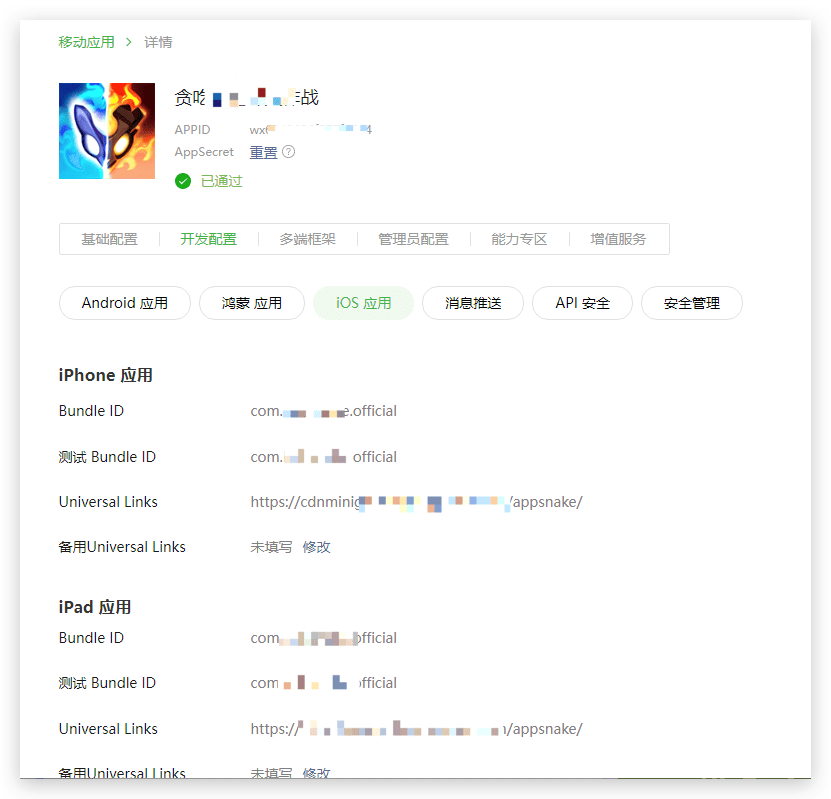
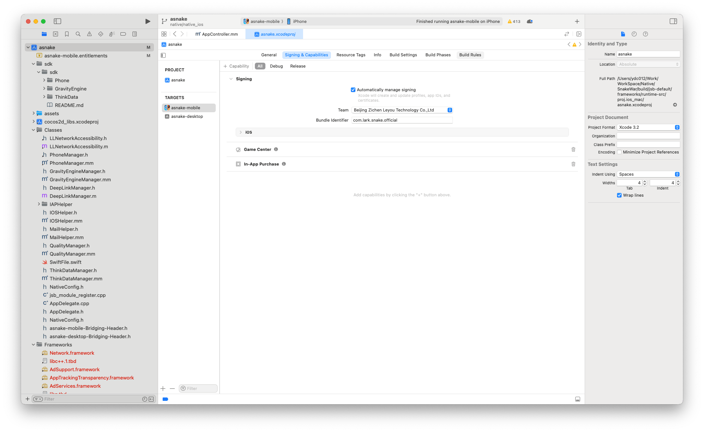
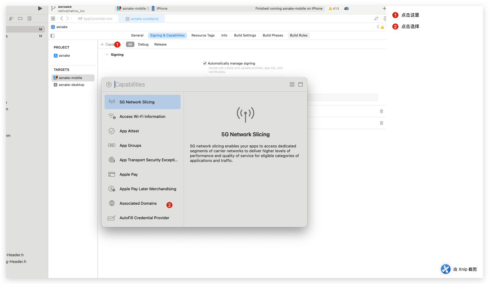
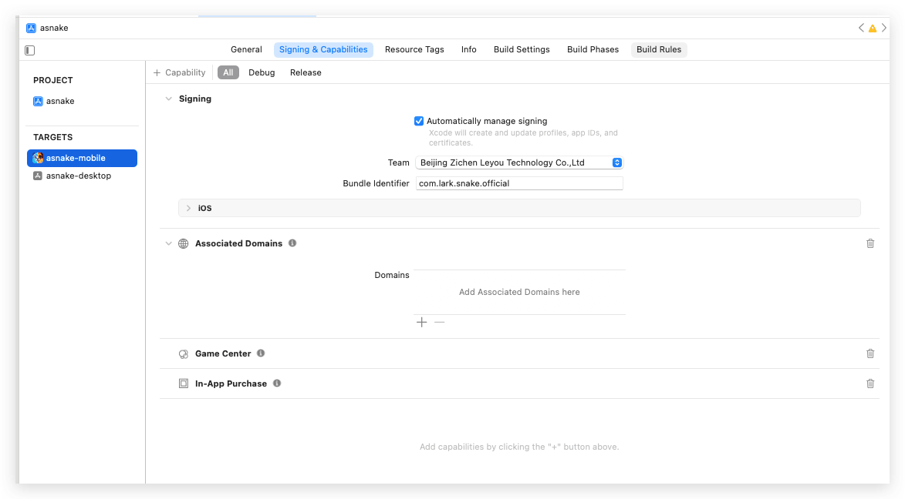
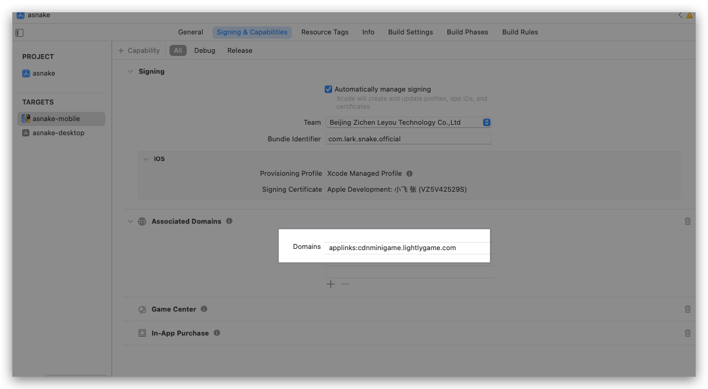
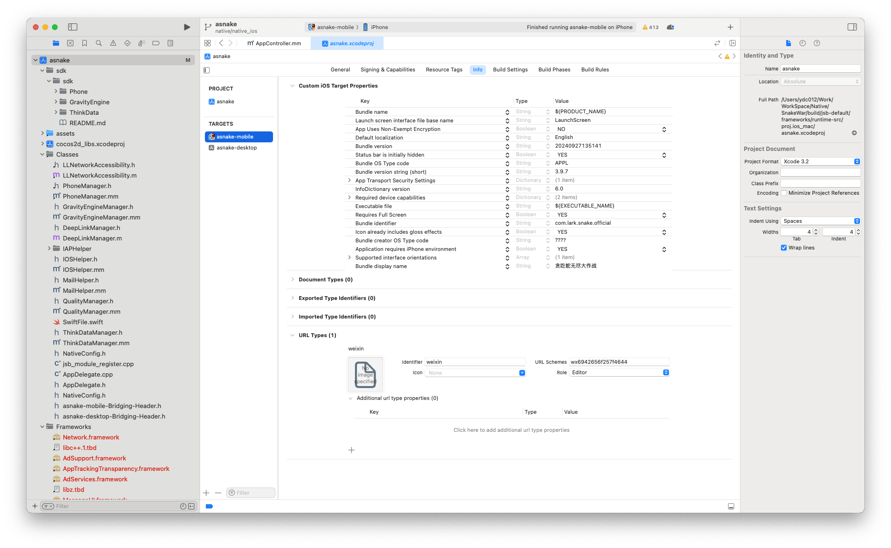
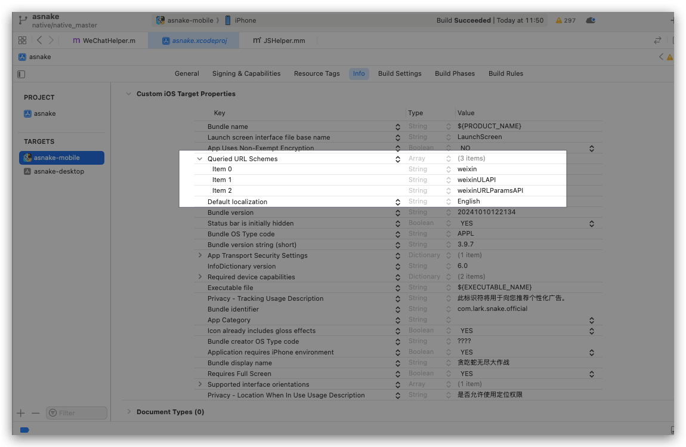
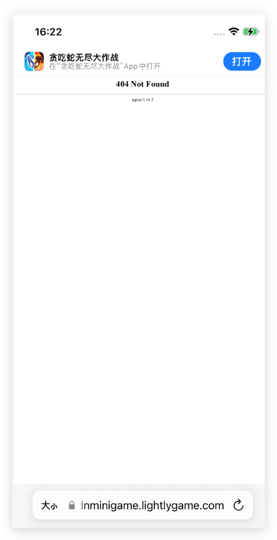
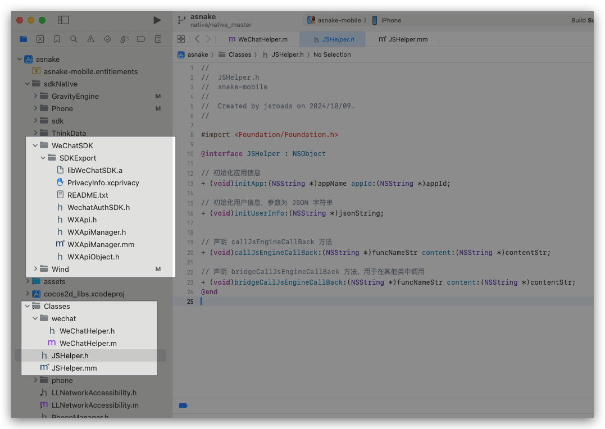

Universal links 是苹果在WWDC上提出的iOS9的新特性之一。当你支持Universal links时，iOS用户可以点击网站链接，无缝重定向到已安装的APP，而无需通过Safari。如果APP没有安装的话，点击链接会在Safari中打开。
<!--more-->

### **iOS中的通用链接** 

`Universal Link`是`Apple`在`WWDC`上提出的`iOS9`的新特性之一；能够方便的通过打开一个`HTTPS`链接来直接启动您的客户端应用，当然前提条件是您必须在手机上安装了此`App`；

在`Universal Link`之前，我们通常使用`URL Scheme`的方法实现`web-App`的方式进行跳转；相比于`URL Scheme`方式,`Universal Link`提供了极佳的用户体验；

关于更多的介绍，可以查阅**Universal Link官方介绍**

### 应用场景

使用`Universal Link`可以让用户在`Safari`浏览器或者其他`App`的`WebView`中拉起相应的`App`，也可以在`App`中使用相应的功能，从而把用户引流到`App`中；比如我们购物时，在`Safari`浏览器中进入淘宝网页点击`打开手机淘宝`则会直接使用`Universal Link`来拉起淘宝`App`;

### Universal Link优点

-  **唯一性**：与自定义的`URL Scheme`相比，`Universal Link`使用的是标准的`HTTPS`协议链接到您的站点，所以一般不会被其他的`App`所声明；自定义的`URL Scheme`在没有安装应用的情况下是无法直接打开的，在`Safari`中还会出现一个不可打开的弹窗；而使用了标准`HTTPS`协议的`Universal Link`链接则具备更好的兼容性；
- **安全**：如果用户的手机上安装了您的应用，那么系统回去您配置的网站上下载您上传的文件`apple-app-site-association`，在这个文件中标明了当前的`Universal Link`的链接能够打开哪些`App`；因为只有开发着自己才有权限在网站的`根目录`上传此文件，所以网站与`App`之间的关联是安全的；
-  **可变**：如果用户的手机上没有安装您的应用，那么不必担心，`Universal Link`依然能够工作；如果你愿意，在没有安装你的`App`的时候，用户点击链接，将会在`Safari`浏览器中展示你网站的内容；
-  **简单**：作为`Universal Link`使用的`HTTPS`链接，可以同时作用于`网站`和`App`;
-  **私有**：其他`App`可以在不需要知道你的`App`是否安装了的情况下与你的`App`相互通信；

# Universal Links 配置

## 微信登陆相关文档

iOS接入指南 [点击访问](https://developers.weixin.qq.com/doc/oplatform/Mobile_App/Access_Guide/iOS.html)

## apple-app-site-association 的配置

地址：https://cdnminigame.lightlygame.com/.well-known/apple-app-site-association

我这里 根目录也放了一份：https://cdnminigame.lightlygame.com/apple-app-site-association
两边内容如下 ：


上传指定文件：创建一个文件，名为`apple-app-site-association`，**注意，文件名必须固定为`apple-app-site-association`，没有后缀，没有后缀，没有后缀**；其内容为`json`格式

```json
{
  "applinks": {
    "apps": [],
    "details": [
      {
        "appID": "NKF6VH268U.com.lark.snake.official",
        "paths": [
          "/appsnake/*"
        ]
      }
    ]
  }
}
```

appID的组成方式为:

- Team ID.your app's bundle identifier;

- NKF6VH268U为Team ID
- com.lark.snake.official 为bundle identifier

地址：

```
https://cdnminigame.lightlygame.com/apple-app-site-association
https://cdnminigame.lightlygame.com/.well-known/apple-app-site-association
```

## 微信公众平台设置




注意事项：**Universal Links 地址后必须有/字符 后面微信要拼接其他参数使用**


## Xcode配置

###   Associated Domains设置

1. 如果没有 Associated Domains 需要新添加一个









```
applinks:cdnminigame.lightlygame.com
```

### URL Types 设置



### LSApplicationQueriesSchemes 添加



```xml
<?xml version="1.0" encoding="UTF-8"?>
<!DOCTYPE plist PUBLIC "-//Apple//DTD PLIST 1.0//EN" "http://www.apple.com/DTDs/PropertyList-1.0.dtd">
<plist version="1.0">
<dict>
	<key>CFBundleDevelopmentRegion</key>
	<string>English</string>
	<key>CFBundleDisplayName</key>
	<string>贪吃蛇无尽大作战</string>
	<key>CFBundleExecutable</key>
	<string>${EXECUTABLE_NAME}</string>
	<key>CFBundleIdentifier</key>
	<string>com.lark.snake.official</string>
	<key>CFBundleInfoDictionaryVersion</key>
	<string>6.0</string>
	<key>CFBundleName</key>
	<string>${PRODUCT_NAME}</string>
	<key>CFBundlePackageType</key>
	<string>APPL</string>
	<key>CFBundleShortVersionString</key>
	<string>3.9.7</string>
	<key>CFBundleSignature</key>
	<string>????</string>
	<key>CFBundleURLTypes</key>
	<array>
		<dict>
			<key>CFBundleTypeRole</key>
			<string>Editor</string>
			<key>CFBundleURLName</key>
			<string>weixin</string>
			<key>CFBundleURLSchemes</key>
			<array>
				<string>wx6942656f257f4644</string>
			</array>
		</dict>
	</array>
	<key>CFBundleVersion</key>
	<string>20241010122134</string>
	<key>ITSAppUsesNonExemptEncryption</key>
	<false/>
	<key>LSApplicationCategoryType</key>
	<string></string>
	<key>LSApplicationQueriesSchemes</key>
	<array>
		<string>weixin</string>
		<string>weixinULAPI</string>
		<string>weixinURLParamsAPI</string>
	</array>
	<key>LSRequiresIPhoneOS</key>
	<true/>
	<key>NSAppTransportSecurity</key>
	<dict>
		<key>NSAllowsArbitraryLoads</key>
		<true/>
	</dict>
	<key>NSLocationWhenInUseUsageDescription</key>
	<string>是否允许使用定位权限</string>
	<key>NSUserTrackingUsageDescription</key>
	<string>此标识符将用于向您推荐个性化广告。</string>
	<key>UILaunchStoryboardName</key>
	<string>LaunchScreen</string>
	<key>UIPrerenderedIcon</key>
	<true/>
	<key>UIRequiredDeviceCapabilities</key>
	<dict>
		<key>accelerometer</key>
		<true/>
		<key>opengles-1</key>
		<true/>
	</dict>
	<key>UIRequiresFullScreen</key>
	<true/>
	<key>UIStatusBarHidden</key>
	<true/>
	<key>UISupportedInterfaceOrientations</key>
	<array>
		<string>UIInterfaceOrientationPortrait</string>
	</array>
</dict>
</plist>

```


## 手机验证 （必须ios手机）Safari浏览器

```shell
https://cdnminigame.lightlygame.com/appsnake/
```



## 登陆相关




JSHelper.h

```objective-c
//
//  JSHelper.h
//  snake-mobile
//
//  Created by jsroads on 2024/10/09.
//

#import <Foundation/Foundation.h>

@interface JSHelper : NSObject

// 初始化应用信息
+ (void)initApp:(NSString *)appName appId:(NSString *)appId;

// 初始化用户信息，参数为 JSON 字符串
+ (void)initUserInfo:(NSString *)jsonString;


// 声明 callJsEngineCallBack 方法
+ (void)callJsEngineCallBack:(NSString *)funcNameStr content:(NSString *)contentStr;

// 声明 bridgeCallJsEngineCallBack 方法，用于在其他类中调用
+ (void)bridgeCallJsEngineCallBack:(NSString *)funcNameStr content:(NSString *)contentStr;
@end

```

JSHelper.mm

```objective-c
//
//  WeChatHelper.m
//  snake-mobile
//
//  Created by jsroads on 2024/10/09.
//

#import "JSHelper.h"
// 确保包含 C++ 标准库头文件
#include <string>
#include "cocos/scripting/js-bindings/jswrapper/SeApi.h"
#import "cocos2d.h"
@implementation JSHelper

// 初始化应用信息
+ (void)initApp:(NSString *)appName appId:(NSString *)appId {
    NSLog(@"Initializing app with name: %@ and ID: %@", appName, appId);
    // 在这里实现你想要的初始化逻辑，比如保存 appName 和 appId
}

// 初始化用户信息，参数为 JSON 字符串
+ (void)initUserInfo:(NSString *)jsonString {
    NSError *error;
    NSData *data = [jsonString dataUsingEncoding:NSUTF8StringEncoding];
    
    // 使用 NSJSONSerialization 解析 JSON 字符串
    NSDictionary *userInfo = [NSJSONSerialization JSONObjectWithData:data options:0 error:&error];
    
    if (error) {
        NSLog(@"Failed to parse JSON: %@", error);
    } else {
        NSLog(@"User Info: %@", userInfo);
        // 在这里实现你需要的处理逻辑，比如将用户信息存储或进一步操作
    }
}


// 定义 callJsEngineCallBack 方法
+ (void)callJsEngineCallBack:(NSString *)funcNameStr content:(NSString *)contentStr {
    NSLog(@"callJsEngineCallBack...");

    // 将 NSString 转为 std::string
    std::string funcName = [funcNameStr UTF8String];
    std::string param = [contentStr UTF8String];
    
    // 拼接 JavaScript 调用字符串，确保是标准的函数调用格式
    std::string jsCallStr = cocos2d::StringUtils::format("%s(%s);", funcName.c_str(), param.c_str());
    NSLog(@"jsCallStr = %s", jsCallStr.c_str());
    
    // 调用 JavaScript 引擎
    se::ScriptEngine::getInstance()->evalString(jsCallStr.c_str());
}


// 桥接方法实现
+ (void)bridgeCallJsEngineCallBack:(NSString *)funcNameStr content:(NSString *)contentStr {
    // 间接调用 C++ 方法
    [JSHelper callJsEngineCallBack:funcNameStr content:contentStr];
}
@end

```


WeChatHelper.h

```objective-c
//
//  WeChatHelper.h
//  snake-mobile
//
//  Created by jsroads on 2024/10/09.
//

#import <Foundation/Foundation.h>

@interface WeChatHelper: NSObject;

//检查是否安装微信
+(BOOL) isInstallWx;

//初始化微信appid，appsecret
+(BOOL)initWx:(NSString *)appName andId:(NSString *)appId andSecret:(NSString *)appSecret;

//微信登录
+ (void)loginWx:(NSString *)param;

//微信登录回调
+(void) wxLoginResultCallback: (BOOL)result andCode: (NSString *)codeMsg;

//微信分享回调
//+(void) wxPayResultCallback: (BOOL)result andMsg: (NSString *)msg;

@end

```


WeChatHelper.m

```objective-c
//
//  WeChatHelper.m
//  snake-mobile
//
//  Created by jsroads on 2024/10/09.
//


#import <Foundation/Foundation.h>
#import "WXApi.h"
#import "WeChatHelper.h"
#import "JSHelper.h"

@implementation WeChatHelper

//检查是否安装微信
+(BOOL) isInstallWx {
    return [WXApi isWXAppInstalled];
}

//初始化微信appid，appsecret
+(BOOL)initWx:(NSString *)appName andId:(NSString *)appId andSecret:(NSString *)appSecret {
    [WXApi startLogByLevel:WXLogLevelNormal logBlock:^(NSString *log) {
        NSLog(@"WeChatSDK : %@", log);
    }];
    NSLog(@"WeChatSDK : %@   %@   %@", appName,appId,appSecret);
    [WXApi registerApp:@"wx6942656f257f4644" universalLink:@"https://cdnminigame.lightlygame.com/appsnake/"]; //填写自己对应的url
    
//    //调用自检函数
//    [WXApi checkUniversalLinkReady:^(WXULCheckStep step, WXCheckULStepResult* result) {
//        NSLog(@"checkUniversalLinkReady:%@, %u, %@, %@", @(step), result.success, result.errorInfo, result.suggestion);
//    }];
    return true;
}

//微信登录
// loginWx 方法定义，接受一个字符串参数
+ (void)loginWx:(NSString *)param {
    // param 是传递的字符串参数
    NSLog(@"Received param: %@", param);
    //构造SendAuthReq结构体
    SendAuthReq* req =[[SendAuthReq alloc ] init ];
    req.scope = @"snsapi_userinfo";// 只能填 snsapi_userinfo
    req.state = @"snake";  //此处需要填写自己的key
    req.nonautomatic = YES;//nonautomatic 属性来控制授权行为 可以这样设置为关闭自动授权
    //第三方向微信终端发送一个SendAuthReq消息结构
    [WXApi sendReq:req completion:nil];
    
}

// wxLoginResultCallback 方法实现，回调 TypeScript
+ (void)wxLoginResultCallback:(BOOL)result andCode:(NSString *)codeMsg {
    NSLog(@"wxLoginResultCallback result %d code : %@", result, codeMsg);
    
    // 构建 JavaScript 回调字符串，格式为 JavaScript 参数
    NSString *code = @"";
    if (result) {
        code = [NSString stringWithFormat:@"true, '%@'", codeMsg];
    } else {
        code = [NSString stringWithFormat:@"false, '%@'", codeMsg];
    }
    
    // 调用 bridgeCallJsEngineCallBack 方法，将 JavaScript 函数名和参数传递过去
    [JSHelper bridgeCallJsEngineCallBack:@"cc.onWeChatLoginResultCallback" content:code];
}

////微信支付回调
//+(void) wxPayResultCallback: (BOOL)result andMsg: (NSString *)msg {
//    
//}
@end

```

AppController.mm

```objective-c
/****************************************************************************
 Copyright (c) 2010-2013 cocos2d-x.org
 Copyright (c) 2013-2016 Chukong Technologies Inc.
 Copyright (c) 2017-2018 Xiamen Yaji Software Co., Ltd.
 
 http://www.cocos2d-x.org
 
 Permission is hereby granted, free of charge, to any person obtaining a copy
 of this software and associated documentation files (the "Software"), to deal
 in the Software without restriction, including without limitation the rights
 to use, copy, modify, merge, publish, distribute, sublicense, and/or sell
 copies of the Software, and to permit persons to whom the Software is
 furnished to do so, subject to the following conditions:
 
 The above copyright notice and this permission notice shall be included in
 all copies or substantial portions of the Software.
 
 THE SOFTWARE IS PROVIDED "AS IS", WITHOUT WARRANTY OF ANY KIND, EXPRESS OR
 IMPLIED, INCLUDING BUT NOT LIMITED TO THE WARRANTIES OF MERCHANTABILITY,
 FITNESS FOR A PARTICULAR PURPOSE AND NONINFRINGEMENT. IN NO EVENT SHALL THE
 AUTHORS OR COPYRIGHT HOLDERS BE LIABLE FOR ANY CLAIM, DAMAGES OR OTHER
 LIABILITY, WHETHER IN AN ACTION OF CONTRACT, TORT OR OTHERWISE, ARISING FROM,
 OUT OF OR IN CONNECTION WITH THE SOFTWARE OR THE USE OR OTHER DEALINGS IN
 THE SOFTWARE.
 ****************************************************************************/

#import "AppController.h"
#import "cocos2d.h"
#import "AppDelegate.h"
#import "RootViewController.h"
#import "SDKWrapper.h"
#import "platform/ios/CCEAGLView-ios.h"
#import "GravityEngineManager.h"
#import "PhoneManager.h"
#import <AppTrackingTransparency/AppTrackingTransparency.h>
#import "ADHelper.h"
#import "WXApiManager.h"
#import "WXApi.h"


using namespace cocos2d;

@implementation AppController

Application* app = nullptr;
@synthesize window;

#pragma mark -
#pragma mark Application lifecycle

- (BOOL)application:(UIApplication *)application didFinishLaunchingWithOptions:(NSDictionary *)launchOptions {
    [[SDKWrapper getInstance] application:application didFinishLaunchingWithOptions:launchOptions];
    // Add the view controller's view to the window and display.
    float scale = [[UIScreen mainScreen] scale];
    CGRect bounds = [[UIScreen mainScreen] bounds];
    window = [[UIWindow alloc] initWithFrame: bounds];
    
    // cocos2d application instance
    app = new AppDelegate(bounds.size.width * scale, bounds.size.height * scale);
    app->setMultitouch(true);
    
    // Use RootViewController to manage CCEAGLView
    _viewController = [[RootViewController alloc]init];
#ifdef NSFoundationVersionNumber_iOS_7_0
    _viewController.automaticallyAdjustsScrollViewInsets = NO;
    _viewController.extendedLayoutIncludesOpaqueBars = NO;
    _viewController.edgesForExtendedLayout = UIRectEdgeAll;
#else
    _viewController.wantsFullScreenLayout = YES;
#endif
    // Set RootViewController to window
    if ( [[UIDevice currentDevice].systemVersion floatValue] < 6.0)
    {
        // warning: addSubView doesn't work on iOS6
        [window addSubview: _viewController.view];
    }
    else
    {
        // use this method on ios6
        [window setRootViewController:_viewController];
    }
    
    [window makeKeyAndVisible];
    
    [[UIApplication sharedApplication] setStatusBarHidden:YES];

    // 调用 PhoneManager 的 initPhoneSDK 方法
       [[PhoneManager sharedInstance] initPhoneSDKWithParentViewController:_viewController networkAvailableCallback:^{
           // 用户有网络时的回调
           NSLog(@"网络可用，开始初始化游戏场景");
           [[PhoneManager sharedInstance] phoneLoginWithAppId];
           //run the cocos2d-x game scene
           app->start();
           [GravityEngineManager initGravity];
           //初始化SDK
           [ADHelper setDebugEnable:YES];
           [ADHelper setupSDKWithAppId:@"46210"];
           [ADHelper setViewController:_viewController];
       }];
    
    return YES;
}

- (BOOL)application:(UIApplication *)application continueUserActivity:(NSUserActivity *)userActivity restorationHandler:(void (^)(NSArray<id<UIUserActivityRestoring>> *restorableObjects))restorationHandler {
    if ([userActivity.activityType isEqual:NSUserActivityTypeBrowsingWeb]) {
        auto incomingURL = userActivity.webpageURL;
        [[SDKWrapper getInstance] application:application continueUserActivity:incomingURL.absoluteString];
        // 处理微信的 Universal Link 回调
        if ([WXApi handleOpenUniversalLink:userActivity delegate:[WXApiManager sharedManager]]) {
            return YES;  // 微信的 Universal Link 处理成功
        }
    }
    return NO;
}


- (void)applicationWillResignActive:(UIApplication *)application {
    /*
     Sent when the application is about to move from active to inactive state. This can occur for certain types of temporary interruptions (such as an incoming phone call or SMS message) or when the user quits the application and it begins the transition to the background state.
     Use this method to pause ongoing tasks, disable timers, and throttle down OpenGL ES frame rates. Games should use this method to pause the game.
     */
    app->onPause();
    [[SDKWrapper getInstance] applicationWillResignActive:application];
}

- (void)applicationDidBecomeActive:(UIApplication *)application {
    /*
     Restart any tasks that were paused (or not yet started) while the application was inactive. If the application was previously in the background, optionally refresh the user interface.
     */
    app->onResume();
    if (@available(iOS 14.5, *)){
        if([ATTrackingManager trackingAuthorizationStatus] == ATTrackingManagerAuthorizationStatusNotDetermined){
            [ATTrackingManager requestTrackingAuthorizationWithCompletionHandler:^(ATTrackingManagerAuthorizationStatus status) {
            }];
        }
    }
    [[SDKWrapper getInstance] applicationDidBecomeActive:application];
}

- (void)applicationDidEnterBackground:(UIApplication *)application {
    /*
     Use this method to release shared resources, save user data, invalidate timers, and store enough application state information to restore your application to its current state in case it is terminated later.
     If your application supports background execution, called instead of applicationWillTerminate: when the user quits.
     */
    [[SDKWrapper getInstance] applicationDidEnterBackground:application];
}

- (void)applicationWillEnterForeground:(UIApplication *)application {
    /*
     Called as part of  transition from the background to the inactive state: here you can undo many of the changes made on entering the background.
     */
    [[SDKWrapper getInstance] applicationWillEnterForeground:application];    
}

- (void)applicationWillTerminate:(UIApplication *)application
{
    [[SDKWrapper getInstance] applicationWillTerminate:application];
    delete app;
    app = nil;
}


#pragma mark -
#pragma mark Memory management

- (void)applicationDidReceiveMemoryWarning:(UIApplication *)application {
    /*
     Free up as much memory as possible by purging cached data objects that can be recreated (or reloaded from disk) later.
     */
}

- (BOOL)application:(UIApplication *)application handleOpenURL:(NSURL *)url
{
    
    if ([WXApi handleOpenURL:url delegate:[WXApiManager sharedManager]]) {
        return YES;
    }
    
    return YES;
}

//iOS9以下
- (BOOL)application:(UIApplication *)application openURL:(NSURL *)url sourceApplication:(NSString *)sourceApplication annotation:(id)annotation
{
    
    if ([WXApi handleOpenURL:url delegate:[WXApiManager sharedManager]]) {
        return YES;
    }
    
    return YES;
}

//iOS9+
- (BOOL)application:(UIApplication *)app openURL:(NSURL *)url options:(nonnull NSDictionary *)options
{
    
    if ([WXApi handleOpenURL:url delegate:[WXApiManager sharedManager]]) {
        return YES;
    }
    
    return YES;
}


@end

```

AppWeChatHelper.ts

```typescript
import { AppConstant, AppEventType, AppLoginCallBackType, AppLoginType, AppPayTrackType } from "./AppConstant";
import { Browser } from "Browser";
import { proto } from "Proto";
import { GFunc } from "GameFunc";
import WxAppOrderCreateResponse = proto.server.WxAppOrderCreateResponse;

interface WeChatHelperProps {
    /*微信小游戏 名字*/
    appName?: string;
    /*微信小游戏 APPID*/
    appId?: string;
    /*微信小游戏密钥*/
    appSecret?: string;
}

/**
 * Created by jsroads on 2024/7/19 11:33
 * Note:
 */
export class AppWeChatHelper {
    /*原生对应调用文件路径*/
    private wxClassPath: string = "";
    /*小游戏 名字*/
    private appName: string = "";
    /*小游戏 APPID*/
    private appId: string = "";
    /*小游戏密钥 刷新才需要*/
    private appSecret: string = "";

    constructor(props: WeChatHelperProps) {
        console.log(`[AppWeChatHelper][ctor]---构造函数`);
        this.appName = props.appName || AppConstant.WECHAT_APP_NAME;
        this.appId = props.appId || AppConstant.WECHAT_APP_ID;
        this.appSecret = props.appSecret || AppConstant.WECHAT_APP_SECRET;

        this.wxClassPath = AppConstant.WECHAT_CLASS_PATH;

        // 注册全局事件 给原生调用
        if (Browser.onAppNative) {
            cc["onWeChatLoginResultCallback"] = this.onWeChatLoginResultCallback;
            cc["onWeChatPayResultCallback"] = this.onWeChatPayResultCallback;
        }
        this.initWx(this.appName, this.appId, this.appSecret);
    }

    /**
     * 微信登陆
     * @private
     */
    public login(): void {
        if (Browser.jsbEmpty) return;
        //检查是否安装微信
        if (this.isInstallWx() === false) {
            const message: string = "用户未安装微信APP";
            console.log("微信登录失败，请检查是否安装微信");
            GFunc.showFloatTip({txt: message});
            const msg: AppLoginCallBackType = {
                type: AppLoginType.Wechat,
                status: "fail",
                code: "wechat_not_install",
                message: message
            };
            cc.director.emit(AppEventType.WECHAT_LOGIN_CALLBACK, msg);
            return;
        }
        if (cc.sys.platform === cc.sys.WIN32) {
            console.log("WechatLoginView");
        } else {
            this.loginWx();
        }
    }

    /**
     * 判断是否安装微信
     * @private
     */
    private isInstallWx(): boolean {
        if (Browser.jsbEmpty) return false;
        if (cc.sys.os === cc.sys.OS_ANDROID) {
            return jsb.reflection.callStaticMethod(
                this.wxClassPath,
                "isInstallWx",
                "()Z"
            );
        } else if (cc.sys.os === cc.sys.OS_IOS) {
            return jsb.reflection.callStaticMethod("WeChatHelper",
                "isInstallWx");
        }
        return false;
    }

    /**
     * 微信 初始化接口
     * @param appName
     * @param appId
     * @param appSecret
     * @private
     */
    private initWx(appName: string, appId: string, appSecret: string): boolean {
        if (Browser.jsbEmpty) return;
        this.appName = appName;
        this.appId = appId;
        this.appSecret = appSecret;
        if (cc.sys.os === cc.sys.OS_ANDROID) {
            return jsb.reflection.callStaticMethod(this.wxClassPath,
                "initWx",
                "(Ljava/lang/String;Ljava/lang/String;Ljava/lang/String;)V",
                this.appName,
                this.appId,
                this.appSecret
            );
        } else if (cc.sys.os === cc.sys.OS_IOS) {
            return jsb.reflection.callStaticMethod(
                "WeChatHelper", // 类名
                "initWx:andId:andSecret:", // 方法名和参数签名
                this.appName, // 第一个参数 appName
                this.appId,   // 第二个参数 appId
                this.appSecret // 第三个参数 appSecret
            );
        }
        return true;
    }

    /**
     * 类内部微信登录调用接口，直接调用sdk
     * @private
     */
    private loginWx(): boolean {
        if (Browser.jsbEmpty) return false;
        if (cc.sys.os === cc.sys.OS_ANDROID) {
            return jsb.reflection.callStaticMethod(
                this.wxClassPath,
                "loginWx",
                "()V"
            );
        } else if (cc.sys.os === cc.sys.OS_IOS) {
            return jsb.reflection.callStaticMethod("WeChatHelper", "loginWx:","123456");
        }
        return false;
    }

    /**
     * 微信支付
     * @private
     * @param extra
     * @param trackData
     */
    public payOrderForWeChat(extra: WxAppOrderCreateResponse, trackData: AppPayTrackType): void {
        if (Browser.jsbEmpty) return;
        cc.log("[WeChatHelper][payWx]--prepayId");
        if (cc.sys.os === cc.sys.OS_ANDROID) {
            jsb.reflection.callStaticMethod(
                this.wxClassPath,
                "payWx",
                "(Ljava/lang/String;Ljava/lang/String;)V",
                JSON.stringify(extra),
                JSON.stringify(trackData),
            );
        } else if (cc.sys.os === cc.sys.OS_IOS) {
            jsb.reflection.callStaticMethod("WeChatHelper", "payWx:",JSON.stringify(extra));
        } else {
            console.error("win版本不支持支付");
        }
    }

    /**
     * Android 回调JS
     * @private
     * @param result
     * @param codeMsg
     */
    // 微信登录结果回调函数
    private onWeChatLoginResultCallback(result: boolean, codeMsg: string) {
        // 如果不是在原生应用中，则返回
        if (!Browser.onAppNative) return;
        // 监听游戏进入前台事件
        cc.game.once(cc.game.EVENT_SHOW, () => {
            cc.director.once(cc.Director.EVENT_AFTER_DRAW, () => {
                console.log(`onWeChatLoginResultCallback Native send nativeCmd:${result} codeMsg:${codeMsg}`);
                // 定义回调消息
                let msg: AppLoginCallBackType;
                // 如果登录失败
                if (result === false) {
                    // 设置回调消息为失败
                    msg = {type: AppLoginType.Wechat, status: "fail", code: codeMsg, message: ""};
                } else {
                    // 设置回调消息为成功
                    msg = {type: AppLoginType.Wechat, status: "success", message: this.appId, code: codeMsg};
                }
                // 发送回调消息
                console.log("WECHAT_LOGIN_CALLBACK------")
                cc.director.emit(AppEventType.WECHAT_LOGIN_CALLBACK, msg);
                console.log("WECHAT_LOGIN_CALLBACK")
            });
        });

    }

    // 微信支付结果回调函数
    private onWeChatPayResultCallback(result: boolean, code: string, orderId: string): void {
        // 如果不是在原生应用中，则返回
        if (!Browser.onAppNative) return;
        // 打印日志
        console.log("onWeChatPayResultCallback", result, code, orderId);
        // 发送回调消息
        cc.director.emit(AppEventType.WECHAT_PAYRESULT_CALLBACK, {result, code, orderId});
    }
}
```

AppConstant.ts

```typescript
import { proto } from "Proto";
import WxAppOrderCreateResponse = proto.server.WxAppOrderCreateResponse;

/**
 * Created by jsroads on 2024/7/19 14:16
 * Note:
 */
export const AppConstant = {
    PACKAGE_NAME: "com/lark/snake/official",
    PACKAGE_COCOS_NAME: "org/cocos2dx/javascript",
    WECHAT_APP_NAME: "贪吃蛇无尽大作战",
    WECHAT_APP_ID: "wx6942656f257f4644",//国内原生APP安卓
    WECHAT_APP_SECRET: "",
    WECHAT_CLASS_PATH: "com/lark/snake/official/WeChatHelper",
    WECHAT_KEY_REFRESH_TOKEN: "snake_app_refresh_token",
    WECHAT_ACCESS_URL: "https://api.weixin.qq.com/sns/oauth2/access_token",
    WECHAT_REFRESH_URL: "https://api.weixin.qq.com/sns/oauth2/refresh_token",

    REWARD_AD_APP_ID: "46211",//激励视频appId
    PLACEMENT_ID: "8133957415611695",//激励视频广告位置id
};

export enum NativeCmd {
    INIT_ADS = "initAds", // 初始化广告
    SHOW_ADS = "showAds", // 播放广告
    INIT_APP_INFO = "initApp", //初始化APP信息
    INIT_USER_INFO = "initUserInfo", //初始化用户登陆信息
}

export enum AppLoginType {
    Wechat = 1, //微信登录
    PhoneNumber = 2, //手机号登录
    TapTap = 3, //taptap登录
}

export enum AppServerType {
    WECHAT_LINK = 0, //互通服用一些微信元素，“微链之桥”
    APP_NEW = 1, //app就用游戏章节名字，“静谧森林”
}

export enum AppPayType {
    Wechat = 1, //微信支付
    AliPay = 2, //支付宝支付
    OtherUnknownPay = 2, //其他支付
}

export enum AppEventType {
    WECHAT_LOGIN_CALLBACK = "WECHAT_LOGIN_CALLBACK", //微信登陆
    PHONE_LOGIN_CALLBACK = "PHONE_LOGIN_CALLBACK", //手机号登陆
    TAPTAP_LOGIN_CALLBACK = "TAPTAP_LOGIN_CALLBACK", //taptap登陆
    CLEAR_APP_LOGIN_CALLBACK = "CLEAR_APP_LOGIN_CALLBACK", //清空登录回调
    WECHAT_PAYRESULT_CALLBACK = "WECHAT_PAYRESULT_CALLBACK", //微信支付
    ALIPAY_PAYRESULT_CALLBACK = "ALIPAY_PAYRESULT_CALLBACK", //支付宝支付
    TAPTAP_CHECK_PAY_CALLBACK = "TAPTAP_CHECK_PAY_CALLBACK", //taptap消费上限检查
    CLEAR_CHECK_PAY_CALLBACK = "CLEAR_CHECK_PAY_CALLBACK", //清空检查消费上限回调
    OtherUnknownPay = 2, //其他支付

    STAGE_OVER_CHECK_NATIVE_AD_INIT = "STAGE_OVER_CHECK_NATIVE_AD_INIT", //检查是否可以初始化原生广告，广告初始化需要权限申请
}
export type AppLoginCallBackType = { type: AppLoginType, status: "success" | "fail", code: string, message?: string }
export type AppCheckPayCallBackType = { type: AppLoginType, status: "success" | "fail"}
export type AppPayRequestType = {
    type: AppPayType, orderId?: string, info?: string, extra?: WxAppOrderCreateResponse, trackData?: AppPayTrackType
}

export type AppPayTrackType = { price: number, name: string, storeId: string }
export type AppPayBackType = { result: boolean, code: string, orderId: string }
export type AppPayStatusType = { type: "success" | "fail", code: string }
```

以上就是相关的代码文件修改。

##  相关问题

### 调用自检函数

```objective-c
//初始化微信appid，appsecret
+(BOOL)initWx:(NSString *)appName andId:(NSString *)appId andSecret:(NSString *)appSecret {
    [WXApi startLogByLevel:WXLogLevelNormal logBlock:^(NSString *log) {
        NSLog(@"WeChatSDK : %@", log);
    }];
    NSLog(@"WeChatSDK : %@   %@   %@", appName,appId,appSecret);
    [WXApi registerApp:@"wx6942656f257f4644" universalLink:@"https://cdnminigame.lightlygame.com/appsnake/"]; //填写自己对应的url
    
//    //调用自检函数
//    [WXApi checkUniversalLinkReady:^(WXULCheckStep step, WXCheckULStepResult* result) {
//        NSLog(@"checkUniversalLinkReady:%@, %u, %@, %@", @(step), result.success, result.errorInfo, result.suggestion);
//    }];
    return true;
}
```

输出如下：

```shell
2024-10-09 16:20:29.176579+0800 asnake-mobile[2694:508576] WeChatSDK : 贪吃蛇无尽大作战   wx6942656f257f4644
2024-10-09 16:20:29.176841+0800 asnake-mobile[2694:508576] WeChatSDK : wxlog:using sdk:pod--
2024-10-09 16:20:29.176944+0800 asnake-mobile[2694:508576] checkUniversalLinkReady:0, 1, check passed,
2024-10-09 16:20:29.177199+0800 asnake-mobile[2694:508576] checkUniversalLinkReady:1, 1, check passed,
2024-10-09 16:20:29.178127+0800 asnake-mobile[2694:508576] checkUniversalLinkReady:2, 1, check passed,
2024-10-09 16:20:29.180123+0800 asnake-mobile[2694:508576] WeChatSDK : wxlog:set property list
2024-10-09 16:20:29.181809+0800 asnake-mobile[2694:508576] checkUniversalLinkReady:3, 1, check passed,
2024-10-09 16:20:29.380122+0800 asnake-mobile[2694:508576] checkUniversalLinkReady:4, 1, check passed,
2024-10-09 16:20:31.272317+0800 asnake-mobile[2694:508576] checkUniversalLinkReady:5, 1, Universal Link check passed. The application is launched by WeChat via Universal Link,
2024-10-09 16:20:31.272368+0800 asnake-mobile[2694:508576] WeChatSDK : wxlog:WXCheckULStepResult[success: 1, errorInfo: Universal Link check passed. The application is launched by WeChat via Universal Link, suggestion: ]
2024-10-09 16:20:31.272396+0800 asnake-mobile[2694:508576] checkUniversalLinkReady:6, 1, All Check Passed!,
2024-10-09 16:20:31.272430+0800 asnake-mobile[2694:508576] WeChatSDK : wxlog:WXCheckULStepResult[success: 1, errorInfo: All Check Passed!, suggestion: ]
```

### 关闭自检函数

报错如下：

```

```

## 总结

这是一个重要的提示信息，通常意味着微信已经成功启动你的应用，但有一些可能存在的问题需要注意：

#### 1. 确保 Apple Developer 网站上的配置正确

- 确保在 [Apple Developer](https://developer.apple.com/account/resources/identifiers/list) 上的 App ID 中启用了 "Associated Domains" 功能。

- 在 Associated Domains 中，添加 Universal Link 配置，例如：

  ```
  applinks:cdnminigame.lightlygame.com
  ```

  这里的 `cdnminigame.lightlygame.com` 应该替换为你自己的服务器域名。

#### 2. 检查 Associated Domains 配置

- 在 Xcode 的 `Capabilities` 选项卡中，启用 **Associated Domains**，并确保正确添加了对应的域名：

  ```
  applinks:cdnminigame.lightlygame.com
  ```

- 该域名必须与微信开放平台中的配置保持一致。

#### 3. 检查 AASA 文件的正确性

- 你需要确保你的服务器上存在一个正确的 `apple-app-site-association` (AASA) 文件。

- AASA 文件通常位于服务器的根目录或 `.well-known` 目录下。例如：

  - `https://cdnminigame.lightlygame.com/.well-known/apple-app-site-association`

- AASA 文件的内容应该包括对你的应用的相关配置，例如：

  ```json
  {
    "applinks": {
      "apps": [],
      "details": [
        {
          "appID": "<TeamID>.<BundleID>",
          "paths": [ "/appsnake/*", "/" ]
        }
      ]
    }
  }
  ```

  确保 `<TeamID>` 是你的 Apple Developer 账户的团队 ID，`<BundleID>` 是你的应用的包名。

#### 4. 检查 Universal Link 是否正常工作

- 使用 iOS 设备上的 Safari 浏览器访问你的 Universal Link，确认它能够正确打开应用。如果应用未被正确打开，可能是 AASA 文件配置有问题。
- 你可以使用苹果提供的调试工具，来检查你的域名和 AASA 文件是否被正确解析：
  - 访问 [Apple Universal Links Validator](https://branch.io/resources/aasa-validator/) 或类似的工具，输入你的域名，检查 AASA 文件的有效性。

#### 5. 检查微信开发者后台配置

- 确保在 [微信开放平台](https://open.weixin.qq.com/) 后台的 iOS 应用配置中，正确填写了 Universal Link 地址。
- 微信后台中的 Universal Link 必须和 Xcode 中 Associated Domains 的域名保持一致。

#### 6. 强制重新安装应用

- 如果你已经修改了 Universal Link 的配置，强烈建议将应用删除后重新安装，因为 iOS 会缓存旧的 Universal Link 配置。
- 删除应用后重新安装通常会刷新缓存，确保最新的 Universal Link 配置被正确应用。

#### 7. 调试信息的解释

- 微信 SDK 提示 `"Universal Link check passed"`，表示部分检查通过，但是 `"The application is launched by WeChat via Universal Link"` 表示应用是通过 Universal Link 启动的，这可能意味着配置存在某些不匹配。
- 确保应用启动时从微信 SDK 返回的 `result` 和 `suggestion` 信息也是显示成功的。

### 总结

这个问题通常是由于 Universal Link 的配置不完整或错误导致的。请按照以下步骤排查：

1. **检查 Apple Developer 配置和 Xcode 中的 Associated Domains 是否正确**。
2. **确保服务器上的 AASA 文件正确配置**，并且可以从外网访问。
3. **检查微信开放平台的配置**，确保所有配置项一致。
4. **使用调试工具验证 AASA 文件**，确保它被正确解析。
5. **重新安装应用**以刷新设备的缓存。

这些步骤应该可以帮助你排查和解决 Universal Link 的问题，使微信登录功能正常工作。

## 其他问题

使用微信授权返回到游戏时，在走完onResp:方法后，控制台会打印WeChatSDK: wxlog:Error:set token fail, errCode:4, errLog:wx token[] or contextId[(null)] is nil

按照文档自检方法，检查结果都是正常的：All Check Passed！

我今天也遇到了问题，在社区论坛搜了类似问题都没有收获，就在绝望之际 看到了这个

官方升级的 ReadMe文件

SDK1.9.9

1. 授权登录支持关闭自动授权
2. 分享支持添加签名，防止篡改

因 查看日志发现，其实返回了 code 但是 微信唤起的时候 一闪而过，有返回code 但是和前些年接入的时候交互不同，于是就在代码搜索 自动 搜到了这个：

```objective-c
/** 是否关闭自动授权

 * @note YES为关闭自动授权，每次登陆都需要用户手动授权；NO为允许自动授权

 */

@property (nonatomic, assign) BOOL nonautomatic;
```


于是思考 是否是因为 默认启动了 自动授权呢？于是登陆逻辑修改为

```objective-c
    //构造SendAuthReq结构体

    SendAuthReq* req =[[SendAuthReq alloc ] init ];

    req.scope = @"snsapi_userinfo";// 只能填 snsapi_userinfo

    req.state = @"snake";  //此处需要填写自己的key

    req.nonautomatic = YES;//nonautomatic 属性来控制授权行为 可以这样设置为关闭自动授权

    //第三方向微信终端发送一个SendAuthReq消息结构

    [WXApi sendReq:req completion:nil];
```


然后就看到了 选择 取消、拒绝，登陆按钮的页面了！！！


很奇怪，微信这么大的改动，接入文档里居然没有提及，让我耗费了几个小时一直以为是自己哪里接入错误了！

## 修改Universal Link

最近项目更换了CDN地址 于是就要修改登录文件的位置 按照下面步骤修改可以更换，特别是代码内的地址，容易忽略掉

### 新的cdn 存放文件 名为`apple-app-site-association` 没有后缀 记得

```json
{
  "applinks": {
    "apps": [],
    "details": [
      {
        "appID": "NKF6VH268U.com.lark.snake.official",
        "paths": [
          "/appsnake/*"
        ]
      }
    ]
  }
}
```

### 微信开放后台修改Universal Link


### Xcode修改配置


### 微信SDK相关代码修改域名

```objective-c
//初始化微信appid，appsecret
+(BOOL)initWx:(NSString *)appName andId:(NSString *)appId andSecret:(NSString *)appSecret {
    [WXApi startLogByLevel:WXLogLevelNormal logBlock:^(NSString *log) {
        NSLog(@"WeChatSDK : %@", log);
    }];
    NSLog(@"WeChatSDK : %@   %@   %@", appName,appId,appSecret);
    [WXApi registerApp:@"wx6942656f257f4644" universalLink:@"https://tcs-cdn.galsanggame.com/appsnake/"]; //填写自己对应的url
    
//    //调用自检函数
//    [WXApi checkUniversalLinkReady:^(WXULCheckStep step, WXCheckULStepResult* result) {
//        NSLog(@"checkUniversalLinkReady:%@, %u, %@, %@", @(step), result.success, result.errorInfo, result.suggestion);
//    }];
    return true;
}

```

### 域名验证通过

```
https://tcs-cdn.galsanggame.com/appsnake/
```

相关验证地址：https://branch.io/resources/aasa-validator/


### 清理打包验证

可以正常唤起微信登录

## 相关链接

- [WeChatSDK: wxlog:Error:set token fail, errCode:4](https://developers.weixin.qq.com/community/develop/doc/000e2088448c806626ea2723451c00)
- [iOS Universal Link(通用链接)使用](https://juejin.cn/post/6995762911851315231)
- [从客户端到服务器端，适配微信iOS OpenSDK中的Universal Links](https://mp.weixin.qq.com/s/pqg3EKL6DpomQqhKD8PE9Q)
- [iOS Universal Links 唤起应用](https://mp.weixin.qq.com/s/_pKht9-6GmXf8zIWj5mD4w)
- [【Coding】Universal Links in iOS](https://mp.weixin.qq.com/s/ftGvo3tSPOh5-UGSsUmTIw)
- [iOS Universal Link使用总结](https://mp.weixin.qq.com/s/RZuiTQPoWWtW4Doi1ckLxA)
- [IOS通用链接如何生成?](https://mp.weixin.qq.com/s/r2yxszLKcWBc9HI5fhlRlg)
- [iOS Universal Link使用总结](https://mp.weixin.qq.com/s/RZuiTQPoWWtW4Doi1ckLxA)