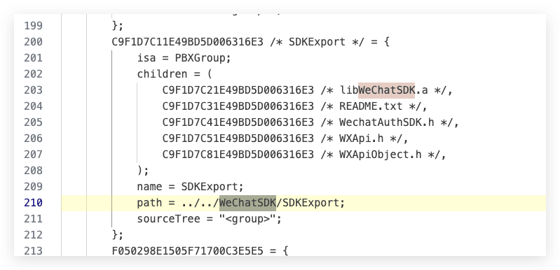
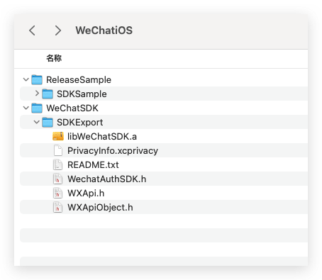
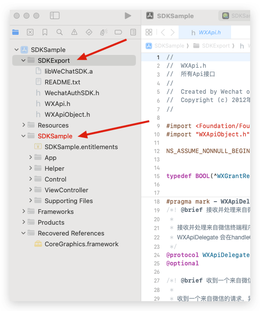
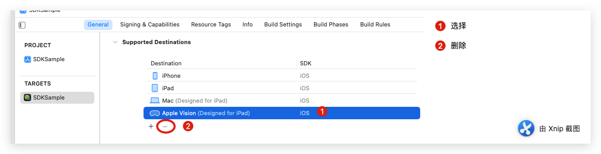
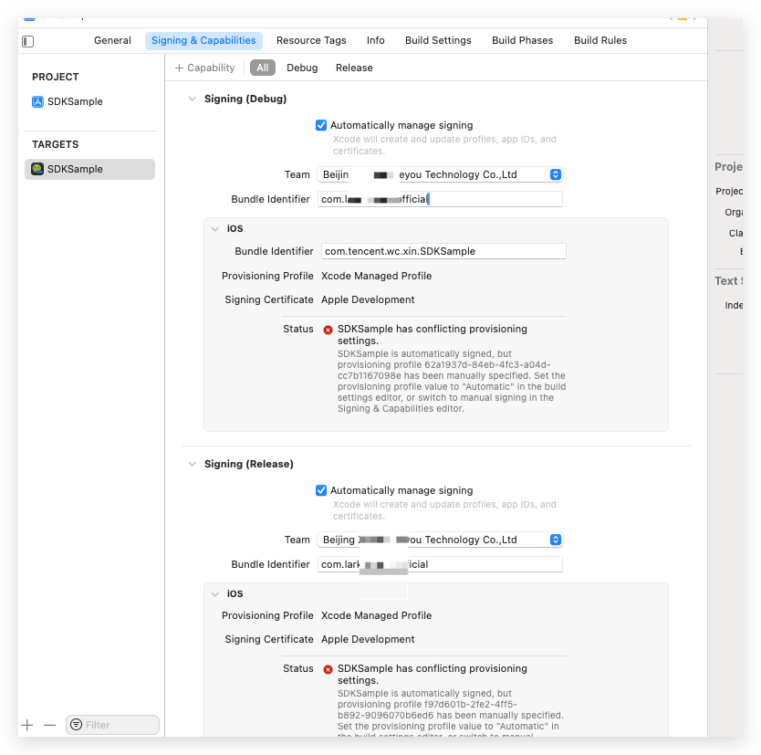
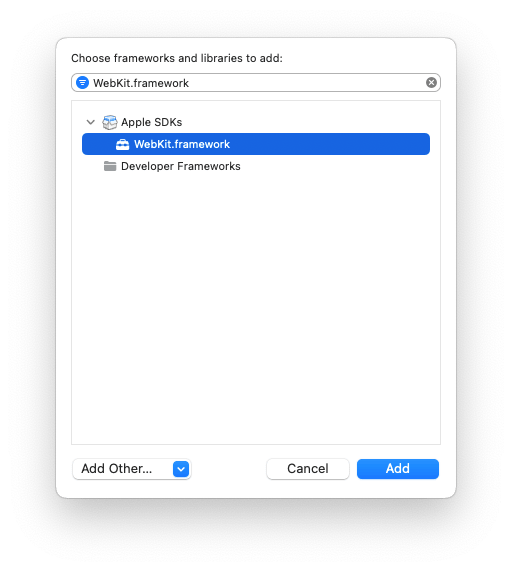

最近项目要接入App的微信登陆功能，于是就去看看官方的文档和范例，下面是如何把官方的范例在本地运行起来的过程，做个记录吧，日后再次使用的时候，可以方便查阅。
<!--more-->

## 环境

- Mac
- Xcode
- ios 手机一部

## 相关文档

- [iOS接入指南](https://developers.weixin.qq.com/doc/oplatform/Mobile_App/Access_Guide/iOS.html)
- [iOS资源下载](https://developers.weixin.qq.com/doc/oplatform/Downloads/iOS_Resource.html)

## 运行官方demo

### 下载资源

> #### 资源下载
>
> 使用微信分享、登录、收藏、支付等功能需要的库以及文件。通过CocoaPods集成（详情查看[接入流程](https://developers.weixin.qq.com/doc/oplatform/Mobile_App/Access_Guide/iOS.html)）或点击下载以下开发工具包：
>
> 1. [iOS开发工具包](https://dldir1.qq.com/WechatWebDev/opensdk/OpenSDK2.0.4.zip)（直接提供.a静态库文件的形式，2.0.4版本，包含支付功能）。
> 2. [iOS开发工具包](https://dldir1.qq.com/WechatWebDev/opensdk/OpenSDK2.0.4_NoPay.zip)（直接提供.a静态库文件的形式，2.0.4版本，不包含支付功能）。
> 3. [iOS开发工具包](https://dldir1.qq.com/WechatWebDev/opensdk/XCFramework/OpenSDK2.0.4.zip)（XCFramework的形式，2.0.4版本，包含支付功能）。
> 4. [iOS开发工具包](https://dldir1.qq.com/WechatWebDev/opensdk/XCFramework/OpenSDK2.0.4_NoPay.zip)（XCFramework的形式，2.0.4版本，不包含支付功能）。

注意 官方demo使用的是 .a静态库文件的形式  

> #### 范例代码
>
> 包含了一个完整的范例工程，该范例的使用可以参阅iOS平台上手指南。点击下载 [范例代码](https://res.wx.qq.com/op_res/bud8ZUIdD-ay-tp773CkmKDdblXObskuY3kV-VRM_zjGSTHi5dI0DwNduRqIehjz)

## 

说明：我们这里下载 [iOS开发工具包.a静态库文件的形式]() 包含支付功能和 [范例代码](https://res.wx.qq.com/op_res/bud8ZUIdD-ay-tp773CkmKDdblXObskuY3kV-VRM_zjGSTHi5dI0DwNduRqIehjz)

1. 下载后，我们这里新建一个目录 名字这里叫做 WeChatiOS


2. 修改名字，由于demo里面配置文件的路径是`../../WeChatSDK/SDKExport` 如下 

   

   

```c++
		C9F1D7C11E49BD5D006316E3 /* SDKExport */ = {
			isa = PBXGroup;
			children = (
				C9F1D7C21E49BD5D006316E3 /* libWeChatSDK.a */,
				C9F1D7C31E49BD5D006316E3 /* README.txt */,
				C9F1D7C41E49BD5D006316E3 /* WechatAuthSDK.h */,
				C9F1D7C51E49BD5D006316E3 /* WXApi.h */,
				C9F1D7C81E49BD5D006316E3 /* WXApiObject.h */,
			);
			name = SDKExport;
			path = ../../WeChatSDK/SDKExport;
			sourceTree = "<group>";
		};
```

```c++
		F05029BB1505F71800C3E5E5 /* Debug */ = {
			isa = XCBuildConfiguration;
			buildSettings = {
				CLANG_ENABLE_OBJC_ARC = YES;
				CODE_SIGN_ENTITLEMENTS = SDKSample.entitlements;
				CODE_SIGN_IDENTITY = "iPhone Distribution: Foshan Nationstar Optoelectronics Co., Ltd.";
				"CODE_SIGN_IDENTITY[sdk=iphoneos*]" = "iPhone Developer";
				DEVELOPMENT_TEAM = 8P7343TG54;
				ENABLE_BITCODE = YES;
				GCC_PRECOMPILE_PREFIX_HEADER = YES;
				GCC_PREFIX_HEADER = "SDKSample-Prefix.pch";
				INFOPLIST_FILE = "SDKSample-Info.plist";
				IPHONEOS_DEPLOYMENT_TARGET = 7.0;
				LIBRARY_SEARCH_PATHS = (
					"$(inherited)",
					"$(SRCROOT)/../../WeChatSDK/SDKExport",
				);
				OTHER_LDFLAGS = (
					"-Objc",
					"-all_load",
				);
				PRODUCT_BUNDLE_IDENTIFIER = "com.tencent.wc.xin.${PRODUCT_NAME:rfc1034identifier}";
				PRODUCT_NAME = "$(TARGET_NAME)";
				PROVISIONING_PROFILE = "62a1937d-84eb-4fc3-a04d-cc7b1167098e";
				PROVISIONING_PROFILE_SPECIFIER = "match Development com.tencent.wc.xin.SDKSample";
				WRAPPER_EXTENSION = app;
			};
			name = Debug;
		};
```

```c++
		F05029BC1505F71800C3E5E5 /* Release */ = {
			isa = XCBuildConfiguration;
			buildSettings = {
				CLANG_ENABLE_OBJC_ARC = YES;
				CODE_SIGN_ENTITLEMENTS = SDKSample.entitlements;
				CODE_SIGN_IDENTITY = "iPhone Distribution: Foshan Nationstar Optoelectronics Co., Ltd.";
				"CODE_SIGN_IDENTITY[sdk=iphoneos*]" = "iPhone Distribution";
				DEVELOPMENT_TEAM = 8P7343TG54;
				ENABLE_BITCODE = YES;
				GCC_PRECOMPILE_PREFIX_HEADER = YES;
				GCC_PREFIX_HEADER = "SDKSample-Prefix.pch";
				INFOPLIST_FILE = "SDKSample-Info.plist";
				IPHONEOS_DEPLOYMENT_TARGET = 7.0;
				LIBRARY_SEARCH_PATHS = (
					"$(inherited)",
					"$(SRCROOT)/../../WeChatSDK/SDKExport",
				);
				OTHER_LDFLAGS = (
					"-Objc",
					"-all_load",
				);
				PRODUCT_BUNDLE_IDENTIFIER = "com.tencent.wc.xin.${PRODUCT_NAME:rfc1034identifier}";
				PRODUCT_NAME = "$(TARGET_NAME)";
				PROVISIONING_PROFILE = "f97d601b-2fe2-4ff5-b892-9096070b6ed6";
				PROVISIONING_PROFILE_SPECIFIER = SDKSample_Inhouse;
				WRAPPER_EXTENSION = app;
			};
			name = Release;
		};
```

要使这个路径正常工作，你需要确保项目结构符合以下形式：

### 项目结构：

```
WeChatiOS/
├── ReleaseSample
│   └── SDKSample//范例代码目录就是`SDKSample.xcodeproj`父目录
└── WeChatSDK
    └── SDKExport
```

具体解释：

- `WeChatiOS/` 是项目的工作目录，包含了项目和 SDK 文件夹。
- `WeChatSDK/` 文件夹位于 `Root/` 目录下，里面包含 `SDKExport` 文件夹。
- `SDKExport/` 文件夹中存放了微信 SDK 的相关文件，如静态库 `libWeChatSDK.a` 以及头文件 `WechatAuthSDK.h`、`WXApi.h`、`WXApiObject.h` 等。
- `SDKSample/` 是上面下载的范例 Xcode 项目文件夹，`SDKSample.xcodeproj` 就是范例的项目文件。

注意 重点是 `../../WeChatSDK/SDKExport`这个路径 其中 SDKExport这个目录 就是上面的 OpenSDK2.0.4 ，所以下面为了构建这个路径，本地运行要对项目进行修改。

### 修改项目配置

1. 新建`WeChatSDK`文件夹 把`OpenSDK2.0.4`重命名为 `SDKExport`，新建一个目录`SDKSample` 把原来`ReleaseSample`内的文件 全部移动到`SDKSample`目录，最终效果如下：



```
├── ReleaseSample
│   └── SDKSample
│       ├── 其他文件...
│       ├── SDKSample-Info.plist
│       ├── SDKSample-Prefix.pch
│       ├── SDKSample.entitlements
│       ├── SDKSample.xcodeproj
└── WeChatSDK
    └── SDKExport
        ├── PrivacyInfo.xcprivacy
        ├── README.txt
        ├── WXApi.h
        ├── WXApiObject.h
        ├── WechatAuthSDK.h
        └── libWeChatSDK.a
```


2. 对引用的`SDK` 重新建立索引路径



- 点击左侧项目内的`SDKExport`目录


- 选择刚刚重命名好的目录`SDKExport`


- 修改完成后，同理 对 `SDKSample` 文件进行重新索引映射 发现文件不再显示标红错误


3. 设置我们运行设备，这里选择真机


4. 删除不支持的设备 以及设置 bundleid 和 team





5. 设置我们支持的iOS版本  这里选择一个 大于 10 的版本 这里选择 12.0


设置后如下


6. 重新设置失去链接或者过期的库


- 先删除原来的 红色的库
- 然后重新添加，添加后如下：


7. 修改完毕后运行我们的项目 点击 运行按钮等待构建完成。


发现构建失败：


这些错误与 `WKWebView` 相关，说明项目使用了 `WKWebView`，但是在链接阶段找不到相关的类。这通常是因为没有正确链接 `WebKit.framework`。

##### 解决方法：

- 打开 `Xcode` 项目，选择项目的 Target。
- 进入 "Build Phases" 选项卡。
- 在 "Link Binary With Libraries" 部分，点击左下角的 `+`，搜索并添加 `WebKit.framework`。




8. 再次构建运行项目

   

9. 手机效果如下：


10. 至此，官方微信范例运行成功！！！