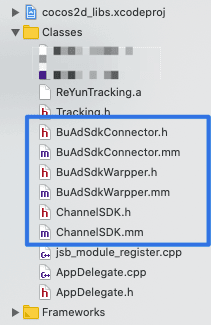
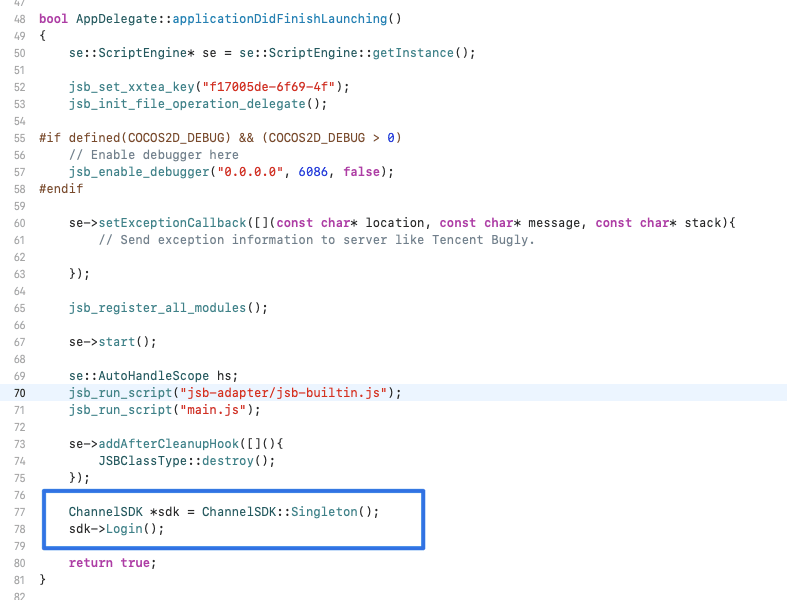
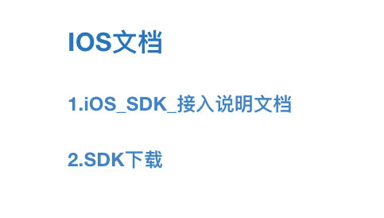

如今小游戏在各个平台百花齐放，百家争鸣，作为开发者自然是尽量去各大平台露露脸，走一波流量，基本就能回本了，如果游戏可玩性还比较好，赚点小钱的机会还是很大的，最近在走完了头条，QQ，微信平台后，又把游戏发布到了iOS的Appstore 上面。关于如何变现，自然是接入广告，下面就谈谈如何接入穿山甲和热云。

<!--more-->

### 穿山甲广告接入

1. 首先我们要去官网仔细阅读API

2. 穿山甲官网：https://partner.oceanengine.com/union/media/union/download（需要注册登录）

也可以在 GitHub 找到 [sdk接口类介绍与广告接入](https://github.com/bytedance/Bytedance-UnionAD/blob/master/Bytedance-UnionAd/Document/UnioniOSSDK.md)

3. 编写我们自己的代码我的代码如下（代码后面放出）



4. 添加 这几个文件到项目里，然后在 `AppDelegate.cpp` 的`applicationDidFinishLaunching`调用



```objective-c
 ChannelSDK *sdk = ChannelSDK::Singleton();
    sdk->Login();
```

记得要引入 

```objective-c
#include "ChannelSDK.h"
```

1. `AppController.mm` 的`didFinishLaunchingWithOptions`写几个静态方法，稍后用JavaScript调用

```objective-c

/**
 初始化视频
有参数，有返回值
*/
+(NSString *)initRewardVideo:(NSString*)videoId{
    NSLog(@"OC收到：有参数，有返回值 %@：hello",videoId);
    ChannelSDK *sdk = ChannelSDK::Singleton();
    sdk->initRewardVideo("powerDialog");
    return @"initRewardVideo";
}

/**
 有参数，有返回值
 点击显示视频
*/
+(NSString *)createVideoAdIOS:(NSString*)videoId{
    NSLog(@"OC收到：有参数，有返回值 %@：hello",videoId);
//    NSString *myname = @"mygame";
//    const char * nameChar =[myname UTF8String];
//    const char * orderIdChar = [videoId UTF8String];
    
    ChannelSDK *sdk = ChannelSDK::Singleton();
    sdk->playRewardVideo("powerDialog","xxxxxx");//xxxxxx 是你的视频id
    return @"hello";
}
```

修改 BuAdSdkWarpper.mm 里面对应的 id

```objective-c
- (id)init {
    if ((self = [super init]) != nil) {
//        [BUAdSDKManager setLoglevel:BUAdSDKLogLevelDebug];
        [BUAdSDKManager setAppID:@"xxxxxx"];//xxxxxx 是你的Appid
        NSLog(@"set appid success");
    }
    
    return self;
}
```

设置视频回调函数

```objective-c
-(void)callJsEngineCallBack:(BOOL) successful extra:(NSString*) extra name:(NSString*) name {
    NSLog(@"callJsEngineCallBack...");
    NSString *funcNameStr = @"finishRewardVideo";
    std::string funcName = [funcNameStr UTF8String];
    NSNumber *successfulNumber = [NSNumber numberWithBool:successful];
    std::string finish = "fail";
    if(successful == true){
        finish = "success";
    }
    std::string jsCallStr = cocos2d::StringUtils::format("%s(\"%s\");",funcName.c_str(),finish.c_str());
    NSLog(@"jsCallStr = %s", jsCallStr.c_str());
    se::ScriptEngine::getInstance()->evalString(jsCallStr.c_str());
}
```

**设置回调函数 线程兼容**

```objective-c

+(void)callJsEngineCallBackStart:(BOOL) mustUpdate {
    NSLog(@"callJsEngineCallBack...");
    NSString *funcNameStr = @"startCallBackStart";
    std::string funcName = [funcNameStr UTF8String];
    std::string mustUpdateStr = "update";
    if(mustUpdate == false){
        mustUpdateStr = "no";
    }
    std::string jsCallStr = cocos2d::StringUtils::format("%s(\"%s\");",funcName.c_str(),mustUpdateStr.c_str());
    NSLog(@"jsCallStr = %s", jsCallStr.c_str());
//    se::ScriptEngine::getInstance()->evalString(jsCallStr.c_str());
//    auto isDestroyed = _isDestroyed;
       auto scheduler = Application::getInstance()->getScheduler();
       scheduler->performFunctionInCocosThread([=](){
        se::ScriptEngine::getInstance()->evalString(jsCallStr.c_str());
        NSLog(@"performFunctionInCocosThread...");
       });
}
```


5. JavaScript 代码里面写入 初始化视频和播放视频 代码

```javascript

    initRewardedVideoAd: function () {
        if (!Browser.isIOS()) return;
        if(cc.sys.isNative&&(cc.sys.os === cc.sys.OS_IOS || cc.sys.os === cc.sys.OS_OSX)){
            let self = this;
            self.user_uuid = self.localStorageGetItem("uuid");
            let result = jsb.reflection.callStaticMethod("AppController", "initRewardVideo:",self.user_uuid);
            console.log("initRewardedVideoAd 返回值", result);
        }
    },
    // 回调函数的参数 success标示成功，fail表示失败update表示版本过低无法调用视频error视频错误
    showRewardedVideoAd: function(curUnitId,callback){
        let self = this;
        // if(self._addVideoIng == true){
        //     console.log("视频正在播放中");
        //     return;
        // }
        self.user_uuid = self.localStorageGetItem("uuid");
        let result = jsb.reflection.callStaticMethod("AppController", "createVideoAdIOS:",self.user_uuid);
        console.log("返回值", result);
    },
```

再写一个全局函数 监听视频播放结束，发放奖励

```javascript
window.finishRewardVideo = function (flag) {
    console.log("smile----finishRewardVideo:", JSON.stringify(flag));
    Browser.isIOS()&&Global.WXComment&&Global.WXComment.videoCallBackSuccess(flag);
}
```

广告播放时候 获取 **rootViewController**

```objective-c
if(isRewardedVideoAutoPlay){
        NSLog(@"需要播放广告了!!");
        isRewardedVideoAutoPlay = NO;
//        [self.rewardVideoAd showAdFromRootViewController:self];
        UIViewController *rootViewController = [UIApplication sharedApplication].keyWindow.rootViewController;
        if (rootViewController != nil) {
            isRewardedVideoPlayFinish = false;
            [self.rewardVideoAd showAdFromRootViewController:rootViewController];
        }else{
            NSLog(@"视图空了 拉取");
        }
      }else{
        NSLog(@"不需要播放广告!!");
      }
```

至此，穿山甲广告接入完毕

### 热云数据接入

1. 同理，先看热云数据官网的热云SDK 接入 [SDK文档](http://doc.trackingio.com/sdkwen-dang.html)
2. 找到对应的iOS文档



3. 打开“**IOS_SDK_接入说明文档**” 初始化接入

```objective-c
+ (void)initWithAppKey: withChannelId:方法进行初始化
```

4. 后续可以自行根据需要接入自己想要接口
5. 同理 JavaScript 需要自己 写代码调用

```javascript
 static register() {
        if (!Browser.isIOS()) return;
        if (!TrackDataHelper.is_fist) return;
        Global.userMgr.writeRegisterTime();
        // console.log("smile----TrackDataHelper:register", JSON.stringify(TrackDataHelper.user_id));
        let result = jsb.reflection.callStaticMethod("AppController", "registerTrack:", TrackDataHelper.user_id);
        // let game = jsb.reflection.callStaticMethod("AppController", "registerGameTrack:",TrackDataHelper.user_id);
        console.log("TrackDataHelper register 返回值", result);
    }
```

### 后记

其实后续看来，代码量不多，但需要熟悉的语法和规范很多，细节很多，自己通过询问同事和群友，以及网上搜索查找，最后问他得以解决。【[几个类文件](https://github.com/jsroads/BuAdSdkWarpper)】


