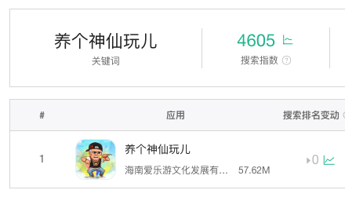
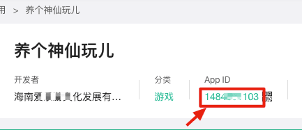
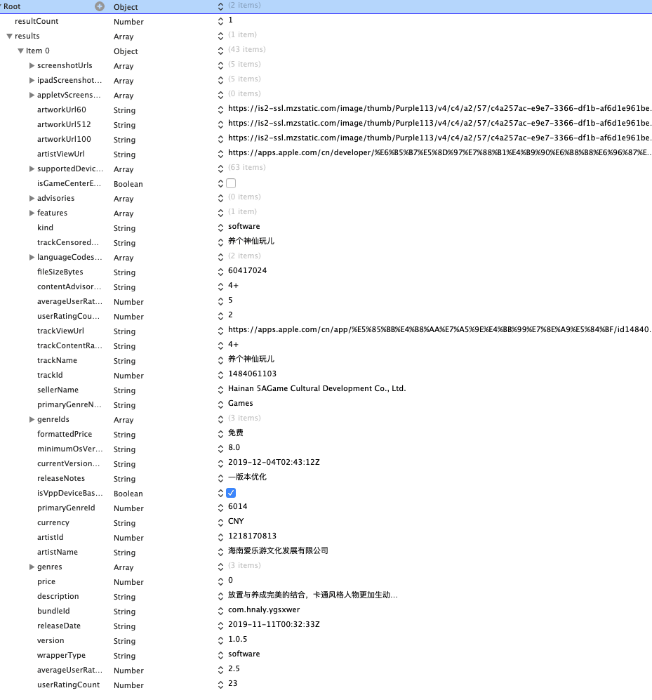

游戏发布到Appstore后，后续如果有版本需要更新，就要提醒用户去更新，此时最好的方式有两种，第一：用热更新的方式，这种玩家不需要主动去下载包，可以直接更新，第二种，让玩家去App Store 商店下载更新。第一种热更新方案，前面的文章已经说过，这里介绍第二种方案。
<!--more-->

### 获取游戏地址

- 七麦数据网站

  - 首先打开网站 输入游戏的名称搜索找到对应的游戏

  

  - 点击游戏 图标 进入游戏介绍

  

  - 目前，推荐使用的下载链接的格式为：https://apps.apple.com/cn/app/id123456789，把数字换成你的AppId
  - WWDC2019后，AppStore应用的下载链接域名变了，从itunes.apple.com变成了apps.apple.com

### 获取AppStore 游戏最新信息

苹果提供了一个很友好的iTunes接口，供我们获取App Store中App当前的最新信息，这是[ iTunes ](https://link.jianshu.com/?t=http%3A%2F%2Fwww.apple.com%2Fitunes%2Faffiliates%2Fresources%2Fdocumentation%2Fitunes-store-web-service-search-api.html)接口地址 ，有兴趣可以看一下，我们要用到的接口如下，xxx 处换成自己 App 的 AppId ，AppId 可以在 iTunes Connect 里面看到

**接口：**

```bash
http://itunes.apple.com/lookup?id=xxx
```

//xxx 为上面获取的游戏ID

比如：微信的AppId为`414478124` 那么就是

```
http://itunes.apple.com/lookup?id=414478124
```

得到信息 大概如下：

```json
{
	"resultCount": 1,
	"results": [{
		"screenshotUrls": ["https://is1-ssl.mzstatic.com/image/thumb/Purple113/v4/a1/d7/a0/a1d7a023-6501-4e61-a512-d9b3c4bdae25/pr_source.jpg/392x696bb.jpg", "https://is5-ssl.mzstatic.com/image/thumb/Purple123/v4/ac/e9/47/ace9478e-837e-7983-1b8e-f6824502e558/pr_source.jpg/392x696bb.jpg", "https://is1-ssl.mzstatic.com/image/thumb/Purple113/v4/0c/84/f3/0c84f344-9b30-11b4-e86c-a8959f1f2b7b/pr_source.jpg/392x696bb.jpg", "https://is2-ssl.mzstatic.com/image/thumb/Purple123/v4/51/d9/d5/51d9d53b-64ea-a54b-19fa-ee4856c0656f/pr_source.jpg/392x696bb.jpg", "https://is2-ssl.mzstatic.com/image/thumb/Purple113/v4/18/95/5b/18955b84-51f4-4da0-a365-823aaf9b3b60/pr_source.jpg/392x696bb.jpg"],
		"ipadScreenshotUrls": ["https://is4-ssl.mzstatic.com/image/thumb/Purple123/v4/5b/66/dc/5b66dcd7-ef51-2a83-d371-eba89da899e7/pr_source.jpg/576x768bb.jpg", "https://is2-ssl.mzstatic.com/image/thumb/Purple123/v4/9a/b9/36/9ab936f5-e689-56ad-9dd1-b5c1416441b7/pr_source.jpg/576x768bb.jpg", "https://is3-ssl.mzstatic.com/image/thumb/Purple113/v4/76/10/8c/76108cdb-2105-378d-9e09-d7e8067081b9/pr_source.jpg/576x768bb.jpg", "https://is4-ssl.mzstatic.com/image/thumb/Purple113/v4/6e/04/56/6e04566d-0b9d-7407-5934-832b96ad81ad/pr_source.jpg/576x768bb.jpg", "https://is2-ssl.mzstatic.com/image/thumb/Purple123/v4/b2/64/d8/b264d80c-ddb0-cbae-8741-af48681208c9/pr_source.jpg/576x768bb.jpg"],
		"appletvScreenshotUrls": [],
		"artworkUrl60": "https://is2-ssl.mzstatic.com/image/thumb/Purple113/v4/c4/a2/57/c4a257ac-e9e7-3366-df1b-af6d1e961beb/source/60x60bb.jpg",
		"artworkUrl512": "https://is2-ssl.mzstatic.com/image/thumb/Purple113/v4/c4/a2/57/c4a257ac-e9e7-3366-df1b-af6d1e961beb/source/512x512bb.jpg",
		"artworkUrl100": "https://is2-ssl.mzstatic.com/image/thumb/Purple113/v4/c4/a2/57/c4a257ac-e9e7-3366-df1b-af6d1e961beb/source/100x100bb.jpg",
		"artistViewUrl": "https://apps.apple.com/cn/developer/%E6%B5%B7%E5%8D%97%E7%88%B1%E4%B9%90%E6%B8%B8%E6%96%87%E5%8C%96%E5%8F%91%E5%B1%95%E6%9C%89%E9%99%90%E5%85%AC%E5%8F%B8/id1218170813?uo=4",
		"supportedDevices": ["iPad2Wifi-iPad2Wifi", "iPad23G-iPad23G", "iPhone4S-iPhone4S", "iPadThirdGen-iPadThirdGen", "iPadThirdGen4G-iPadThirdGen4G", "iPhone5-iPhone5", "iPodTouchFifthGen-iPodTouchFifthGen", "iPadFourthGen-iPadFourthGen", "iPadFourthGen4G-iPadFourthGen4G", "iPadMini-iPadMini", "iPadMini4G-iPadMini4G", "iPhone5c-iPhone5c", "iPhone5s-iPhone5s", "iPadAir-iPadAir", "iPadAirCellular-iPadAirCellular", "iPadMiniRetina-iPadMiniRetina", "iPadMiniRetinaCellular-iPadMiniRetinaCellular", "iPhone6-iPhone6", "iPhone6Plus-iPhone6Plus", "iPadAir2-iPadAir2", "iPadAir2Cellular-iPadAir2Cellular", "iPadMini3-iPadMini3", "iPadMini3Cellular-iPadMini3Cellular", "iPodTouchSixthGen-iPodTouchSixthGen", "iPhone6s-iPhone6s", "iPhone6sPlus-iPhone6sPlus", "iPadMini4-iPadMini4", "iPadMini4Cellular-iPadMini4Cellular", "iPadPro-iPadPro", "iPadProCellular-iPadProCellular", "iPadPro97-iPadPro97", "iPadPro97Cellular-iPadPro97Cellular", "iPhoneSE-iPhoneSE", "iPhone7-iPhone7", "iPhone7Plus-iPhone7Plus", "iPad611-iPad611", "iPad612-iPad612", "iPad71-iPad71", "iPad72-iPad72", "iPad73-iPad73", "iPad74-iPad74", "iPhone8-iPhone8", "iPhone8Plus-iPhone8Plus", "iPhoneX-iPhoneX", "iPad75-iPad75", "iPad76-iPad76", "iPhoneXS-iPhoneXS", "iPhoneXSMax-iPhoneXSMax", "iPhoneXR-iPhoneXR", "iPad812-iPad812", "iPad834-iPad834", "iPad856-iPad856", "iPad878-iPad878", "iPadMini5-iPadMini5", "iPadMini5Cellular-iPadMini5Cellular", "iPadAir3-iPadAir3", "iPadAir3Cellular-iPadAir3Cellular", "iPodTouchSeventhGen-iPodTouchSeventhGen", "iPhone11-iPhone11", "iPhone11Pro-iPhone11Pro", "iPadSeventhGen-iPadSeventhGen", "iPadSeventhGenCellular-iPadSeventhGenCellular", "iPhone11ProMax-iPhone11ProMax"],
		"isGameCenterEnabled": false,
		"advisories": [],
		"features": ["iosUniversal"],
		"kind": "software",
		"trackCensoredName": "养个神仙玩儿",
		"languageCodesISO2A": ["EN", "ZH"],
		"fileSizeBytes": "60417024",
		"contentAdvisoryRating": "4+",
		"averageUserRatingForCurrentVersion": 5.0,
		"userRatingCountForCurrentVersion": 2,
		"trackViewUrl": "https://apps.apple.com/cn/app/%E5%85%BB%E4%B8%AA%E7%A5%9E%E4%BB%99%E7%8E%A9%E5%84%BF/id1484061103?uo=4",
		"trackContentRating": "4+",
		"trackName": "养个神仙玩儿",
		"trackId": 1484061103,
		"sellerName": "Hainan 5AGame Cultural Development Co., Ltd.",
		"primaryGenreName": "Games",
		"genreIds": ["6014", "7015", "7014"],
		"formattedPrice": "免费",
		"minimumOsVersion": "8.0",
		"currentVersionReleaseDate": "2019-12-04T02:43:12Z",
		"releaseNotes": "—版本优化",
		"isVppDeviceBasedLicensingEnabled": true,
		"primaryGenreId": 6014,
		"currency": "CNY",
		"artistId": 1218170813,
		"artistName": "海南爱乐游文化发展有限公司",
		"genres": ["游戏", "模拟游戏", "角色扮演游戏"],
		"price": 0.00,
		"description": "放置与养成完美的结合，卡通风格人物更加生动\n用你的商业头脑，经营你的商业仙界\n\n【游戏玩法】\n1、无关卡和等级限制，自由发挥，经营你的仙界。\n2、可爱清新游戏画风，趣味十足，发挥游戏空间。\n3、修炼和关怀换成长，神仙打工，增加游戏收益。",
		"bundleId": "com.hnaly.ygsxwer",
		"releaseDate": "2019-11-11T00:32:33Z",
		"version": "1.0.5",
		"wrapperType": "software",
		"averageUserRating": 2.5,
		"userRatingCount": 23
	}]
}
```




其中有我们需要的信息

```json
{
    "resultCount" : 1,
    "results" : [{
        "artistId" : "开发者 ID",
        "artistName" : "开发者名称",
        "trackCensoredName" : "审查名称",
        "trackContentRating" : "评级",
        "trackId" : "应用程序 ID",
        "trackName" = "应用程序名称",
        "trackViewUrl" = "应用程序下载网址",
        "userRatingCount" = "用户评论数量",
        "userRatingCountForCurrentVersion" = "当前版本的用户评论数量",
        "version" = "版本号",
        "releaseNotes"="更新内容"
        "description"="应用介绍"
    }]
}
```

### 代码实现

- 如果我们想在游戏每次登陆的时候提示用户去更新，那么我们需要一个弹窗提示：

检查版本是否是最新：

```objective-c
/// 检查版本更新
- (void)checkVersion {
    NSURL * url = [NSURL URLWithString:@"http://itunes.apple.com/lookup?id=414478124"];
    [[[NSURLSession sharedSession] dataTaskWithURL:url completionHandler:^(NSData *data, NSURLResponse *response, NSError *error) {
        NSDictionary * dataDic = [NSJSONSerialization JSONObjectWithData:data options:NSJSONReadingMutableLeaves error:nil];
        NSArray *results = dataDic[@"results"];
        if (results && results.count > 0) {
            NSDictionary *response = results.firstObject;
            NSString *currentVersion = [[NSBundle mainBundle] objectForInfoDictionaryKey:@"CFBundleShortVersionString"]; // 软件的当前版本
            NSString *lastestVersion = response[@"version"]; // AppStore 上软件的最新版本
            if (currentVersion && lastestVersion && ![self isLastestVersion:currentVersion compare:lastestVersion]) {
                NSString * releaseNotes = response[@"releaseNotes"]; // 新版本更新内容
                NSString * alertContent = [NSString stringWithFormat:@"%@\n\n是否前往 AppStore 更新版本？",releaseNotes];
                // 给出提示是否前往 AppStore 更新
                UIAlertController *alert = [UIAlertController alertControllerWithTitle:@"检测到有版本更新" message:alertContent preferredStyle:UIAlertControllerStyleAlert];
                [alert addAction:[UIAlertAction actionWithTitle:@"前往" style:UIAlertActionStyleDefault handler:^(UIAlertAction *action) {
                    NSString *trackViewUrl = response[@"trackViewUrl"]; // AppStore 上软件的地址
                    if (trackViewUrl) {
                        NSURL *appStoreURL = [NSURL URLWithString:trackViewUrl];
                        if ([[UIApplication sharedApplication] canOpenURL:appStoreURL]) {
                            [[UIApplication sharedApplication] openURL:appStoreURL];
                        }
                    }
                }]];
                [alert addAction:[UIAlertAction actionWithTitle:@"取消" style:UIAlertActionStyleCancel handler:nil]];
                [[UIApplication sharedApplication].keyWindow.rootViewController presentViewController:alert animated:YES completion:nil];
            }
        }
    }] resume];
}
```

比较版本大小：

```objective-c
/// 判断是否最新版本号（大于或等于为最新）
- (BOOL)isLastestVersion:(NSString *)currentVersion compare:(NSString *)lastestVersion {
    if (currentVersion && lastestVersion) {
        // 拆分成数组
        NSMutableArray *currentItems = [[currentVersion componentsSeparatedByString:@"."] mutableCopy];
        NSMutableArray *lastestItems = [[lastestVersion componentsSeparatedByString:@"."] mutableCopy];
        // 如果数量不一样补0
        NSInteger currentCount = currentItems.count;
        NSInteger lastestCount = lastestItems.count;
        if (currentCount != lastestCount) {
            NSInteger count = labs(currentCount - lastestCount); // 取绝对值
            for (int i = 0; i < count; ++i) {
                if (currentCount > lastestCount) {
                    [lastestItems addObject:@"0"];
                } else {
                    [currentItems addObject:@"0"];
                }
            }
        }
        // 依次比较
        BOOL isLastest = YES;
        for (int i = 0; i < currentItems.count; ++i) {
            NSString *currentItem = currentItems[i];
            NSString *lastestItem = lastestItems[i];
            if (currentItem.integerValue != lastestItem.integerValue) {
                isLastest = currentItem.integerValue > lastestItem.integerValue;
                break;
            }
        }
        return isLastest;
    }
    return NO;
}
```

最后我们在 `AppController.mm` 文件的 `didFinishLaunchingWithOptions` 方法内调用

```objective-c
[self checkVersion];
```

- 如果我们需要更改大版本的时候强制用户更新，需要去掉取消按钮，并且优先比较大的版本

检查版本代码更新为：

```objective-c
/// 检查版本更新
- (void)checkVersion {
//    NSURL * url = [NSURL URLWithString:@"http://itunes.apple.com/lookup?id=414478124"];
    NSURL * url = [NSURL URLWithString:@"https://itunes.apple.com/cn/lookup?id=414478124"];
    [[[NSURLSession sharedSession] dataTaskWithURL:url completionHandler:^(NSData *data, NSURLResponse *response, NSError *error) {
        NSDictionary * dataDic = [NSJSONSerialization JSONObjectWithData:data options:NSJSONReadingMutableLeaves error:nil];
        NSArray *results = dataDic[@"results"];
        if (results && results.count > 0) {
            NSDictionary *response = results.firstObject;
            NSString *currentVersion = [[NSBundle mainBundle] objectForInfoDictionaryKey:@"CFBundleShortVersionString"]; // 软件的当前版本
            NSString *lastestVersion = response[@"version"]; // AppStore 上软件的最新版本
//            lastestVersion = @"2.0.2";//测试 数据 线上注释
            NSLog(@"currentVersion %@：",currentVersion);
            NSLog(@"lastestVersion %@：",lastestVersion);
            if (currentVersion && lastestVersion && ![self isMustLastestVersion:currentVersion compare:lastestVersion]) {
                    NSString * releaseNotes = response[@"releaseNotes"]; // 新版本更新内容
                    NSString * alertContent = [NSString stringWithFormat:@"%@\n\n是否前往 AppStore 更新版本？",releaseNotes];
                    // 给出提示是否前往 AppStore 更新
                    UIAlertController *alert = [UIAlertController alertControllerWithTitle:@"检测到有版本更新" message:alertContent preferredStyle:UIAlertControllerStyleAlert];
                    [alert addAction:[UIAlertAction actionWithTitle:@"前往" style:UIAlertActionStyleDefault handler:^(UIAlertAction *action) {
                        NSString *trackViewUrl = response[@"trackViewUrl"]; // AppStore 上软件的地址
                        if (trackViewUrl) {
                            NSURL *appStoreURL = [NSURL URLWithString:trackViewUrl];
                            if ([[UIApplication sharedApplication] canOpenURL:appStoreURL]) {
                                [[UIApplication sharedApplication] openURL:appStoreURL];
                            }
                        }
                    }]];
//                    [alert addAction:[UIAlertAction actionWithTitle:@"取消" style:UIAlertActionStyleCancel handler:nil]];
                    [[UIApplication sharedApplication].keyWindow.rootViewController presentViewController:alert animated:YES completion:nil];
                }else if (currentVersion && lastestVersion && ![self isLastestVersion:currentVersion compare:lastestVersion]) {
                NSString * releaseNotes = response[@"releaseNotes"]; // 新版本更新内容
                NSString * alertContent = [NSString stringWithFormat:@"%@\n\n是否前往 AppStore 更新版本？",releaseNotes];
                // 给出提示是否前往 AppStore 更新
                UIAlertController *alert = [UIAlertController alertControllerWithTitle:@"检测到有版本更新" message:alertContent preferredStyle:UIAlertControllerStyleAlert];
                [alert addAction:[UIAlertAction actionWithTitle:@"前往" style:UIAlertActionStyleDefault handler:^(UIAlertAction *action) {
                    NSString *trackViewUrl = response[@"trackViewUrl"]; // AppStore 上软件的地址
                    if (trackViewUrl) {
                        NSURL *appStoreURL = [NSURL URLWithString:trackViewUrl];
                        if ([[UIApplication sharedApplication] canOpenURL:appStoreURL]) {
                            [[UIApplication sharedApplication] openURL:appStoreURL];
                        }
                    }
                }]];
                [alert addAction:[UIAlertAction actionWithTitle:@"取消" style:UIAlertActionStyleCancel handler:nil]];
                [[UIApplication sharedApplication].keyWindow.rootViewController presentViewController:alert animated:YES completion:nil];
            }
        }else{
             NSLog(@"未知错误");
        }
    }] resume];
}
```

检查是否为大的版本

```objective-c
/// 判断是否最新版本号（必须更新）
- (BOOL)isMustLastestVersion:(NSString *)currentVersion compare:(NSString *)lastestVersion {
    if (currentVersion && lastestVersion) {
        // 拆分成数组
        NSMutableArray *currentItems = [[currentVersion componentsSeparatedByString:@"."] mutableCopy];
        NSMutableArray *lastestItems = [[lastestVersion componentsSeparatedByString:@"."] mutableCopy];
        // 如果数量不一样补0
        NSInteger currentCount = currentItems.count;
        NSInteger lastestCount = lastestItems.count;
        if (currentCount != lastestCount) {
            NSInteger count = labs(currentCount - lastestCount); // 取绝对值
            for (int i = 0; i < count; ++i) {
                if (currentCount > lastestCount) {
                    [lastestItems addObject:@"0"];
                } else {
                    [currentItems addObject:@"0"];
                }
            }
        }
        // 依次比较
        BOOL isLastest = YES;
        NSString *currentItem = currentItems[0];
        NSString *lastestItem = lastestItems[0];
        if (currentItem.integerValue != lastestItem.integerValue) {
            isLastest = currentItem.integerValue > lastestItem.integerValue;
        }
        return isLastest;
    }
    return NO;
}
```

```objective-c
/// 判断是否最新版本号（大于或等于为最新）
- (BOOL)isLastestVersion:(NSString *)currentVersion compare:(NSString *)lastestVersion {
    if (currentVersion && lastestVersion) {
        // 拆分成数组
        NSMutableArray *currentItems = [[currentVersion componentsSeparatedByString:@"."] mutableCopy];
        NSMutableArray *lastestItems = [[lastestVersion componentsSeparatedByString:@"."] mutableCopy];
        // 如果数量不一样补0
        NSInteger currentCount = currentItems.count;
        NSInteger lastestCount = lastestItems.count;
        if (currentCount != lastestCount) {
            NSInteger count = labs(currentCount - lastestCount); // 取绝对值
            for (int i = 0; i < count; ++i) {
                if (currentCount > lastestCount) {
                    [lastestItems addObject:@"0"];
                } else {
                    [currentItems addObject:@"0"];
                }
            }
        }
        // 依次比较
        BOOL isLastest = YES;
        for (int i = 0; i < currentItems.count; ++i) {
            NSString *currentItem = currentItems[i];
            NSString *lastestItem = lastestItems[i];
            if (currentItem.integerValue != lastestItem.integerValue) {
                isLastest = currentItem.integerValue > lastestItem.integerValue;
                break;
            }
        }
        return isLastest;
    }
    return NO;
}
```

同理 调用方法是：

```objective-c
 [self checkVersion];
```

### 服务器动态更新配置

其实另外两种种常见的更新方式：

- 把配置文件放在CDN服务器，每次更新的时候去CDN服务器下载配置文件，比如json,但是目前Cocos Creator 不支持 引用链接地址【[点击前往- 获取和加载资源](https://docs.cocos.com/creator/manual/zh/scripting/load-assets.html)】

  > 目前的此类手动资源加载还有一些限制，对用户影响比较大的是：
  >
  > 1. 原生平台远程加载不支持图片文件以外类型的资源
  > 2. 这种加载方式只支持图片、声音、文本等原生资源类型，不支持 SpriteFrame、SpriteAtlas、Tilemap 等资源的直接加载和解析（需要后续版本中的 AssetBundle 支持）
  > 3. Web 端的远程加载受到浏览器的 [CORS 跨域策略限制](https://developer.mozilla.org/en-US/docs/Web/HTTP/Access_control_CORS)，如果对方服务器禁止跨域访问，那么会加载失败，而且由于 WebGL 安全策略的限制，即便对方服务器允许 http 请求成功之后也无法渲染。

- 使用HTTPS请求服务器，从服务器获取对用的数据，通过获取的信息去判断然后根据结果去弹框，弹框代码如下：

### iOS 提示框

由于对objective-c 语法熟识度有限，自己就从网上找了一个大神写好的弹框【**[ALAlertView](https://github.com/alanshen0118/ALAlertView)**】，拿来就用了，基本已经满足这个需求了

ALAlertView.m

```objective-c
//
//  ALAlertView.m
//  Sollair
//
//  Created by alan on 8/8/16.
//  Copyright © 2016 bjdv. All rights reserved.
//

#import "ALAlertView.h"
#define kIOS9_OR_LATER ( [[[UIDevice currentDevice] systemVersion] compare:@"9.0"] != NSOrderedAscending )

@interface ALAlertView ()

@property (copy, nonatomic) CancelCallBack cancelCallBack;

@property (copy, nonatomic) OtherCallBack otherCallBack;

@end

@implementation ALAlertView

+ (instancetype)alertView {
    return [[[self class] alloc] init];
}

#pragma mark - public method
#pragma mark -- class method
/**
 *  类方法  提示框（只显示消息）
 *
 *  @param message 消息
 */
+ (void)showMessage:(NSString *)message {
    [[[self class] alertView] showMessage:message];
}

/**
 *  类方法  提示框（只显示标题和消息）
 *
 *  @param title   标题
 *  @param message 消息
 */
+ (void)showAlertViewWithTitle:(NSString *)title message:(NSString *)message {
    [[[self class] alertView] showAlertViewWithTitle:title message:message];
}

/**
 *  类方法  提示框（只显示标题和消息）
 *
 *  @param title   标题
 *  @param message 消息
 *  @param dismissCallBack 确定回调
 */
+ (void)showAlertViewWithTitle:(NSString *)title message:(NSString *)message dismissCallBack:(CancelCallBack)dismissCallBack {
    [[[self class] alertView] showAlertViewWithTitle:title message:message dismissCallBack:dismissCallBack];
}

#pragma mark -- object method
/**
 *  提示框（只显示消息）
 *
 *  @param message 消息
 */
- (void)showMessage:(NSString *)message {
    [self showAlertViewWithTitle:nil message:message];
}

/**
 *  提示框（只显示标题和消息）
 *
 *  @param title   标题
 *  @param message 消息
 */
- (void)showAlertViewWithTitle:(NSString *)title message:(NSString *)message {
    [self showAlertViewWithTitle:title message:message cancelButtonTitle:@"确定" cancelCallBack:nil otherCallBack:nil otherButtonTitles:nil];
}

/**
 *  提示框（只显示标题和消息）
 *
 *  @param title   标题
 *  @param message 消息
 *  @param dismissCallBack 确定回调
 */
- (void)showAlertViewWithTitle:(NSString *)title message:(NSString *)message dismissCallBack:(CancelCallBack)dismissCallBack {
    [self showAlertViewWithTitle:title message:message cancelButtonTitle:@"确定" cancelCallBack:dismissCallBack otherCallBack:nil otherButtonTitles:nil, nil];
}


#pragma mark -- base method
/**
 *  提示框基础方法
 *
 *  @param title             标题
 *  @param message           消息
 *  @param cancelButtonTitle 取消按钮标题
 *  @param cancelCallBack    取消按钮回调
 *  @param otherCallBack     其他按钮回调
 *  @param otherButtonTitles 其他按钮
 */
- (void)showAlertViewWithTitle:(NSString *)title message:(NSString *)message cancelButtonTitle:(NSString *)cancelButtonTitle cancelCallBack:(CancelCallBack)cancelCallBack otherCallBack:(OtherCallBack)otherCallBack otherButtonTitles:(NSString *)otherButtonTitles, ... NS_REQUIRES_NIL_TERMINATION{
#if __IPHONE_OS_VERSION_MIN_REQUIRED >= __IPHONE_9_0
    //初始化AlertController
    UIAlertController *alertViewController = [UIAlertController alertControllerWithTitle:title message:message preferredStyle:UIAlertControllerStyleAlert];
    //定义va_list
    va_list argsList;
    //指向首地址
    va_start(argsList, otherButtonTitles);
    NSInteger index = 0;
    //遍历
    while (otherButtonTitles) {
        //过滤入参类型
        if (![otherButtonTitles isKindOfClass:[NSString class]]) {
            break;
        }
        //过滤空字符串
        if (![self isBlankString:otherButtonTitles]) {
            //添加提示框按钮动作
            UIAlertAction *alertAction = [UIAlertAction actionWithTitle:otherButtonTitles style:UIAlertActionStyleDefault handler:^(UIAlertAction * _Nonnull action) {
                if (otherCallBack) {
                    [alertViewController dismissViewControllerAnimated:YES completion:nil];
                    otherCallBack(index);
                }
            }];
            [alertViewController addAction:alertAction];
        }
        //指向下一个地址
        otherButtonTitles = va_arg(argsList, NSString *);
        index++;
    }
    va_end(argsList);
    
    //取消按钮
    if (![self isBlankString:cancelButtonTitle]) {
        UIAlertAction *alertAction = [UIAlertAction actionWithTitle:cancelButtonTitle style:UIAlertActionStyleCancel handler:^(UIAlertAction * _Nonnull action) {
            //点击过后关闭提示框
            if (cancelCallBack) {
                [alertViewController dismissViewControllerAnimated:YES completion:nil];
                //取消回调方法
                cancelCallBack();
            }
        }];
        [alertViewController addAction:alertAction];
    }
    //从当前控制器中模态弹出提示框
    [[self getCurrentViewController] presentViewController:alertViewController animated:YES completion:nil];
    
#else
    if (kIOS9_OR_LATER) {
        UIAlertController *alertViewController = [UIAlertController alertControllerWithTitle:title message:message preferredStyle:UIAlertControllerStyleAlert];
        va_list argsList;
        va_start(argsList, otherButtonTitles);
        NSInteger index = 0;
        while (otherButtonTitles) {
            if (![otherButtonTitles isKindOfClass:[NSString class]]) {
                break;
            }
            if (![self isBlankString:otherButtonTitles]) {
                UIAlertAction *alertAction = [UIAlertAction actionWithTitle:otherButtonTitles style:UIAlertActionStyleDefault handler:^(UIAlertAction * _Nonnull action) {
                    if (otherCallBack) {
                        [alertViewController dismissViewControllerAnimated:YES completion:nil];
                        otherCallBack(index);
                    }
                }];
                [alertViewController addAction:alertAction];
            }
            otherButtonTitles = va_arg(argsList, NSString *);
            index++;
        }
        va_end(argsList);
        if (![self isBlankString:cancelButtonTitle]) {
            UIAlertAction *alertAction = [UIAlertAction actionWithTitle:cancelButtonTitle style:UIAlertActionStyleCancel handler:^(UIAlertAction * _Nonnull action) {
                if (cancelCallBack) {
                    [alertViewController dismissViewControllerAnimated:YES completion:nil];
                    cancelCallBack();
                }
            }];
            [alertViewController addAction:alertAction];
        }
        
        [[self getCurrentViewController] presentViewController:alertViewController animated:YES completion:nil];
    } else {
        self.cancelCallBack = [cancelCallBack copy];
        self.otherCallBack = [otherCallBack copy];
        UIAlertView *alertView = [[UIAlertView alloc] initWithTitle:title message:message delegate:self cancelButtonTitle:cancelButtonTitle otherButtonTitles:nil];
        va_list argsList;
        va_start(argsList, otherButtonTitles);
        NSInteger index = 0;
        while (otherButtonTitles) {
            if (![self isBlankString:otherButtonTitles]) {
                [alertView addButtonWithTitle:otherButtonTitles];
            }
            otherButtonTitles = va_arg(argsList, NSString *);
            index++;
        }
        va_end(argsList);
        
        [alertView show];
    }
    
#endif
}

#pragma mark - System Delegate
#pragma mark -- UIAlertViewDelegete
#if __IPHONE_OS_VERSION_MIN_REQUIRED < __IPHONE_9_0
- (void)alertView:(UIAlertView *)alertView clickedButtonAtIndex:(NSInteger)buttonIndex {
    NSInteger otherButtonIndex = 0;
    if (alertView.cancelButtonIndex == 0) {
        if (buttonIndex == 0) {
            if (self.cancelCallBack) {
                self.cancelCallBack();
            }
            return;
        }
        otherButtonIndex = buttonIndex - 1;
    }
    if (self.otherCallBack) {
        self.otherCallBack(otherButtonIndex);
    }
    
}
#endif

#pragma mark - Utils
/**
 *  判断空字符串
 *
 *  @param string 字符串
 *
 *  @return 是否为空
 */
- (BOOL)isBlankString:(NSString *)string {
    if (string == nil || string == NULL) {
        return YES;
    }
    if ([string isKindOfClass:[NSNull class]]) {
        return YES;
    }
    if ([[string stringByTrimmingCharactersInSet:[NSCharacterSet whitespaceCharacterSet]] length]==0) {
        return YES;
    }
    return NO;
}

/**
 *  获取当前视图控制器
 *
 *  @return 当前视图控制器
 */
- (UIViewController *)getCurrentViewController
{
    UIViewController *currentViewController = nil;
    UIWindow * window = [[UIApplication sharedApplication] keyWindow];
    
    if ([window subviews].count == 0) {
        return nil;
    }
    
    if (window.windowLevel != UIWindowLevelNormal) {
        NSArray *windows = [[UIApplication sharedApplication] windows];
        for(UIWindow * subWindow in windows)
        {
            if (subWindow.windowLevel == UIWindowLevelNormal) {
                window = subWindow;
                break;
            }
        }
    }

    UIView *frontView = [[window subviews] objectAtIndex:0];
    id nextResponder = [frontView nextResponder];
    
    if ([nextResponder isKindOfClass:[UIViewController class]]) {
        currentViewController = nextResponder;
    } else {
        currentViewController = window.rootViewController;
    }
    return currentViewController;
}
@end

```

ALAlertView.h

```objective-c
//
//  ALAlertView.h
//  Sollair
//
//  Created by alan on 8/8/16.
//  Copyright © 2016 bjdv. All rights reserved.
//

#import <Foundation/Foundation.h>
#import <UIKit/UIKit.h>
#define kIOS9_OR_LATER ( [[[UIDevice currentDevice] systemVersion] compare:@"9.0"] != NSOrderedAscending )

#define XXALERT(msg) [ALAlertView showMessage:msg];

typedef void(^CancelCallBack)();
typedef void(^OtherCallBack)(NSInteger buttonIndex);

@interface ALAlertView : NSObject<UIAlertViewDelegate>

+ (instancetype)alertView;

/**
 *  类方法  提示框（只显示消息）
 *
 *  @param message 消息
 */
+ (void)showMessage:(NSString *)message;

/**
 *  类方法  提示框（只显示标题和消息）
 *
 *  @param title   标题
 *  @param message 消息
 */
+ (void)showAlertViewWithTitle:(NSString *)title message:(NSString *)message;

/**
 *  类方法  提示框（只显示标题和消息）
 *
 *  @param title   标题
 *  @param message 消息
 *  @param dismissCallBack 确定回调
 */
+ (void)showAlertViewWithTitle:(NSString *)title message:(NSString *)message dismissCallBack:(CancelCallBack)dismissCallBack;

/**
 *  提示框基础方法
 *
 *  @param title             标题
 *  @param message           消息
 *  @param cancelButtonTitle 取消按钮标题
 *  @param cancelCallBack    取消按钮回调
 *  @param otherCallBack     其他按钮回调
 *  @param otherButtonTitles 其他按钮
 */
- (void)showAlertViewWithTitle:(NSString *)title message:(NSString *)message cancelButtonTitle:(NSString *)cancelButtonTitle cancelCallBack:(CancelCallBack)cancelCallBack otherCallBack:(OtherCallBack)otherCallBack otherButtonTitles:(NSString *)otherButtonTitles, ... NS_REQUIRES_NIL_TERMINATION;

/**
 *  提示框（只显示消息）
 *
 *  @param message 消息
 */
- (void)showMessage:(NSString *)message;

/**
 *  提示框（只显示标题和消息）
 *
 *  @param title   标题
 *  @param message 消息
 */
- (void)showAlertViewWithTitle:(NSString *)title message:(NSString *)message;

/**
 *  提示框（只显示标题和消息）
 *
 *  @param title   标题
 *  @param message 消息
 *  @param dismissCallBack 确定回调
 */
- (void)showAlertViewWithTitle:(NSString *)title message:(NSString *)message dismissCallBack:(CancelCallBack)dismissCallBack;

@end

```

调用方法

```objective-c
+(NSString *)updateGames:(NSString*)userId{
    NSLog(@"OC收到：有参数，有返回值 %@：userId",userId);
//    [[ALAlertView alertView] showAlertViewWithTitle:@"标题" message:@"消息" dismissCallBack:^{
//        NSLog(@"用户点击了确定");
//        [[UIApplication sharedApplication] openURL:[NSURL URLWithString:@"https://apps.apple.com/cn/app/id1484061103?mt=8"]];
//    }];
    [[ALAlertView alertView] showAlertViewWithTitle:@"更新提示" message:@"游戏有新的版本可以更新" cancelButtonTitle:@"取消" cancelCallBack:^{
            NSLog(@"用户点击了取消");
     }otherCallBack:^(NSInteger buttonIndex){
         NSLog(@"用户点击了确定");
         [[UIApplication sharedApplication] openURL:[NSURL URLWithString:@"https://apps.apple.com/cn/app/id1484061103?mt=8"]];
     } otherButtonTitles:@"确定", nil];
    return @"updateGames";
}
```


### 参考

- [iOS如何快速获取App在AppStore的下载地址](https://www.jianshu.com/p/1be092e00c6f)
- [iOS 获取 AppStore 上 APP 版本号比较提示更新](http://www.cocoachina.com/articles/24601)
- [iOS简单调用系统提示框(UIAlertController)](https://www.codeleading.com/article/9993524143/)
- [利用 iTunes 接口检查 App 版本更新](http://www.coolketang.com/staticIOS/5b0953b4ac502e0062c27f31.html)
- [iOS跳转AppStore相关](https://www.jianshu.com/p/d81a0ca7b149)
- [ios 开发之UIAlertController](https://www.jianshu.com/p/7fb04f9daad5)
- [cocos creator iOS原生分享接入](https://www.jianshu.com/p/61ac842eddc5)