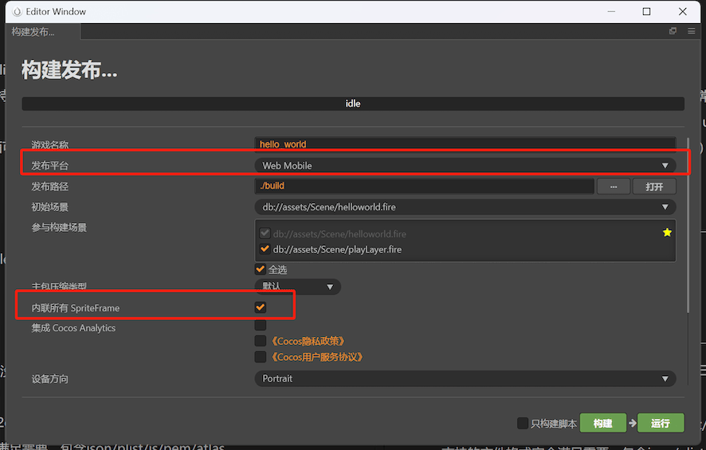
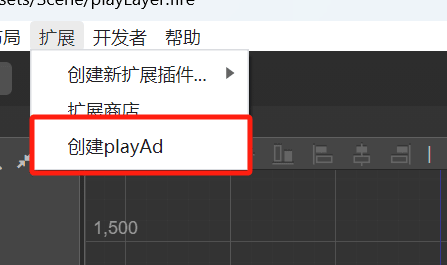
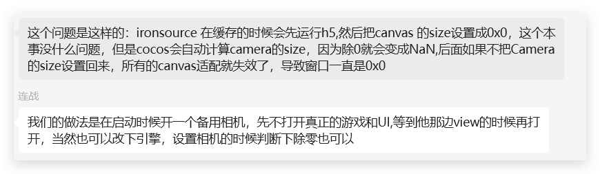

这里是你博客列表显示的摘要文字，现在很多游戏都喜欢用素材广告来吸引用户，就引发了游戏试玩的制作，本身`Cocos Creator`不支持直接导出试玩，但很多开发者们已经研究了一套试玩的工具和方法策略，下面就简单的说说如何制作海外试玩。
<!--more-->
现在海外的试玩平台有很多。比如 `AppLovin`、`Facebook`、`Google`、`IronSource`、`Liftoff`、`Mintegral`、`Moloco`、`Pangle`、`Rubeex`、`Tiktok`、`Unity`等试玩广告平台。这些平台有个特点就是构建导出的web目录，最终要生成一个`html`文件。

## 工具插件相关

### super-html（128元）【收费】


商店地址：https://store.cocos.com/app/detail/3657

- 接入文档 [[demo | sdk\]](https://github.com/magician-f/cocos-playable-demo)
- 最后更新时间：2024-03-07

### SmartAd试玩打包工具（支持GoogleAds、Facebook等7个渠道）【免费】


商店地址：https://store.cocos.com/app/detail/3732

- 最后更新时间：2022-05-11

### CreatePlayableAd【免费】





#### 插件特色

- 没有sdk，没有sdk，没有sdk（重要的事情说三遍）。所以扩展性极高，任何新的平台都可以轻松拿捏
- 支持绝大多数 cocos 2d 组件。例如 spine/plist/particle......
- 支持的文件格式完全满足需要，包含 json/plist/js/pem/atlas......
- 支持的资源格式也足够丰富，包含 wasm/png/jpg/gif/wav/bin/mp3/ttf/dbbin/mp4......

插件地址：https://store.cocos.com/app/detail/6293

最后更新时间：2024-06-18

### Playable ads adapter【免费】

地址：https://github.com/ppgee/cocos-pnp

Cocos广告试玩多渠道导出插件

#### 插件使用

如果只是使用，可以直接下载构建包，大版本区分2.x和3.x，目前已通过测试的版本是2.4.9、2.4.10、3.6.0、3.8.2，其他版本自行测试，有问题欢迎提issue或者解决提mr

#### 下载地址

插件下载地址：

https://github.com/ppgee/cocos-pnp/releases?q=playable-ads-adapter&expanded=true

> ### 安装插件
>
> 将下载好的插件解压后放到Cocos对应的插件文件夹：
>
> - 2.x的插件目录是项目根目录的packages
> - 3.x的插件目录是项目根目录的extensions
>
> 安装后即可使用（如果找不到插件的，可以选择重启一下项目）
>
> #### 使用插件
>
> - 插件有两种方式进行适配，第一种是正常点击项目构建发布（构建渠道请选择 `web-mobile` 或者 `web-desktop`）时，自动触发适配功能
> - 项目选项栏中出现 **多渠道构建** ，点击该选项下的 **开始构建**进行构建
>
> #### 插件说明
>
> #### 支持渠道
>
> |              | AppLovin | Facebook | Google | IronSource | Liftoff | Mintegral | Moloco | Pangle | Rubeex | Tiktok | Unity |
> | ------------ | -------- | -------- | ------ | ---------- | ------- | --------- | ------ | ------ | ------ | ------ | ----- |
> | **>= 2.4.6** | ✅        | ✅        | ✅      | ✅          | ✅       | ✅         | ✅      | ✅      | ✅      | ✅      | ✅     |
> | **3.8.x**    | ✅        | ✅        | ✅      | ✅          | ✅       | ✅         | ✅      | ✅      | ✅      | ✅      | ✅     |

### Cocos-Creator-Build-Tool

地址：https://gitee.com/welcome2jcSpace/Cocos-Creator-Build-Tool

可以解决CocosCreator2.4x版本Web包跨域问题打包成单Html

论坛地址：https://forum.cocos.org/t/topic/120482

## 其他制作

### SmartAd试玩广告制作平台

官方地址：https://www.smartad.pro/


#### 试玩多渠道支持添加SDK操作说明

##### 添加SDK

```
window.smartad_sdk && window.smartad_sdk() 
```

##### SDK调用时机

在试玩广告的落地页安装按钮（有的渠道也称下载按钮）点击时调用上述SDK。

#### 优化文章

- [Cocos试玩加载速度优化](https://www.smartad.pro/help/4)
- [包体大小优化](https://www.smartad.pro/help/5)

### 微游H5出海开发者中心

官方地址：https://www.minigamecloud.com/


#### SDK接入指南

https://www.minigamecloud.com/docs/cocos-creator-2.xjieruzhinan

## 使用过程 

这里我们使用一个免费版 [Playable ads adapter](https://github.com/ppgee/cocos-pnp)

#### 修改源码


```typescript
export const AD_SDK_SCRIPT = `<script>"use strict";function _typeof(e){return(_typeof="function"==typeof Symbol&&"symbol"==typeof Symbol.iterator?function(e){return typeof e}:function(e){return e&&"function"==typeof Symbol&&e.constructor===Symbol&&e!==Symbol.prototype?"symbol":typeof e})(e)}function _classCallCheck(e,t){if(!(e instanceof t))throw new TypeError("Cannot call a class as a function")}function _defineProperties(e,t){for(var i=0;i<t.length;i++){var n=t[i];n.enumerable=n.enumerable||!1,n.configurable=!0,"value"in n&&(n.writable=!0),Object.defineProperty(e,n.key,n)}}function _createClass(e,t,i){return t&&_defineProperties(e.prototype,t),i&&_defineProperties(e,i),e}var Config={LIB_VERSION:"2.2.4",LIB_NAME:"MG"},_={},ArrayProto=Array.prototype,ObjProto=Object.prototype,slice=ArrayProto.slice,nativeToString=ObjProto.toString,nativeHasOwnProperty=Object.prototype.hasOwnProperty,nativeForEach=ArrayProto.forEach,nativeIsArray=Array.isArray,breaker={},utmTypes=["utm_source","utm_medium","utm_campaign","utm_content","utm_term"];_.each=function(e,t,i){if(null==e)return!1;if(nativeForEach&&e.forEach===nativeForEach)e.forEach(t,i);else if(e.length===+e.length){for(var n=0,a=e.length;n<a;n++)if(n in e&&t.call(i,e[n],n,e)===breaker)return!1}else for(var r in e)if(nativeHasOwnProperty.call(e,r)&&t.call(i,e[r],r,e)===breaker)return!1},_.extend=function(i){return _.each(slice.call(arguments,1),function(e){for(var t in e)void 0!==e[t]&&(i[t]=e[t])}),i},_.extend2Layers=function(i){return _.each(slice.call(arguments,1),function(e){for(var t in e)void 0!==e[t]&&(_.isObject(e[t])&&_.isObject(i[t])?_.extend(i[t],e[t]):i[t]=e[t])}),i},_.isArray=nativeIsArray||function(e){return"[object Array]"===nativeToString.call(e)},_.isFunction=function(e){try{return"function"==typeof e}catch(e){return!1}},_.isPromise=function(e){return"[object Promise]"===nativeToString.call(e)&&null!=e},_.isObject=function(e){return"[object Object]"===nativeToString.call(e)&&null!=e},_.isEmptyObject=function(e){if(_.isObject(e)){for(var t in e)if(nativeHasOwnProperty.call(e,t))return!1;return!0}return!1},_.isUndefined=function(e){return void 0===e},_.isString=function(e){return"[object String]"===nativeToString.call(e)},_.isDate=function(e){return"[object Date]"===nativeToString.call(e)},_.isBoolean=function(e){return"[object Boolean]"===nativeToString.call(e)},_.isNumber=function(e){return"[object Number]"===nativeToString.call(e)&&/[\\d\\.]+/.test(String(e))},_.isJSONString=function(e){try{JSON.parse(e)}catch(e){return!1}return!0},_.decodeURIComponent=function(t){var i="";try{i=decodeURIComponent(t)}catch(e){i=t}return i},_.encodeURIComponent=function(t){var i="";try{i=encodeURIComponent(t)}catch(e){i=t}return i},_.utf8Encode=function(e){for(var t,i="",n=t=0,a=(e=(e+"").replace(/\\r\\n/g,"\\n").replace(/\\r/g,"\\n")).length,r=0;r<a;r++){var s=e.charCodeAt(r),o=null;s<128?t++:o=127<s&&s<2048?String.fromCharCode(s>>6|192,63&s|128):String.fromCharCode(s>>12|224,s>>6&63|128,63&s|128),null!==o&&(n<t&&(i+=e.substring(n,t)),i+=o,n=t=r+1)}return n<t&&(i+=e.substring(n,e.length)),i},_.base64Encode=function(e){var t,i,n,a,r="ABCDEFGHIJKLMNOPQRSTUVWXYZabcdefghijklmnopqrstuvwxyz0123456789+/=",s=0,o=0,c="",u=[];if(!e)return e;for(e=_.utf8Encode(e);t=(a=e.charCodeAt(s++)<<16|e.charCodeAt(s++)<<8|e.charCodeAt(s++))>>18&63,i=a>>12&63,n=a>>6&63,a=63&a,u[o++]=r.charAt(t)+r.charAt(i)+r.charAt(n)+r.charAt(a),s<e.length;);switch(c=u.join(""),e.length%3){case 1:c=c.slice(0,-2)+"==";break;case 2:c=c.slice(0,-1)+"="}return c},_.encodeDates=function(n){return _.each(n,function(e,t){if(_.isDate(e))n[t]=_.formatDate(e);else if(_.isObject(e))n[t]=_.encodeDates(e);else if(_.isArray(e))for(var i=0;i<e.length;i++)_.isDate(e[i])&&(n[t][i]=_.formatDate(e[i]))}),n},_.formatDate=function(e){function t(e){return e<10?"0"+e:e}return e.getFullYear()+"-"+t(e.getMonth()+1)+"-"+t(e.getDate())+" "+t(e.getHours())+":"+t(e.getMinutes())+":"+t(e.getSeconds())+"."+((i=e.getMilliseconds())<100&&9<i?"0"+i:i<10?"00"+i:i);var i},_.searchObjDate=function(i){try{(_.isObject(i)||_.isArray(i))&&_.each(i,function(e,t){_.isObject(e)||_.isArray(e)?_.searchObjDate(i[t]):_.isDate(e)&&(i[t]=_.formatDate(e))})}catch(e){logger$1.warn(e)}},_.UUID=function(){var e=(new Date).getTime();return String(Math.random()).replace(".","").slice(1,11)+"-"+e},_.UUIDv4=function(){return"xxxxxxxx-xxxx-4xxx-yxxx-xxxxxxxxxxxx".replace(/[xy]/g,function(e){var t=16*Math.random()|0;return("x"===e?t:3&t|8).toString(16)})},_.setMpPlatform=function(e){_.mpPlatform=e},_.getMpPlatform=function(){return _.mpPlatform},_.createExtraHeaders=function(){return{"TA-Integration-Type":Config.LIB_NAME,"TA-Integration-Version":Config.LIB_VERSION,"TA-Integration-Count":"1","TA-Integration-Extra":_.getMpPlatform()}},_.checkAppId=function(e){return e=e.replace(/\\s*/g,"")},_.checkUrl=function(e){return e=e.replace(/\\s*/g,""),e=_.url("basic",e)},_.url=function(){function a(){return new RegExp(/(.*?)\\.?([^.]*?)\\.(com|net|org|biz|ws|in|me|co\\.uk|co|org\\.uk|ltd\\.uk|plc\\.uk|me\\.uk|edu|mil|br\\.com|cn\\.com|eu\\.com|hu\\.com|no\\.com|qc\\.com|sa\\.com|se\\.com|se\\.net|us\\.com|uy\\.com|ac|co\\.ac|gv\\.ac|or\\.ac|ac\\.ac|af|am|as|at|ac\\.at|co\\.at|gv\\.at|or\\.at|asn\\.au|com\\.au|edu\\.au|org\\.au|net\\.au|id\\.au|be|ac\\.be|adm\\.br|adv\\.br|am\\.br|arq\\.br|art\\.br|bio\\.br|cng\\.br|cnt\\.br|com\\.br|ecn\\.br|eng\\.br|esp\\.br|etc\\.br|eti\\.br|fm\\.br|fot\\.br|fst\\.br|g12\\.br|gov\\.br|ind\\.br|inf\\.br|jor\\.br|lel\\.br|med\\.br|mil\\.br|net\\.br|nom\\.br|ntr\\.br|odo\\.br|org\\.br|ppg\\.br|pro\\.br|psc\\.br|psi\\.br|rec\\.br|slg\\.br|tmp\\.br|tur\\.br|tv\\.br|vet\\.br|zlg\\.br|br|ab\\.ca|bc\\.ca|mb\\.ca|nb\\.ca|nf\\.ca|ns\\.ca|nt\\.ca|on\\.ca|pe\\.ca|qc\\.ca|sk\\.ca|yk\\.ca|ca|cc|ac\\.cn|net\\.cn|com\\.cn|edu\\.cn|gov\\.cn|org\\.cn|bj\\.cn|sh\\.cn|tj\\.cn|cq\\.cn|he\\.cn|nm\\.cn|ln\\.cn|jl\\.cn|hl\\.cn|js\\.cn|zj\\.cn|ah\\.cn|gd\\.cn|gx\\.cn|hi\\.cn|sc\\.cn|gz\\.cn|yn\\.cn|xz\\.cn|sn\\.cn|gs\\.cn|qh\\.cn|nx\\.cn|xj\\.cn|tw\\.cn|hk\\.cn|mo\\.cn|cn|cx|cz|de|dk|fo|com\\.ec|tm\\.fr|com\\.fr|asso\\.fr|presse\\.fr|fr|gf|gs|co\\.il|net\\.il|ac\\.il|k12\\.il|gov\\.il|muni\\.il|ac\\.in|co\\.in|org\\.in|ernet\\.in|gov\\.in|net\\.in|res\\.in|is|it|ac\\.jp|co\\.jp|go\\.jp|or\\.jp|ne\\.jp|ac\\.kr|co\\.kr|go\\.kr|ne\\.kr|nm\\.kr|or\\.kr|li|lt|lu|asso\\.mc|tm\\.mc|com\\.mm|org\\.mm|net\\.mm|edu\\.mm|gov\\.mm|ms|nl|no|nu|pl|ro|org\\.ro|store\\.ro|tm\\.ro|firm\\.ro|www\\.ro|arts\\.ro|rec\\.ro|info\\.ro|nom\\.ro|nt\\.ro|se|si|com\\.sg|org\\.sg|net\\.sg|gov\\.sg|sk|st|tf|ac\\.th|co\\.th|go\\.th|mi\\.th|net\\.th|or\\.th|tm|to|com\\.tr|edu\\.tr|gov\\.tr|k12\\.tr|net\\.tr|org\\.tr|com\\.tw|org\\.tw|net\\.tw|ac\\.uk|uk\\.com|uk\\.net|gb\\.com|gb\\.net|vg|sh|kz|ch|info|ua|gov|name|pro|ie|hk|com\\.hk|org\\.hk|net\\.hk|edu\\.hk|us|tk|cd|by|ad|lv|eu\\.lv|bz|es|jp|cl|ag|mobi|eu|co\\.nz|org\\.nz|net\\.nz|maori\\.nz|iwi\\.nz|io|la|md|sc|sg|vc|tw|travel|my|se|tv|pt|com\\.pt|edu\\.pt|asia|fi|com\\.ve|net\\.ve|fi|org\\.ve|web\\.ve|info\\.ve|co\\.ve|tel|im|gr|ru|net\\.ru|org\\.ru|hr|com\\.hr|ly|xyz)$/)}function r(e,t){var i=e.charAt(0),t=t.split(i);return i===e?t:t[(e=parseInt(e.substring(1),10))<0?t.length+e:e-1]}function s(e,t){for(var i,n,a=e.charAt(0),r=t.split("&"),s=[],o={},c=e.substring(1),u=0,l=r.length;u<l;u++)if(""!==(s=(s=r[u].match(/(.*?)=(.*)/))||[r[u],r[u],""])[1].replace(/\\s/g,"")){if(s[2]=(n=s[2]||"",_.decodeURIComponent(n.replace(/\\+/g," "))),c===s[1])return s[2];(i=s[1].match(/(.*)\\[([0-9]+)\\]/))?(o[i[1]]=o[i[1]]||[],o[i[1]][i[2]]=s[2]):o[s[1]]=s[2]}return a===e?o:o[c]}return function(e,t){var i={};if("tld?"===e)return a();if(t=t||window.location.toString(),!e)return t;if(e=e.toString(),t.match(/^mailto:([^/].+)/))n=t.match(/^mailto:([^/].+)/),i.protocol="mailto",i.email=n[1];else{if(t.match(/(.*?)\\/#!(.*)/)&&(t=(n=t.match(/(.*?)\\/#!(.*)/))[1]+n[2]),t.match(/(.*?)#(.*)/)&&(n=t.match(/(.*?)#(.*)/),i.hash=n[2],t=n[1]),i.hash&&e.match(/^#/))return s(e,i.hash);if(t.match(/(.*?)\\?(.*)/)&&(n=t.match(/(.*?)\\?(.*)/),i.query=n[2],t=n[1]),i.query&&e.match(/^\\?/))return s(e,i.query);if(t.match(/(.*?):?\\/\\/(.*)/)&&(n=t.match(/(.*?):?\\/\\/(.*)/),i.protocol=n[1].toLowerCase(),t=n[2]),t.match(/(.*?)(\\/.*)/)&&(n=t.match(/(.*?)(\\/.*)/),i.path=n[2],t=n[1]),i.path=(i.path||"").replace(/^([^/])/,"/$1").replace(/\\/$/,""),e.match(/^[-0-9]+$/)&&(e=e.replace(/^([^/])/,"/$1")),e.match(/^\\//))return r(e,i.path.substring(1));if((n=(n=r("/-1",i.path.substring(1)))&&n.match(/(.*?)\\.(.*)/))&&(i.file=n[0],i.filename=n[1],i.fileext=n[2]),t.match(/(.*):([0-9]+)$/)&&(n=t.match(/(.*):([0-9]+)$/),i.port=n[2],t=n[1]),t.match(/(.*?)@(.*)/)&&(n=t.match(/(.*?)@(.*)/),i.auth=n[1],t=n[2]),i.auth&&(n=i.auth.match(/(.*):(.*)/),i.user=n?n[1]:i.auth,i.pass=n?n[2]:void 0),i.hostname=t.toLowerCase(),"."===e.charAt(0))return r(e,i.hostname);a()&&(n=i.hostname.match(a()))&&(i.tld=n[3],i.domain=n[2]?n[2]+"."+n[3]:void 0,i.sub=n[1]||void 0);var n=i.port?":"+i.port:"";i.protocol=i.protocol||window.location.protocol.replace(":",""),i.port=i.port||("https"===i.protocol?"443":"80"),i.protocol=i.protocol||("443"===i.port?"https":"http"),i.basic=i.protocol+"://"+i.hostname+n}return e in i?i[e]:"{}"===e?i:""}}(),_.createString=function(e){for(var t=e,i=Math.random().toString(36).substr(2);i.length<t;)i+=Math.random().toString(36).substr(2);return i=i.substr(0,e)},_.createAesKey=function(){return _.createString(16)},_.generateEncryptyData=function(e,t){if(void 0===t)return e;var i=t.publicKey,n=t.version;if(void 0===i||void 0===n)return e;if("undefined"==typeof CryptoJS||"undefined"==typeof JSEncrypt)return e;var a=_.createAesKey();try{var r=CryptoJS.enc.Utf8.parse(a),s=CryptoJS.enc.Utf8.parse(JSON.stringify(e)),o=_.isUndefined(CryptoJS.pad.Pkcs7)?CryptoJS.pad.PKCS7:CryptoJS.pad.Pkcs7,r=CryptoJS.AES.encrypt(s,r,{mode:CryptoJS.mode.ECB,padding:o}).toString(),o=new JSEncrypt;o.setPublicKey(i);o=o.encrypt(a);return!1===o?(logger$1.warn("Encryption failed, return the original data"),e):{pkv:n,ekey:o,payload:r}}catch(e){logger$1.warn("Encryption failed, return the original data: "+e)}return e},_.getUtm=function(){var i={};return _.each(utmTypes,function(e){try{var t=_.getQueryParam(location.href,e);t.length&&(i[e]=t)}catch(e){logger$1.warn("get utm fail: "+e)}}),JSON.stringify(i)},_.getQueryParam=function(e,t){t=t.replace(/[\\[]/,"\\\\[").replace(/[\\]]/,"\\\\]"),e=_.decodeURIComponent(e);e=new RegExp("[\\\\?&]"+t+"=([^&#]*)").exec(e);return null===e||e&&"string"!=typeof e[1]&&e[1].length?"":_.decodeURIComponent(e[1])},_.getUtmFromQuery=function(t){var i={};return _.each(utmTypes,function(e){t[e]&&(i[e]=t[e])}),JSON.stringify(i)},_.indexOf=function(e,t){var i=e.indexOf;if(i)return i.call(e,t);for(var n=0;n<e.length;n++)if(t===e[n])return n;return-1},_.checkCalibration=function(e,t,i){return e};var logger$1="object"===_typeof(logger$1)?logger$1:{};logger$1.info=function(){if("object"===("undefined"==typeof console?"undefined":_typeof(console))&&console.log&&logger$1.enabled)try{return console.log.apply(console,arguments)}catch(e){console.log(arguments[0])}},logger$1.warn=function(){if("object"===("undefined"==typeof console?"undefined":_typeof(console))&&console.log&&logger$1.enabled)try{return console.warn.apply(console,arguments)}catch(e){console.warn(arguments[0])}};var PlatformProxy=function(){function e(){_classCallCheck(this,e),this.config={persistenceName:"thinkingdata",persistenceNameOld:"thinkingdata_mg"}}return _createClass(e,[{key:"getConfig",value:function(){return this.config}},{key:"getStorage",value:function(e,t,i){e=localStorage.getItem(e);if(!t)return _.isJSONString(e)?JSON.parse(e):{};_.isJSONString(e)?i(JSON.parse(e)):i({})}},{key:"setStorage",value:function(e,t){localStorage.setItem(e,t)}},{key:"removeStorage",value:function(e){localStorage.removeItem(e)}},{key:"_setSystemProxy",value:function(e){this._sysCallback=e}},{key:"getSystemInfo",value:function(e){var t={mp_platform:"web",system:this._getOs(),screenWidth:window.screen.width,screenHeight:window.screen.height,systemLanguage:navigator.language};this._sysCallback&&(t=_.extend(t,this._sysCallback(e))),e.success(t),e.complete()}},{key:"_getOs",value:function(){var e=navigator.userAgent;return/Windows/i.test(e)?/Phone/.test(e)||/WPDesktop/.test(e)?"Windows Phone":"Windows":/(iPhone|iPad|iPod)/.test(e)?"iOS":/Android/.test(e)?"Android":/(BlackBerry|PlayBook|BB10)/i.test(e)?"BlackBerry":/Mac/i.test(e)?"MacOS":/Linux/.test(e)?"Linux":/CrOS/.test(e)?"ChromeOS":""}},{key:"getNetworkType",value:function(e){e.complete()}},{key:"onNetworkStatusChange",value:function(){}},{key:"request",value:function(e){var t={},i=new XMLHttpRequest;if(i.open(e.method,e.url),e.header)for(var n in e.header)i.setRequestHeader(n,e.header[n]);return i.onreadystatechange=function(){4===i.readyState&&200===i.status?(t.statusCode=200,_.isJSONString(i.responseText)&&(t.data=JSON.parse(i.responseText)),e.success(t)):200!==i.status&&(t.errMsg="network error",e.fail(t))},i.ontimeout=function(){t.errMsg="timeout",e.fail(t)},i.send(e.data),i}},{key:"initAutoTrackInstance",value:function(e,t){this.instance=e,this.autoTrack=t.autoTrack;var i=this;"onpagehide"in window?window.onpagehide=function(){i.onPageHide(!0)}:window.onbeforeunload=function(){i.onPageHide(!0)},i.onPageShow(),i.autoTrack.appHide&&i.instance.timeEvent("ta_page_hide"),"onvisibilitychange"in document&&(document.onvisibilitychange=function(){document.hidden?i.onPageHide(!1):(i.onPageShow(),i.autoTrack.appHide&&i.instance.timeEvent("ta_page_hide"))})}},{key:"setGlobal",value:function(e,t){window[t]=e}},{key:"getAppOptions",value:function(){}},{key:"showToast",value:function(){}},{key:"onPageShow",value:function(){var e;this.autoTrack.appShow&&(e={},_.extend(e,this.autoTrack.properties),_.isFunction(this.autoTrack.callback)&&_.extend(e,this.autoTrack.callback("appShow")),this.instance._internalTrack("ta_page_show",e))}},{key:"onPageHide",value:function(e){var t;this.autoTrack.appHide&&(t={},_.extend(t,this.autoTrack.properties),_.isFunction(this.autoTrack.callback)&&_.extend(t,this.autoTrack.callback("appHide")),this.instance._internalTrack("ta_page_hide",t,new Date,null,e))}}],[{key:"createInstance",value:function(){return new e}}]),e}(),AutoTrackBridge=function(){function i(e,t){_classCallCheck(this,i),this.taInstance=e,this.config=t||{},this.referrer="Directly open",this.config.isPlugin?(e.App=function(){App.apply(this,arguments)},inension(e.Page)):(e=App,App=this._initAppExtention(e),e=Page,Page=this._initPageExtension(e))}return _createClass(i,[{key:"_initPageExtension",value:function(n){var a=this;return function(e){var t=e.onShow,i=e.onShareAppMessage;return e.onShow=function(e){a.onPageShow(),"function"==typeof t&&t.call(this,e)},"function"==typeof i&&(e.onShareAppMessage=function(e){e=i.call(this,e);return a.onPageShare(e)}),n(e)}}},{key:"_initAppExtention",value:function(a){var r=this;return function(e){var t=e.onLaunch,i=e.onShow,n=e.onHide;return e.onLaunch=function(e){r.onAppLaunch(e,this),"function"==typeof t&&t.call(this,e)},e.onShow=function(e){r.onAppShow(e),"function"==typeof i&&i.call(this,e)},e.onHide=function(){r.onAppHide(),"function"==typeof n&&n.call(this)},a(e)}}},{key:"onAppLaunch",value:function(e,t){this._setAutoTrackProperties(e),_.isUndefined(t)||(t[this.taInstance.name]=this.taInstance),this.config.appLaunch&&(t={},e&&e.path&&(t["#url_path"]=this._getPath(e.path)),e&&e.query&&(t["#utm"]=_.getUtmFromQuery(e.query)),this.taInstance._internalTrack("ta_mp_launch",t))}},{key:"onAppShow",value:function(e){var t;this.config.appHide&&this.taInstance.timeEvent("ta_mp_hide"),this._setAutoTrackProperties(e),this.config.appShow&&(t={},e&&e.path&&(t["#url_path"]=this._getPath(e.path)),e&&e.query&&(t["#utm"]=_.getUtmFromQuery(e.query)),_.extend(t,this.config.properties),_.isFunction(this.config.callback)&&_.extend(t,this.config.callback("appShow")),this.taInstance._internalTrack("ta_mp_show",t))}},{key:"onAppHide",value:function(){var e;this.config.appHide&&(e={"#url_path":this._getCurrentPath()},_.extend(e,this.config.properties),_.isFunction(this.config.callback)&&_.extend(e,this.config.callback("appHide")),this.taInstance._internalTrack("ta_mp_hide",e))}},{key:"_getCurrentPath",value:function(){var e="Not to get";try{var t=getCurrentPages(),e=t[t.length-1].route}catch(e){logger$1.info(e)}return e}},{key:"_setAutoTrackProperties",value:function(e){e={"#scene":e.scene};this.taInstance._setAutoTrackProperties(e)}},{key:"_getPath",value:function(e){return"string"==typeof e?e.replace(/^\\//,""):"Abnormal values"}},{key:"onPageShare",value:function(e){return this.config.pageShare&&this.taInstance._internalTrack("ta_mp_share",{"#url_path":this._getCurrentPath()}),_.isObject(e)?e:{}}},{key:"onPageShow",value:function(){var e,t;this.config.pageShow&&(t={"#url_path":(e=this._getCurrentPath())||"The system did not get a value","#referrer":this.referrer},this.referrer=e,this.taInstance._internalTrack("ta_mp_view",t))}}]),i}(),AutoTrackBridge$1=function(){function a(e,t,i){var n=this;_classCallCheck(this,a),this.taInstance=e,this.config=t||{};t=i.getLaunchOptionsSync();this._onShow(t),this.startTracked=!0,i.onShow(function(e){n._onShow(e)}),i.onHide(function(){var e;n.startTracked=!1,n.config.appHide&&(e={},_.extend(e,n.config.properties),_.isFunction(n.config.callback)&&_.extend(e,n.config.callback("appHide")),n.taInstance._internalTrack("ta_mg_hide",e))})}return _createClass(a,[{key:"_onShow",value:function(e){this.startTracked||(this.config.appHide&&this.taInstance.timeEvent("ta_mg_hide"),e&&e.scene&&this.taInstance._setAutoTrackProperties({"#scene":e.scene}),this.config.appShow&&(e={},_.extend(e,this.config.properties),_.isFunction(this.config.callback)&&_.extend(e,this.config.callback("appShow")),this.taInstance._internalTrack("ta_mg_show",e)))}}]),a}(),PlatformProxy$1=function(){function n(e,t,i){_classCallCheck(this,n),this.api=e,this.config=t,this._config=i}return _createClass(n,[{key:"getConfig",value:function(){return this.config}},{key:"getStorage",value:function(e,t,i){if(!t){if("dd_mp"===this._config.platform){var n=this.api.getStorageSync({key:e});return _.isJSONString(n.data)?JSON.parse(n.data):{}}n=this.api.getStorageSync(e);return _.isJSONString(n)?JSON.parse(n):{}}this.api.getStorage({key:e,success:function(e){e=_.isJSONString(e.data)?JSON.parse(e.data):{};i(e)},fail:function(){logger$1.warn("getStorage faild"),i({})}})}},{key:"setStorage",value:function(e,t){"ali_mp"===this._config.platform||"tb_mp"===this._config.platform||"dd_mp"===this._config.platform?this.api.setStorageSync({key:e,data:t}):this.api.setStorageSync(e,t)}},{key:"removeStorage",value:function(e){_.isFunction(this.api.removeStorage)?this.api.removeStorage({key:e}):_.isFunction(this.api.deleteStorage)&&this.api.deleteStorage({key:e})}},{key:"_getPlatform",value:function(){return""}},{key:"getSystemInfo",value:function(t){var i=this._config.mpPlatform;this.api.getSystemInfo({success:function(e){_.isFunction(i)?e.mp_platform=i(e):e.mp_platform=i,t.success(e),"wechat"===i&&t.complete()},complete:function(){t.complete()}})}},{key:"getNetworkType",value:function(t){_.isFunction(this.api.getNetworkType)?this.api.getNetworkType({success:function(e){t.success(e)},complete:function(){t.complete()}}):(t.success({}),t.complete())}},{key:"onNetworkStatusChange",value:function(e){_.isFunction(this.api.onNetworkStatusChange)?this.api.onNetworkStatusChange(e):e({})}},{key:"request",value:function(t){if("ali_mp"!==this._config.platform&&"dd_mp"!==this._config.platform)return this.api.request(t);var e=_.extend({},t);return e.headers=t.header,e.success=function(e){e.statusCode=e.status,t.success(e)},e.fail=function(e){e.errMsg=e.errorMessage,t.fail(e)},"dd_mp"===this._config.platform?this.api.httpRequest(e):this.api.request(e)}},{key:"initAutoTrackInstance",value:function(e,t){return _.isObject(t.autoTrack)&&(t.autoTrack.isPlugin=t.is_plugin),new(this._config.mp?AutoTrackBridge:AutoTrackBridge$1)(e,t.autoTrack,this.api)}},{key:"setGlobal",value:function(e,t){this._config.mp?logger$1.warn("ThinkingAnalytics: we do not set global name for TA instance when you do not enable auto track."):GameGlobal[t]=e}},{key:"getAppOptions",value:function(e){var t={};try{t=this.api.getLaunchOptionsSync()}catch(e){logger$1.warn("Cannot get launch options.")}if(_.isFunction(e))try{this._config.mp?this.api.onAppShow(e):this.api.onShow(e)}catch(e){logger$1.warn("Cannot register onShow callback.")}return t}},{key:"showToast",value:function(e){var t;_.isFunction(this.api.showToast)&&(t={title:e},"dd_mp"!==this._config.platform&&"ali_mp"!==this._config.platform||(t.content=e),this.api.showToast(t))}}],[{key:"createInstance",value:function(){return this._createInstance("R_CURRENT_PLATFORM")}},{key:"_createInstance",value:function(e){switch(e){case"wechat_mp":return new n(wx,{persistenceName:"thinkingdata",persistenceNameOld:"thinkingdata_wechat"},{mpPlatform:"wechat",mp:!0,platform:e});case"wechat_mg":return new n(wx,{persistenceName:"thinkingdata",persistenceNameOld:"thinkingdata_wechat_game"},{mpPlatform:"wechat",platform:e});case"qq_mp":return new n(qq,{persistenceName:"thinkingdata",persistenceNameOld:"thinkingdata_qq"},{mpPlatform:"qq",mp:!0,platform:e});case"qq_mg":return new n(qq,{persistenceName:"thinkingdata",persistenceNameOld:"thinkingdata_qq_game"},{mpPlatform:"qq",platform:e});case"baidu_mp":return new n(swan,{persistenceName:"thinkingdata",persistenceNameOld:"thinkingdata_swan"},{mpPlatform:function(e){return e.host},mp:!0,platform:e});case"baidu_mg":return new n(swan,{persistenceName:"thinkingdata",persistenceNameOld:"thinkingdata_swan_game"},{mpPlatform:function(e){return e.host},platform:e});case"tt_mg":return new n(tt,{persistenceName:"thinkingdata",persistenceNameOld:"thinkingdata_tt_game"},{mpPlatform:function(e){return e.appName},platform:e});case"tt_mp":return new n(tt,{persistenceName:"thinkingdata",persistenceNameOld:"thinkingdata_tt"},{mpPlatform:function(e){return e.appName},mp:!0,platform:e});case"ali_mp":return new n(my,{persistenceName:"thinkingdata",persistenceNameOld:"thinkingdata_ali"},{mpPlatform:function(e){return e.app},mp:!0,platform:e});case"dd_mp":return new n(dd,{persistenceName:"thinkingdata",persistenceNameOld:"thinkingdata_dd"},{mpPlatform:"dingding",mp:!0,platform:e});case"bl_mg":return new n(bl,{persistenceName:"thinkingdata",persistenceNameOld:"thinkingdata_mg"},{mpPlatform:"bilibili",platform:e});case"kuaishou_mp":return new n(ks,{persistenceName:"thinkingdata",persistenceNameOld:"thinkingdata_kuaishou"},{mpPlatform:"kuaishou",mp:!0,platform:e});case"qh360_mg":return new n(qh,{persistenceName:"thinkingdata",persistenceNameOld:"thinkingdata_qh360"},{mpPlatform:"qh360",platform:e});case"tb_mp":return new n(my,{persistenceName:"thinkingdata",persistenceNameOld:"thinkingdata_tb"},{mpPlatform:"tb",mp:!0,platform:e});case"jd_mp":return new n(jd,{persistenceName:"thinkingdata",persistenceNameOld:"thinkingdata_jd"},{mpPlatform:"jd",mp:!0,platform:e});case"qh360_mp":return new n(qh,{persistenceName:"thinkingdata",persistenceNameOld:"thinkingdata_qh360"},{mpPlatform:"qh360",mp:!0,platform:e});case"WEB":return new PlatformProxy.createInstance}}}]),n}(),AutoTrackBridge$2=function e(t,i){var n=this;_classCallCheck(this,e),this.taInstance=t,this.config=i||{},this.config.appShow&&this.taInstance._internalTrack("ta_mg_show"),this.config.appHide&&this.taInstance.timeEvent("ta_mg_hide"),qg.onShow(function(){var e;n.config.appHide&&n.taInstance.timeEvent("ta_mg_hide"),n.config.appShow&&(e={},_.extend(e,n.config.properties),_.isFunction(n.config.callback)&&_.extend(e,n.config.callback("appShow")),n.taInstance._internalTrack("ta_mg_show"))}),qg.onHide(function(){var e;n.config.appHide&&(e={},_.extend(e,n.config.properties),_.isFunction(n.config.callback)&&_.extend(e,n.config.callback("appHide")),n.taInstance._internalTrack("ta_mg_hide"))})},PlatformProxy$2=function(){function e(){_classCallCheck(this,e),this.config={persistenceName:"thinkingdata",persistenceNameOld:"thinkingdata_qg_vivo_game",asyncPersistence:!0}}return _createClass(e,[{key:"getConfig",value:function(){return this.config||{}}},{key:"getStorage",value:function(e,t,i){if(!t){t=qg.getStorageSync({key:e});return _.isJSONString(t)?JSON.parse(t):{}}qg.getStorage({key:e,success:function(e){e=_.isJSONString(e)?JSON.parse(e):{};i(e)},fail:function(){i({})}})}},{key:"setStorage",value:function(e,t){qg.setStorage({key:e,value:t})}},{key:"removeStorage",value:function(e){qg.deleteStorage({key:e})}},{key:"getSystemInfo",value:function(n){qg.getSystemInfo({success:function(e){var t=e,i=[e.osType,e.osVersionName].join(" ");t.brand=e.manufacturer,t.system=i,t.mp_platform="vivo_qg",n.success(t)},complete:function(){n.complete()}})}},{key:"getNetworkType",value:function(i){qg.getNetworkType({success:function(e){var t=e;t.networkType=e.type,i.success(t)},complete:function(){i.complete()}})}},{key:"onNetworkStatusChange",value:function(i){qg.subscribeNetworkStatus({callback:function(e){var t=e;t.networkType=e.type,i(t)}})}},{key:"request",value:function(t){return qg.request({url:t.url,data:t.data,method:t.method,header:t.header,success:function(e){t.success(e)},fail:function(e){t.fail(e)}})}},{key:"initAutoTrackInstance",value:function(e,t){return new AutoTrackBridge$2(e,t.autoTrack)}},{key:"setGlobal",value:function(e,t){globalThis[t]=e}},{key:"getAppOptions",value:function(){return{}}},{key:"showToast",value:function(e){qg.showToast({message:e,duration:0})}}],[{key:"createInstance",value:function(){return new e}}]),e}(),AutoTrackBridge$3=function e(t,i,n){var a=this;_classCallCheck(this,e),this.taInstance=t,this.config=i||{},this.config.appShow&&(i={},_.extend(i,this.config.properties),_.isFunction(this.config.callback)&&_.extend(i,this.config.callback("appShow")),this.taInstance._internalTrack("ta_mg_show",i)),this.config.appHide&&this.taInstance.timeEvent("ta_mg_hide"),n.onShow(function(){var e;a.config.appHide&&a.taInstance.timeEvent("ta_mg_hide"),a.config.appShow&&(e={},_.extend(e,a.config.properties),_.isFunction(a.config.callback)&&_.extend(e,a.config.callback("appShow")),a.taInstance._internalTrack("ta_mg_show",e))}),n.onHide(function(){var e;a.config.appHide&&(e={},_.extend(e,a.config.properties),_.isFunction(a.config.callback)&&_.extend(e,a.config.callback("appHide")),a.taInstance._internalTrack("ta_mg_hide",e))})},PlatformProxy$3=function(){function n(e,t,i){_classCallCheck(this,n),this.api=e,this.config=t,this._config=i}return _createClass(n,[{key:"getConfig",value:function(){return this.config||{}}},{key:"getStorage",value:function(e,t,i){e=localStorage.getItem(e);if(!t)return _.isJSONString(e)?JSON.parse(e):{};_.isJSONString(e)?i(JSON.parse(e)):i({})}},{key:"setStorage",value:function(e,t){localStorage.setItem(e,t)}},{key:"removeStorage",value:function(e){localStorage.removeItem(e)}},{key:"getSystemInfo",value:function(t){var i=this._config.mpPlatform;this.api.getSystemInfo({success:function(e){e.mp_platform=i,t.success(e)},complete:function(){t.complete()}})}},{key:"getNetworkType",value:function(t){this.api.getNetworkType({success:function(e){t.success(e)},complete:function(){t.complete()}})}},{key:"onNetworkStatusChange",value:function(t){this.api.onNetworkStatusChange({callback:function(e){t(e)}})}},{key:"request",value:function(e){var t={},i=new XMLHttpRequest;if(i.open(e.method,e.url),e.header)for(var n in e.header)i.setRequestHeader(n,e.header[n]);return i.onreadystatechange=function(){4===i.readyState&&200===i.status?(t.statusCode=200,_.isJSONString(i.responseText)&&(t.data=JSON.parse(i.responseText)),e.success(t)):200!==i.status&&(t.errMsg="network error",e.fail(t))},i.ontimeout=function(){t.errMsg="timeout",e.fail(t)},i.send(e.data),i}},{key:"initAutoTrackInstance",value:function(e,t){return new AutoTrackBridge$3(e,t.autoTrack,this.api)}},{key:"setGlobal",value:function(e,t){globalThis[t]=e}},{key:"getAppOptions",value:function(){return this.api.getLaunchOptionsSync()}},{key:"showToast",value:function(e){this.api.showToast({title:e,icon:"none",duration:2e3})}}],[{key:"createInstance",value:function(){return this._createInstance("R_CURRENT_PLATFORM")}},{key:"_createInstance",value:function(e){switch(e){case"oppo":return new n(qg,{persistenceName:"thinkingdata",persistenceNameOld:"thinkingdata_qg_oppo_game"},{mpPlatform:"oppo_qg"});case"huawei":return new n(hbs,{persistenceName:"thinkingdata",persistenceNameOld:"thinkingdata_qg_huawei_game"},{mpPlatform:"huawei_qg"});case"mz":return new n(qg,{persistenceName:"thinkingdata",persistenceNameOld:"thinkingdata_qg_mz_game"},{mpPlatform:"mz"});case"xiaomi":return new n(qg,{persistenceName:"thinkingdata",persistenceNameOld:"thinkingdata_qg"},{mpPlatform:"xiaomi"})}}}]),n}(),PlatformProxyCC=function(){function e(){_classCallCheck(this,e)}return _createClass(e,null,[{key:"createInstance",value:function(){var e=Object.freeze({WECHAT_GAME:104,QQ_PLAY:105,BAIDU_GAME:107,VIVO_GAME:108,OPPO_GAME:109,HUAWEI_GAME:110,XIAOMI_GAME:111,BYTEDANCE_GAME:117,QTT_GAME:116,LINKSURE:119,WECHAT_MINI_GAME:"WECHAT_GAME",BAIDU_MINI_GAME:"BAIDU_MINI_GAME",XIAOMI_QUICK_GAME:"XIAOMI_QUICK_GAME",OPPO_MINI_GAME:"OPPO_MINI_GAME",VIVO_MINI_GAME:"VIVO_MINI_GAME",HUAWEI_QUICK_GAME:"HUAWEI_QUICK_GAME",BYTEDANCE_MINI_GAME:"BYTEDANCE_MINI_GAME",QTT_MINI_GAME:"QTT_MINI_GAME",LINKSURE_MINI_GAME:"LINKSURE_MINI_GAME"});if(cc.sys.platform===e.WECHAT_GAME||cc.sys.platform===e.WECHAT_MINI_GAME)return PlatformProxy$1._createInstance("wechat_mg");if(cc.sys.platform===e.BAIDU_GAME||cc.sys.platform===e.BAIDU_MIN_GAME)return PlatformProxy$1._createInstance("baidu_mg");if(cc.sys.platform===e.VIVO_GAME||cc.sys.platform===e.VIVO_MINI_GAME)return PlatformProxy$2.createInstance();if(cc.sys.platform===e.QQ_PLAY)return PlatformProxy$1._createInstance("qq_mg");if(cc.sys.platform===e.OPPO_GAME||cc.sys.platform===e.OPPO_MINI_GAME)return PlatformProxy$3._createInstance("oppo");if(cc.sys.platform===e.HUAWEI_GAME||cc.sys.platform===e.HUAWEI_QUICK_GAME)return PlatformProxy$3._createInstance("huawei");if(cc.sys.platform===e.XIAOMI_GAME||cc.sys.platform===e.XIAOMI_QUICK_GAME)return PlatformProxy$3._createInstance("xiaomi");if(cc.sys.platform===e.BYTEDANCE_GAME||cc.sys.platform===e.BYTEDANCE_MINI_GAME)return PlatformProxy$1._createInstance("tt_mg");var i=PlatformProxy.createInstance();return i._sysCallback=function(){return{system:cc.sys.os.replace(" ","")+" "+cc.sys.osVersion}},i.getNetworkType=function(e){var t={};switch(cc.sys.getNetworkType()){case cc.sys.NetworkType.LAN:t.networkType="WIFI";break;case cc.sys.NetworkType.WWAN:t.networkType="WWAN";break;default:t.networkType="NONE"}e.success(t),e.complete()},i.getSystemInfo=function(e){var t={mp_platform:cc.sys.platform.toString(),system:i._getOs(),screenWidth:window.screen.width,screenHeight:window.screen.height};i._sysCallback&&(t=_.extend(t,i._sysCallback(e))),e.success(t),e.complete()},i}}]),e}(),PlatformAPI=function(){function e(){_classCallCheck(this,e)}return _createClass(e,null,[{key:"_getCurrentPlatform",value:function(){return this.currentPlatform||(this.currentPlatform=PlatformProxyCC.createInstance())}},{key:"getConfig",value:function(){return this._getCurrentPlatform().getConfig()}},{key:"getStorage",value:function(e,t,i){return this._getCurrentPlatform().getStorage(e,t,i)}},{key:"setStorage",value:function(e,t){return this._getCurrentPlatform().setStorage(e,t)}},{key:"removeStorage",value:function(e){return this._getCurrentPlatform().removeStorage(e)}},{key:"getSystemInfo",value:function(e){return this._getCurrentPlatform().getSystemInfo(e)}},{key:"getNetworkType",value:function(e){return this._getCurrentPlatform().getNetworkType(e)}},{key:"onNetworkStatusChange",value:function(e){this._getCurrentPlatform().onNetworkStatusChange(e)}},{key:"request",value:function(e){return this._getCurrentPlatform().request(e)}},{key:"initAutoTrackInstance",value:function(e,t){return this._getCurrentPlatform().initAutoTrackInstance(e,t)}},{key:"setGlobal",value:function(e,t){e&&t&&this._getCurrentPlatform().setGlobal(e,t)}},{key:"getAppOptions",value:function(e){return this._getCurrentPlatform().getAppOptions(e)}},{key:"showDebugToast",value:function(e){this._getCurrentPlatform().showToast(e)}}]),e}(),KEY_NAME_MATCH_REGEX=/^[a-zA-Z][a-zA-Z0-9_]{0,49}$/,PropertyChecker=function(){function e(){_classCallCheck(this,e)}return _createClass(e,null,[{key:"stripProperties",value:function(e){return _.isObject(e)&&_.each(e,function(e,t){_.isString(e)||_.isNumber(e)||_.isDate(e)||_.isBoolean(e)||_.isArray(e)||_.isObject(e)||logger$1.warn("Your data -",t,e,"- format does not meet requirements and may not be stored correctly. Attribute values only support String, Number, Date, Boolean, Array, Object")}),e}},{key:"_checkPropertiesKey",value:function(e){var i=!0;return _.each(e,function(e,t){KEY_NAME_MATCH_REGEX.test(t)||(logger$1.warn("Invalid KEY: "+t),i=!1)}),i}},{key:"event",value:function(e){return!(!_.isString(e)||!KEY_NAME_MATCH_REGEX.test(e))||(logger$1.warn("Check the parameter format. The eventName must start with an English letter and contain no more than 50 characters including letters, digits, and underscores: "+e),!1)}},{key:"propertyName",value:function(e){return!(!_.isString(e)||!KEY_NAME_MATCH_REGEX.test(e))||(logger$1.warn("Check the parameter format. PropertyName must start with a letter and contain letters, digits, and underscores (_). The value is a string of no more than 50 characters: "+e),!1)}},{key:"properties",value:function(e){return this.stripProperties(e),!e||(_.isObject(e)?!!this._checkPropertiesKey(e)||(logger$1.warn("Check the parameter format. The properties key must start with a letter, contain digits, letters, and underscores (_), and contain a maximum of 50 characters"),!1):(logger$1.warn("properties can be none, but it must be an object"),!1))}},{key:"propertiesMust",value:function(e){return this.stripProperties(e),void 0===e||!_.isObject(e)||_.isEmptyObject(e)?(logger$1.warn("properties must be an object with a value"),!1):!!this._checkPropertiesKey(e)||(logger$1.warn("Check the parameter format. The properties key must start with a letter, contain digits, letters, and underscores (_), and contain a maximum of 50 characters"),!1)}},{key:"userId",value:function(e){return!(!_.isString(e)||!/^.{1,64}$/.test(e))||(logger$1.warn("The user ID must be a string of less than 64 characters and cannot be null"),!1)}},{key:"userAddProperties",value:function(e){if(!this.propertiesMust(e))return!1;for(var t in e)if(!_.isNumber(e[t]))return logger$1.warn("The attributes of userAdd need to be Number"),!1;return!0}},{key:"userAppendProperties",value:function(e){if(!this.propertiesMust(e))return!1;for(var t in e)if(!_.isArray(e[t]))return logger$1.warn("The attribute of userAppend must be Array"),!1;return!0}}]),e}(),HttpTask=function(){function r(e,t,i,n,a){_classCallCheck(this,r),this.data=e,this.serverUrl=t,this.callback=a,this.tryCount=_.isNumber(i)?i:1,this.timeout=_.isNumber(n)?n:3e3,this.taClassName="HttpTask"}return _createClass(r,[{key:"run",value:function(){var t=this,e=_.createExtraHeaders();e["content-type"]="application/json";var i=PlatformAPI.request({url:this.serverUrl,method:"POST",data:this.data,header:e,success:function(e){t.onSuccess(e),clearTimeout(n)},fail:function(e){t.onFailed(e),clearTimeout(n)}}),n=setTimeout(function(){(_.isObject(i)||_.isPromise(i))&&_.isFunction(i.abort)&&i.abort()},this.timeout)}},{key:"onSuccess",value:function(e){if(200===e.statusCode){var t;switch(e.data.code){case 0:t="success";break;case-1:t="invalid data";break;case-2:t="invalid APP ID";break;default:t="Unknown return code"}this.callback({code:e.data.code,msg:t})}else this.callback({code:-3,msg:e.statusCode})}},{key:"onFailed",value:function(e){0<--this.tryCount?this.run():this.callback({code:-3,msg:e.errMsg})}}]),r}(),HttpTaskDebug=function(){function o(e,t,i,n,a,r,s){_classCallCheck(this,o),this.data=e,this.serverDebugUrl=t,this.callback=s,this.tryCount=_.isNumber(i)?i:1,this.timeout=_.isNumber(n)?n:3e3,this.dryrun=a,this.deviceId=r,this.taClassName="HttpTaskDebug"}return _createClass(o,[{key:"run",value:function(){var t=this,e="appid="+this.data["#app_id"]+"&source=client&dryRun="+this.dryrun+"&deviceId="+this.deviceId+"&data="+encodeURIComponent(JSON.stringify(this.data.data[0])),i=_.createExtraHeaders();i["content-type"]="application/x-www-form-urlencoded";var n=PlatformAPI.request({url:this.serverDebugUrl,method:"POST",data:e,header:i,success:function(e){t.onSuccess(e),clearTimeout(a)},fail:function(e){t.onFailed(e),clearTimeout(a)}}),a=setTimeout(function(){(_.isObject(n)||_.isPromise(n))&&_.isFunction(n.abort)&&n.abort()},this.timeout)}},{key:"onSuccess",value:function(e){if(200===e.statusCode){var t;if(0===e.data.errorLevel)t="Verify data success.";else if(1===e.data.errorLevel){for(var i=e.data.errorProperties,n="",a=0;a<i.length;a++)var r=i[a].errorReason,n=n+" propertyName:"+i[a].propertyName+" errorReasons:"+r+"\\n";t="Debug data error. errorLevel:"+e.data.errorLevel+" reason:"+n}else 2!==e.data.errorLevel&&-1!==e.data.errorLevel||(t="Debug data error. errorLevel:"+e.data.errorLevel+" reason:"+e.data.errorReasons);logger$1.info(t),this.callback({code:e.data.errorLevel,msg:t})}else this.callback({code:-3,msg:e.statusCode})}},{key:"onFailed",value:function(e){0<--this.tryCount?this.run():this.callback({code:-3,msg:e.errMsg})}}]),o}(),SenderQueue=function(){function e(){_classCallCheck(this,e),this.items=[],this.isRunning=!1,this.showDebug=!1}return _createClass(e,[{key:"enqueue",value:function(e,t,i,n){var n=!(3<arguments.length&&void 0!==n)||n,a=this,t="debug"===i.debugMode?new HttpTaskDebug(e,t,i.maxRetries,i.sendTimeout,0,i.deviceId,function(e){a.isRunning=!1,_.isFunction(i.callback)&&i.callback(e),a._runNext(),!1===a.showDebug&&(0!==e.code&&1!==e.code&&2!==e.code||(a.showDebug=!0,_.isFunction(PlatformAPI.showDebugToast)&&PlatformAPI.showDebugToast("The current mode is Debug")))}):"debugOnly"===i.debugMode?new HttpTaskDebug(e,t,i.maxRetries,i.sendTimeout,1,i.deviceId,function(e){a.isRunning=!1,_.isFunction(i.callback)&&i.callback(e),a._runNext(),!1===a.showDebug&&(0!==e.code&&1!==e.code&&2!==e.code||(a.showDebug=!0,_.isFunction(PlatformAPI.showDebugToast)&&PlatformAPI.showDebugToast("The current mode is debugOnly")))}):new HttpTask(JSON.stringify(e),t,i.maxRetries,i.sendTimeout,function(e){a.isRunning=!1,_.isFunction(i.callback)&&i.callback(e),a._runNext()});!0===n?(this.items.push(t),this._runNext()):t.run()}},{key:"_dequeue",value:function(){return this.items.shift()}},{key:"_runNext",value:function(){if(0<this.items.length&&!this.isRunning)if(this.isRunning=!0,"HttpTask"!==this.items[0].taClassName)this._dequeue().run();else{var e=this.items.splice(0,this.items.length),t=e[0],i=JSON.parse(t.data),n=i["#app_id"],a=[];a.push(t.callback);for(var r=1;r<e.length;r++){var s=e[r],o=JSON.parse(s.data);o["#app_id"]===n&&t.serverUrl===s.serverUrl?(i.data=i.data.concat(o.data),a.push(s.callback)):this.items.push(s)}var c=(new Date).getTime();i["#flush_time"]=c,new HttpTask(JSON.stringify(i),t.serverUrl,t.tryCount,t.timeout,function(e){for(var t in a)Object.hasOwnProperty.call(a,t)&&(0,a[t])(e)}).run()}}}]),e}(),senderQueue=new SenderQueue,DEFAULT_CONFIG={name:"thinkingdata",is_plugin:!1,maxRetries:3,sendTimeout:3e3,enablePersistence:!0,asyncPersistence:!1,enableLog:!0,strict:!1,debugMode:"none",enableCalibrationTime:!1},systemInformation={properties:{"#lib":Config.LIB_NAME,"#lib_version":Config.LIB_VERSION},initDeviceId:function(e){_.isString(e)&&(this.properties["#device_id"]=e)},getSystemInfo:function(e){var i=this;PlatformAPI.onNetworkStatusChange(function(e){i.properties["#network_type"]=e.networkType}),PlatformAPI.getNetworkType({success:function(e){i.properties["#network_type"]=e.networkType},complete:function(){PlatformAPI.getSystemInfo({success:function(e){logger$1.info(JSON.stringify(e,null,4));var t=e.system?e.system.replace(/\\s+/g," ").split(" "):[],t={"#manufacturer":e.brand,"#device_model":e.model,"#screen_width":Number(e.screenWidth),"#screen_height":Number(e.screenHeight),"#os":t[0],"#os_version":t[1],"#mp_platform":e.mp_platform,"#system_language":e.systemLanguage};_.extend(i.properties,t),_.setMpPlatform(e.mp_platform)},complete:function(){e()}})}})}},ThinkingDataPersistence=function(){function e(t,i){var n=this;_classCallCheck(this,e),this.enabled=t.enablePersistence,this.enabled?(t.isChildInstance?(this.name=t.persistenceName+"_"+t.name,this.nameOld=t.persistenceNameOld+"_"+t.name):(this.name=t.persistenceName,this.nameOld=t.persistenceNameOld),t.asyncPersistence?(this._state={},PlatformAPI.getStorage(this.name,!0,function(e){_.isEmptyObject(e)?PlatformAPI.getStorage(n.nameOld,!0,function(e){n._state=_.extend2Layers({},e,n._state),n._init(t,i),n._save()}):(n._state=_.extend2Layers({},e,n._state),n._init(t,i),n._save())})):(this._state=PlatformAPI.getStorage(this.name)||{},_.isEmptyObject(this._state)&&(this._state=PlatformAPI.getStorage(this.nameOld)||{}),this._init(t,i))):(this._state={},this._init(t,i))}return _createClass(e,[{key:"_init",value:function(e,t){this.getDistinctId()||this.setDistinctId(_.UUID()),e.isChildInstance||(this.getDeviceId()||this._setDeviceId(_.UUID()),systemInformation.initDeviceId(this.getDeviceId())),this.initComplete=!0,"function"==typeof t&&t(),this._save()}},{key:"_save",value:function(){this.enabled&&this.initComplete&&PlatformAPI.setStorage(this.name,JSON.stringify(this._state))}},{key:"_set",value:function(e,t){var i,n=this;"string"==typeof e?(i={})[e]=t:"object"===_typeof(e)&&(i=e),_.each(i,function(e,t){n._state[t]=e}),this._save()}},{key:"_get",value:function(e){return this._state[e]}},{key:"setEventTimer",value:function(e,t){var i=this._state.event_timers||{};i[e]=t,this._set("event_timers",i)}},{key:"removeEventTimer",value:function(e){var t=(this._state.event_timers||{})[e];return _.isUndefined(t)||(delete this._state.event_timers[e],this._save()),t}},{key:"getDeviceId",value:function(){return this._state.device_id}},{key:"_setDeviceId",value:function(e){this.getDeviceId()?logger$1.warn("cannot modify the device id."):this._set("device_id",e)}},{key:"getDistinctId",value:function(){return this._state.distinct_id}},{key:"setDistinctId",value:function(e){this._set("distinct_id",e)}},{key:"getAccountId",value:function(){return this._state.account_id}},{key:"setAccountId",value:function(e){this._set("account_id",e)}},{key:"getSuperProperties",value:function(){return this._state.props||{}}},{key:"setSuperProperties",value:function(e,t){e=t?e:_.extend(this.getSuperProperties(),e);this._set("props",e)}}]),e}(),dataStoragePrefix="tampsdk_",tabStoragePrefix="tab_tampsdk_",BatchConsumer=function(){function i(e,t){_classCallCheck(this,i),this.config=e,this.ta=t,this.timer=null,this.batchConfig=_.extend({size:5,interval:5e3,storageLimit:200},this.config.batchConfig),this.batchConfig.size<1&&(this.batchConfig.size=1),30<this.batchConfig.size&&(this.batchConfig.size=30),this.tabKey=tabStoragePrefix+this.config.appId,this.storageLimit=this.batchConfig.storageLimit,this.isRequest=!1,this.trackList=[],this.needFlush=!1}return _createClass(i,[{key:"batchInterval",value:function(){var e=this;e.timer=setTimeout(function(){e.recycle(),e.send(),clearTimeout(e.timer),e.batchInterval()},this.batchConfig.interval)}},{key:"add",value:function(e){if(this.isRequest)this.trackList.push(e);else{var t=e,i=dataStoragePrefix+this.config.appId+"_"+String(_.UUID()),e=PlatformAPI.getStorage(this.tabKey);if(_.isArray(e)||(e=[]),e.length<=this.storageLimit)e.push(i),PlatformAPI.setStorage(this.tabKey,JSON.stringify(e)),PlatformAPI.setStorage(i,JSON.stringify(t));else{var n=e.splice(0,20);console.log("deleted events data:"+n),e.push(i),PlatformAPI.setStorage(this.tabKey,JSON.stringify(e)),PlatformAPI.setStorage(i,JSON.stringify(t));for(var t={},a=[],r=0;r<n.length;r++){var s=PlatformAPI.getStorage(n[r]);a.push(s)}t.data=a,t["#app_id"]=this.config.appId,this.request(t,n)}}}},{key:"flush",value:function(){clearTimeout(this.timer),this.send(),this.batchInterval()}},{key:"send",value:function(){if(this.isRequest)this.needFlush=!0;else{var e=PlatformAPI.getStorage(this.tabKey);if(e&&e.length){for(var t={},i=[],n=[],a=e.length<this.batchConfig.size?e.length:this.batchConfig.size,r=0;r<a;r++){var s=PlatformAPI.getStorage(e[r]);i.push(s),n.push(e[r])}t.data=i,t["#app_id"]=this.config.appId,this.request(t,n)}}}},{key:"request",value:function(e,i){var n=this;logger$1.info("flush data: "+JSON.stringify(e)),n.isRequest=!0,senderQueue.enqueue(e,this.ta.serverUrl,{maxRetries:this.config.maxRetries,sendTimeout:this.config.sendTimeout,callback:function(e){0==e.code&&n.remove(i),n.isRequest=!1;for(var t=0;t<n.trackList.length;t++)n.add(n.trackList[t]);n.trackList=[],n.needFlush&&(n.needFlush=!1,n.flush())},debugMode:this.config.debugMode,deviceId:this.ta.getDeviceId()})}},{key:"remove",value:function(e){var t=PlatformAPI.getStorage(this.tabKey);if(t){for(var i=0;i<e.length;i++){var n=_.indexOf(t,e[i]);-1<n&&t.splice(n,1),PlatformAPI.removeStorage(e[i])}PlatformAPI.setStorage(this.tabKey,JSON.stringify(t))}}},{key:"recycle",value:function(){}}]),i}(),ThinkingDataAPI=function(){function i(e){_classCallCheck(this,i),e.appId=e.appId?_.checkAppId(e.appId):_.checkAppId(e.appid),e.serverUrl=e.serverUrl?_.checkUrl(e.serverUrl):_.checkUrl(e.server_url);var t=_.extend({},DEFAULT_CONFIG,PlatformAPI.getConfig());_.isObject(e)?this.config=_.extend(t,e):this.config=t,this._init(this.config)}return _createClass(i,[{key:"_init",value:function(e){var t=this;this.name=e.name,this.appId=e.appId||e.appid;var i=e.serverUrl||e.server_url;this.serverUrl=i+"/sync_xcx",this.serverDebugUrl=i+"/data_debug",this.configUrl=i+"/config",this.autoTrackProperties={},this._queue=[],this.updateConfig(this.configUrl,this.appId),e.isChildInstance?this._state={}:(logger$1.enabled=e.enableLog,this.instances=[],this._state={getSystemInfo:!1,initComplete:!1},PlatformAPI.setGlobal(this,this.name)),this.store=new ThinkingDataPersistence(e,function(){t.config.asyncPersistence&&_.isFunction(t.config.persistenceComplete)&&t.config.persistenceComplete(t),t._updateState()}),this.enabled=!_.isBoolean(this.store._get("ta_enabled"))||this.store._get("ta_enabled"),this.isOptOut=!!_.isBoolean(this.store._get("ta_isOptOut"))&&this.store._get("ta_isOptOut"),!e.isChildInstance&&e.autoTrack&&(this.autoTrack=PlatformAPI.initAutoTrackInstance(this,e)),void 0!==this.config.enableBatch&&!1!==this.config.enableBatch&&(this.batchConsumer=new BatchConsumer(this.config,this),this.batchConsumer.batchInterval())}},{key:"initSystemInfo",value:function(){var e=this;this.config.isChildInstance||systemInformation.getSystemInfo(function(){e._updateState({getSystemInfo:!0})})}},{key:"updateConfig",value:function(e,t){var i=this,n=_.createExtraHeaders();n["content-type"]="application/json";var a=PlatformAPI.request({url:e+"?appid="+t,method:"GET",header:n,success:function(e){_.isUndefined(e)||_.isUndefined(e.data)||(logger$1.info("config update success("+t+") :"+JSON.stringify(e.data)),_.isUndefined(e.data.data)||(i.config.syncBatchSize=e.data.data.sync_batch_size,i.config.syncInterval=e.data.data.sync_interval,i.config.disableEventList=e.data.data.disable_event_list,_.isUndefined(e.data.data.secret_key)||(e=e.data.data.secret_key,i.config.secretKey={publicKey:e.key,version:e.version})))},fail:function(e){logger$1.info("config update fail("+t+") :"+e.errMsg)}});setTimeout(function(){(_.isObject(a)||_.isPromise(a))&&_.isFunction(a.abort)&&a.abort()},3e3)}},{key:"initInstance",value:function(e,t){if(this.config.isChildInstance)logger$1.warn("initInstance() cannot be called on child instance");else{if(_.isString(e)&&e!==this.name&&_.isUndefined(this[e])){t=new i(_.extend({},this.config,{enablePersistence:!1,isChildInstance:!0,name:e},t));return this[e]=t,this.instances.push(e),this[e]._state=this._state,t}logger$1.warn("initInstance() failed due to the name is invalid: "+e)}}},{key:"lightInstance",value:function(e){return this[e]}},{key:"_setAutoTrackProperties",value:function(e){_.extend(this.autoTrackProperties,e)}},{key:"init",value:function(){if(this.initSystemInfo(),this._state.initComplete)return!1;this._updateState({initComplete:!0}),logger$1.info("Thinking Analytics SDK initialized successfully with mode: "+this.config.debugMode+", APP ID : "+this.config.appId+", server url: "+this.config.serverUrl+", libversion: "+Config.LIB_VERSION)}},{key:"_isReady",value:function(){return this._state.getSystemInfo&&this._state.initComplete&&this.store.initComplete&&this.getDeviceId()}},{key:"_updateState",value:function(e){var t=this;_.isObject(e)&&_.extend(this._state,e),this._onStateChange(),_.each(this.instances,function(e){t[e]._onStateChange()})}},{key:"_onStateChange",value:function(){var t=this;this._isReady()&&this._queue&&0<this._queue.length&&(_.each(this._queue,function(e){t[e[0]].apply(t,slice.call(e[1]))}),this._queue=[])}},{key:"_hasDisabled",value:function(){var e=!this.enabled||this.isOptOut;return e&&logger$1.info("ThinkingData is Pause or Stop!"),e}},{key:"_sendRequest",value:function(e,t,i){if(!this._hasDisabled())if(_.isUndefined(this.config.disableEventList)||!this.config.disableEventList.includes(e.eventName)){t=_.isDate(t)?t:new Date;var n={data:[{"#type":e.type,"#time":_.formatDate(t),"#distinct_id":this.store.getDistinctId()}]};this.store.getAccountId()&&(n.data[0]["#account_id"]=this.store.getAccountId()),"track"===e.type||"track_update"===e.type||"track_overwrite"===e.type?(n.data[0]["#event_name"]=e.eventName,"track_update"===e.type||"track_overwrite"===e.type?n.data[0]["#event_id"]=e.extraId:e.firstCheckId&&(n.data[0]["#first_check_id"]=e.firstCheckId),n.data[0].properties=_.extend({"#zone_offset":0-t.getTimezoneOffset()/60},systemInformation.properties,this.autoTrackProperties,this.store.getSuperProperties(),this.dynamicProperties?this.dynamicProperties():{}),t=this.store.removeEventTimer(e.eventName),_.isUndefined(t)||(r=(new Date).getTime()-t,86400<(a=parseFloat((r/1e3).toFixed(3)))?a=86400:a<0&&(a=0),n.data[0].properties["#duration"]=a)):n.data[0].properties={},_.isObject(e.properties)&&!_.isEmptyObject(e.properties)&&_.extend(n.data[0].properties,e.properties),_.searchObjDate(n.data[0]),1<this.config.maxRetries&&(n.data[0]["#uuid"]=_.UUIDv4()),n["#app_id"]=this.appId,logger$1.info(JSON.stringify(n,null,4));var a,r="debug"===this.config.debugMode||"debugOnly"===this.config.debugMode?this.serverDebugUrl:this.serverUrl;if(_.isBoolean(this.config.enableEncrypt)&&!0===this.config.enableEncrypt&&(n.data[0]=_.generateEncryptyData(n.data[0],this.config.secretKey)),this.batchConsumer&&"none"===this.config.debugMode&&!i)return this.batchConsumer.add(n.data[0]),void(_.isFunction(e.onComplete)&&e.onComplete({code:0,msg:"success"}));i?(a=new FormData,"debug"===this.config.debugMode||"debugOnly"===this.config.debugMode?(a.append("source","client"),a.append("appid",this.appId),a.append("dryRun","debugOnly"===this.config.debugMode?1:0),a.append("deviceId",this.getDeviceId()),a.append("data",JSON.stringify(n.data[0]))):(i=_.base64Encode(JSON.stringify(n)),a.append("data",i)),navigator.sendBeacon(r,a),_.isFunction(e.onComplete)&&e.onComplete({statusCode:200})):senderQueue.enqueue(n,r,{maxRetries:this.config.maxRetries,sendTimeout:this.config.sendTimeout,callback:e.onComplete,debugMode:this.config.debugMode,deviceId:this.getDeviceId()})}else logger$1.info("disabled Event : "+e.eventName)}},{key:"_isObjectParams",value:function(e){return _.isObject(e)&&_.isFunction(e.onComplete)}},{key:"track",value:function(e,t,i,n){var a;this._hasDisabled()||(this._isObjectParams(e)&&(e=(a=e).eventName,t=a.properties,i=a.time,n=a.onComplete),PropertyChecker.event(e)&&PropertyChecker.properties(t)||!this.config.strict?this._internalTrack(e,t,i,n):_.isFunction(n)&&n({code:-1,msg:"invalid parameters"}))}},{key:"trackUpdate",value:function(e){var t,i;this._hasDisabled()||(e&&e.eventId&&(PropertyChecker.event(e.eventName)&&PropertyChecker.properties(e.properties)||!this.config.strict)?this._isReady()?(t=_.checkCalibration(e.properties,e.time,this.config.enableCalibrationTime),i=_.isDate(e.time)?e.time:new Date,this._sendRequest({type:"track_update",eventName:e.eventName,properties:t,onComplete:e.onComplete,extraId:e.eventId},i)):this._queue.push(["trackUpdate",[e]]):(logger$1.warn("Invalide parameter for trackUpdate: you should pass an object contains eventId to trackUpdate()"),_.isFunction(e.onComplete)&&e.onComplete({code:-1,msg:"invalid parameters"})))}},{key:"trackOverwrite",value:function(e){var t,i;this._hasDisabled()||(e&&e.eventId&&(PropertyChecker.event(e.eventName)&&PropertyChecker.properties(e.properties)||!this.config.strict)?this._isReady()?(t=_.checkCalibration(e.properties,e.time,this.config.enableCalibrationTime),i=_.isDate(e.time)?e.time:new Date,this._sendRequest({type:"track_overwrite",eventName:e.eventName,properties:t,onComplete:e.onComplete,extraId:e.eventId},i)):this._queue.push(["trackOverwrite",[e]]):(logger$1.warn("Invalide parameter for trackOverwrite: you should pass an object contains eventId to trackOverwrite()"),_.isFunction(e.onComplete)&&e.onComplete({code:-1,msg:"invalid parameters"})))}},{key:"trackFirstEvent",value:function(e){var t,i;this._hasDisabled()||(e&&e.eventName&&(PropertyChecker.event(e.eventName)&&PropertyChecker.properties(e.properties)||!this.config.strict)?this._isReady()?(t=_.checkCalibration(e.properties,e.time,this.config.enableCalibrationTime),i=_.isDate(e.time)?e.time:new Date,this._sendRequest({type:"track",eventName:e.eventName,properties:t,onComplete:e.onComplete,firstCheckId:e.firstCheckId||this.getDeviceId()},i)):this._queue.push(["trackFirstEvent",[e]]):(logger$1.warn("Invalide parameter for trackFirstEvent: you should pass an object contains eventName to trackFirstEvent()"),_.isFunction(e.onComplete)&&e.onComplete({code:-1,msg:"invalid parameters"})))}},{key:"_internalTrack",value:function(e,t,i,n,a){var r;this._hasDisabled()||(r=_.checkCalibration(t,i,this.config.enableCalibrationTime),i=_.isDate(i)?i:new Date,this._isReady()?this._sendRequest({type:"track",eventName:e,properties:r,onComplete:n},i,a):this._queue.push(["_internalTrack",[e,t,i,n]]))}},{key:"userSet",value:function(e,t,i){var n;this._hasDisabled()||(this._isObjectParams(e)&&(e=(n=e).properties,t=n.time,i=n.onComplete),PropertyChecker.propertiesMust(e)||!this.config.strict?(t=_.isDate(t)?t:new Date,this._isReady()?this._sendRequest({type:"user_set",properties:e,onComplete:i},t):this._queue.push(["userSet",[e,t,i]])):(logger$1.warn("calling userSet failed due to invalid arguments"),_.isFunction(i)&&i({code:-1,msg:"invalid parameters"})))}},{key:"userSetOnce",value:function(e,t,i){var n;this._hasDisabled()||(this._isObjectParams(e)&&(e=(n=e).properties,t=n.time,i=n.onComplete),PropertyChecker.propertiesMust(e)||!this.config.strict?(t=_.isDate(t)?t:new Date,this._isReady()?this._sendRequest({type:"user_setOnce",properties:e,onComplete:i},t):this._queue.push(["userSetOnce",[e,t,i]])):(logger$1.warn("calling userSetOnce failed due to invalid arguments"),_.isFunction(i)&&i({code:-1,msg:"invalid parameters"})))}},{key:"userUnset",value:function(e,t,i){var n;this._hasDisabled()||(this._isObjectParams(n)&&(e=n.property,t=n.time,i=n.onComplete),PropertyChecker.propertyName(e)||!this.config.strict?(t=_.isDate(t)?t:new Date,this._isReady()?((n={})[e]=0,this._sendRequest({type:"user_unset",properties:n,onComplete:i},t)):this._queue.push(["userUnset",[e,i,t]])):(logger$1.warn("calling userUnset failed due to invalid arguments"),_.isFunction(i)&&i({code:-1,msg:"invalid parameters"})))}},{key:"userDel",value:function(e,t){var i;this._hasDisabled()||(this._isObjectParams(e)&&(e=(i=e).time,t=i.onComplete),e=_.isDate(e)?e:new Date,this._isReady()?this._sendRequest({type:"user_del",onComplete:t},e):this._queue.push(["userDel",[e,t]]))}},{key:"userAdd",value:function(e,t,i){var n;this._hasDisabled()||(this._isObjectParams(e)&&(e=(n=e).properties,t=n.time,i=n.onComplete),PropertyChecker.userAddProperties(e)||!this.config.strict?(t=_.isDate(t)?t:new Date,this._isReady()?this._sendRequest({type:"user_add",properties:e,onComplete:i},t):this._queue.push(["userAdd",[e,t,i]])):(logger$1.warn("calling userAdd failed due to invalid arguments"),_.isFunction(i)&&i({code:-1,msg:"invalid parameters"})))}},{key:"userAppend",value:function(e,t,i){var n;this._hasDisabled()||(this._isObjectParams(e)&&(e=(n=e).properties,t=n.time,i=n.onComplete),PropertyChecker.userAppendProperties(e)||!this.config.strict?(t=_.isDate(t)?t:new Date,this._isReady()?this._sendRequest({type:"user_append",properties:e,onComplete:i},t):this._queue.push(["userAppend",[e,t,i]])):(logger$1.warn("calling userAppend failed due to invalid arguments"),_.isFunction(i)&&i({code:-1,msg:"invalid parameters"})))}},{key:"userUniqAppend",value:function(e,t,i){var n;this._hasDisabled()||(this._isObjectParams(e)&&(e=(n=e).properties,t=n.time,i=n.onComplete),PropertyChecker.userAppendProperties(e)||!this.config.strict?(t=_.isDate(t)?t:new Date,this._isReady()?this._sendRequest({type:"user_uniq_append",properties:e,onComplete:i},t):this._queue.push(["userUniqAppend",[e,t,i]])):(logger$1.warn("calling userAppend failed due to invalid arguments"),_.isFunction(i)&&i({code:-1,msg:"invalid parameters"})))}},{key:"flush",value:function(){this.batchConsumer&&"none"===this.config.debugMode&&this.batchConsumer.flush()}},{key:"authorizeOpenID",value:function(e){this.identify(e)}},{key:"identify",value:function(e){if(!this._hasDisabled()){if("number"==typeof e)e=String(e);else if("string"!=typeof e)return!1;this.store.setDistinctId(e)}}},{key:"getDistinctId",value:function(){return this.store.getDistinctId()}},{key:"login",value:function(e){if(!this._hasDisabled()){if("number"==typeof e)e=String(e);else if("string"!=typeof e)return!1;this.store.setAccountId(e)}}},{key:"getAccountId",value:function(){return this.store.getAccountId()}},{key:"logout",value:function(){this._hasDisabled()||this.store.setAccountId(null)}},{key:"setSuperProperties",value:function(e){this._hasDisabled()||(PropertyChecker.propertiesMust(e)||!this.config.strict?this.store.setSuperProperties(e):logger$1.warn("setSuperProperties parameter must be a valid property value"))}},{key:"clearSuperProperties",value:function(){this._hasDisabled()||this.store.setSuperProperties({},!0)}},{key:"unsetSuperProperty",value:function(e){var t;this._hasDisabled()||_.isString(e)&&(delete(t=this.getSuperProperties())[e],this.store.setSuperProperties(t,!0))}},{key:"getSuperProperties",value:function(){return this.store.getSuperProperties()}},{key:"getPresetProperties",value:function(){var e=systemInformation.properties,t={},i=e["#os"];t.os=_.isUndefined(i)?"":i;i=e["#screen_width"];t.screenWidth=_.isUndefined(i)?0:i;i=e["#screen_height"];t.screenHeight=_.isUndefined(i)?0:i;i=e["#network_type"];t.networkType=_.isUndefined(i)?"":i;i=e["#device_model"];t.deviceModel=_.isUndefined(i)?"":i;i=e["#os_version"];t.osVersion=_.isUndefined(i)?"":i,t.deviceId=this.getDeviceId();var n=0-(new Date).getTimezoneOffset()/60;t.zoneOffset=n;e=e["#manufacturer"];return t.manufacturer=_.isUndefined(e)?"":e,t.toEventPresetProperties=function(){return{"#device_model":t.deviceModel,"#device_id":t.deviceId,"#screen_width":t.screenWidth,"#screen_height":t.screenHeight,"#os":t.os,"#os_version":t.osVersion,"#network_type":t.networkType,"#zone_offset":n,"#manufacturer":t.manufacturer}},t}},{key:"setDynamicSuperProperties",value:function(e){this._hasDisabled()||("function"==typeof e?PropertyChecker.properties(e())||!this.config.strict?this.dynamicProperties=e:logger$1.warn("A dynamic public property must return a valid property value"):logger$1.warn("setDynamicSuperProperties parameter must be a function type"))}},{key:"timeEvent",value:function(e,t){this._hasDisabled()||(t=_.isDate(t)?t:new Date,this._isReady()?PropertyChecker.event(e)||!this.config.strict?this.store.setEventTimer(e,t.getTime()):logger$1.warn("calling timeEvent failed due to invalid eventName: "+e):this._queue.push(["timeEvent",[e,t]]))}},{key:"getDeviceId",value:function(){return systemInformation.properties["#device_id"]}},{key:"enableTracking",value:function(e){this.enabled=e,this.store._set("ta_enabled",e)}},{key:"optOutTracking",value:function(){this.store.setSuperProperties({},!0),this.store.setDistinctId(_.UUID()),this.store.setAccountId(null),this._queue.splice(0,this._queue.length),this.isOptOut=!0,this.store._set("ta_isOptOut",!0)}},{key:"optOutTrackingAndDeleteUser",value:function(){var e=new Date;this._sendRequest({type:"user_del"},e),this.optOutTracking()}},{key:"optInTracking",value:function(){this.isOptOut=!1,this.store._set("ta_isOptOut",!1)}},{key:"setTrackStatus",value:function(e){switch(e){case"PAUSE":this.eventSaveOnly=!1,this.optInTracking(),this.enableTracking(!1);break;case"STOP":this.eventSaveOnly=!1,this.optOutTracking(!0);break;case"SAVE_ONLY":break;case"NORMAL":default:this.eventSaveOnly=!1,this.optInTracking(),this.enableTracking(!0)}logger$1.info("switch track status:"+e)}}]),i}(),DEFAULT_CONFIG$1={name:"thinkingdata",enableLog:!0,enableNative:!1},ThinkingDataAPIForNative=function(){function i(e){_classCallCheck(this,i),e.appId=e.appId?_.checkAppId(e.appId):_.checkAppId(e.appid),e.serverUrl=e.serverUrl?_.checkUrl(e.serverUrl):_.checkUrl(e.server_url);var t=_.extend({},DEFAULT_CONFIG$1,PlatformAPI.getConfig());_.isObject(e)?this.config=_.extend(t,e):this.config=t,this._init(this.config)}return _createClass(i,[{key:"_isNativePlatform",value:function(){return!(!this._isIOS()&&!this._isAndroid()||!this.config.enableNative)}},{key:"_isIOS",value:function(){return!(!cc.sys.isNative||"iOS"!==cc.sys.os)}},{key:"_isAndroid",value:function(){return!(!cc.sys.isNative||"Android"!==cc.sys.os)}},{key:"_init",value:function(e){this.name=e.name,this.appId=e.appId||e.appid,this._isNativePlatform()?(this.initInstanceForNative(this.name,e,this.appId),this._readStorage(e)):this.taJs=new ThinkingAnalyticsAPIForJS(e)}},{key:"_readStorage",value:function(e){var t=this,i=e.persistenceName,n=e.persistenceNameOld;e.isChildInstance&&(i=e.persistenceName+"_"+e.name,n=e.persistenceNameOld+"_"+e.name),this._state=PlatformAPI.getStorage(i)||{},_.isEmptyObject(this._state)&&(this._state=PlatformAPI.getStorage(n)||{}),_.isEmptyObject(this._state)?PlatformAPI.getStorage(i,!0,function(e){_.isEmptyObject(e)?PlatformAPI.getStorage(n,!0,function(e){t._state=_.extend2Layers({},e,t._state)}):t._state=_.extend2Layers({},e,t._state),t._state.distinct_id&&t.identifyForNative(t._state.distinct_id),t._state.account_id&&t.loginForNative(t._state.account_id)}):(this._state.distinct_id&&this.identifyForNative(this._state.distinct_id),this._state.account_id&&this.loginForNative(this._state.account_id))}},{key:"initInstance",value:function(e,t){return this._isNativePlatform()?_.isUndefined(t)?this[e]=new ThinkingAnalyticsAPI(this.config):this[e]=new ThinkingAnalyticsAPI(t):this[e]=this.taJs.initInstance(e,t),this[e]}},{key:"lightInstance",value:function(e){return this[e]}},{key:"init",value:function(){if(this._isNativePlatform()){var e=window,t=this;return e.__autoTrackCallback=function(e){if(_.isFunction(t.config.autoTrack.callback)){e=t.config.autoTrack.callback(e);return JSON.stringify(e)}return"{}"},void this.startThinkingAnalyticsForNative()}this.taJs.init()}},{key:"track",value:function(e,t,i,n){this._isNativePlatform()?this.trackForNative(e,t,i,this.appId):this.taJs.track(e,t,i,n)}},{key:"trackUpdate",value:function(e){this._isNativePlatform()?this.trackUpdateForNative(e,this.appId):this.taJs.trackUpdate(e)}},{key:"trackOverwrite",value:function(e){this._isNativePlatform()?this.trackOverwriteForNative(e,this.appId):this.taJs.trackOverwrite(e)}},{key:"trackFirstEvent",value:function(e){this._isNativePlatform()?this.trackFirstEventForNative(e,this.appId):this.taJs.trackFirstEvent(e)}},{key:"userSet",value:function(e,t,i){this._isNativePlatform()?this.userSetForNative(e,this.appId):this.taJs.userSet(e,t,i)}},{key:"userSetOnce",value:function(e,t,i){this._isNativePlatform()?this.userSetOnceForNative(e,this.appId):this.taJs.userSetOnce(e,t,i)}},{key:"userUnset",value:function(e,t,i){this._isNativePlatform()?this.userUnsetForNative(e,this.appId):this.taJs.userUnset(e,t,i)}},{key:"userDel",value:function(e,t){this._isNativePlatform()?this.userDelForNative(this.appId):this.taJs.userDel(e,t)}},{key:"userAdd",value:function(e,t,i){this._isNativePlatform()?this.userAddForNative(e,this.appId):this.taJs.userAdd(e,t,i)}},{key:"userAppend",value:function(e,t,i){this._isNativePlatform()?this.userAppendForNative(e,this.appId):this.taJs.userAppend(e,t,i)}},{key:"userUniqAppend",value:function(e,t,i){this._isNativePlatform()?this.userUniqAppendForNative(e,this.appId):this.taJs.userUniqAppend(e,t,i)}},{key:"flush",value:function(){this._isNativePlatform()?this.flushForNative(this.appId):this.taJs.flush()}},{key:"authorizeOpenID",value:function(e){this.identify(e)}},{key:"identify",value:function(e){this._isNativePlatform()?this.identifyForNative(e,this.appId):this.taJs.identify(e)}},{key:"getDistinctId",value:function(){return this._isNativePlatform()?this.getDistinctIdForNative(this.appId):this.taJs.getDistinctId()}},{key:"login",value:function(e){this._isNativePlatform()?this.loginForNative(e,this.appId):this.taJs.login(e)}},{key:"getAccountId",value:function(){return this._isNativePlatform()?this.getAccountIdForNative(this.appId):this.taJs.getAccountId()}},{key:"logout",value:function(){this._isNativePlatform()?this.logoutForNative(this.appId):this.taJs.logout()}},{key:"setSuperProperties",value:function(e){this._isNativePlatform()?this.setSuperPropertiesForNative(e,this.appId):this.taJs.setSuperProperties(e)}},{key:"clearSuperProperties",value:function(){this._isNativePlatform()?this.clearSuperPropertiesForNative(this.appId):this.taJs.clearSuperProperties()}},{key:"unsetSuperProperty",value:function(e){this._isNativePlatform()?this.unsetSuperPropertyForNative(e,this.appId):this.taJs.unsetSuperProperty(e)}},{key:"getSuperProperties",value:function(){return this._isNativePlatform()?this.getSuperPropertiesForNative(this.appId):this.taJs.getSuperProperties()}},{key:"getPresetProperties",value:function(){if(this._isNativePlatform()){var e=this.getPresetPropertiesForNative(this.appId),t={},i=e["#os"];t.os=_.isUndefined(i)?"":i;i=e["#screen_width"];t.screenWidth=_.isUndefined(i)?0:i;i=e["#screen_height"];t.screenHeight=_.isUndefined(i)?0:i;i=e["#network_type"];t.networkType=_.isUndefined(i)?"":i;i=e["#device_model"];t.deviceModel=_.isUndefined(i)?"":i;i=e["#os_version"];t.osVersion=_.isUndefined(i)?"":i,t.deviceId=this.getDeviceId();var n=0-(new Date).getTimezoneOffset()/60;t.zoneOffset=n;e=e["#manufacturer"];return t.manufacturer=_.isUndefined(e)?"":e,t.toEventPresetProperties=function(){return{"#device_model":t.deviceModel,"#device_id":t.deviceId,"#screen_width":t.screenWidth,"#screen_height":t.screenHeight,"#os":t.os,"#os_version":t.osVersion,"#network_type":t.networkType,"#zone_offset":n,"#manufacturer":t.manufacturer}},t}return this.taJs.getPresetProperties()}},{key:"setDynamicSuperProperties",value:function(t){this._isNativePlatform()?"function"==typeof t?(this.dynamicProperties=t,window.__dynamicPropertiesForNative=function(e){console.log("__dynamicPropertiesForNative: native msg: ",e);e=t(),e=_.encodeDates(e);return JSON.stringify(e)},this.setDynamicSuperPropertiesForNative("__dynamicPropertiesForNative")):logger.warn("setDynamicSuperProperties parameter must be a function type"):this.taJs.setDynamicSuperProperties(t)}},{key:"timeEvent",value:function(e,t){return this._isNativePlatform()?this.timeEventForNative(e,this.appId):this.taJs.timeEvent(e,t)}},{key:"getDeviceId",value:function(){return this._isNativePlatform()?this.getDeviceIdForNative(this.appId):this.taJs.getDeviceId()}},{key:"enableTracking",value:function(e){this._isNativePlatform()?this.enableTrackingForNative(e,this.appId):this.taJs.enableTracking(e)}},{key:"optOutTracking",value:function(){this._isNativePlatform()?this.optOutTrackingForNative(this.appId):this.taJs.optOutTracking()}},{key:"optOutTrackingAndDeleteUser",value:function(){this._isNativePlatform()?this.optOutTrackingAndDeleteUserForNative(this.appId):this.taJs.optOutTrackingAndDeleteUser()}},{key:"optInTracking",value:function(){this._isNativePlatform()?this.optInTrackingForNative(this.appId):this.taJs.optInTracking()}},{key:"setTrackStatus",value:function(e){this._isNativePlatform()?this.setTrackStatusForNative(e,this.appId):this.taJs.setTrackStatus(e)}},{key:"trackForNative",value:function(e,t,i,n){i=_.isDate(i)?_.formatDate(i):"";_.isUndefined(t)&&(t={}),t=_.extend(t,this.dynamicProperties?this.dynamicProperties():{}),t=_.encodeDates(t),this._isAndroid()?jsb.reflection.callStaticMethod("com/cocos/game/CocosCreatorProxyApi","track","(Ljava/lang/String;Ljava/lang/String;Ljava/lang/String;Ljava/lang/String;)V",e,JSON.stringify(t),i,n):this._isIOS()&&jsb.reflection.callStaticMethod("CocosCreatorProxyApi","track:properties:time:appId:",e,JSON.stringify(t),i,n)}},{key:"trackUpdateForNative",value:function(e,t){e.properties=_.extend(_.isUndefined(e.properties)?{}:e.properties,this.dynamicProperties?this.dynamicProperties():{}),e=_.encodeDates(e),this._isAndroid()?jsb.reflection.callStaticMethod("com/cocos/game/CocosCreatorProxyApi","trackUpdate","(Ljava/lang/String;Ljava/lang/String;)V",JSON.stringify(e),t):this._isIOS()&&jsb.reflection.callStaticMethod("CocosCreatorProxyApi","trackUpdate:appId:",JSON.stringify(e),t)}},{key:"trackFirstEventForNative",value:function(e,t){e.properties=_.extend(_.isUndefined(e.properties)?{}:e.properties,this.dynamicProperties?this.dynamicProperties():{}),e=_.encodeDates(e),this._isAndroid()?jsb.reflection.callStaticMethod("com/cocos/game/CocosCreatorProxyApi","trackFirstEvent","(Ljava/lang/String;Ljava/lang/String;)V",JSON.stringify(e),t):this._isIOS()&&jsb.reflection.callStaticMethod("CocosCreatorProxyApi","trackFirstEvent:appId:",JSON.stringify(e),t)}},{key:"trackOverwriteForNative",value:function(e,t){e.properties=_.extend(_.isUndefined(e.properties)?{}:e.properties,this.dynamicProperties?this.dynamicProperties():{}),e=_.encodeDates(e),this._isAndroid()?jsb.reflection.callStaticMethod("com/cocos/game/CocosCreatorProxyApi","trackOverwrite","(Ljava/lang/String;Ljava/lang/String;)V",JSON.stringify(e),t):this._isIOS()&&jsb.reflection.callStaticMethod("CocosCreatorProxyApi","trackOverwrite:appId:",JSON.stringify(e),t)}},{key:"timeEventForNative",value:function(e,t){this._isAndroid()?jsb.reflection.callStaticMethod("com/cocos/game/CocosCreatorProxyApi","timeEvent","(Ljava/lang/String;Ljava/lang/String;)V",e,t):this._isIOS()&&jsb.reflection.callStaticMethod("CocosCreatorProxyApi","timeEvent:appId:",e,t)}},{key:"loginForNative",value:function(e,t){this._isAndroid()?jsb.reflection.callStaticMethod("com/cocos/game/CocosCreatorProxyApi","login","(Ljava/lang/String;Ljava/lang/String;)V",e,t):this._isIOS()&&jsb.reflection.callStaticMethod("CocosCreatorProxyApi","login:appId:",e,t)}},{key:"logoutForNative",value:function(e){this._isAndroid()?jsb.reflection.callStaticMethod("com/cocos/game/CocosCreatorProxyApi","logout","(Ljava/lang/String;)V",e):this._isIOS()&&jsb.reflection.callStaticMethod("CocosCreatorProxyApi","logout:",e)}},{key:"setSuperPropertiesForNative",value:function(e,t){e=_.encodeDates(e),this._isAndroid()?jsb.reflection.callStaticMethod("com/cocos/game/CocosCreatorProxyApi","setSuperProperties","(Ljava/lang/String;Ljava/lang/String;)V",JSON.stringify(e),t):this._isIOS()&&jsb.reflection.callStaticMethod("CocosCreatorProxyApi","setSuperProperties:appId:",JSON.stringify(e),t)}},{key:"getSuperPropertiesForNative",value:function(e){var t="{}";return this._isAndroid()?t=jsb.reflection.callStaticMethod("com/cocos/game/CocosCreatorProxyApi","getSuperProperties","(Ljava/lang/String;)Ljava/lang/String;",e):this._isIOS()&&(t=jsb.reflection.callStaticMethod("CocosCreatorProxyApi","getSuperProperties:",e)),JSON.parse(t)}},{key:"unsetSuperPropertyForNative",value:function(e,t){this._isAndroid()?jsb.reflection.callStaticMethod("com/cocos/game/CocosCreatorProxyApi","unsetSuperProperty","(Ljava/lang/String;Ljava/lang/String;)V",e,t):this._isIOS()&&jsb.reflection.callStaticMethod("CocosCreatorProxyApi","unsetSuperProperty:appId:",e,t)}},{key:"clearSuperPropertiesForNative",value:function(e){this._isAndroid()?jsb.reflection.callStaticMethod("com/cocos/game/CocosCreatorProxyApi","clearSuperProperties","(Ljava/lang/String;)V",e):this._isIOS()&&jsb.reflection.callStaticMethod("CocosCreatorProxyApi","clearSuperProperties:",e)}},{key:"userSetForNative",value:function(e,t){e=_.encodeDates(e),this._isAndroid()?jsb.reflection.callStaticMethod("com/cocos/game/CocosCreatorProxyApi","userSet","(Ljava/lang/String;Ljava/lang/String;)V",JSON.stringify(e),t):this._isIOS()&&jsb.reflection.callStaticMethod("CocosCreatorProxyApi","userSet:appId:",JSON.stringify(e),t)}},{key:"userSetOnceForNative",value:function(e,t){e=_.encodeDates(e),this._isAndroid()?jsb.reflection.callStaticMethod("com/cocos/game/CocosCreatorProxyApi","userSetOnce","(Ljava/lang/String;Ljava/lang/String;)V",JSON.stringify(e),t):this._isIOS()&&jsb.reflection.callStaticMethod("CocosCreatorProxyApi","userSetOnce:appId:",JSON.stringify(e),t)}},{key:"userAppendForNative",value:function(e,t){e=_.encodeDates(e),this._isAndroid()?jsb.reflection.callStaticMethod("com/cocos/game/CocosCreatorProxyApi","userAppend","(Ljava/lang/String;Ljava/lang/String;)V",JSON.stringify(e),t):this._isIOS()&&jsb.reflection.callStaticMethod("CocosCreatorProxyApi","userAppend:appId:",JSON.stringify(e),t)}},{key:"userUniqAppendForNative",value:function(e,t){e=_.encodeDates(e),this._isAndroid()?jsb.reflection.callStaticMethod("com/cocos/game/CocosCreatorProxyApi","userUniqAppend","(Ljava/lang/String;Ljava/lang/String;)V",JSON.stringify(e),t):this._isIOS()&&jsb.reflection.callStaticMethod("CocosCreatorProxyApi","userUniqAppend:appId:",JSON.stringify(e),t)}},{key:"userAddForNative",value:function(e,t){e=_.encodeDates(e),this._isAndroid()?jsb.reflection.callStaticMethod("com/cocos/game/CocosCreatorProxyApi","userAdd","(Ljava/lang/String;Ljava/lang/String;)V",JSON.stringify(e),t):this._isIOS()&&jsb.reflection.callStaticMethod("CocosCreatorProxyApi","userAdd:appId:",JSON.stringify(e),t)}},{key:"userUnsetForNative",value:function(e,t){this._isAndroid()?jsb.reflection.callStaticMethod("com/cocos/game/CocosCreatorProxyApi","userUnset","(Ljava/lang/String;Ljava/lang/String;)V",e,t):this._isIOS()&&jsb.reflection.callStaticMethod("CocosCreatorProxyApi","userUnset:appId:",e,t)}},{key:"userDelForNative",value:function(e){this._isAndroid()?jsb.reflection.callStaticMethod("com/cocos/game/CocosCreatorProxyApi","userDel","(Ljava/lang/String;)V",e):this._isIOS()&&jsb.reflection.callStaticMethod("CocosCreatorProxyApi","userDel:",e)}},{key:"flushForNative",value:function(e){this._isAndroid()?jsb.reflection.callStaticMethod("com/cocos/game/CocosCreatorProxyApi","flush","(Ljava/lang/String;)V",e):this._isIOS()&&jsb.reflection.callStaticMethod("CocosCreatorProxyApi","flush:",e)}},{key:"authorizeOpenIDForNative",value:function(e,t){this._isAndroid()?jsb.reflection.callStaticMethod("com/cocos/game/CocosCreatorProxyApi","authorizeOpenID","(Ljava/lang/String;Ljava/lang/String;)V",e,t):this._isIOS()&&jsb.reflection.callStaticMethod("CocosCreatorProxyApi","authorizeOpenID:appId:",e,t)}},{key:"identifyForNative",value:function(e,t){this._isAndroid()?jsb.reflection.callStaticMethod("com/cocos/game/CocosCreatorProxyApi","identify","(Ljava/lang/String;Ljava/lang/String;)V",e,t):this._isIOS()&&jsb.reflection.callStaticMethod("CocosCreatorProxyApi","identify:appId:",e,t)}},{key:"initInstanceForNative",value:function(e,t,i){this._isAndroid()?(jsb.reflection.callStaticMethod("com/cocos/game/CocosCreatorProxyApi","setCustomerLibInfo","(Ljava/lang/String;Ljava/lang/String;)V",Config.LIB_NAME,Config.LIB_VERSION),_.isUndefined(t)?jsb.reflection.callStaticMethod("com/cocos/game/CocosCreatorProxyApi","initInstanceAppId","(Ljava/lang/String;Ljava/lang/String;)V",e,i):jsb.reflection.callStaticMethod("com/cocos/game/CocosCreatorProxyApi","initInstanceConfig","(Ljava/lang/String;Ljava/lang/String;)V",e,JSON.stringify(t))):this._isIOS()&&(jsb.reflection.callStaticMethod("CocosCreatorProxyApi","setCustomerLibInfoWithLibName:libVersion:",Config.LIB_NAME,Config.LIB_VERSION),_.isUndefined(t)?jsb.reflection.callStaticMethod("CocosCreatorProxyApi","initInstance:appId:",e,i):jsb.reflection.callStaticMethod("CocosCreatorProxyApi","initInstance:config:",e,JSON.stringify(t)))}},{key:"lightInstanceForNative",value:function(e,t){return this._isAndroid()?jsb.reflection.callStaticMethod("com/cocos/game/CocosCreatorProxyApi","lightInstance","(Ljava/lang/String;Ljava/lang/String;)V",e,t):this._isIOS()?jsb.reflection.callStaticMethod("CocosCreatorProxyApi","lightInstance:appId:",e,t):void 0}},{key:"startThinkingAnalyticsForNative",value:function(e){this._isAndroid()?jsb.reflection.callStaticMethod("com/cocos/game/CocosCreatorProxyApi","startThinkingAnalytics","(Ljava/lang/String;)V",e):this._isIOS()&&jsb.reflection.callStaticMethod("CocosCreatorProxyApi","startThinkingAnalytics:",e)}},{key:"setDynamicSuperPropertiesForNative",value:function(e,t){this._isAndroid()?jsb.reflection.callStaticMethod("com/cocos/game/CocosCreatorProxyApi","setDynamicSuperProperties","(Ljava/lang/String;Ljava/lang/String;)V",e,t):this._isIOS()&&jsb.reflection.callStaticMethod("CocosCreatorProxyApi","setDynamicSuperProperties:appId:",e,t)}},{key:"getDeviceIdForNative",value:function(e){return this._isAndroid()?jsb.reflection.callStaticMethod("com/cocos/game/CocosCreatorProxyApi","getDeviceId","(Ljava/lang/String;)Ljava/lang/String;",e):this._isIOS()?jsb.reflection.callStaticMethod("CocosCreatorProxyApi","getDeviceId:",e):void 0}},{key:"getDistinctIdForNative",value:function(e){return this._isAndroid()?jsb.reflection.callStaticMethod("com/cocos/game/CocosCreatorProxyApi","getDistinctId","(Ljava/lang/String;)Ljava/lang/String;",e):this._isIOS()?jsb.reflection.callStaticMethod("CocosCreatorProxyApi","getDistinctId:",e):void 0}},{key:"getAccountIdForNative",value:function(e){return this._isAndroid()?jsb.reflection.callStaticMethod("com/cocos/game/CocosCreatorProxyApi","getAccountId","(Ljava/lang/String;)Ljava/lang/String;",e):this._isIOS()?jsb.reflection.callStaticMethod("CocosCreatorProxyApi","getAccountId:",e):void 0}},{key:"getPresetPropertiesForNative",value:function(e){var t="{}";return this._isAndroid()?t=jsb.reflection.callStaticMethod("com/cocos/game/CocosCreatorProxyApi","getPresetProperties","(Ljava/lang/String;)Ljava/lang/String;",e):this._isIOS()&&(t=jsb.reflection.callStaticMethod("CocosCreatorProxyApi","getPresetProperties:",e)),JSON.parse(t)}},{key:"enableTrackingForNative",value:function(e,t){this._isAndroid()?jsb.reflection.callStaticMethod("com/cocos/game/CocosCreatorProxyApi","enableTracking","(Ljava/lang/String;Ljava/lang/String;)V",e.toString(),t):this._isIOS()&&jsb.reflection.callStaticMethod("CocosCreatorProxyApi","enableTracking:appId:",e.toString(),t)}},{key:"optOutTrackingForNative",value:function(e){this._isAndroid()?jsb.reflection.callStaticMethod("com/cocos/game/CocosCreatorProxyApi","optOutTracking","(Ljava/lang/String;)V",e):this._isIOS()&&jsb.reflection.callStaticMethod("CocosCreatorProxyApi","optOutTracking:",e)}},{key:"optOutTrackingAndDeleteUserForNative",value:function(e){this._isAndroid()?jsb.reflection.callStaticMethod("com/cocos/game/CocosCreatorProxyApi","optOutTrackingAndDeleteUser","(Ljava/lang/String;)V",e):this._isIOS()&&jsb.reflection.callStaticMethod("CocosCreatorProxyApi","optOutTrackingAndDeleteUser:",e)}},{key:"optInTrackingForNative",value:function(e){this._isAndroid()?jsb.reflection.callStaticMethod("com/cocos/game/CocosCreatorProxyApi","optInTracking","(Ljava/lang/String;)V",e):this._isIOS()&&jsb.reflection.callStaticMethod("CocosCreatorProxyApi","optInTracking:",e)}},{key:"setTrackStatusForNative",value:function(e,t){this._isAndroid()?jsb.reflection.callStaticMethod("com/cocos/game/CocosCreatorProxyApi","setTrackStatus","(Ljava/lang/String;Ljava/lang/String;)V",e,t):this._isIOS()&&jsb.reflection.callStaticMethod("CocosCreatorProxyApi","setTrackStatus:appId:",e,t)}}]),i}();window.ThinkingAnalyticsAPI=ThinkingDataAPIForNative,window.ThinkingAnalyticsAPIForJS=ThinkingDataAPI,module.exports=ThinkingDataAPIForNative;function getScript(e,i){var n=document.createElement("script");n.type="text/javascript",n.async=!0,i&&(n.onload=i),n.src=e,document.head.appendChild(n)}function parseMessage(e){var i=e.data,n=i.indexOf(DOLLAR_PREFIX+RECEIVE_MSG_PREFIX);if(-1!==n){var t=i.slice(n+2);return getMessageParams(t)}return{}}function getMessageParams(e){var i,n=[],t=e.split("/"),a=t.length;if(-1===e.indexOf(RECEIVE_MSG_PREFIX)){if(a>=2&&a%2===0)for(i=0;a>i;i+=2)n[t[i]]=t.length<i+1?null:decodeURIComponent(t[i+1])}else{var o=e.split(RECEIVE_MSG_PREFIX);void 0!==o[1]&&(n=JSON&&JSON.parse(o[1]))}return n}function getDapi(e){var i=parseMessage(e);if(!i||i.name===GET_DAPI_URL_MSG_NAME){var n=i.data;getScript(n,onDapiReceived)}}function invokeDapiListeners(){for(var e in dapiEventsPool)dapiEventsPool.hasOwnProperty(e)&&dapi.addEventListener(e,dapiEventsPool[e])}function onDapiReceived(){dapi=window.dapi,window.removeEventListener("message",getDapi),invokeDapiListeners()}function init(){window.dapi.isDemoDapi&&(window.parent.postMessage(DOLLAR_PREFIX+SEND_MSG_PREFIX+JSON.stringify({state:"getDapiUrl"}),"*"),window.addEventListener("message",getDapi,!1))}window.isDapiPlatform = typeof dapi !== "undefined" || typeof window.dapi !== "undefined";var DOLLAR_PREFIX="$$",RECEIVE_MSG_PREFIX="DAPI_SERVICE:",SEND_MSG_PREFIX="DAPI_AD:",GET_DAPI_URL_MSG_NAME="connection.getDapiUrl",dapiEventsPool={},dapi=window.dapi||{isReady:function(){return!1},addEventListener:function(e,i){dapiEventsPool[e]=i},removeEventListener:function(e){delete dapiEventsPool[e]},isDemoDapi:!0};init();</script>`
export const ONLOAD_SCRIPT = `<script>window.addEventListener("load", function () {(typeof dapi !== "undefined" && dapi.isReady()) ? onReadyCallback() : dapi.addEventListener("ready", onReadyCallback);});function onReadyCallback() {dapi.removeEventListener("ready", onReadyCallback);let isAudioEnabled = !!dapi.getAudioVolume();window.super_html_change_audio && window.super_html_change_audio(isAudioEnabled);if (dapi.isViewable()) {adVisibleCallback({isViewable: true});requestAnimationFrame(checkBootDapi);}dapi.addEventListener("viewableChange", adVisibleCallback);dapi.addEventListener("adResized", adResizeCallback);dapi.addEventListener("audioVolumeChange", audioVolumeChangeCallback);}function startGame() {var screenSize = dapi.getScreenSize();cc.director && cc.director.emit("play_event_game_resume");cc && cc.game && cc.game.resume();}function pauseGame() {cc.director && cc.director.emit("play_event_game_pause");cc && cc.game && cc.game.pause();}function checkBootDapi() {if (typeof window.isStartBoot === "undefined" || window.isStartBoot === false) {window.boot && window.boot();window.isStartBoot = true;} else {return;}requestAnimationFrame(checkBootDapi);}function adVisibleCallback(event) {console.log("isViewable " + event.isViewable);if (event.isViewable) {screenSize = dapi.getScreenSize();startGame();} else {pauseGame();}}function adResizeCallback(event) {screenSize = event;console.log("ad was resized width " + event.width + " height " + event.height);}function userClickedDownloadButton(event) {dapi.openStoreUrl();}function audioVolumeChangeCallback(volume) {let isAudioEnabled = !!volume;window.super_html_change_audio && window.super_html_change_audio(isAudioEnabled);if (isAudioEnabled) {} else {}}</script>`
```

#### 修改本地 npm环境 为 node18

由于我本地为了正常出VIVO小游戏的渠道的小游戏包，所以本地使用了 node 16.20，为了正常编译广告库，需要使用node 18环境，为这里使用nvm 操作npm 版本的切换。

```shell
YDC012deMac-mini~/Work/Tools/cocos-pnp-main-plus/packages/playable-adapter-core(:|✔) % cd /Users/ydc012/Work/Tools/cocos-pnp-main-plus/packages/playable-adapter-core
YDC012deMac-mini~/Work/Tools/cocos-pnp-main-plus/packages/playable-adapter-core(:|✔) % pnpm build

> playable-adapter-core@1.2.4 build /Users/ydc012/Work/Tools/cocos-pnp-main-plus/packages/playable-adapter-core
> rollup -c


src/index.ts → dist/playable-adapter-core.js...
(!) Circular dependency
src/utils/file-system/index.ts -> src/utils/file-system/project.ts -> src/global.ts -> src/utils/file-system/resource.ts -> src/utils/extends.ts -> src/utils/file-system/index.ts
created dist/playable-adapter-core.js in 2.4s

src/index.ts → dist/playable-adapter-core.d.ts...
created dist/playable-adapter-core.d.ts in 364ms
YDC012deMac-mini~/Work/Tools/cocos-pnp-main-plus/packages/playable-adapter-core(:|✔) % cd /Users/ydc012/Work/Tools/cocos-pnp-main-plus/packages/playable-ads-adapter
YDC012deMac-mini~/Work/Tools/cocos-pnp-main-plus/packages/playable-ads-adapter(:|✔) % pnpm build:2x

> playable-ads-adapter@1.3.10 build:2x /Users/ydc012/Work/Tools/cocos-pnp-main-plus/packages/playable-ads-adapter
> pnpm clear && pnpm build --environment BUILD_VERSION:2x


> playable-ads-adapter@1.3.10 clear /Users/ydc012/Work/Tools/cocos-pnp-main-plus/packages/playable-ads-adapter
> rm -rf dist/


> playable-ads-adapter@1.3.10 build /Users/ydc012/Work/Tools/cocos-pnp-main-plus/packages/playable-ads-adapter
> rollup -c "--environment" "BUILD_VERSION:2x"


src/main2x.ts → dist/playable-ads-adapter...
copied:
  assets/package-2x.json → dist/playable-ads-adapter/package.json [R, T]
  i18n/en.js → dist/playable-ads-adapter/i18n/en.js
  i18n/zh.js → dist/playable-ads-adapter/i18n/zh.js
cocos-plugin-update copy folder to global cocos plugin packages
cocos-plugin-update copy folder success
created dist/playable-ads-adapter in 1.7s
YDC012deMac-mini~/Work/Tools/cocos-pnp-main-plus/packages/playable-ads-adapter(:|✔) %
```

### 把构建好的文件做成插件


构建完成后


## 问题

IOS设备，卡死问题（对点击和滑动无响应）

Critical bugs: Any iOS device. Creative stucks on USE THE JOYSTICK TO MOVE... tutorial screen, when it is launched with a delay between Initialisation and displaying the ad.

分析问题如下：



修改：

```javascript
    const width = cc.winSize.width === 0 ? 1080 : cc.winSize.width;
    const height = cc.winSize.height === 0 ? 1920 : cc.winSize.height;
    this.ViewSize = new cc.Size(width, height);
```

#### 其他拓展：

写一个 模拟测试文件 用来模拟 `IronSource` 广告加载器

```html
<html>
<head>
  <!-- 添加音乐开关按钮，设置初始文本和样式 -->
  <button id="music-toggle" onclick="toggleMusic()" style="position:absolute;top:20px;left:20px;z-index:1000;background-color:blue;color:white;padding:10px;border:none;border-radius:5px;cursor:pointer;">
    音乐开
  </button>
  <script>
    // 全局音乐开关逻辑
    var musicOn = true;
    function toggleMusic() {
      var button = document.getElementById("music-toggle");
      if (musicOn) {
        // 停止音乐
        // 这里加入你的停止音乐代码
        console.log("Music OFF");
        button.textContent = "Music OFF";
      } else {
        // 播放音乐
        // 这里加入你的播放音乐代码
        console.log("Music ON");
        button.textContent = "Music ON";
      }
      musicOn = !musicOn;
      if(window.super_html_change_audio){
        window.super_html_change_audio(musicOn);
      }
    }
  </script>
</head>
<body>
    <iframe src="https://xxxxxxx/xxxxx/playerIndex.html" id="GameDiv" width="0" height="0">
    </iframe>
    <script>
        //3秒后修改尺寸
        setTimeout(() => {
            var GameDiv = document.getElementById('GameDiv');
            GameDiv.style.width = '90%';
            GameDiv.style.height = '90%';
        }, 3000)
    </script>

</body>

</html>
```

## 思考

其实这次广告踩坑，最大的问题是 `IronSource` 没有提供一个可以测试的环境，导致很多时候，本地测试完全没有问题，但是上传到他们的广告平台却被拒审，这样反反复复几周时间都耽搁了，但是没办法，作为开发者，只能忍气吞声的干好本职工作。