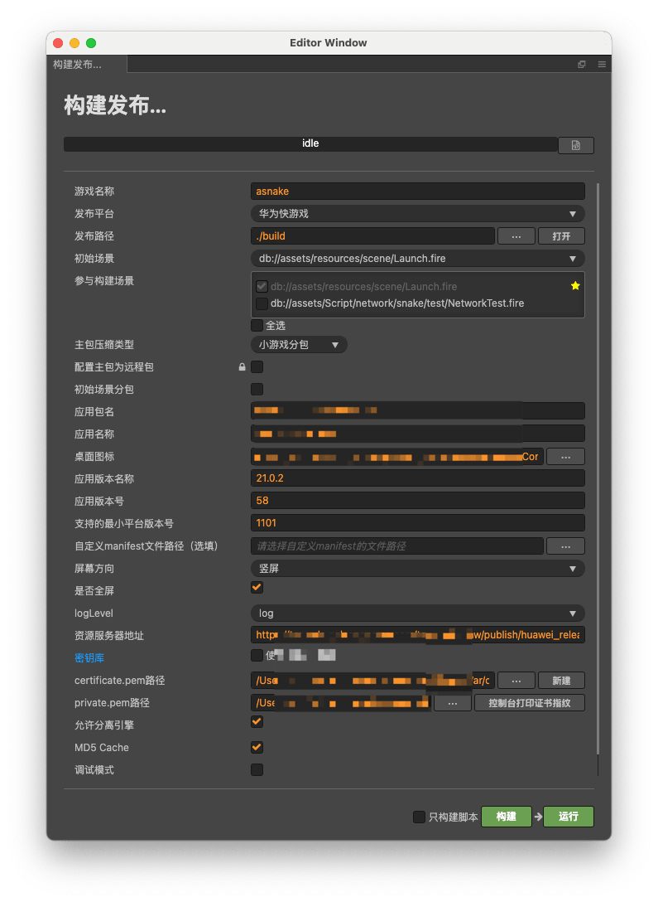
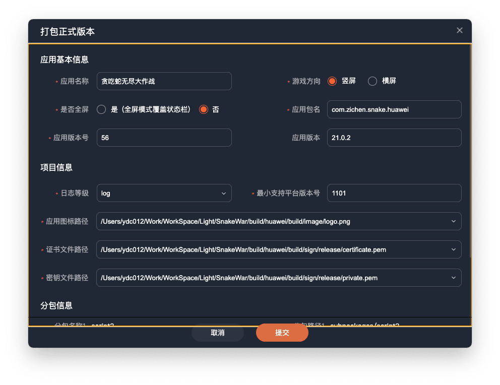
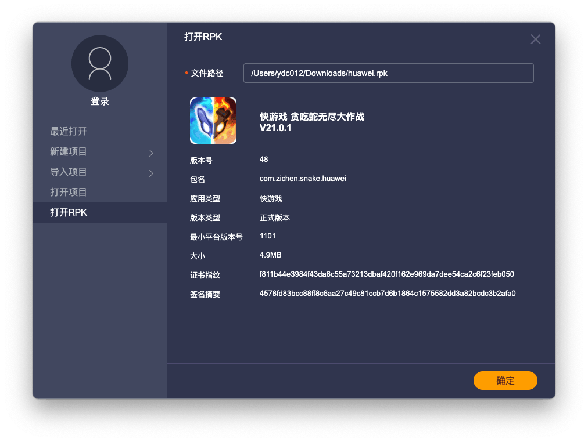
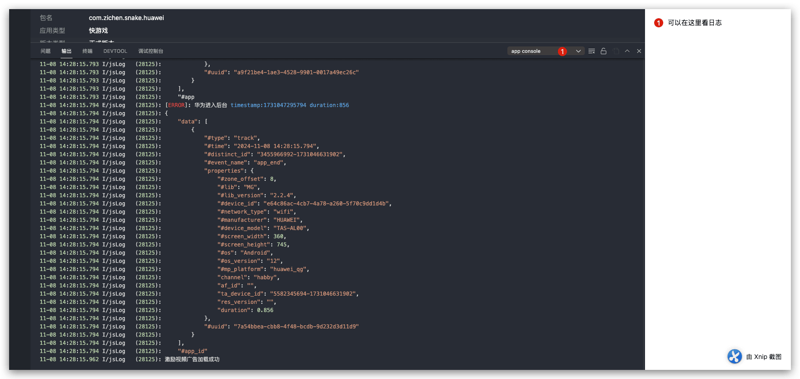

小游戏渠道现在有很多，华为渠道也是其中一个，本来渠道没有什么值得单独讲的，但是最近因为审核问题，导致了一个日志无法查看，于是单独写一篇文章记录一下，便于日后查阅，也给其他的开发者一点启示。
<!--more-->

## 相关资料

#### Cocos Creator构建华为游戏



#### 华为快游戏

相关文档 [Runtime快游戏](https://developer.huawei.com/consumer/cn/doc/quickApp-Guides/quickgame-dev-runtimegame-0000001158950223)

开发工具下载：

- 花瓣轻游快游戏开发者工具 [工具下载](https://developer.huawei.com/consumer/cn/doc/quickApp-Guides/quickgame-tool-download-0000001166035569)
- 华为快应用IDE [工具下载](https://developer.huawei.com/consumer/cn/doc/Tools-Library/quickapp-ide-download-0000001101172926#ZH-CN_TOPIC_0000001101172926__section8185184915)

### 开发介绍

1. 上面我们使用Cocos Creator构建出的华为版本目录如下：

   

2. 使用花瓣打开项目


3. 打正式版本




4. 因为登陆的时候 用户可能是 华为账号未登陆 所以要处理，此时花瓣轻游是无法查看没有登陆的日志，所以要使用APK查看日志，rpk查看日志可以使用 另外一个工具 快应用IDE打开查看
5. 使用快应用查看日志：下载地址




6. 运行查看日志：




### 核心逻辑

下面是登陆的核心逻辑：

```typescript
    private static loginHuaWeiSDK(){
        qg.gameLoginWithReal({
                forceLogin: 1,
                appid: MiniGameManager.instance.HW_APPID,
                success(res) {
                    //华为没有accessToken校验，code写死为100
                    console.log(`华为小游戏授权返回成功： ${JSON.stringify(res)}`);
                   	MySdk.loginCallback && MySdk.loginCallback({code: 100, message: null, data: res}, "");
                    MySdk.loginCallback = null;
                },
                fail(data,code) {
                    console.log(code + "👀" + data);
                    console.log("game login with real fail:" + data + ", code:" + code);
                    //根据状态码处理游戏的逻辑。
                    //状态码为7004或者2012，表示玩家取消登录。
                    //此时，建议返回游戏界面，可以让玩家重新进行登录操作。
                    if(code ==7004||code ==2012){
                        console.log("玩家取消登录，返回游戏界面让玩家重新登录。");
                    }
                    //状态码为7021表示玩家取消实名认证。
                    //在中国大陆的情况下，此时需要禁止玩家进入游戏。
                    if(code ==7021){
                        console.log("玩家已取消身份验证。禁止玩家进入游戏");
                    }
                }
         });
    }

```

注意事项：花瓣轻游开发者工具调试的用户交互界面 和正式版本交互页面不同，开发者工具调试页面多了一个提示的UI。
