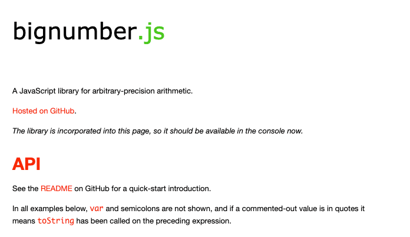
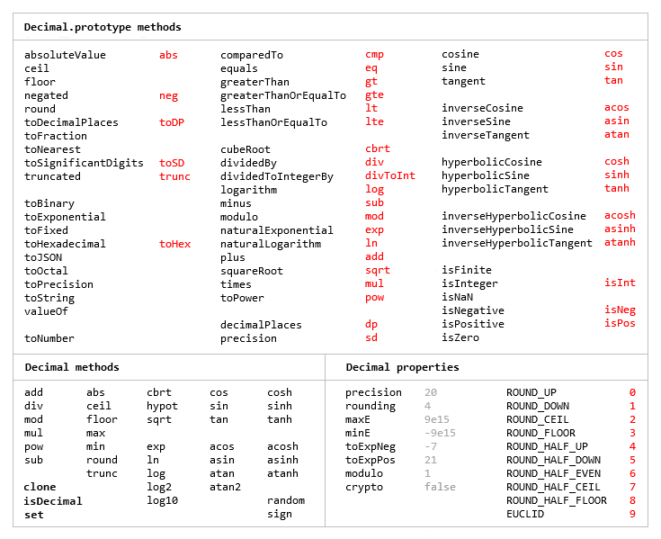

编程开发中有时候用到很大的数字的时候，语言本身的数字上限已经不能支持，此时只能自己构建一些数据结构去保存这些。JavaScript的`Number`类型为[双精度IEEE 754 64位浮点](https://en.wikipedia.org/wiki/Floating-point_arithmetic)类型，一般来讲程序开发，基本的数字类型Number类型是够用的JavaScript 中最大的安全整数 (`2的53次方 - 1`)和JavaScript 中最小的安全整数 (`-(2的53次方 - 1)`)。但是有时候我们处理的业务逻辑出现秒产出和每个级别升级收益指数级增长的时候这个就超出了安全整数范围，此时我们一般借助于第三方类库([bignumber.js](https://mikemcl.github.io/bignumber.js))和[decimal.js](https://github.com/MikeMcl/decimal.js/) 解决问题。
<!--more-->

### 介绍



[bignumber.js](https://mikemcl.github.io/bignumber.js) 一个用于任意精度算术的JavaScript库。官网文档是英文版的，作为一个中文开发者，简单的翻译一下这些方法是必不可少的工作。

### 静态方法

#### clone()

> 生成一个独立的BigNumber构造函数

```javascript
var num = BigNumber.clone()
num(1).div(3).toNumber() //0.3333333333333333
```


#### config()

> 为这个独立的BigNumber构造函数设置参数

包括以下几个参数：

- DECIMAL_PLACES(默认值：20) 用于设置小数位数。在除法、开方、指数计算时会用到。

```javascript
var num = BigNumber.clone()
num.config({DECIMAL_PLACES:4})
num(1).div(3).toNumber() //0.3333，注意跟上面计算结果的区别
```

- ROUNDING_MODE(默认值4) 舍入模式，取值的意义可参照 文档

```javascript
var num = BigNumber.clone()
num(1).div(3).toNumber() //0.3333333333333333
```

```javascript
//取值范围：
    BigNumber.ROUND_UP = 0;         //远离0方向舍入
    BigNumber.ROUND_DOWN = 1;       //向0方向舍入
    BigNumber.ROUND_CEIL = 2;       //向正无限大舍入
    BigNumber.ROUND_FLOOR = 3;      //向负无限大舍入
    BigNumber.ROUND_HALF_UP = 4;    //四舍五入：向最接近的数字方向舍入，如果与两个相邻数字的距离相等，则向上舍入。
    BigNumber.ROUND_HALF_DOWN = 5;  //向最接近的数字方向舍入，如果与两个相邻数字的距离相等，则向下舍入。
    BigNumber.ROUND_HALF_EVEN = 6;  //向最接近数字方向舍入，如果与两个相邻数字的距离相等，则向相邻的偶数舍入
    BigNumber.ROUND_HALF_CEIL = 7;
    BigNumber.ROUND_HALF_FLOOR = 8;
```

- EXPONENTIAL_AT(默认值[-7,20]) 指数计数法

- RANGE(默认值[-1e+9,1e+9])

- CRYPTO(默认值 false) 用于设置BigNumber.random()的随机生成算法。如果无法设置为true，则使用Math.random()生成随机值。

- MODULO_MODE(默认值：ROUND_DOWN) 取模运算的模式

- POW_PRECISION(默认值：0) pow运算结果的精度

- FORMATE(格式化对应的设置)

```javascript
默认值：
BigNumber.config().FORMAT
==============================
{
decimalSeparator: "."
fractionGroupSeparator: " "
fractionGroupSize: 0
groupSeparator: ","
groupSize: 3
secondaryGroupSize: 0
}
```

#### 是否为大数字类型 `isBigNumber`

```javascript
x = 42
y = new BigNumber(x)

BigNumber.isBigNumber(x)             // false
y instanceof BigNumber               // true
BigNumber.isBigNumber(y)             // true

BN = BigNumber.clone();
z = new BN(x)
z instanceof BigNumber               // false
BigNumber.isBigNumber(z)             // true
```


#### maximum([]),minimum([])

> 获取数组中的最大值/最小值


#### random([precision])

> 返回一个伪随机值，参数可以指定小数点位数

#### 求和 .sum(n...) ⇒ BigNumber

```javascript
x = new BigNumber('3257869345.0378653')
BigNumber.sum(4e9, x, '123456789.9')      // '7381326134.9378653'

arr = [2, new BigNumber(14), '15.9999', 12]
BigNumber.sum.apply(null, arr)            // '43.9999'
```

### 实例方法

#### 绝对值`.abs() *⇒ BigNumber*`

返回一个BigNumber，其值是该BigNumber的值的绝对值，即大小。

返回值始终是精确且未取整的。

```
x = new BigNumber(-0.8)
y = x.absoluteValue()           // '0.8'
z = y.abs()                     // '0.8'
```

#### 加法：.plus(n [, base]) ⇒ BigNumber

```javascript
0.1 + 0.2                       // 0.30000000000000004
x = new BigNumber(0.1)
y = x.plus(0.2)                 // '0.3'
BigNumber(0.7).plus(x).plus(y)  // '1'
x.plus('0.1', 8)                // '0.225'
```

#### 减法：.minus(n [, base]) ⇒ BigNumber

```javascript
0.6 * 3                         // 1.7999999999999998
x = new BigNumber(0.6)
y = x.multipliedBy(3)           // '1.8'
BigNumber('7e+500').times(y)    // '1.26e+501'
x.multipliedBy('-a', 16)        // '-6
```

#### 除法

##### 普通除法运算： .div(n [, base]) ⇒ BigNumber； .dividedBy(n [, base]) ⇒ BigNumber

```javascript
x = new BigNumber(355)
y = new BigNumber(113)
x.dividedBy(y)                  // '3.14159292035398230088'
x.div(5)                        // '71'
x.div(47, 16)                   // '5'
复制代码
```

**注意：** 除法计算结果会根据DECIMAL_PLACES和ROUNDING_MODE两个属性设置进行舍入。

##### 除法，返回整数： .idiv(n [, base]) ⇒ BigNumber；.dividedToIntegerByv(n [, base]) ⇒ BigNumber

```javascript
x = new BigNumber(355)
y = new BigNumber(113)
x.dividedBy(y)                  // '3.14159292035398230088'
x.div(5)                        // '71'
x.div(47, 16)                   // '5'
复制代码
```

#### 取模/取余： .mod(n [, base]) ⇒ BigNumber；modulo.(n [, base]) ⇒ BigNumber

```javascript
1 % 0.9                         // 0.09999999999999998
x = new BigNumber(1)
x.modulo(0.9)                   // '0.1'
y = new BigNumber(33)
y.mod('a', 33)                  // '3'
复制代码
```

**注意：** 取模/取余运算受MODULO_MODE设置影响

#### 指数运算： .pow(n [, m]) ⇒ BigNumber;.exponentiatedBy(n [, m]) ⇒ BigNumber

```
Math.pow(0.7, 2)                // 0.48999999999999994
x = new BigNumber(0.7)
x.exponentiatedBy(2)            // '0.49'
BigNumber(3).pow(-2)            // '0.11111111111111111111'
复制代码
```

**注意：** n代表的是指数。如果n<0,计算结果肯定是小数，所以计算结果会受 DECIMAL_PLACES 和 ROUNDING_MODE影响。

#### 开平方：.sqrt() ⇒ BigNumber；.squareRoot.() ⇒ BigNumber

```javascript
x = new BigNumber(16)
x.squareRoot()                  // '4'
y = new BigNumber(3)
y.sqrt()                        // '1.73205080756887729353'
复制代码
```

#### 比较大小： .comparedTo(n [, base]) ⇒ number

比较结果，参考如下表：

```javascript
1	操作数>n
-1	操作数<n
0	操作数==n
null	操作数或者n不是数字
复制代码
```

举例：

```javascript
x = new BigNumber(Infinity)
y = new BigNumber(5)
x.comparedTo(y)                 // 1
x.comparedTo(x.minus(1))        // 0
y.comparedTo(NaN)               // null
y.comparedTo('110', 2)          // -1
复制代码
```

#### 大于 .gt(n [, base]) *⇒ boolean*`

`n`：*number | string | BigNumber*
`base`：*数字*
*有关更多参数详细信息，请参见[BigNumber](https://mikemcl.github.io/bignumber.js/#bignumber)。*

返回`true`如果BigNumber的值比的值 `n`，否则返回`false`。

注意：此方法在[`comparedTo`](https://mikemcl.github.io/bignumber.js/#cmp)内部使用该方法。

#### 大于等于.gte(n [, base]) *⇒ boolean*`

`n`：*number | string | BigNumber*
`base`：*数字*
*有关更多参数详细信息，请参见[BigNumber](https://mikemcl.github.io/bignumber.js/#bignumber)。*

返回`true`如果BigNumber的值大于或等于的值`n`，否则返回`false`。

注意：此方法在[`comparedTo`](https://mikemcl.github.io/bignumber.js/#cmp)内部使用该方法。

#### 小于`.lt(n [, base]) *⇒ boolean*`

`n`：*number | string | BigNumber*
`base`：*数字*
*有关更多参数详细信息，请参见[BigNumber](https://mikemcl.github.io/bignumber.js/#bignumber)。*

返回`true`如果BigNumber的值小于的值 `n`，否则返回`false`。

注意：此方法在[`comparedTo`](https://mikemcl.github.io/bignumber.js/#cmp)内部使用该方法。

#### 小于等于 `.lte(n [, base]) *⇒ boolean*`

`n`：*number | string | BigNumber*
`base`：*数字*
*有关更多参数详细信息，请参见[BigNumber](https://mikemcl.github.io/bignumber.js/#bignumber)。*

返回`true`如果此BigNumber的值小于或等于的值 `n`，否则返回`false`。

注意：此方法在[`comparedTo`](https://mikemcl.github.io/bignumber.js/#cmp)内部使用该方法。

#### 判断是否相等 .eq(n [, base]) *⇒ boolean*`

`n`：*number | string | BigNumber*
`base`：*数字*

#### 精度调整

##### .dp([dp [, rm]]) ⇒ BigNumber|number；decimalPlaces.[dp [, rm]]) ⇒ BigNumber|number 根据dp(decimals places)和rm(round mode)对操作数进行舍入

```javascript
x = new BigNumber(1234.56)
x.decimalPlaces(1)                     // '1234.6'
x.dp()                                 // 2  如果不传dp，则函数返回的是操作数的小数点的位数
x.decimalPlaces(2)                     // '1234.56'
x.dp(10)                               // '1234.56'
x.decimalPlaces(0, 1)                  // '1234'
x.dp(0, 6)                             // '1235'
x.decimalPlaces(1, 1)                  // '1234.5'
x.dp(1, BigNumber.ROUND_HALF_EVEN)     // '1234.6'
x                                      // '1234.56'
复制代码
```

#### 取整：.integerValue([rm]) ⇒ BigNumber

> 根据rm(round mode)返回操作数的整数部分

```javascript
x = new BigNumber(123.456)
x.integerValue()                        // '123'
x.integerValue(BigNumber.ROUND_CEIL)    // '124'
y = new BigNumber(-12.7)
y.integerValue()                        // '-13'
y.integerValue(BigNumber.ROUND_DOWN)    // '-12',向0舍入
复制代码
```

#### 有效数字 .sd([d [, rm]]) ⇒ BigNumber|number；precision.([d [, rm]]) ⇒ BigNumber|number

> 什么是有效数字？--->从该数的第一个非零数字起，直到末尾数字止的数字称为有效数字，如0.618的有效数字有三个，分别是6,1,8。

```javascript
x = new BigNumber(9876.54321)
x.precision(6)                         // '9876.54'
x.sd()                                 // 9 如果省略参数d，则返回有效数字个数
x.precision(6, BigNumber.ROUND_UP)     // '9876.55'
x.sd(2)                                // '9900' //todo
x.precision(2, 1)                      // '9800'    //todo
y = new BigNumber(987000)
y.precision()                          // 3
y.sd(true)                             // 6,如多参数sd为true，则整数部分后边的0也会被认为是有效数字
复制代码
```

#### .toFixed([dp [, rm]]) ⇒ string

> 返回一个字符串，小数位根据dp截取或者填充。
>  **注意：** Unlike Number.prototype.toFixed, which returns exponential notation if a number is greater or equal to 1021, this method will always return normal notation.

##### 跟Number.prototype.toFixed(dp)的异同

1. 如果省略参数dp，BigNumber(1.123).toFixed() 原样返回'1.123';而1.123.toFixed()会去掉所有小数位，只返回整数位'1'
2. 如果操作数大于10^21，BigNumber(10^21).toFixed()会跟普通数字一样返回；10^21.toFixed() 会通过指数形式返回

```javascript
Math.pow(10,20).toFixed()   //"100000000000000000000"
Math.pow(10,21).toFixed()   //"1e+21"

BigNumber(10).pow(20).toFixed() //"100000000000000000000"
BigNumber(10).pow(21).toFixed() //"1000000000000000000000"
复制代码
```

示例：

```javascript
x = 3.456
y = new BigNumber(x)
x.toFixed()                     // '3'
y.toFixed()                     // '3.456'
y.toFixed(0)                    // '3'
x.toFixed(2)                    // '3.46'
y.toFixed(2)                    // '3.46'
y.toFixed(2, 1)                 // '3.45'  (ROUND_DOWN)
x.toFixed(5)                    // '3.45600'
y.toFixed(5)                    // '3.45600'
复制代码
```

**注意：** toFixed()方法与dp()方法的主要区别是，toFixed返回的是字符串，如果小数位不够的话会用0补齐；dp()方法返回的是BigNumber|number，小数位不够的话会忽略

#### 数字格式化 .toFormat([dp [, rm]]) ⇒ string

> 返回字符串，会根据dp和rm进行舍入,并根据FORMAT属性进行格式化。

```javascript
format = {
    decimalSeparator: '.',
    groupSeparator: ',',
    groupSize: 3,
    secondaryGroupSize: 0,
    fractionGroupSeparator: ' ',
    fractionGroupSize: 0
}
BigNumber.config({ FORMAT: format })

x = new BigNumber('123456789.123456789')
x.toFormat()                    // '123,456,789.123456789'
x.toFormat(1)                   // '123,456,789.1'
复制代码
```

#### 转换为js 基础数值类型 .toNumber() ⇒ number

> 效果与使用+运算符一致

```javascript
x = new BigNumber(456.789)
x.toNumber()                    // 456.789
+x                              // 456.789
```

#### 平方根`.sqrt() *⇒ BigNumber*`

```javascript
x = new BigNumber(16)
x.squareRoot()                  // '4'
y = new BigNumber(3)
y.sqrt()                        // '1.73205080756887729353'
```

### 注意事项

1. 如果大数字是很多位，则必须是字符串类型才行：比如

```javascript
30000000000000000000000000000000000000000000013000000000000000000000000000000000000000000000
```

官网解释：字符串* 类型的值的位数没有限制（JavaScript的最大数组大小除外）。请参阅[`RANGE`](https://mikemcl.github.io/bignumber.js/#range)设置BigNumber的最大和最小可能指数值。

### 后续更新：

因为游戏算法里面涉及到了 指数运算 ([bignumber.js](https://mikemcl.github.io/bignumber.js))的指数计算的时候 幂 不能是小数，所以改成了 作者的另外一个大数字的库 [decimal.js](https://github.com/MikeMcl/decimal.js/) 用法基本一样，毕竟是一个作者的作品，如果你用的比较简单 他们还要 轻量版的

[decimal.js-light](https://github.com/MikeMcl/decimal.js-light) （去掉了一些不常用的函数，文件更小）



这样 项目继续用大数字开发了，爽歪歪！！

### 参考

- [bignumber.js使用记录](https://juejin.im/post/5be00d15e51d451bc70bfa26)
- [bignumber.js](https://mikemcl.github.io/bignumber.js/)

