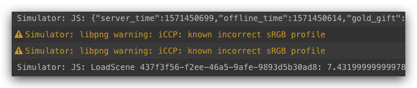
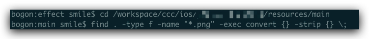

在使用Cocos Creator 开发游戏的时候，项目在模拟器下预览的时候 出现了 ”libpng warning: iCCP: known incorrect sRGB profile“ 这个警告，虽然没有影响运行，但是看起来太烦人了，于是去网上查找了原因和方案，得以解决。
<!--more-->
首先这个虽然不影响运行的警告是什么原因造成的呢，原因：libpng 对[GIMP](https://link.jianshu.com/?t=https://www.baidu.com/s?wd=GIMP&tn=44039180_cpr&fenlei=mv6quAkxTZn0IZRqIHckPjm4nH00T1YLmH-Wmyu9PWbsujuhnhP-0ZwV5Hcvrjm3rH6sPfKWUMw85HfYnjn4nH6sgvPsT6KdThsqpZwYTjCEQLGCpyw9Uz4Bmy-bIi4WUvYETgN-TLwGUv3EnHb3rHDLnjc1PWbknj6srH6vPs)生成的png报错 libpng warning: i: known incorrect sRGB profile 原因是新版的libpng增强了检查，发出警告。此警告可以忽略。



```bash
libpng warning: iCCP: known incorrect sRGB profile
```

虽然可以忽略无视，但是这个看起来太烦人了，于是乎，想看看网上有没有人有上面好的解决方案，一搜索，发现还真有，问题得以顺利解决。

### 步骤

#### 安装 libpng

ImageMagick 所依赖的库，因为我们的工程中仅仅用到了PNG的图，所以此处就以PNG库为例，其他类似。可以去官网下载。[点击进入](http://www.imagemagick.org/download/delegates/) 通过命令安装。也可以用 homebrew 安装。

```bash
brew install libpng
```

#### 安装ImageMagick

同样使用 homebrew

```bash
brew install ImageMagick
```

#### 处理素材目录

安装好ImageMagick，convert函数便可以用了，在命令行 cd 到自己的工程资源目录，运行下面的 命令来解决上面提到的问题

```bash
find . -type f -name "*.png" -exec convert {} -strip {} \;
```

比如我的 目录



运行后，报警错误消除，因为这个是处理文件目录下面所有的 png 格式，有些正确的也被改变了，我就一个个还原，直到找到报错的几个图片，剩下的 都重置回去了，当然了，ImageMagick 的功能远远不至于此，还有很多强大的功能。

### 参考地址 

- [cocos2d-x 3.0 and libpng](http://discuss.cocos2d-x.org/t/cocos2d-x-3-0-and-libpng/12451)
- [Permission denied的解决办法](https://www.cnblogs.com/ggband/p/10665312.html)
- [Mac软件包管理神器Homebrew](https://www.jianshu.com/p/3016f1897e31)
- [ImageMagick 中文站](http://www.imagemagick.com.cn/)

最后附加一些 homebrew 常用的操作

> 安装软件
>
> `brew install 软件名`，如`brew install git`。
>
> 卸载软件
>
> `brew uninstall 软件名`，如`brew uninstall git`。
>
> 查找软件
>
> ```
> brew search 查询内容
> ```
>
> 1. 普通查询，`brew search git`
> 2. 正则查询，`brew search /gi*/`
>
> 升级软件
>
> - `brew upgrade 软件名`：更新指定软件，如`brew update git`。
> - `brew upgrade`：更新所有软件。
>
> 清理软件
>
> - `brew cleanup -n`：查看哪些软件包要被清除。
> - `brew cleanup 软件名`：清除指定软件包的所有老版本。
> - `brew cleanup`：清除所有软件包的所有老版本。
>
> 关联软件
>
> - `brew prune`：清理无用的symlink，且清理与之相关的位于`/Applications`和`~/Applications`中的无用App链接。
> - `brew link 软件名`：将指定软件的安装文件symlink到Homebrew上。
>
> > `brew install`安装的软件会自动执行link操作；
> > DIY安装的需要手动执行link操作；
> > 加上`--overwrite`选项，会先删除旧的symlink，再进行新的link操作。
>
> 信息查询
>
> - `brew -v`：查看Homebrew版本号。
> - `brew list`：列出已安装的软件。
> - `brew home`：用浏览器打开homebrew官网。
> - `brew info`：显示软件信息。
>
> 其他操作
>
> - `brew update`：升级Homebrew自身。
> - `brew doctor`：检测系统中与Homebrew有关的潜在问题。

**注意：如果遇到文件权限问题** （Permission denied）

解决的办法：

```bash
$ sudo chmod -R 777 某一目录
```