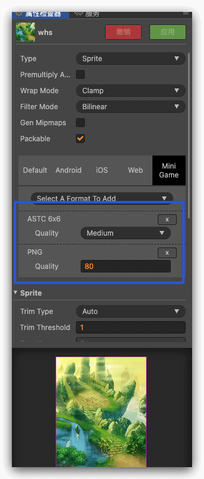
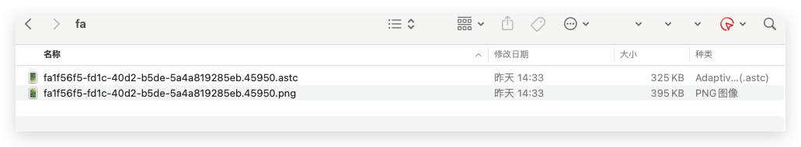
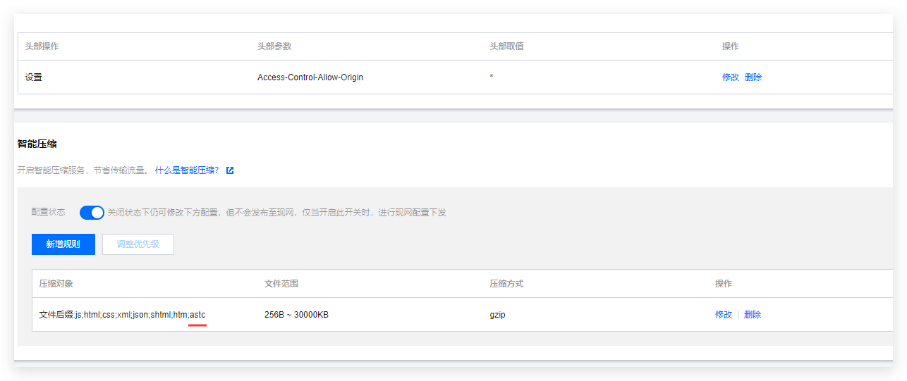
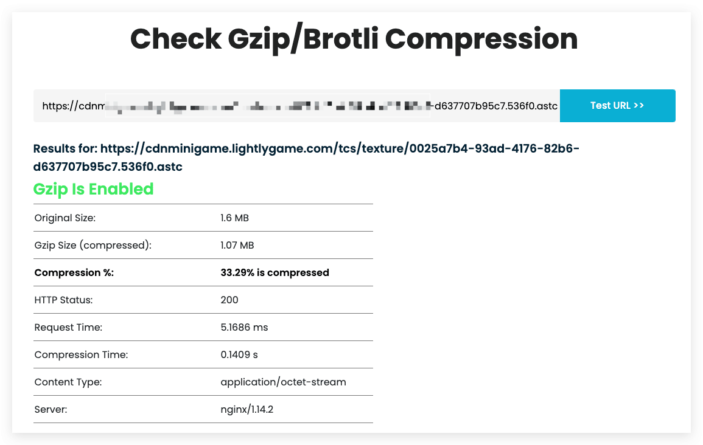
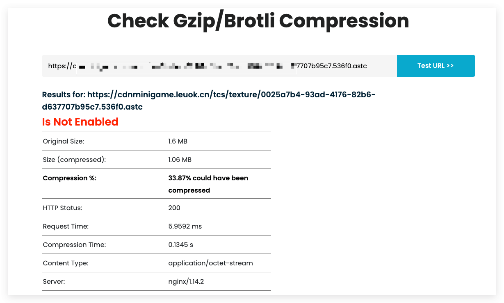
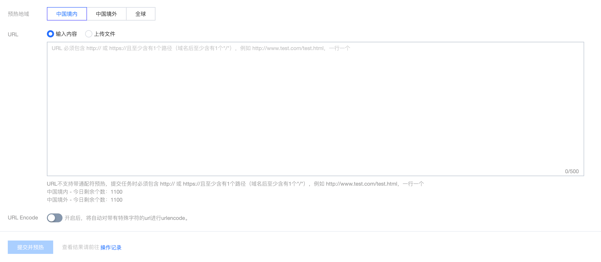
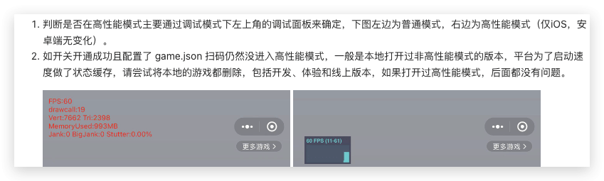

随着小游戏体量增加后，需要进一步对游戏内存优化，一般来说，如果小游戏的设计初期考虑了小游戏平台，一般来说内存都可以接受，但实际的开发工作中，很多游戏是先上线了原生平台，发现游戏数据不错，想继续在小游戏平台分一杯羹。于是就把游戏移植到了小游戏平台。这样的游戏一般存在加载问题，性能渲染问题，内存优化问题，导致手机发热，启动慢，游戏卡等现象，下面说一下如何使用纹理格式。
<!--more-->
目前来说，小游戏纹理很成熟了，截止目前，微信、抖音、QQ 都支持ASTC纹理格式，虽然说，小游戏使用纹理整体来说不算麻烦，但是牵扯到好几个细节操作，还是记录一下，便于后面查阅。

## 文章内环境

- Cocos Creator 2.4.11
- Mac电脑
- CDN
- 微信/抖音/QQ 小游戏平台

## 具体步骤

1. 新建一个Cocos Creator项目，然后随便找几张图片 这里测试使用Png格式

   

2. 如上图所示 添加两个选择 分别为 ASTC 6X6 和 PNG格式

3. 重新构建游戏，就可以看到我们构建的文件里素材存在两个后缀格式

   

4. 此时，我们就可以通过预览游戏看到游戏正常使用纹理（上面的设置为 优先使用ASTC）

## 优化构建步骤

由于我们项目没有使用 纹理格式，牵扯到小游戏和原生分支合并到问题，于是，便考虑到，能否在构建前 改变png 到 meta 文件信息，构建结束后，再重置回去。于是便使用脚本实现。

下面说一个简单的脚本：

```python
#!/usr/bin/env python3
# -*- coding: utf-8 -*-

import os
import json
import subprocess
import time
import sys

def update_meta_file(file_path):
    try:
        print(f"Processing file: {file_path}")
        with open(file_path, "r") as file:
            data = json.load(file)
            data["platformSettings"] = {
                "minigame": {
                    "formats": [
                        {"name": "astc_6x6", "quality": "medium"},
                        {"name": "png", "quality": 80},
                    ]
                },
                "default": {"formats": [{"name": "png", "quality": 80}]},
            }

        with open(file_path, "w") as file:
            json.dump(data, file, indent=2)
            # print(f"Updated file: {file_path}")
    except json.JSONDecodeError as e:
        print(f"Error parsing JSON in file {file_path}: {e}")
    except Exception as e:
        print(f"Error updating file {file_path}: {e}")


def update_meta_file_2(file_path):
    try:
        print(f"Processing file: {file_path}")
        with open(file_path, "r") as file:
            data = json.load(file)
            data["platformSettings"] = {}

        with open(file_path, "w") as file:
            json.dump(data, file, indent=2)
            # print(f"Updated file: {file_path}")
    except json.JSONDecodeError as e:
        print(f"Error parsing JSON in file {file_path}: {e}")
    except Exception as e:
        print(f"Error updating file {file_path}: {e}")


def recursive_update(directory):
    for root, _, files in os.walk(directory):
        for file in files:
            if file.endswith(".png.meta") or file.endswith(".jpg.meta"):
                file_path = os.path.join(root, file)
                update_meta_file(file_path)


def recursive_update_2(directory):
    for root, _, files in os.walk(directory):
        for file in files:
            if file.endswith(".png.meta") or file.endswith(".jpg.meta"):
                file_path = os.path.join(root, file)
                update_meta_file_2(file_path)


if __name__ == "__main__":
    target_directory = "../assets/"  # 使用相对路径，表示当前目录下的assets目录
    # 改meta
    print(f"开始——————————————————————————————批量修改meta文件!!!")
    recursive_update(target_directory)
    time.sleep(1)  # 休眠1秒

    # 执行构建
    print(f"结束——————————————————————————————执行构建脚本")

    build_args = list(sys.argv.copy())
    isBackMeta = False
    if "--publish" in build_args:
        print("发布版本")
        build_args.append("--gitcheck")
        build_args.append("false")
        isBackMeta = True
    else:
        print("开发版本")
    print("build_args", build_args)
    #command = "./build.py --env 2 --server 18 --release"
    build_args = " ".join(build_args[1:])
    command = f"./build.py {build_args}"
    subprocess.run(command, shell=True)

    time.sleep(1)  # 休眠1秒
    if isBackMeta:
        # 还原
        print(f"——————————————————————————————批量还原meta文件")
        recursive_update_2(target_directory)
        print(f"——————————————————————————————结束")

```

注意 上面脚本内 的 build.py 其实内容就是 构建游戏的具体命令 这里考虑到篇幅，不再展示

## CDN自动解压

### 如何设置智能压缩配置

看到上面图片，我们发现，ASTC的体积和没有压缩的png 图片大小几乎相当，但是PNG 格式说可以压缩的，如果使用了ASTC 格式那么将带来一个问题，就是传输下载时间变长。于是便有了这个CDN自动解压。

我们这里使用的是腾讯云服务。[智能压缩配置](https://cloud.tencent.com/document/product/228/41736)



### 如何检查智能压缩配置生效

这里给出 几个个网站 都可以在线验证 如果失效了 搜索  gzip test tool

- https://www.giftofspeed.com/gzip-test/
- https://www.gidnetwork.com/tools/gzip-test.php
- https://www.websiteplanet.com/webtools/gzip-compression/
- https://base64.guru/tools/gzip-test

下面给出 可以成功支持 和 不支持的 结果





## CDN预热

如果项目传到CDN的资源服务器后，如果最开始下载的人，会因为CDN节点没有预热，资源下载节点少，而引发用户下载时长比较长，需要我们对资源进行预热。

[缓存预热](https://cloud.tencent.com/document/product/228/40273)

> ## 功能介绍
>
> 腾讯云 CDN 提供资源预热功能，可将指定资源主动从源站加载至 CDN 加速节点并缓存。当用户首次请求资源时，可直接从 CDN 加速节点获取缓存的资源，无需再次回源。
>
> ## 操作指南
>
> 登录 [CDN 控制台](https://console.cloud.tencent.com/cdn)，单击左侧目录的**刷新预热**，进入后可按需提交 **URL 预热**任务：
>
> - 内容分发网络 CDN 与 全站加速 ECDN 域名的 URL支持混合填写提交。
> - 支持输入内容和上传 txt 文件两种提交方式。
> - 支持指定预热区域：预热地域对应域名的加速区域，请按需选择。
>
> 

## 微信小游戏高性能模式

微信小游戏平台推出了高性能模式。高性能模式下，安卓端拥有更好的渲染性能和表现，无需特殊适配，iOS 端需要进行一定的适配以保证两种模式兼容。

#### 开通高性能模式开关

开通高性能模式的方式为：登录微信公众平台 -> 首页能力地图模块 -> 点击进入"生产提效包" -> 点击开通高性能模式。 开通成功后，过配置 game.json 的 iOSHighPerformance 为 true 则可进入高性能模式，通过去掉此开关可以正常回退到普通模式，以便两种模式对比

```json
{
    "deviceOrientation": "portrait",
    "networkTimeout": {
        "request": 15000,
        "connectSocket": 15000,Cocos 微信小游戏内存与性能优化指南（iOS端）
        "uploadFile": 15000,
        "downloadFile": 25000
    },
    "iOSHighPerformance": true
}
```



注意，使用这个功能 需要Cocos Creator版本 大于 2.4.9

## 总结

astc 纹理对下降内存和提高加载速度是有效的，但是手机具体是否支持 astc 比较复杂，和手机 的 soc(cpu、gpu)，安卓系统版本等等相关。 最好导出多种格式的图比如 png 和 astc 等，让 引擎自动判断使用的图片格式。构建后 发现 astc 和 png 数量对不上，其实是引擎内置的png 图片导致的，故而可以忽略。

## 拓展知识

- [普通小游戏接入指南-性能优化](https://developer.open-douyin.com/docs/resource/zh-CN/mini-game/guide/minigame/optimization)
- [Cocos 微信小游戏内存与性能优化指南（iOS端）](https://mp.weixin.qq.com/s/u9MWq0d-bZukwwFjlf2_-w)