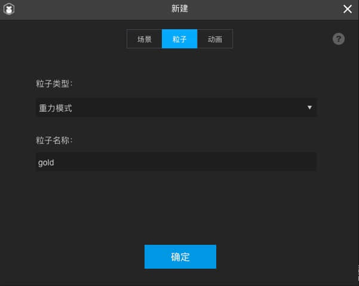
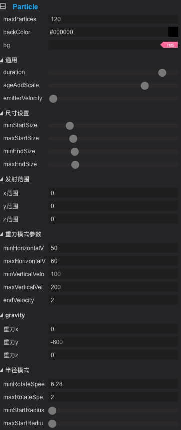

游戏要想有好的展现，除了美术UI展现和程序逻辑实现之外，音效和动画特效也是优秀游戏必不可少的部分，之前做动画的时候，基本都是使用Spine动画代替，要么是徒手写代码实现一些简陋的动画效果，以前看过官方的demo 知道粒子可以做出很绚丽和随机的动画，这次恰好有机会得以尝试。

<!--more-->

### 操作步骤

1. 其实在Layabox里面做粒子特效也非常简单，主要就是新建一个粒子文件，选择类型，然后调节参数，做出自己想要的效果，然后导出配置文件。
2. 程序里面加载配置文件，初始化粒子特效器，播放即可

#### 细节操作：

1. 新建粒子文件



2. 修改部分参数



3. 最终效果如下


4. 最后在代码里面加载并播放

```typescript
import {IPoint} from "../../common/core/IPoint";
import Particle2D = Laya.Particle2D;
import ParticleSetting = Laya.ParticleSetting;

export default class GoldParticle {
    private animation: Particle2D;
    private callback: Function;

    private static _ins: GoldParticle;

    static get ins(): GoldParticle {
        if (!this._ins) this._ins = new GoldParticle();
        return this._ins;
    }

    public showAnimation(point: IPoint, callback) {
        this.callback = callback;
        if (!this.animation) {
            let settings: ParticleSetting = Laya.loader.getRes("res/particles/test.part");
            this.animation = new Particle2D(settings);
            this.animation.autoPlay = false;
            this.animation.emitter.start();
            Laya.stage.addChild(this.animation);
        }
        this.animation.zOrder = 3000;
        this.animation.x = point.x;
        this.animation.y = point.y;
        this.animation.play();
      // 我设置的粒子播放时长是 3500 毫秒
        this.animation.timerOnce(3500, this, this.completeParticle2D)
    }

    private completeParticle2D() {
        this.animation.stop();
        if (this.callback) this.callback();
    }
}
```

以上就是对粒子效果的简单应用。