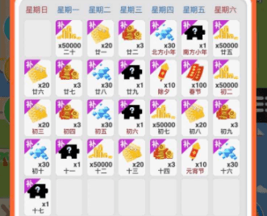

Javascript官方提供了一个关于时间日期处理的工具类Date，但在有时候做功能的时候，我们需要更具体的定制功能，比如倒计时，活动日期范围，日期转换和比较大小等，这些数据经常需要策划去配置，然后程序通过读取配置文件通常是json 或者xml 格式，策划或者运营一般喜欢比较直观的时间，比如 2021-01-01 00:00:01 此时在有些环境下就会出现一些意想不到的问题。
<!--more-->
接下来就说说这个问题如何产生和如何避免

## 问题产生

### 环境

- iOS端&&小游戏（微信小游戏和头条小游戏）

**复现概率**

- 必现

**复现方式**

```javascript
let date = new Data("2021-01-01 00:00:01");
```

**复现现象**



**正常显示**


## 问题原因

> `Date()`构造函数有四种基本形式
>
> #### 没有参数
>
> 如果没有提供参数，那么新创建的Date对象表示实例化时刻的日期和时间。
>
> #### Unix时间戳
>
> - `value`
>
>   一个 Unix 时间戳（[Unix Time Stamp](http://pubs.opengroup.org/onlinepubs/9699919799/basedefs/V1_chap04.html#tag_04_16)），它是一个整数值，表示自1970年1月1日00:00:00 UTC（the Unix epoch）以来的毫秒数，忽略了闰秒。请注意大多数 Unix 时间戳功能仅精确到最接近的秒。
>
> - 时间戳字符串
>
> - `dateString`
>
>   表示日期的字符串值。该字符串应该能被 [`Date.parse()`](https://developer.mozilla.org/zh-CN/docs/Web/JavaScript/Reference/Global_Objects/Date/parse) 正确方法识别（即符合 [IETF-compliant RFC 2822 timestamps](http://tools.ietf.org/html/rfc2822#page-14) 或 [version of ISO8601](http://www.ecma-international.org/ecma-262/5.1/#sec-15.9.1.15)）。**注意:** 由于浏览器之间的差异与不一致性，强烈不推荐使用`Date`构造函数来解析日期字符串 (或使用与其等价的`Date.parse`)。对 RFC 2822 格式的日期仅有约定俗称的支持。 对 ISO 8601 格式的支持中，仅有日期的串 (例如 "1970-01-01") 会被处理为 UTC 而不是本地时间，与其他格式的串的处理不同。
>
> 
>
> `**Date.parse()**` 方法解析一个表示某个日期的字符串，并返回从1970-1-1 00:00:00 UTC 到该日期对象（该日期对象的UTC时间）的毫秒数，如果该字符串无法识别，或者一些情况下，包含了不合法的日期数值（如：2015-02-31），则返回值为NaN。
>
> 不推荐在ES5之前使用Date.parse方法，因为字符串的解析完全取决于实现。直到至今，不同宿主在如何解析日期字符串上仍存在许多差异，因此最好还是手动解析日期字符串（在需要适应不同格式时库能起到很大帮助）。   

上面的意思就是说，如果我初始化日期函数的时候，如果用  "2021-01-01 00:00:01" 这样的日期格式，输入不合法的歌手，返回NaN这个就导致上面的UI出现问题。

### 解决办法

避免用这种错误参数输入的方式输入 "2021-01-01 00:00:01" 这样的 “-”连接的日期格式

兼容方法：

```javascript
/**
 * 格式化日期
 * @param dateStr {String}
 * @returns {Date}
 */
transformDate(dateStr) {
    if (dateStr.indexOf("-") > -1) {
        return new Date(dateStr.replace(/\-/g, "\/"))
    }
    if (dateStr.indexOf("/") > -1) {
        return new Date(dateStr.replace(/\//g, "\/"))
    }
    if (dateStr.indexOf(".") > -1) {
        return new Date(dateStr.replace(/\./g, "\/"))
    }
}
```

## 总结

这个 bug 很隐蔽只有 ios 端小游戏才能复现，原生环境下（ios的ipa和安卓apk）也是正常的。当然，如果初始化日期的参数是啥标准格式肯定是没问题的，这个是自己没有仔细阅读AP I造成的，在测试的时候没有用iOS的设备测试微信小游戏，故而测试阶段遗漏掉了这个问题。通过用户反馈才看到的。