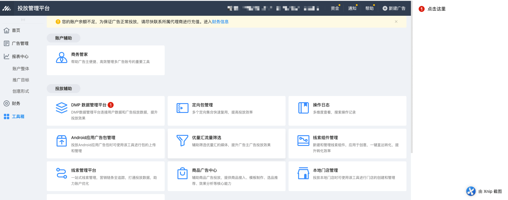
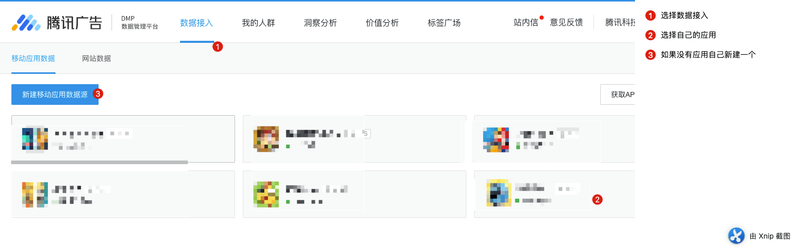
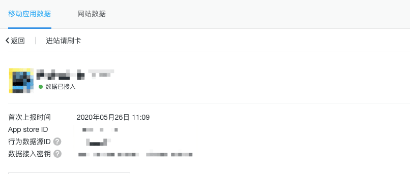
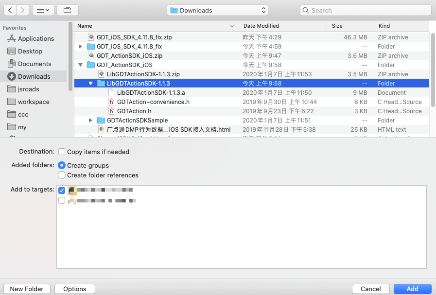
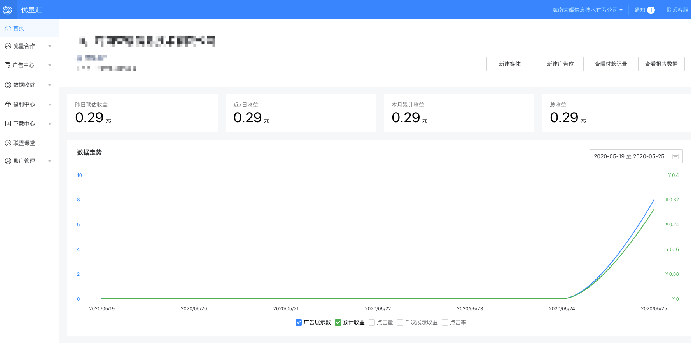
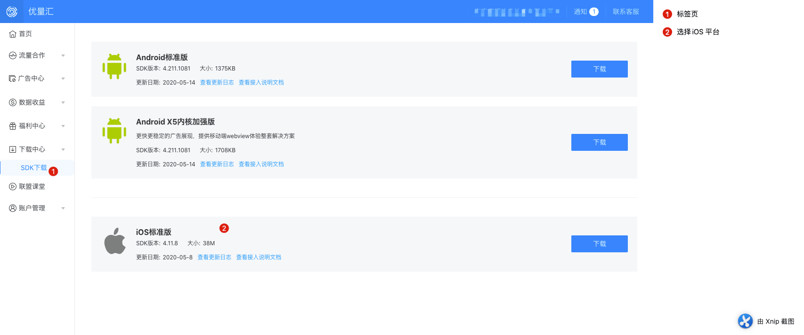
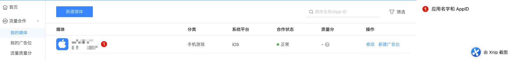
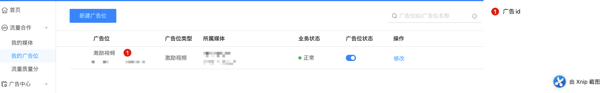
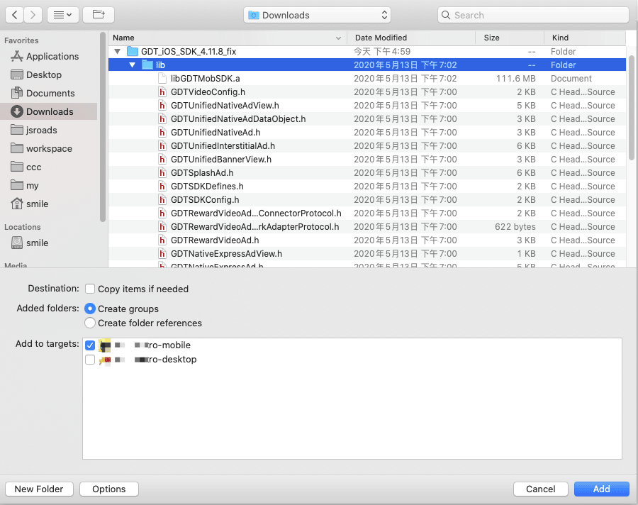

本篇文章简单的说一下，如何使用Cocos Creator项目导出iOS 项目后 接入腾讯的优量汇和DMP系统。话不多说，下面看具体操作。

<!--more-->概述

### DMP 数据上报 

地址：https://developers.e.qq.com/docs/user_actions/app

### 优量汇 banner广告 /激励视频 流量变现的SDK

地址： https://developers.adnet.qq.com/doc/ios/guide

## DMP 信息汇总







找到应用的 信息

- App store ID xxxxx
- 行为数据源ID xxxxx
- 数据接入密钥 xxxxxxxxxxxx

### 步骤

#### SDK添加依赖



### SDK 初始化 

文档地址：https://www.eyrefree.org/GDTActionSDK/

#### 必须接入事件 初始化和启动 AppController.mm 文件

```objective-c
- (BOOL)application:(UIApplication *)application didFinishLaunchingWithOptions:(NSDictionary *)launchOptions {
    /*
     * 在接入广点通行为数据SDK时，请在App启动的时候调用初始化方法
     * 初始化方法调用时请传入数据源UserActionSetId和在后台看到的secretKey密钥串
     */
    [GDTAction init:@"yourActionSetId" secretKey:@"yourSecretKey"];

    return YES;
}

- (void)applicationDidBecomeActive:(UIApplication *)application {

    /*
     * 在应用启动的时候请上报GDTSDKActionNameStartApp行为
     * SDK内部会判断此次启动行为是否为激活行为并上报，开发者无需另外作判断逻辑
     */
    [GDTAction logAction:GDTSDKActionNameStartApp actionParam:@{@"value":@(123)}];
}

```

#### 接入自定义的事件：

```objective-c
/**
    自定义打点参数为 NSString 事件
*/
+(NSString *)setGameEventWithParam:(NSString*)actionName withContent:(NSString*)actionParamStr{
    NSLog(@"OC收到：setGameEventWithParam 有参数 %@：",actionParamStr);
      NSData *data = [actionParamStr dataUsingEncoding:NSUTF8StringEncoding];
      id json = [NSJSONSerialization JSONObjectWithData:data options:0 error:nil];
    NSLog(@"%@",[json objectForKey:@"id"]);
    NSLog(@"转换后：setGameEventWithParam %@：",json);
    [GDTAction logAction:actionName actionParam:json];
    return @"setGameEventWithParam OK";
}
```


## 优量汇信息汇总

官网地址：https://adnet.qq.com/

首页界面：



sdk 接入界面：https://adnet.qq.com/resource/sdk



sdk 接入文档引导：https://developers.adnet.qq.com/doc/ios/guide

#### 新建媒体



#### 新建广告位



### 步骤

#### 构建ios 项目


#### 添加依赖文件



1. | **需要引入的依赖库**           |
   | ------------------------------ |
   | libGDTMobSDK.a                 |
   | GDTMobBannerView.h             |
   | GDTNativeExpressAd.h           |
   | GDTNativeExpressAdView.h       |
   | GDTMobInterstitial.h           |
   | GDTNativeAd.h                  |
   | GDTSplashAd.h                  |
   | GDTRewardVideoAd.h             |
   | GDTUnifiedNativeAd.h           |
   | GDTUnifiedNativeAdView.h       |
   | GDTUnifiedNativeAdDataObject.h |
   | GDTLogoView.h                  |
   | GDTMediaView.h                 |
   | GDTSDKDefines.h                |

   ##### 需要引入的系统库

   | 库名称                        | SDK             | 备注             |
   | ----------------------------- | --------------- | ---------------- |
   | AdSupport.framework           | 4.7.2及以后版本 |                  |
   | CoreLocation.framework        | 同上            |                  |
   | QuartzCore.framework          | 同上            |                  |
   | SystemConfiguration.framework | 同上            |                  |
   | CoreTelephony.framework       | 同上            |                  |
   | libz.tbd                      | 同上            | 或者是libz.dylib |
   | Security.framework            | 同上            |                  |
   | StoreKit.framework            | 同上            |                  |
   | libxml2.tbd                   | 同上            |                  |
   | AVFoundation.framework        | 同上            |                  |
   | WebKit.framework              | 同上            | 可选             |

**说明：**

1. SystemConfiguration.framework、CoreTelephony.framework、Security.framework是为了统计app信息使用
2. iOS9以后的版本，需要把libz.dylib替换成libz.tbd
3. 引入系统库的操作过程如下：
   在Xcode中选中工程名，在Target->Build Phases->Link Binary With Libraries中点击“+”,在弹出窗口输入库名称，出现后点击“Add”则将库引入到系统中。

#### 接入原生代码

AppDelegate.cpp 文件的 applicationDidFinishLaunching 方法添加 内容

```c++
    //优量汇 ----开始
    AdNetSDKHelper *sdk = AdNetSDKHelper::Singleton();
    sdk->Init();
    //优量汇 ----结束
```

改后大概这样

```c++
#include "AppDelegate.h"
#include "AdNetSDKHelper.h"
#include "cocos2d.h"
#include "cocos/scripting/js-bindings/manual/jsb_module_register.hpp"
#include "cocos/scripting/js-bindings/manual/jsb_global.h"
#include "cocos/scripting/js-bindings/jswrapper/SeApi.h"
#include "cocos/scripting/js-bindings/event/EventDispatcher.h"
#include "cocos/scripting/js-bindings/manual/jsb_classtype.hpp"
```

```c++
bool AppDelegate::applicationDidFinishLaunching()
{
    se::ScriptEngine* se = se::ScriptEngine::getInstance();

    jsb_set_xxtea_key("d9e4fffe-7009-45");
    jsb_init_file_operation_delegate();

#if defined(COCOS2D_DEBUG) && (COCOS2D_DEBUG > 0)
    // Enable debugger here
    jsb_enable_debugger("0.0.0.0", 6086, false);
#endif

    se->setExceptionCallback([](const char* location, const char* message, const char* stack){
        // Send exception information to server like Tencent Bugly.

    });

    jsb_register_all_modules();

    se->start();

    se::AutoHandleScope hs;
    jsb_run_script("jsb-adapter/jsb-builtin.js");
    jsb_run_script("main.js");

    se->addAfterCleanupHook([](){
        JSBClassType::destroy();
    });
    //优量汇 ----开始
    AdNetSDKHelper *sdk = AdNetSDKHelper::Singleton();
    sdk->Init();
    //优量汇 ----结束
    return true;
}
```

AdNetSDKHelper.h

```objective-c
//
//  ChannelSDK.h
//  myysx-mobile
//
//  Created by smile on 2019/11/12.
//
#ifndef SanGuo_xy_ChannelSDK_h
#define SanGuo_xy_ChannelSDK_h
#include "cocos2d.h"

USING_NS_CC;
#include <string>

class AdNetSDKHelper
{
public:
    
    
    static AdNetSDKHelper* Singleton();
    virtual void Init();
    virtual void Login();
    virtual void initRewardVideo(std::string name);
    virtual void playRewardVideo(std::string name);
    std::string channelName;
    bool        ok;
    bool        needLogin;
    bool        isLogin;
    int         user_id;
private:
    static AdNetSDKHelper* __instance__;
};
#endif

```

AdNetSDKHelper.mm

```objective-c
//
//  AdNetSDKHelper.mm
//  myysx-mobile
//
//  Created by smile on 2019/11/12.
//

#include "AdNetSDKHelper.h"
#include "cocos2d.h"
#include "AdSdkConnector.h"
#import "GDTSDKConfig.h"
#ifdef  CHANNEL_MUYOUZYJ
@interface AdNetSDKHelperCallbackHandler:UIViewController
#else
@interface AdNetSDKHelperCallbackHandler:UIViewController
#endif
+ (AdNetSDKHelperCallbackHandler*)sharedHandler;
@end
static NSString *kGDTMobSDKAppId = @"123456789";//应用 iOS id
static NSString *kGDTMobSDKVideoId = @"1223345666666";// 激励视频 id
AdNetSDKHelper* AdNetSDKHelper::__instance__ = NULL;
AdNetSDKHelper* AdNetSDKHelper::Singleton(){
     if(AdNetSDKHelper::__instance__ == NULL)
     {
         AdNetSDKHelper::__instance__ = new AdNetSDKHelper();
     }
     return AdNetSDKHelper::__instance__;
};
 void AdNetSDKHelper::Init(){
     CCLOG("AdNetSDKHelper::Init");
//     this->needLogin = false;
//     this->ok = false;
//     this->isLogin = false;
//     this->user_id = 0;
     BOOL result = [GDTSDKConfig registerAppId:kGDTMobSDKAppId];
     if (result) {
         NSLog(@"注册成功");
     }
    AdSdkConnector *adsdk = [AdSdkConnector getInstance];
    [adsdk initBuAdSdkWarpper:kGDTMobSDKVideoId];

 };

void AdNetSDKHelper::Login(){
    printf("登录成功\n");

//    [[AdSdkConnector getInstance] initBuAdSdkWarpper];
 
};


void AdNetSDKHelper::initRewardVideo(std::string name){
    AdSdkConnector *adsdk = [AdSdkConnector getInstance];
    [adsdk loadVideo:kGDTMobSDKVideoId autoPlay:@"not play"];
}

void AdNetSDKHelper::playRewardVideo(std::string name){
    AdSdkConnector *adsdk = [AdSdkConnector getInstance];
    [adsdk playVideo:kGDTMobSDKVideoId];
}
```

AdSdkConnector.h

```objective-c
//
//  AdSdkConnector.h
//  subway-mobile
//
//  Created by smile on 2020/05/25.
//
//
#include <string>
#import "GDTRewardVideoAd.h"
#import "RootViewController.h"
@interface AdSdkConnector  : RootViewController<GDTRewardedVideoAdDelegate>{
        bool isRewardedVideoPlayFinish;
        bool isRewardedVideoAutoPlay;
        NSString* rewardPlacementId;
}
@property (nonatomic, strong) GDTRewardVideoAd *rewardVideoAd;
+ (AdSdkConnector *) getInstance;            //用来获取实例的方法
- (void) loadVideo: (NSString *)placementId autoPlay: (NSString *)autoPlayFlag;
- (void) initBuAdSdkWarpper: (NSString *)placementId;
- (void) playVideo: (NSString *)placementId;
@end
//
//#if defined(__cplusplus)
//extern "C" {
//#endif
//
////    virtual (void)initBuAdSdkWarpper();
////    virtual void initBuAdSdkWarpper();
//    void initAndCacheFullscreenVideo();
//
//    bool hasCachedFullscreenVideo();
//    void showFullscreenVideo();
//    void initAndCacheRewardVideosWithDeviceId();
//    void initAndCacheInterVideosWithDeviceId();
//    void initAndCacheRewardVideoWithName(const char* name);
//    void initAndCacheInterVideoWithName(const char* name);
//    bool hasCachedRewardVideoWithName(const char* name);
//    bool hasCachedInterVideoWithName(const char* name);
//    void showRewardVideoWithName(const char* name, const char* orderId);
//    void showInterVideoWithName(const char* name, const char* orderId);
//
////    void showRewardVideoWithName(NSString* name, NSString* orderId);
//    void showBanner();
//    void hideBanner();
//    void checkState();
//#if defined(__cplusplus)
//}
//#endif

```

AdSdkConnector.mm

```objective-c
//
//  AdSdkConnector.mm
//  subway-mobile
//
//  Created by smile on 2020/05/25.
//

#import "AdSdkConnector.h"
#import "AppController.h"
#import "RootViewController.h"
#import "AppController.h"
#import "GDTRewardVideoAd.h"
#import "GDTSDKConfig.h"
#include "cocos/scripting/js-bindings/jswrapper/SeApi.h"
#import "cocos2d.h"
#import "GDTAction.h"
static AdSdkConnector *instance;    //这里声明一下静态实例，方便javascript层调用
@implementation AdSdkConnector


//获取实例的方法，方便javascript层调用
+(AdSdkConnector *) getInstance{
    if (!instance) {
           instance = [[AdSdkConnector alloc] init];
       }
       return instance;
}

- (id)init{
    return self;
}


////初始化，根着SDK文档照做就好了
//- (void) viewDidLoad {
//    NSLog(@"viewDidLoad");
//    instance=self;
//}

//
//打开激励视频的方法
-(void) initBuAdSdkWarpper: (NSString *)placementId{
// NSString* appidString = [[NSString alloc] initWithUTF8String: name];
// NSLog(@"initBuAdSdkWarppers %@",appidString);
    NSLog(@"initBuAdSdkWarppers");
    rewardPlacementId = placementId;
    self.rewardVideoAd.delegate = self;
}


//
//打开激励视频的方法
-(void) loadVideo: (NSString *)placementId autoPlay: (NSString *)autoPlayFlag{
// NSString* appidString = [[NSString alloc] initWithUTF8String: name];
// NSLog(@"initBuAdSdkWarppers %@",appidString);
    NSLog(@"loadVideo %@",placementId);
    [super viewDidLoad];
    self.rewardVideoAd = [[GDTRewardVideoAd alloc] initWithPlacementId:placementId];
    self.rewardVideoAd.delegate = self;
    self.rewardVideoAd.videoMuted = NO; // 设置激励视频是否静音
    [self.rewardVideoAd loadAd];
    BOOL res =  [autoPlayFlag isEqualToString:@"play"];
    if(res){
        isRewardedVideoAutoPlay = res;
            NSLog(@"需要播放广告了");
    }else{
         isRewardedVideoAutoPlay = res;
          NSLog(@"不需要播放广告");
    }
}


// 确认激励视频广告有效性之后，在合适的时机展示广告
- (void)playVideo: (NSString *)placementId {
   if (self.rewardVideoAd.expiredTimestamp <= [[NSDate date] timeIntervalSince1970]) {
        NSLog(@"广告已过期，请重新拉取");
        [self loadVideo:placementId autoPlay:@"play"];
        return;
    }
    if (!self.rewardVideoAd.isAdValid) {
        NSLog(@"广告失效!，请重新拉取");
        [self loadVideo:placementId autoPlay:@"play"];
        return;
    }
    UIViewController *rootViewController = [UIApplication sharedApplication].keyWindow.rootViewController;
    if (rootViewController != nil) {
        isRewardedVideoPlayFinish = false;
        [self.rewardVideoAd showAdFromRootViewController:rootViewController];
    }else{
        NSLog(@"视图空了 拉取");
    }
//     [self.rewardVideoAd showAdFromRootViewController:self];
     
//     if (self.audioSessionSwitch.on) {
//         [[AVAudioSession sharedInstance] setActive:NO error:nil];
//         [[AVAudioSession sharedInstance] setCategory:AVAudioSessionCategoryPlayback error:nil];
//         [[AVAudioSession sharedInstance] setActive:YES error:nil];
//     }
    
}

#pragma mark - GDTRewardVideoAdDelegate
- (void)gdt_rewardVideoAdDidLoad:(GDTRewardVideoAd *)rewardedVideoAd
{
    NSLog(@"%s",__FUNCTION__);
    NSLog(@"广告数据加载成功");
    NSLog(@"eCPM:%ld eCPMLevel:%@", [rewardedVideoAd eCPM], [rewardedVideoAd eCPMLevel]);
}


- (void)gdt_rewardVideoAdVideoDidLoad:(GDTRewardVideoAd *)rewardedVideoAd
{
    NSLog(@"%s",__FUNCTION__);
    NSLog(@"视频文件加载成功");
    if(isRewardedVideoAutoPlay){
        NSLog(@"需要播放广告了!!");
        isRewardedVideoAutoPlay = NO;
//        [self.rewardVideoAd showAdFromRootViewController:self];
        UIViewController *rootViewController = [UIApplication sharedApplication].keyWindow.rootViewController;
        if (rootViewController != nil) {
            isRewardedVideoPlayFinish = false;
            [self.rewardVideoAd showAdFromRootViewController:rootViewController];
        }else{
            NSLog(@"视图空了 拉取");
        }
      }else{
        NSLog(@"不需要播放广告!!");
      }
}


- (void)gdt_rewardVideoAdWillVisible:(GDTRewardVideoAd *)rewardedVideoAd
{
    NSLog(@"%s",__FUNCTION__);
    NSLog(@"视频播放页即将打开");
}

- (void)gdt_rewardVideoAdDidExposed:(GDTRewardVideoAd *)rewardedVideoAd
{
    NSLog(@"%s",__FUNCTION__);
    NSLog(@"广告已曝光");
}

- (void)gdt_rewardVideoAdDidClose:(GDTRewardVideoAd *)rewardedVideoAd
{
    NSLog(@"%s",__FUNCTION__);
//    广告关闭后释放ad对象
    self.rewardVideoAd = nil;
    NSLog(@"广告已关闭");
    [GDTAction logAction:@"VideoClick" actionParam:@{@"value":@"VideoAdClick"}];
    [self callJsEngineCallBack:isRewardedVideoPlayFinish name:@"video"];
    [self loadVideo:rewardPlacementId autoPlay:@"not play"];
}


- (void)gdt_rewardVideoAdDidClicked:(GDTRewardVideoAd *)rewardedVideoAd
{
    NSLog(@"%s",__FUNCTION__);
    NSLog(@"广告已点击");
}

- (void)gdt_rewardVideoAdDidRewardEffective:(GDTRewardVideoAd *)rewardedVideoAd
{
    NSLog(@"%s",__FUNCTION__);
    NSLog(@"播放达到激励条件");
    isRewardedVideoPlayFinish = true;
}

- (void)gdt_rewardVideoAdDidPlayFinish:(GDTRewardVideoAd *)rewardedVideoAd
{
    NSLog(@"%s",__FUNCTION__);
    NSLog(@"视频播放结束");
//    if (self.audioSessionSwitch.on) {
//        [[AVAudioSession sharedInstance] setActive:NO withOptions:AVAudioSessionSetActiveOptionNotifyOthersOnDeactivation error:nil];
//    }
}

- (void)gdt_rewardVideoAd:(GDTRewardVideoAd *)rewardedVideoAd didFailWithError:(NSError *)error
{
    if (error.code == 4014) {
        NSLog(@"请拉取到广告后再调用展示接口");
 
    } else if (error.code == 4016) {
        NSLog(@"应用方向与广告位支持方向不一致");

    } else if (error.code == 5012) {
        NSLog(@"广告已过期");

    } else if (error.code == 4015) {
        NSLog(@"广告已经播放过，请重新拉取");

    } else if (error.code == 5002) {
        NSLog(@"视频下载失败");

    } else if (error.code == 5003) {
        NSLog(@"视频播放失败");

    } else if (error.code == 5004) {
        NSLog(@"没有合适的广告");
    }
    NSLog(@"ERROR: %@", error);
}

-(void)callJsEngineCallBack:(BOOL) successful  name:(NSString*) name {
    NSLog(@"callJsEngineCallBack...");
    NSString *funcNameStr = @"finishRewardVideo";
    std::string funcName = [funcNameStr UTF8String];
//    NSNumber *successfulNumber = [NSNumber numberWithBool:successful];
    std::string finish = "fail";
    if(successful == true){
        finish = "success";
    }
    std::string jsCallStr = cocos2d::StringUtils::format("%s(\"%s\");",funcName.c_str(),finish.c_str());
    NSLog(@"jsCallStr = %s", jsCallStr.c_str());
    se::ScriptEngine::getInstance()->evalString(jsCallStr.c_str());
}
@end

```

### 小插曲

本地预览正常，导出项目的时候 报错 ios-出现 reference to "point" is ambiguous

出现原因：

C++代码与OC代码混编导致；

解决方法：

将包含进来的系统头文件优先import<.h> 或者include<.h>

再将自定义的头文件 import".h" 或者 include ".h"

原文链接 [ios-出现 reference to "point" is ambiguous](https://blog.csdn.net/u010679565/article/details/75071043)

### 总结：

