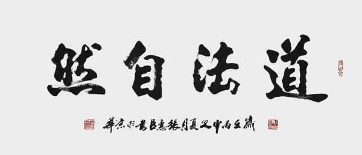
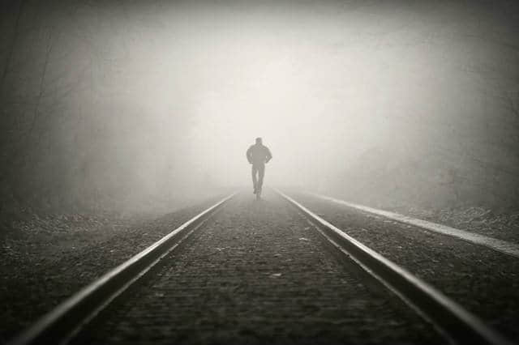
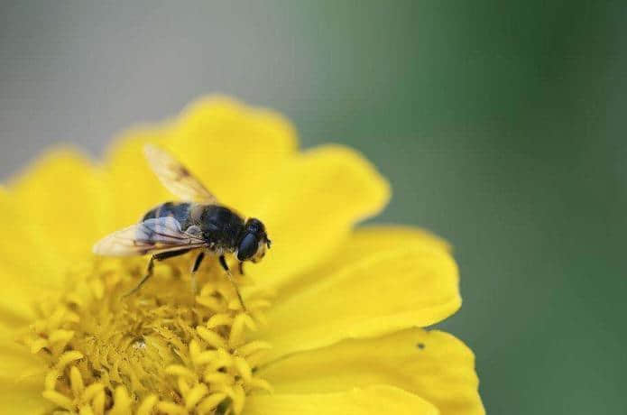

#### 每一个不曾起舞的日子,都是对生命的辜负 —- 尼采

<!-- more -->

 生活里不全是天真灿烂，不全是愁云惨淡，恪守自己的信仰，负重前行，在当前的环境里，努力做最好的自己，想放弃的时候，好好想想，是什么让自己已经坚持了这么久。奔跑起来的时候，才知道流汗的感觉也是一种释然；户外活动的时候，才知道宅男的生活是多么的颓废；早起的时候，才发觉原来人的一天可以这样来过。俗话说，好吃不过家常菜，知冷知热结发妻，随着年龄渐渐的成熟，心态也越来越显得泰然自若，过去的遗憾，不会耿耿于怀，未来的期盼却时刻牢记心间。会从身边的小事一点点的去品味生活，从生活的一个个细节去把握未来。

如果你的生活里有以下的现象或者感觉，请谨慎对待：

 近来三个月里，最开心的三件事是什么？

 近来三个月里，你完成的最漂亮的三个计划是什么？

 近来三个月里，你认识了最有趣三个人是谁？

 近来三个月里，你最遗憾的三件事是什么？

 近来三个月里，你最满意坚持三个习惯是什么？

 请驻足下来，静下来，仔仔细细想想，到底是什么阻断了做几件开心的事，到底是什么阻隔了自己的计划？到底是什么让自己不愿意再去和别人社交，到底是什么让自己说起遗憾都有点麻木，到底是什么让自己有点刻意的去躲避“坚持”二字。答案放在自己心里就好。爱惜自己，爱生活，好好坚持，不爱，请放弃也要干脆。

 业精于勤，荒于嬉；行成于思，毁于随。优秀的人总是孤独的行者，平庸的人喜欢簇拥前行，聪明的人不屑于和差距甚远的人喋喋不休的争论，有终局思维的人不会和目光短浅的人谈论长远的收益，如果，你发觉自己和周围有点格格不入了，其实没太大必要去寝食难安，辗转反侧，路漫漫需要上下求索，而不是一味的跟着别人的脚印前行，长大了，都会为自己的行为付出代价和责任，不必婆口苦心的规劝一个人，反而招来鄙夷的反感。要有所为，有所不为。

 成熟就是要懂得放弃和选择，割舍一些不必要的情感，选择自己要的，要懂得看透名利，合理取舍；成熟就是要学会有自己独立的人格，有自己看世界的视角，学会维护自己的尊严和价值观。成熟就是努力处理好理想和现实的矛盾，学会爱护家人和珍惜自己的时间，做自己的太阳，影响周围，自己为自己的前程负责。三十而立，总结其自己，接受自己的平凡，接受自己的不完美。

 致还想继续前行的人，*沧浪之水清兮*，*可以濯吾缨*；*沧浪之*水浊兮，*可以濯吾*足。不要放弃阅读和学习，不要在困难和娱乐化泛滥的社会里没有迷失自己。请秉持一种持之以恒的学习习惯，坚持自己的操守，不必做什么事情都变成随大流，盲目从众的生活。阅读不是为了炫耀给谁看，多读了几本书，不必沾沾自喜。突然自己顿悟的见解要和行走在你前面的高手请教和探讨，往事耿耿于怀只会让接下来的生活更加糟糕，纠结于过去的错误并不会改变什么，需要和过去和解，放下负累，抛下不属于自己的思想包袱。尝试着更健康的作息，得空的时候回温习一遍内心认为经典的东西，无论是短文，还是电影或者歌曲。多和哪些积极对待生活的人为伍，但是要有自己独立的人格和思维。

