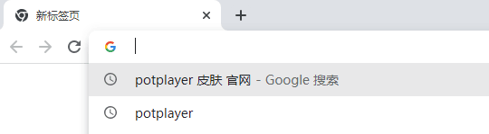
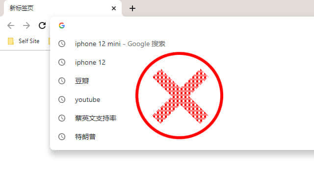
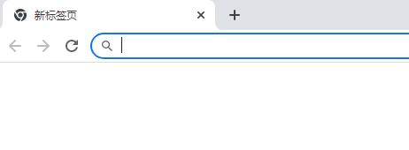
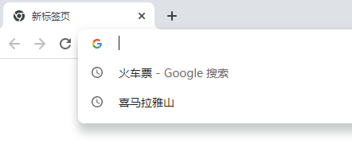
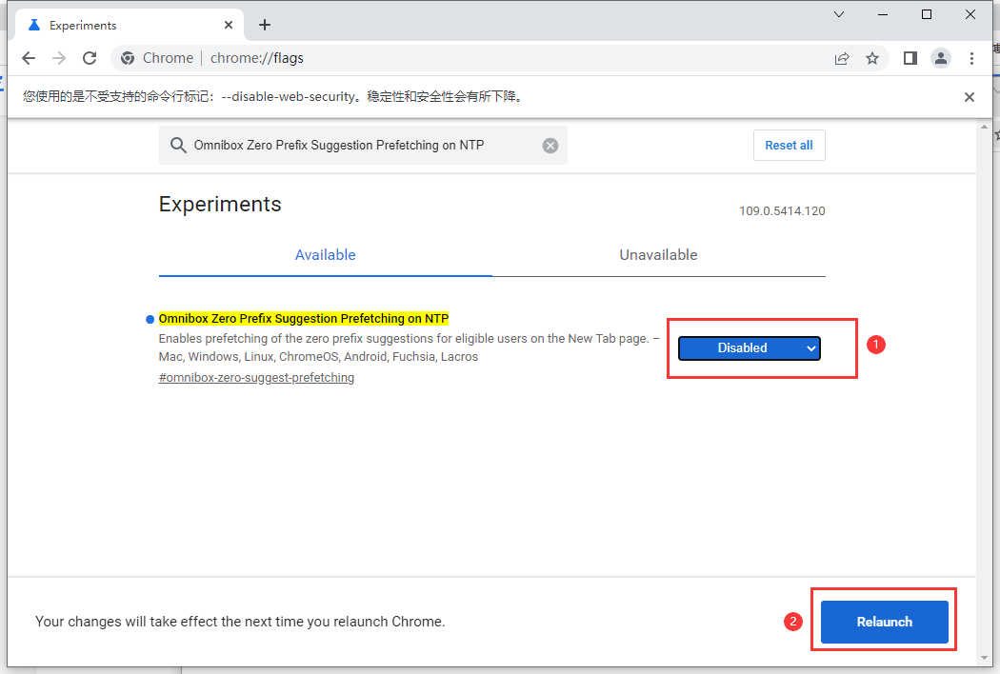

平时上网时候最常用的就是搜索，而我本人习惯使用Chrome浏览器，浏览记录大部分人都知道如何删除，甚至可以大家一个无痕模式，无论是工作还是生活搜索栏的搜索历史记录有时候并不想让其他人看到自己搜索了什么，特别是在公共环境，那么我们如何避免搜索记录被别人看到呢？下面就说一下如何隐藏和删除搜索栏的搜索历史。
<!--more-->

## 问题困扰

Chrome是大家熟知的浏览器，但是搜索栏的历史记录如何自己一条条的删除确实很麻烦，于是想到了能不能批量删除，发现浏览器并没有提供批量删除的接口，于是自己在网上找了一些解决方案，下面就记录一下。

## 解决方法

### 插件解决

首先我们想到的是Chrome强大的插件系统，于是就首先想到使用插件解决这个问题，于是就搜索插件，还真找到了一款插件，于是就测试一下试试。

[HCOS - Hide Chrome Omnibox Suggestions](https://chrome.google.com/webstore/detail/hcos-hide-chrome-omnibox/aldijnffnfojelcpcfoekkeifffkhldo)

插件地址:https://chrome.google.com/webstore/detail/hcos-hide-chrome-omnibox/aldijnffnfojelcpcfoekkeifffkhldo

安装后 

发现 完美解决！！

### 自带设置解决

解决前

#### 步骤

Chrome 版本信息 **2023 chrome 109版本**

1. 首先打开 地址 输入：`chrome://flags`

搜索 `Omnibox Zero Prefix Suggestion Prefetching on NTP` 选择`disable`，然后`Relaunch`

3. **关闭浏览器，重新打开Chrome** 发现 已经正常

## 总结

以上就是两种删除Chrome搜索栏记录的方法，有需求的你，赶快试试吧！