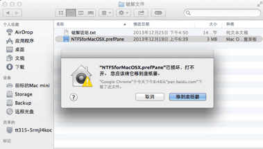
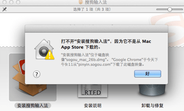
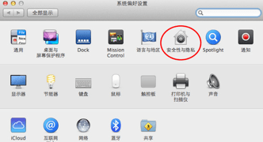
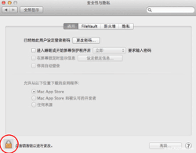
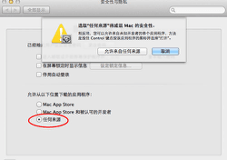
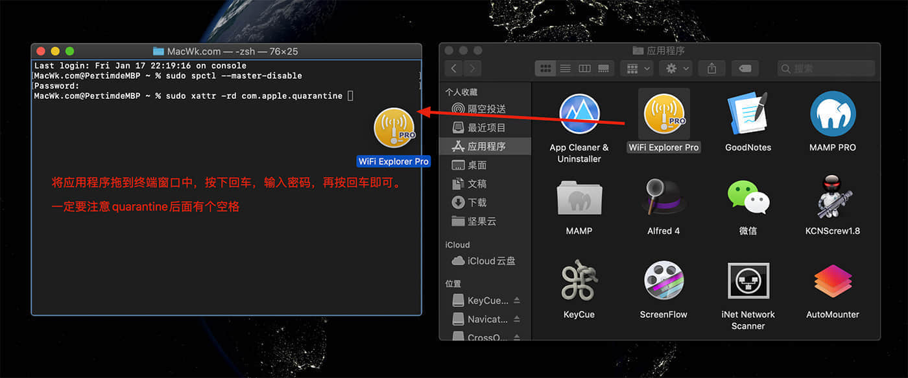

    *很多朋友们在安装软件时Mac OS系统出现提示“XXXApp 已损坏”或“不是Mac Appstore下载的。您应该将它一道废纸篓”这样的提示，怎么回事呢?要怎么解决呢？*

 <!-- more -->


其实很多时候往往这些软件可能是经过了汉化或者破解，所以被Mac认为「已损坏」，那么解决方法就是临时改变Mac系统安全设置。




1、首先需要点击左上角苹果标志打开系统偏好设置，选择安全性与隐私；




2、然后点击左下角锁形按钮，这时会提示需要输入苹果系统用户密码，输入你的账号密码点击确定；

 　

3、选择“任何来源”，然后点击允许来自任何来源，这样就不会出现“软件已损坏”或“不是Mac Appstore下载的”的提示了。




 

Mac安装软件的几种常见方式：



打开 `系统偏好设置 -> 安全与隐私 -> 通用` 选项卡，检查是否已经启用了 `任何来源` 选项。如果没有启用，先点击左下角的小黄锁图标解锁，然后选中`任何来源`。

如果没有这个选项，我们打开`终端`，输入以下命令 (可以通过点击屏幕右上角的搜索图标，输入`终端`快速运行)：

```
sudo spctl --master-disable
```

然后按下键盘的回车键（return），输入密码，再按回车键，完成。

> 输入命令回车后会看见个 password 后面还有个钥匙图标，在钥匙图标后面输入你自己电脑解锁密码（输入的时候不显示你输入的密码，感觉就是输入不了东西一样，也不用管，凭感觉输入完正确解锁密码后按回车键）

好了，现在回到 `系统偏好设置 -> 安全性与隐私 -> 通用` 里，就会发现已选中`任何来源`选项了。

**2020年4月29更新**

> 一般执行完命令会默认选中的，如果没有选中，解锁一下选中就可以了！

到这里一般情况下应用都可以运行了，特别是 macOS 10.14 及以下系统

但是 macOS 10.15x 系统对于未签名的应用又进一步收缩了权限，众所周知破解软件基本上不会进行签名的，特别是所以当我们在 10.15.x 系统上运行破解软件的时候可能还会提示`xxx.app已损坏`，不过没关系，我们通过命令绕过苹果的公证 Gatekeeper 就可以了。

## 绕过公证：

打开终端，输入以下命令：

```bash
sudo xattr -rd com.apple.quarantine /Applications/xxxxxx.app
```

将上面的 `xxxxxx`.app 换成你的App名称，比如 `Sketch.app`

```bash
sudo xattr -rd com.apple.quarantine /Applications/Sketch.app
```

或者复制以下命令粘贴到终端后

```bash
sudo xattr -rd com.apple.quarantine 
```

打开Finder（访达），点击左侧的 `应用程序`，将应用拖进终端中，然后按键盘的回车键（return），输入密码，再按回车键，完成。

> 注意 `quarantine` 后面必须有个空格



好了再看一下是不是可以打开APP了！

## 最后

> 如果您嫌麻烦，您也可以下载 macwk.com 编写的 macOS工具箱，可以快速执行命令操作：

下载完成后，打开dmg文件，按住键盘上的`control`键，然后单击或者右键点击macOS小助手应用图标，再点击`打开`即可！

输入序号：`14`，然后将应用拖进窗口中，按下回车，输入密码即可！