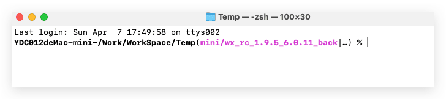
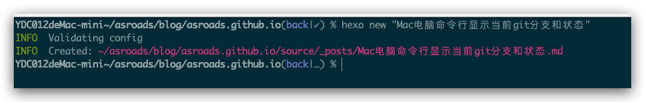
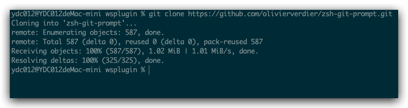
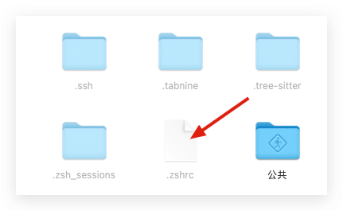
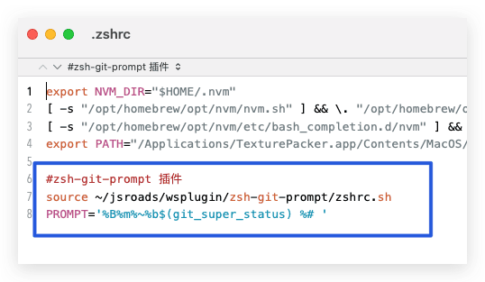
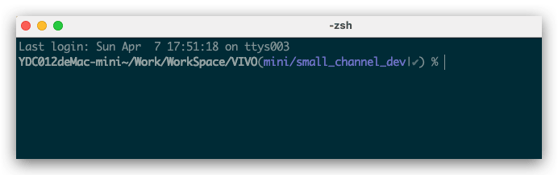

前几天在抖音上学习git知识的时候，发现博主的电脑命令行可以直接显示当前仓库的分支名字和状态等信息，一时间，觉得这个功能挺好的，于是今天得空整理一下，设置一下自己的电脑，打开命令行如果目录是git 仓库是可以正常显示为git分支信息啥的。
<!--more-->

## 最终效果

先看一下我本地配置后的效果图：





## 相关知识链接：

- [git-prompt.sh](https://github.com/git/git/blob/master/contrib/completion/git-prompt.sh)

- [bash-git-prompt](https://github.com/magicmonty/bash-git-prompt)
- [zsh-git-prompt](https://github.com/olivierverdier/zsh-git-prompt)

相关说明：上面几个链接都可以配置一天分支状态，最终我选择了 [zsh-git-prompt](https://github.com/olivierverdier/zsh-git-prompt) 原因是喜欢它最终展示的样式（颜值喜欢没办法～）

## 几种方法：

### 方法一：git官方方式显示git分支

1. 下载脚本到本地，比如命名为`~/.git-prompt.sh`下载地址：[点击前往](https://github.com/git/git/blob/master/contrib/completion/git-prompt.sh)

   ```
   https://github.com/git/git/blob/master/contrib/completion/git-prompt.sh
   ```

2. 编辑.zshrc: vim ~/.zshrc

```
GIT_PS1_SHOWUPSTREAM="auto"
GIT_PS1_SHOWCOLORHINTS="yes"
source ~/.git-prompt.sh
setopt PROMPT_SUBST
PS1='[%n@%m %c$(__git_ps1 " (%s)")]\$ '
```

3. 保存配置

```
source ~/.zshrc
```

### 方式二：zsh (oh my zsh)+iTerm2

由于自己不太想安装 oh my zsh 这个方案没有过多尝试，大家可以自行搜索查看实现方法。

### 使用zsh-git-prompt

1. 本地下载[zsh-git-prompt](https://github.com/olivierverdier/zsh-git-prompt)，将此存储库克隆到硬盘上的某个位置。

```
 git clone https://github.com/olivierverdier/zsh-git-prompt.git
```



1. 修改文件`~/.zshrc`，并配置`zshrc.sh`找到我们的`~/.zshrc`文件，添加：

   ```
   source path/to/zshrc.sh
   # an example prompt
   PROMPT='%B%m%~%b$(git_super_status) %# '
   ```

   

   比如我这里是：

   

   ```
   #zsh-git-prompt 插件
   source ~/jsroads/wsplugin/zsh-git-prompt/zshrc.sh
   PROMPT='%B%m%~%b$(git_super_status) %# '
   ```

2. 进入 git 存储库并测试它！



相关知识拓展：

| Symbol | Meaning                                    |
| ------ | ------------------------------------------ |
| ✔      | repository clean                           |
| ●n     | there are `n` staged files                 |
| ✖n     | there are `n` unmerged files               |
| ✚n     | there are `n` changed but *unstaged* files |
| …      | there are some untracked files             |

分支跟踪符号：

| Symbol | Meaning                                                      |
| ------ | ------------------------------------------------------------ |
| ↑n     | ahead of remote by `n` commits                               |
| ↓n     | behind remote by `n` commits                                 |
| ↓m↑n   | branches diverged, other by `m` commits, yours by `n` commits |

## 其他知识

###  修改文件权限

1. sudo -i 切换到root账户
2. 切换目录 cd 你的文件(夹)路径的上一级目录。
3. `sudo chmod -R 777` 你的文件(夹)名。
4. 输入密码。
5. 成功

## 参考

- [Mac下iterm2配色方案（高亮）及显示Git分支（CSDN）](https://blog.csdn.net/huangpb123/article/details/79631473)
- [macOS上配置和使用iTerm2（掘金）](https://juejin.cn/post/7129045402376126471)
- [zsh-git-prompt](https://github.com/olivierverdier/zsh-git-prompt)
- [bash-git-prompt](https://github.com/magicmonty/bash-git-prompt)
