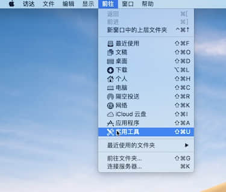
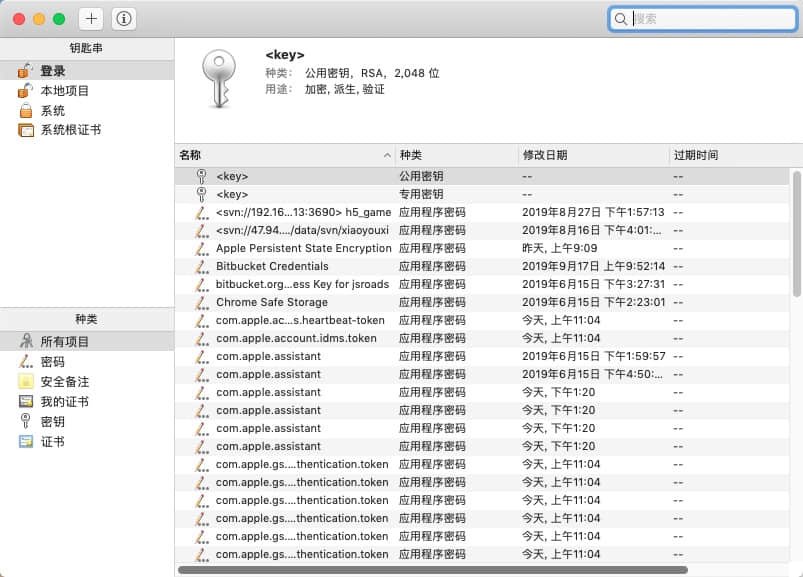
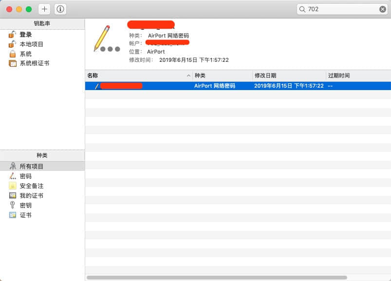
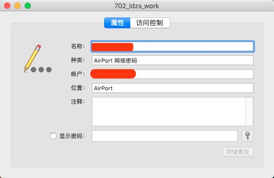
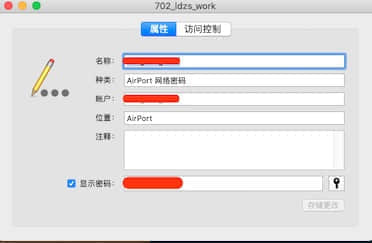

毕竟很少用到这个功能，但是，就是今天，手机周末在家重置了所有的网络设置，导致正常上班的情况下，无法正常打卡，公司的打卡机用的是钉钉，必须用特定WiFi网络打卡，本来是早上8:54到公司的，可连不上公司的WiFi，奈何公司的WiFi密码设置的还是比较复杂些的，虽然后面观察了一下有规律，但长时间不登录，确实已经想不起了，于是乎，我在9:03才打上卡，工作的电脑也是连着WiFi的，就是因为对Mac电脑查看WiFi密码不熟悉，导致我这三分钟的误差，于是我决定写一篇文章记下来，日后备用。

<!-- more -->

### 步骤

1. 先请打开 Mac 系统中的**“实用工具”**窗口，可以点击屏幕顶部菜单中“前往”，再点击**“实用工具”**选项。

   

2. 在实用工具窗口中点击打开**“钥匙串访问”**图标，如图所示

   

3. 在钥匙串访问窗口中，一般在 Mac 电脑中保存的密码比较多，可以直接在右下角搜索框中输入无线网络名称，在列表中找到无线网络,如图所示

接下来很顺利的找到了我们的网络

4. 接着再输入我们的登录系统密码，如图所示

   

5. 选择显示密码，输入我们的Mac电脑的账户名和密码

6. 下面就正确的显示了我们的密码

   

   