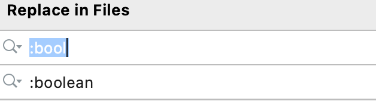
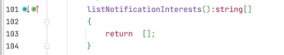
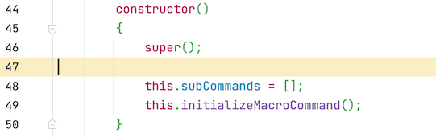

[PureMVC](http://puremvc.org/)是一款优秀的mvc的框架，实现了多个语言的版本，框架用观察者模式做到了低耦合的消息机制。下面就简单的说说如何对框架源码处理，重新编译生成自定义的目标文件。
<!--more-->

## 环境

- typescript 环境
- ant 环境
- java jdk环境
- [yuicompressor-2.4.8.jar](https://github.com/yui/yuicompressor/releases)
- cocos creator

## 步骤

1. 首先下载框架，解压后 得到框架 此时我们修改一个名字（这个自己随便修改 这里名字为 `puremvc-ts`）

2. 然后修改 `build` 目录下面的[user.properties.sample](https://github.com/PureMVC/puremvc-typescript-standard-framework/blob/master/user.properties.sample) 为 `user.properties` 然后把自己的 tsc 环境变量修改为自己的真实变量路径这里为：

   ```shell
     typescript.compiler.path = /usr/local/bin/tsc
   ```

   

3. 修改源码的几处错误 比如 全局修改 `bool` 为 `boolean` ts 没有 bool 这个类型。




1. 修改 `src/org/puremvc/typescript/patterns/mediator/Mediator.ts`  关于数组类型的错误 这里都修改为 `[]`

   

   

   1. 修改 `src/org/puremvc/typescript/patterns/command/MacroCommand.ts` 关于数组类型的错误 这里都修改为 `[]`

      

      1. 然后把我们下载好的最新版本的 [yuicompressor-2.4.8.jar](https://github.com/yui/yuicompressor/releases)放到 `build/lib/yuicompressor` 目录下面 原来已经有个 `yuicompressor-2.4.2.jar` 我们要对这个jar 升级一次 
      2. 接下来修改 `build/build.properties` 文件 的 `yuicompressor.file` 参数

      ```
      yuicompressor.file = lib/yuicompressor/yuicompressor-2.4.8.jar
      ```

      1. 然后我们进入 build目录 打开 命令行工具  使用 ant 命令 ：这个 build 命令 在 build.xml 文件里 如下

      ```
      clean.src.bin, compile.src, clean.src, compress, build.src, clean.test.bin, compile.test, clean.test, build.test, build.all
      ```

      具体用法：

      ```
      ant build.all
      ```

      如果单单编译框架 可以用：

      ```
      ant build.src
      ```

      1. 运行结果：

      ```bash
      Last login: Thu Mar  4 12:04:32 on ttys001
      smile@bogon build % ant build.src
      Buildfile: /Users/smile/work/helper/puremvc-ts/build/build.xml
      
      clean.src.bin:
      
      compile.src:
           [echo] Writing tsc command line arguments to : /Users/smile/work/helper/puremvc-ts/build/../src/compile.list
           [echo] "\Users\smile\work\helper\puremvc-ts\src\org\puremvc\typescript\core\Controller.ts"
           [echo] "\Users\smile\work\helper\puremvc-ts\src\org\puremvc\typescript\core\Model.ts"
           [echo] "\Users\smile\work\helper\puremvc-ts\src\org\puremvc\typescript\core\View.ts"
           [echo] "\Users\smile\work\helper\puremvc-ts\src\org\puremvc\typescript\interfaces\ICommand.ts"
           [echo] "\Users\smile\work\helper\puremvc-ts\src\org\puremvc\typescript\interfaces\IController.ts"
           [echo] "\Users\smile\work\helper\puremvc-ts\src\org\puremvc\typescript\interfaces\IFacade.ts"
           [echo] "\Users\smile\work\helper\puremvc-ts\src\org\puremvc\typescript\interfaces\IMediator.ts"
           [echo] "\Users\smile\work\helper\puremvc-ts\src\org\puremvc\typescript\interfaces\IModel.ts"
           [echo] "\Users\smile\work\helper\puremvc-ts\src\org\puremvc\typescript\interfaces\INotification.ts"
           [echo] "\Users\smile\work\helper\puremvc-ts\src\org\puremvc\typescript\interfaces\INotifier.ts"
           [echo] "\Users\smile\work\helper\puremvc-ts\src\org\puremvc\typescript\interfaces\IObserver.ts"
           [echo] "\Users\smile\work\helper\puremvc-ts\src\org\puremvc\typescript\interfaces\IProxy.ts"
           [echo] "\Users\smile\work\helper\puremvc-ts\src\org\puremvc\typescript\interfaces\IView.ts"
           [echo] "\Users\smile\work\helper\puremvc-ts\src\org\puremvc\typescript\patterns\command\MacroCommand.ts"
           [echo] "\Users\smile\work\helper\puremvc-ts\src\org\puremvc\typescript\patterns\command\SimpleCommand.ts"
           [echo] "\Users\smile\work\helper\puremvc-ts\src\org\puremvc\typescript\patterns\facade\Facade.ts"
           [echo] "\Users\smile\work\helper\puremvc-ts\src\org\puremvc\typescript\patterns\mediator\Mediator.ts"
           [echo] "\Users\smile\work\helper\puremvc-ts\src\org\puremvc\typescript\patterns\observer\Notification.ts"
           [echo] "\Users\smile\work\helper\puremvc-ts\src\org\puremvc\typescript\patterns\observer\Notifier.ts"
           [echo] "\Users\smile\work\helper\puremvc-ts\src\org\puremvc\typescript\patterns\observer\Observer.ts"
           [echo] "\Users\smile\work\helper\puremvc-ts\src\org\puremvc\typescript\patterns\proxy\Proxy.ts"
           [echo] --out "/Users/smile/work/helper/puremvc-ts/build/../bin/puremvc-typescript-standard-1.0.js"
           [echo] --module amd
           [echo] --target ES5
           [echo] Calling /usr/local/bin/tsc with /Users/smile/work/helper/puremvc-ts/build/../src/compile.list
           [echo] /Users/smile/work/helper/puremvc-ts/build/../src/compile.list deleted
         [delete] Deleting: /Users/smile/work/helper/puremvc-ts/src/compile.list
      
      clean.src:
      
      compress:
      [yuicompress] puremvc-typescript-standard-1.0.js:/Users/smile/work/helper/puremvc-ts/bin
      [yuicompress] Compressing /Users/smile/work/helper/puremvc-ts/bin/puremvc-typescript-standard-1.0.js to /Users/smile/work/helper/puremvc-ts/bin/puremvc-typescript-standard-1.0-min.js
      
      build.src:
      
      BUILD SUCCESSFUL
      Total time: 2 seconds
      smile@bogon build %
      ```

      ### 其他拓展

      上面是把 编译的两个过程一起做了，其实可以独立分开自己处理的，分为 tsc 编译 js压缩

      ### tsc 编译文件

      其实第一步就是如何把多个ts 文件编辑成一个js 文件 这个 可以参考 tsc 参数配置：[编译选项](https://www.tslang.cn/docs/handbook/compiler-options.html)

      下面是一些 tsc 常用的编译参数：

      --help：显示帮助信息。 --module：载入扩展模块。 --target：设置 ECMA 版本。 --declaration：额外生成一个 .d.ts 扩展名的文件。 --removeComments：删除文件的注释。 --out：编译多个文件并合并到一个输出的文件。 --sourcemap：生成一个 sourcemap (.map) 文件。 --watch：在监视模式下运行编译器。会监视输出文件，在它们改变时重新编译。 --module noImplicitAny：在表达式和声明上有隐含的 any 类型时报错。

      这样 如果没有ant 环境的 可以自己用 tsc 命令自己编译 就是新建项目 然后把 引擎放进去 在 项目根目录 执行 tsc 命令即可

      ### js压缩

      这里我们可以介绍一下 yuicompressor 大概的命令如下

      ```sh
java -jar yuicompressor-2.4.8.jar puremvc.js > build/puremvc.js 
      ```
      
      也可以添加其他参数：

      通用参数： -h, --help 显示帮助信息 --type <js|css> 指定输入文件的文件类型 --charset <charset> 指定读取输入文件使用的编码 --line-break <column> 在指定的列后插入一个 line-bread 符号 -v, --verbose 显示info和warn级别的信息 -o <file> 指定输出文件。默认输出是控制台。

      JavaScript专用参数： --nomunge 只压缩, 不对局部变量进行混淆。 --preserve-semi 保留所有的分号 --disable-optimizations 禁止优化

      **在线等压缩 网站**

       在线JS/CSS/HTML压缩(采用[YUI Compressor](http://www.oschina.net/p/yui+compressor)实现)

      https://tool.oschina.net/jscompress

      ### 拓展：

      Cocos Creator 3.0 使用插件模式 会报错，puremvc 本身就有 ts 版本 而且是两个 一个 [标准版本 ](https://github.com/PureMVC/puremvc-typescript-standard-framework) 一个是[多核心 版本 ](https://github.com/PureMVC/puremvc-typescript-multicore-framework) ，我这里只是[标准版本](https://github.com/PureMVC/puremvc-typescript-standard-framework) 这个版本 多个文件 合并成一个ts 文件而已 为的就是看起来方便 用起来 感觉是一个模块出来的而已，遵循了 cocos creator 3.0 的官方 推荐的方式。

      下面是[标准版本](https://github.com/PureMVC/puremvc-typescript-standard-framework)合并后的一个完整的 ts 文件 这样 不需要 像以前那样 用倒入插件 和 添加声明文件啥的 直接当成 `ts` 使用即可。有用的拿去吧。

      标准版合并后的ts下载地址：[puremvc.ts](https://github.com/jsroads/mylibs/blob/main/puremvc/dist/puremvc.ts)

      **说明：**就是把多个文件 合并成一个文件，修改了几个类型的错误，其他均未曾修改，Cocos Creator 3.0 可以直接用。

      ## 参考

      - [编译选项](https://www.tslang.cn/docs/handbook/compiler-options.html)
- [tsconfig.json](https://www.tslang.cn/docs/handbook/tsconfig-json.html)
      - [TypeScript tsc 常用编译参数](https://www.axihe.com/edu/typescript/build-parameters.html)
      - [PUREMVC 开源框架一](https://blog.csdn.net/fhqydidxil1zql/article/details/87637126)
      - [js压缩工具 yuicompressor 使用教程](https://blog.csdn.net/xiongzhengxiang/article/details/6987125)