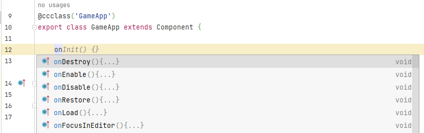
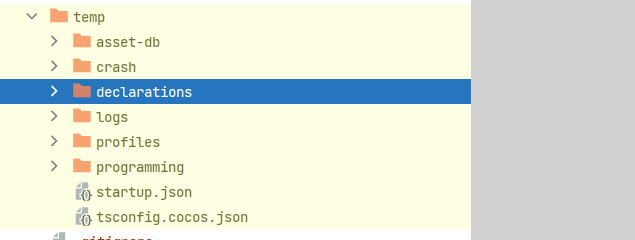
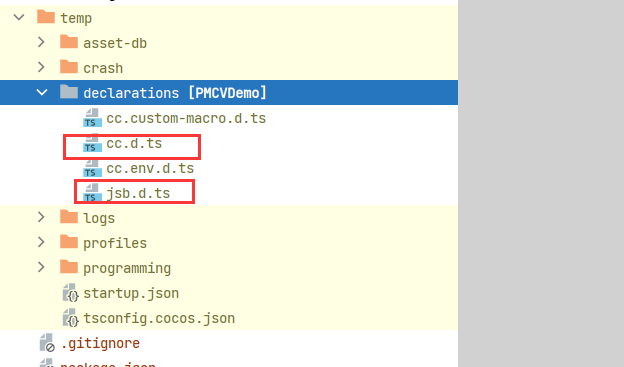
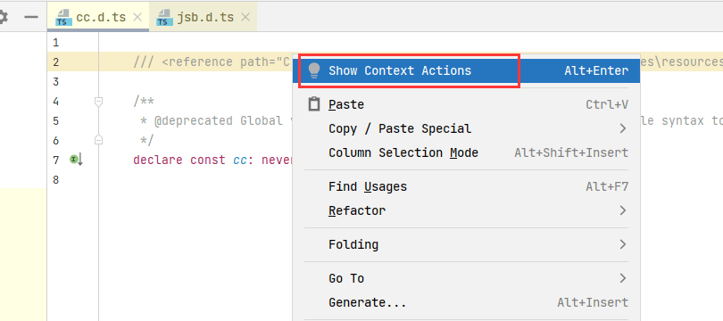
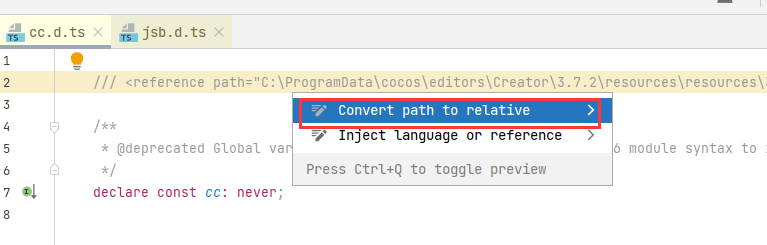
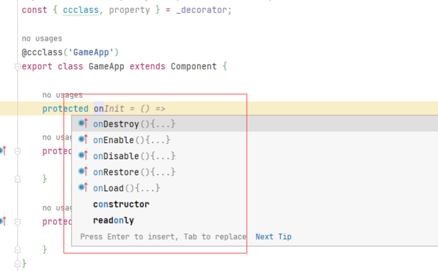
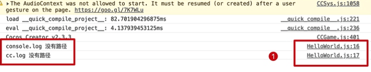
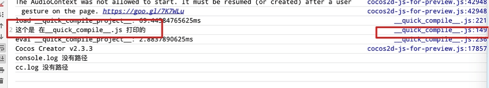

最近开始使用`CocosCreator3.7.2`开发项目，新建项目后，发现引擎代码不会提示了，找了一圈，网上其他人有一些方案但是都不理想，于是整合了一下，如何操作，以及其中的一些原因。下面说一下具体的分析和操作。
<!--more-->

## 实现效果

引擎自带的API智能提示：



## 原因分析

先说不能提示的原因：

1. 我们首先看项目内的 `tsconfig.json` 文件的内容：

```json
{
  /* Base configuration. Do not edit this field. */
  "extends": "./temp/tsconfig.cocos.json",

  /* Add your custom configuration here. */
  "compilerOptions": {
    "strict": false
  }
}

```

2. 这里  `"extends": "./temp/tsconfig.cocos.json"`，这个是一个子配置，于是我们打开子配置看内容：

   ```json
   {
   	//... 省略不重要的部分
       "types": [
         "./temp/declarations/cc.custom-macro",
         "./temp/declarations/cc",
         "./temp/declarations/jsb",
         "./temp/declarations/cc.env"
       ],
       //... 省略不重要的部分
   }
   
   ```

3. 这里我们看到，这个types配置的就是引擎的声明文件`.d.ts`，这里我们打开`declarations`这个文件夹。正常来说使用`Webstorm`的人都会 把 `temp` 文件夹设置为 `Excluded` 

   

4. 这里我们需要把 它的子文件夹 `declarations`  文件夹从 `Excluded` 状态中移除（如果看不到 `temp` 文件夹，可以尝试点击项目目录面板右上角的齿轮按钮，`Tree Appearance > Show Excluded Files`）
   

5. 我们打开这俩文件 都会看到 使用了绝对路径的引用语句：

```
/// <reference path="C:\ProgramData\cocos\editors\Creator\3.7.2\resources\resources\3d\engine\@types\jsb.d.ts"/>
```

```
/// <reference path="C:\ProgramData\cocos\editors\Creator\3.7.2\resources\resources\3d\engine\bin\.declarations\cc.d.ts"/>
```

6. WebStorm 无法智能提示的代码原因已经找到，就是不能识别绝对路径，找到原因，那接下来就是探讨如何优雅的解决问题。

## 解决方案

### 方案一  修改路径为相对路径

1. 分别打开 `cc.d.ts` 和 `jsb.d.ts` 两个文件，将光标移到 `reference` 标签的路径 `path` 值中，`ATL+ENTER` (或右键 > Show Context Actions)。

   

2. 选择 `Convert path to relative`，将此处的绝对路径转为相对路径（**主要原因：** Webstorm 对于这类路径依赖只识别相对路径，所以才会导致原来的 `cc.d.ts` 和 `jsb.d.ts` 不起作用）



3. 转为相对路径后，继续光标原处 `ATL+ENTER` (或右键 > Show Context Actions)，选择 `Create library with files outside the project`
4. 此时，在项目目录下边的 `External Libraries` 中已成功添加了 `ts-external-references/cc.d.ts`，文件 `jsb.d.ts` 同理

#### 注意：

此方法需要，`CocosCreator`引擎和项目在同一个磁盘才可以。

### 方案二， 直接使用引擎下的声明文件替换

1. 我们根据上面的路径找到对应的引擎是声明文件：你自己引擎路径不一定跟我的一样，请自己查找安装目录

```
C:\ProgramData\cocos\editors\Creator\3.7.2\resources\resources\3d\engine\@types\jsb.d.ts
```

```
C:\ProgramData\cocos\editors\Creator\3.7.2\resources\resources\3d\engine\bin\.declarations\cc.d.ts
```

2. 直接使用 这俩文件，替换文件夹 `declarations` 下的 对应同名文件即可。

## 效果

我这里展示一下 方案二的效果：



正常提示代码，目标完成！！


## 拓展

### 忽略声明文件报错

此时，项目内的声明文件（.d.ts）报错怎么办，因为声明文件，无须真正的去解决，只用使用忽略 `// @ts-nocheck` 即可：在声明文件的头部 添加一行忽略即可：

```typescript
// @ts-nocheck
declare module “cc” {
…这里是内容
}
```

其他相关忽略 如下：单行忽略(添加到特定行的行前来忽略这一行的错误)

```javascript
// @ts-ignore
```

跳过对某些文件的检查 (添加到该文件的首行才起作用)

```javascript
// @ts-nocheck
```

对某些文件的检查

```javascript
// @ts-check
```

### webstorm 项目输出的内容 路径是 js 而不是 ts

我们期待的：



实际输出的：


解决步骤：

1. 在编辑器配置 路径 `C:\Users\asroads\.CocosCreator\profiles` 下关闭 `features.json` 的快速编译（如果没用这个文件，自己创建一个`json`即可）
2. `features.json`` 里面加上 `bundle-quick-compiler-project: false 。

```
{ "xiaomi-runtime": true, "bundle-quick-compiler-project": false }
```

3. 建议 删除 项目内的 `library` `local` `temp` 三大衍生 目录 重新打开项目即可。

## 总结

有时候使用代码开发工具的时候，需要我们不断的去摸索一些设置，或者选项，只有我们对工具熟悉了，后面开发的过程中，才会有更改的效果写功能。

## 参考

- [Webstorm 智能提示配置](https://forum.cocos.org/t/topic/145779)
