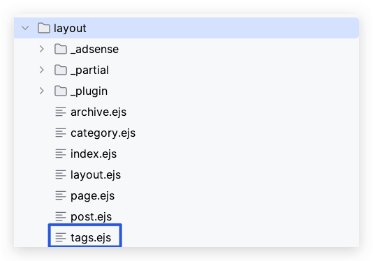

从 博客搭建开始，到现在一年多了，陆陆续续更新了几十篇自己的所学所感，最近在浏览别人博客的时候，觉得有些人的博客的打开速度比我的快，就想着，是不是要更新一下博客的插件，于是就尝试了一下，当然中间遇到了问题，给我带来了一些思考。
<!--more-->

### 思考一

盲目的升级了所有插件，升级了 环境，导致 `hexo generate` 运行后 编译报错很奇怪，去网上搜索问题，有网友指出是插件版本问题（这个毫无疑问，因为我也是升级了 插件导致的）网友的建议是 使用稳定版的插件

于是我重新还原了项目，分为几步走，

- 我一个 一个插件升级
- 升级一个插件后，就重新编译 测试一下 ，后面我在所有插件只剩下  hexo 这个安装包 的时候 都是OK的
- 那么问题很明显了，我的报错是 我升级 hexo 引起的，那是不是 最新的 hexo 触发了什么问题吗 这样呆着疑问我继续找问题，我把 我大部分的文章都 移动出来，就剩下几篇简单的文章，发现是可以通过编译的
- 此时我一个文章添加进去，哪个添加进去后 报错了，肯定是那个文章 格式不对，后来 经过一点点摸索，终于大概 20分钟后，找到了报错地方是 一个 http 地址引起的
- 我的报错 是 【ERR_INVALID_URL】 这个类型的，我再文章里 直接写了的  [http://localhost:4000](http://localhost:4000 ) 这样的 导致的，于是我 就把  http://localhost:4000  改成了  `http://localhost:4000`  添加了 代码格式 就没事了，但我后面 测试 发现这个问题 又不见了，可以 直接写地址，这个 很奇怪，估计应该是 插件 升级 后 不兼容引起的 如果我重新 建文章 到没有直接触发这个问题
- 最后 成功 把 hexo  从 3.9.0 升级到 4.2.0

### 思考二

以前 对 npm 安装的插件理解不是很深入，以前总觉得 `package.json` 是插件结果的一个体现，比如我项目用了什么插件，里面就显示了 使用的插件结果，这次安装，升级后，理解了，这个 文件 其实 蛮重要的，在项目内 可以删掉  `node_modules` 文件夹 然后 直接运行 

```shell
npm install
```

就能 直接读取 `package.json`文件里 配置好的 插件 直接 生成对应的环境  以前 我总是一个个 重新安装一遍，很费精力，如果想来，是自己对 npm 使用的方式不对，根本原因是自己对 npm 理解不够深入引起的，这次本来是 升级一下博客，结果还额外理解了 npm 的知识，内心还是很开心的。

#### 其他 2021-08-30 更新

##### 博客 突然不能 部署 hexo d 

报错如下：

```
The “mode“ argument must be integer. Received an instance of Object
```

原因：

node.js和hexo存在版本适配的关系，所以当可能是一个版本过高一个版本过低导致的出现问题。

解决这个问题可以将hexo更新至高版本，也可以重新安装一个低版本的node。

参考：

> ### Node.js 版本限制
>
> 我们强烈建议永远安装最新版本的 Hexo，以及 [推荐的 Node.js 版本](https://hexo.io/zh-cn/docs/#安装前提)。
>
> | Hexo 版本   | 最低兼容 Node.js 版本 |
> | :---------- | :-------------------- |
> | 5.0+        | 10.13.0               |
> | 4.1 - 4.2   | 8.10                  |
> | 4.0         | 8.6                   |
> | 3.3 - 3.9   | 6.9                   |
> | 3.2 - 3.3   | 0.12                  |
> | 3.0 - 3.1   | 0.10 or iojs          |
> | 0.0.1 - 2.8 | 0.10                  |

##### hexo 更新后 发现 警告如下


```shell
Deprecated config detected: "external_link" with a Boolean value is deprecated.
```

修改方式：

_config.yml

```yaml
# Deprecated
external_link: true|false

# New option
external_link:
  enable: true|false

```

### 2022-05-31 更新

换了电脑windows 更新博客 发现抱错 具体原因是 电脑新环境没有公钥生成


解决方案：

```
git config --global user.name "your github user name"
git config --global user.email "your github 注册邮箱"

```

代码执行后，生成公钥

```
ssh-keygen -t rsa -C "your github 注册邮箱"
```


此时公钥保存在 C:\Users\ .ssh 的文件夹下，打开id_rsa.pub文件，将里面的内容全部复制； 然后去GitHub的Settings, 找到SSH and GPG keys的页面， 新建一个SSH Key, 将刚才复制的内容粘贴到新建的SSH Key中并点击保存。

保存后输入以下代码检测SSH Key生效

ssh git@github.com

出现下面的文字，则本地和Github远程连接上了


按照链接： https://github.com/hexojs/hexo/issues/2778 中的方法，我执行了以下代码

```
hexo config deploy.repository git@github.com:[yourgitname]/[yourgitname].github.io.git
```


再次执行 `hexo d` 成功部署

参考地址:[执行Hexo d报错Spawn failed， 以及OpenSSL SSL_read: Connection was reset, errno 10054](https://blog.csdn.net/Candle_light/article/details/114992784)

### 2023-12-07 更新

Hexo 目前最新版本已经是 7.0.0，最近恰好有个时间，就顺便升级了一下博客，其中一些依赖已经被弃用 需要简单的更换下面简单的说一下，一些注意的地方。

**使用 `sass` 代替 `node-sass`**:`node-sass` 已经被标记为弃用，现在推荐使用 Dart Sass (`sass`)。您可以通过卸载 `node-sass` 并安装 `sass` 来替换，卸载 `node-sass`：`npm uninstall node-sass`。安装 Dart Sass：`npm install sass`。

**安装特定版本的 Hexo**:

- 使用 npm 安装指定版本的 Hexo。例如，如果您想安装 Hexo 7.0.0，您可以运行：

  ```shell
  npm install hexo@7.0.0
  ```

- 如果想将 Hexo 安装为全局模块，可以在命令中加上 -g 标志：

  ```shell
  npm install hexo@7.0.0 -g
  ```

**修复缓存目录的权限**

运行以下命令来更改 npm 缓存目录的所有权：

```shell
sudo chown -R $(whoami) ~/.npm
```

**清理 npm 缓存**:

```shell
npm cache clean --force
```

**检查全局 Hexo CLI 版本**:

运行 `npm list -g --depth=0` 查看全局安装的所有 npm 包，包括 Hexo CLI 的版本。确认全局安装的 Hexo CLI 版本。

**检查 Hexo CLI 的实际路径**:运行 `which hexo` 来查看实际运行的 Hexo CLI 的路径。

**单独检查每个包的最新版本**:使用以下命令来查看每个 npm 包的最新版本:

```shell
npm show [package-name] version
```

例如，要检查 `hexo-abbrlink` 的最新版本，您可以运行：

```shell
npm show hexo-abbrlink version
```

本次遇到的问题，是更新后，运行 hexo -g 构建后，发现 标签为空：

#### 需要修改两个地方，主要是我使用的主题[hexo-theme-meadow](https://github.com/kb1000fx/hexo-theme-meadow)问题：

1. 修改 `layout` 目录下的 `tag.ejs`  为 `tags.ejs`



原内容：

```ejs
<%- partial('_partial/page/collapse',{pagetype: 'tag'}) %>
```

修改：

```ejs
<%- partial('_partial/page/tags') %>
```

2. layout/_partial/page/tags.ejs 内容修改：其实就是 把 `<%site.tags.data.forEach(function(element) {%>` 修改为    `<%site.tags.forEach(function(element) {%>`

   ```ejs
   <div class="page-describe">
       <%=_p('counter.tags',site.tags.length)%>
   </div>
   <div class="tags-contain">
       <%site.tags.forEach(function(element) {%>
           <div class="mdui-chip tags-chip">
               <%if(theme.tag_page_count==true){%>
                   <span class="mdui-chip-icon"><%=element.length%></span>
               <%}%>
               <a class="mdui-chip-title" href="<%-url_for(element.path)%>"><%=element.name%></a>
           </div>
       <%})%>
   </div>
   ```

3. 如果想在 ejs 打印 需要这样：

```ejs
<% console.log('page.posts:', page.posts); %>
```

### 后记

虽然说，新版本代表着未知，可能会有新的问题，但是一般来讲，新版本都是对过去版本的功能拓展和升级，已经问题的修复，如果撇开商业因素的问题，作为一个技术的学习者，是要保持着对新事物的好奇和学习的心情，俗话说，“不积跬步无以至千里”，有时候差距就是一点点拉开的，今天 和社会脱节一点点，明天一点点，时间久了，自己想追上去的时候，却发觉距离太大，而引发更大的恐惧和焦虑，与其被社会逼着进步，不入自己拥抱变化，拥抱未来。

### 参考

- [将 Hexo 升级到 v5.0.0](https://tommy.net.cn/2020/08/08/upgrade-hexo-to-v5-0-0/)

