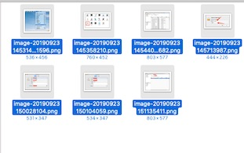
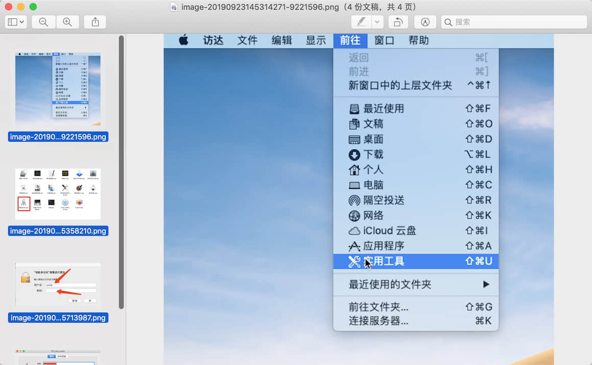
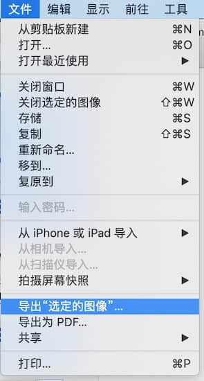

个人博客开了一年多，平常大都是发布一下文章，写一下工作的感想，很多文章都用了图片，今天发现我好多图片都是后缀png的，而且尺寸都显得很大，要想然自己的博客文章打开的快速，减少读者的加载是一个工程，另外每个文章写的时候，里面有很多图片，最后都重新替换了，可很难找出那些是没有引用的，于是乎，有了这篇文章。

<!-- more -->

### 优化三部曲

- 更改图片格式，比如后缀为 png的改成JPEG
- 更改图片尺寸。比如原来是1000X600的 可以适当比例缩放
- 删除多余的没有用到的图片

#### 更改格式

- Mac系统自带预览图片可以搞定

因为我文章不多，所以我一个个操作

1. 比如我们这个文章的博客

   

   

2. 我们打开文件夹,全选我们的图片



3. 继续全选我们的图片



4. 

5. 修改我们需要的满意的尺寸 我是按照百分比修改的


6. 我们发现 图片尺寸已经 缩小 


#### 更改格式

1. 前面几步和上面一致，只是在打开编辑的时候选择的是 导出选定的图像
2. 

2. 选择我们要存放的文件夹 和 选项 选择 格式


3. 把生成的图片替换


4. 我们用 Typora 编辑器打开我们的文章 选择查找 --替换 后缀名即可


5.我们发现 可以正常显示我们新的图片了

#### 删除多余的图片

这个我自己去看了 编辑器的设置没有这样的功能，就想着用Python3 自己写个脚本吧

脚本如下：

```python
#!/usr/bin/env -S -P${HOME}/anaconda/bin python
# -*- coding:utf-8 -*-
import re, os
from itertools import chain

blogDirsList = []
img_patten = r'!\[.*?\]\((.*?)\)|'
# 博客文件夹 本地目录指向 source/_posts 源文件
myblogPath = '/jsroads/blog/asroads.github.io/source/_posts'
blogPath = os.path.abspath(myblogPath)
blogfiles = os.listdir(blogPath)
for blogfile in blogfiles:
    # 得到该文件下所有目录的路径
    m = os.path.join(blogPath, blogfile)
    # 判断该路径下是否是文件夹
    if (os.path.isdir(m)):
        h = os.path.split(m)
        # 把符合要求的目录加进去
        blogDirsList.append(os.path.join(blogPath, h[1]))
print("博客目录", blogDirsList)
# 遍历目录地址
mdList = []  # md 文件里引用的图片
pngList = []  # 本地同名文件夹文件的图片
for source_path in blogDirsList:
    if os.path.exists(source_path):
        for parent, dirs, files in os.walk(source_path):
            for file in files:
                file_path = os.path.join(parent, file)
                if os.path.splitext(file)[-1] == ".png" or os.path.splitext(file)[-1] == ".jpeg":  # 获取后缀
                    picUrl = os.path.join(parent, file)
                    pngList.append(picUrl)
                    # print('jsroads',file_path)
                if os.path.splitext(file)[-1] == ".md":  # 获取后缀
                    with open(os.path.join(source_path, file), 'r', encoding='utf-8') as f:  # 使用utf-8 编码打开
                        post = f.read()
                        matches = re.compile(img_patten).findall(post)
                        if matches and len(matches) > 0:
                            # print("jsroads:",matches)
                            # 多个group整合成一个列表
                            for match in list(chain(*matches)):
                                if match and len(match) > 0:
                                    picUrl = os.path.join(parent, match)
                                    mdList.append(picUrl)
        # 对比一下 两个文件夹的不同 删除没有使用的
        for picPath in pngList:
            if picPath not in mdList:
                print("picPath", picPath)
                # 删除 没有使用的素材（这里主要删除图片）
                os.remove(picPath)

```

下面是我的输出：

```json
博客目录 ['/jsroads/blog/asroads.github.io/source/_posts/other', '/jsroads/blog/asroads.github.io/source/_posts/about', '/jsroads/blog/asroads.github.io/source/_posts/life', '/jsroads/blog/asroads.github.io/source/_posts/game', '/jsroads/blog/asroads.github.io/source/_posts/tool']
picPath /jsroads/blog/asroads.github.io/source/_posts/game/Layabox2-0引入puremvc框架/image-20190824183550706.png
picPath /jsroads/blog/asroads.github.io/source/_posts/game/Layabox2-0引入puremvc框架/image-20190824184345625.png
picPath /jsroads/blog/asroads.github.io/source/_posts/game/Layabox2-0引入puremvc框架/image-20190824184445658.png
picPath /jsroads/blog/asroads.github.io/source/_posts/game/LayaBox2-0-圆形进度条制作/image-20190327200707147.png
picPath /jsroads/blog/asroads.github.io/source/_posts/game/Cocos-Creator-引入TweenMax-Uncaught-TypeError-container-appendChild-解决方法/image-20190916104222217.png
picPath /jsroads/blog/asroads.github.io/source/_posts/game/Cocos-Creator-引入TweenMax-Uncaught-TypeError-container-appendChild-解决方法/image-20190916104642302.png
picPath /jsroads/blog/asroads.github.io/source/_posts/game/LayaAir2-0-LayaBox-之小游戏开放域开发/image-20190307202019424.png
picPath /jsroads/blog/asroads.github.io/source/_posts/game/微信小游戏Laya2-0粒子特效实现/image-20190823142029613.jpeg
picPath /jsroads/blog/asroads.github.io/source/_posts/game/微信小游戏Laya2-0粒子特效实现/image-20190823141529866.jpeg
picPath /jsroads/blog/asroads.github.io/source/_posts/game/Layabox2-0引入puremvc框架/image-20190824183550706.png
picPath /jsroads/blog/asroads.github.io/source/_posts/game/Layabox2-0引入puremvc框架/image-20190824184345625.png
picPath /jsroads/blog/asroads.github.io/source/_posts/game/Layabox2-0引入puremvc框架/image-20190824184445658.png
picPath /jsroads/blog/asroads.github.io/source/_posts/game/LayaBox2-0-圆形进度条制作/image-20190327200707147.png
picPath /jsroads/blog/asroads.github.io/source/_posts/game/Cocos-Creator-引入TweenMax-Uncaught-TypeError-container-appendChild-解决方法/image-20190916104222217.png
picPath /jsroads/blog/asroads.github.io/source/_posts/game/Cocos-Creator-引入TweenMax-Uncaught-TypeError-container-appendChild-解决方法/image-20190916104642302.png
picPath /jsroads/blog/asroads.github.io/source/_posts/game/LayaAir2-0-LayaBox-之小游戏开放域开发/image-20190307202019424.png
picPath /jsroads/blog/asroads.github.io/source/_posts/game/微信小游戏Laya2-0粒子特效实现/image-20190823142029613.jpeg
picPath /jsroads/blog/asroads.github.io/source/_posts/game/微信小游戏Laya2-0粒子特效实现/image-20190823141529866.jpeg
picPath /jsroads/blog/asroads.github.io/source/_posts/tool/Webstorm如何配置Layabox2-0项目/image-20190302194904756.png
picPath /jsroads/blog/asroads.github.io/source/_posts/tool/Webstorm如何配置Layabox2-0项目/image-20190302195857734.png
picPath /jsroads/blog/asroads.github.io/source/_posts/tool/如何下载微信公众号的文章和媒体文件/image-20190516123503663.png

```

其实删除多余素材 并不能 加速 用户体验，但是对于自己日常开发要求干净的洁癖还是很重要的，自己试试吧。

下面记录一下 Python3 常用的一些操作

```python
mport os
file = "Hello.py"

# 获取前缀（文件名称）
assert os.path.splitext(file)[0] == "Hello"

# 获取后缀（文件类型）
assert os.path.splitext(file)[-1] == ".py"
assert os.path.splitext(file)[-1][1:] == "py"
```

```python
import os

# 获取当前程序运行目录
print(os.getcwd())

# 获取指定目录下的列表
print(os.listdir("E:\\server"))

# 检查是否存在文件或文件夹
print(os.path.exists("E:\\test\\a.txt"))

# 创建文件夹，已经存在文件会报错
os.mkdir("E:\\test1")

# 删除文件夹，只能删除文件夹
os.remove("E:\\test1")

# 文件重命名
os.rename("E:\\test\\a.txt", "E:\\test\\b.txt")
```

```python
import shutil,os
if os.path.exists(os.path.join(bizimage_filepath, image_name)):
	//移除文件
	os.remove(os.path.join(bizimage_filepath, image_name))
	//移除空文件夹
	shutil.rmtree(bizimage_filepath)
```

```python
#通过in和not in关键字来判读一个list中是否包含一个元素
theList = [‘a’,’b’,’c’]
if ‘a’ in theList:
print ‘a in the list’

if ‘d’ not in theList:
print ‘d is not in the list’
```

> ```python
> #!/usr/bin/env -S -P${HOME}/anaconda/bin python
> # -*- coding:utf-8 -*-
> 
> import re, os, shutil, time, sys, argparse
> from itertools import chain
> import oss2
> 
> # 需要替换url的MD文件
> md_file = ''
> 
> # 操作类型, L2L (默认本地到本地)， L2W（本地到图床）， W2L（图床到本地）
> action = 'L2L'
> 
> # 保存图片文件的根目录
> dir_base = '/*******/_MD_Media'
> 
> # Markdown中图片语法  或者 
> img_patten = r'!\[.*?\]\((.*?)\)|'
> 
> 
> def get_img_local_path(md_file, path):
>     """
>     获取MD文件中嵌入图片的本地文件绝对地址
>     :param md_file: MD文件
>     :param path: 图片URL
>     :return: 图片的本地文件绝对地址
>     """
> 
>     result = None
> 
>     # /a/b/c
>     if path.startswith('/'):
>         result = path
>     # ./a/b/c
>     elif path.startswith('.'):
>         result = '{0}/{1}'.format(os.path.dirname(md_file), path)
>     # file:///a/b/c
>     elif path.startswith('file:///'):
>         result = path[8:]
>         result = result.replace('%20',' ')
>     else:
>         result = '{0}/{1}'.format(os.path.dirname(md_file), path)
> 
>     return result
> 
> def local_2_local(md_file, dir_ts, match):
>     """
>     把MD中的本地图片移动到指定目录下，并返回URL。 这里并没有进行URL的替换
>     :param md_file:
>     :param dir_ts:
>     :param match:
>     :return: new_url，新本地文件地址。如果不需要替换，就返回空
>     """
>     dir_tgt = '{0}/{1}'.format(dir_base, dir_ts)
>     new_url = None
>     # 判断是不是已经是一个图片的网址，或者已经在指定目录下
>     if not (re.match('((http(s?))|(ftp))://.*', match) or re.match('{}/.*'.format(dir_base), match)):
>         # 如果图片url是本地文件，就替换到指定目录
>         img_file = get_img_local_path(md_file, match)
>         if os.path.isfile(img_file):
>             new_url = '{0}/{1}'.format(dir_tgt, os.path.basename(match))
>             os.makedirs(dir_tgt, exist_ok=True)
>             # 移动物理文件
>             shutil.move(img_file, dir_tgt)
> 
>     return new_url
> 
> def local_2_web(md_file, dir_ts, match):
>     """
>     把MD中的本地图片上传到OSS下，并返回URL。 这里并没有进行URL的替换
>     :param md_file:
>     :param dir_ts:
>     :param match:
>     :return: new_url，新本地文件地址。如果不需要替换，就返回空
>     """
> 
>     # 阿里云OSS信息
>     bucket_name = "b******ce"
>     endpoint = "http://oss-cn-beijing.aliyuncs.com"
>     access_key_id = "******"
>     access_key_secret = "******"
>     web_img_prfix = 'https://******.oss-cn-beijing.aliyuncs.com'
>     # 创建Bucket对象，所有Object相关的接口都可以通过Bucket对象来进行
>     bucket = oss2.Bucket(oss2.Auth(access_key_id, access_key_secret), endpoint, bucket_name)
> 
>     new_url = None
>     # 判断是不是已经是一个图片的网址
>     if not (re.match('((http(s?))|(ftp))://.*', match) ):
>         # 如果图片url是本地文件，就上传
>         img_file = get_img_local_path(md_file, match)
>         if os.path.isfile(img_file):
>             key_url = '{0}/{1}'.format(dir_ts, os.path.basename(match))
>             bucket.put_object_from_file(key_url, img_file)
>             new_url = '{}/{}'.format(web_img_prfix, key_url)
> 
>     return new_url
> 
> def replace_md_url(md_file):
>     """
>     把指定MD文件中引用的图片移动到指定地点（本地或者图床），并替换URL
>     :param md_file: MD文件
>     :return:
>     """
> 
>     if os.path.splitext(md_file)[1] != '.md':
>         print('{}不是Markdown文件，不做处理。'.format(md_file))
>         return
> 
>     cnt_replace = 0
>     # 本次操作时间戳
>     dir_ts = time.strftime('%Y-%m-%d-%H-%M-%S', time.localtime())
> 
>     with open(md_file, 'r',encoding='utf-8') as f: #使用utf-8 编码打开
>         post = f.read()
>         matches = re.compile(img_patten).findall(post)
>         if matches and len(matches)>0 :
>             # 多个group整合成一个列表
>             for match in list(chain(*matches)) :
>                 if match and len(match)>0 :
>                     new_url = None
> 
>                     # 进行不同类型的URL转换操作
>                     if action == 'L2L':
>                         new_url = local_2_local(md_file, dir_ts, match)
>                     elif action == 'L2W':
>                         new_url = local_2_web(md_file, dir_ts, match)
> 
>                     # 更新MD中的URL
>                     if new_url :
>                         post = post.replace(match, new_url)
>                         cnt_replace = cnt_replace + 1
> 
>         # 如果有内容的话，就直接覆盖写入当前的markdown文件
>         if post and cnt_replace > 0:
>             open(md_file, 'w', encoding='utf-8').write(post)
>             print('{0}的{1}个URL被替换到<{2}>/{3}'.format(os.path.basename(md_file), cnt_replace, action, dir_ts))
>         elif cnt_replace == 0:
>             print('{}中没有需要替换的URL'.format(os.path.basename(md_file)))
> 
> 
> 
> 
> 
> if __name__ == '__main__':
>     parser = argparse.ArgumentParser()
> 
>     parser.add_argument('-f', '--file', help='文件Full file name ofMarkdown file.')
>     parser.add_argument('-a', '--action', help='操作类型： L2L, L2W, W2L .')
>     parser.add_argument('-d', '--dir', help='Base directory to store MD images.')
> 
>     args = parser.parse_args()
> 
>     if args.action:
>         action = args.action
>     if args.dir:
>         dir_base = args.dir
>     if args.file:
>         replace_md_url(args.file)
> 
> 
> 
> 
> ```


### 后记

其实很多事情，有了目标，就朝着这个目标努力，虽然未必能真正做到自己最初的想法，但是起码不会原地不动，至少是开卷有益，有时候还有意外的学习收获。

### 参考链接

- [用python批量替换MD文件中的图片地址](https://juejin.im/post/5af2ad0c6fb9a07ac363758b)

- [Hexo博客搭建之删除无用的tags和categories](https://yanyinhong.github.io/2017/05/03/How-to-delete-useless-tags-and-categories/)

  