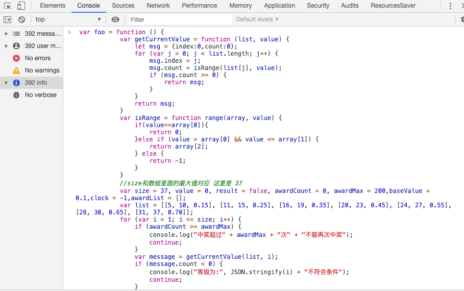
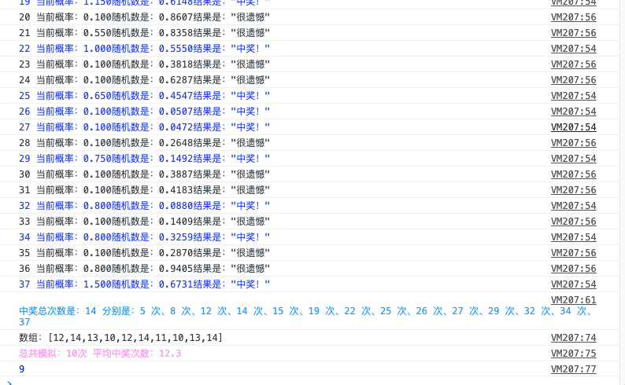

有同事想要写一个抽奖的算法，找我帮忙写个算法展示给其他人看，最好是可以脱离编辑器的，首先，我就想到了用Chome的console 面板运行JavaScript，于是就写了一段代码实现了这个抽奖，其中包括模拟多少级，平均中奖次数，已经最多可以中奖多少次。下面就把源码贴出，做个留念。
<!--more-->

### 需求

用户在每个等级有一次抽奖机会，初始概率是10%，如果当前等级抽奖没有抽中，则下次抽奖概率加上一个等级区间的的增量（这里是15%，25%，35%.....），如果本次中奖，则重新设置成初始的中奖概率，一个用户整个成长期有个总共中奖的上限，中奖次数达到上限后，不能再次中奖，这里我设置了200，是远远超过的，相当于没有限制，可以设置这个数，限制中奖次数。

### 具体步骤

- 代码实现

其实算法不难，急速先用闭包实现一个timer（以免模拟次数很大的时候，程序卡死），然后设置一些常量 运行函数。话不多说，Show  The Code！

```javascript
 var foo = function () {
            var getCurrentValue = function (list, value) {
                let msg = {index:0,count:0};
                for (var j = 0; j < list.length; j++) {
                    msg.index = j;
                    msg.count = isRange(list[j], value);
                    if (msg.count >= 0) {
                        return msg;
                    }
                }
                return msg;
            }
            var isRange = function range(array, value) {
                if(value==array[0]){
                    return 0;
                }else if (value > array[0] && value <= array[1]) {
                    return array[2];
                } else {
                    return -1;
                }
            }
            //size和数组里面的最大值对应 这里是 37
            var size = 37, value = 0, result = false, awardCount = 0, awardMax = 200,baseValue = 0.1,clock = -1,awardList = [];
            var list = [[5, 10, 0.15], [11, 15, 0.25], [16, 19, 0.35], [20, 23, 0.45], [24, 27, 0.55], [28, 30, 0.65], [31, 37, 0.70]];
            for (var i = 1; i <= size; i++) {
                if (awardCount >= awardMax) {
                    console.log("中奖超过" + awardMax + "次" + "不能再次中奖");
                    continue;
                }
                var message = getCurrentValue(list, i);
                if (message.count < 0) {
                    console.log("等级为:", JSON.stringify(i) + "不符合条件");
                    continue;
                }
                if(clock!=message.index){
                    clock = message.index;
                    value = baseValue;
                }
                if(result){
                    value = baseValue;
                }else {
                    value += message.count;
                }
                var randomValue = Math.random();
                if (randomValue <= value) {
                    result = true;
                    awardCount++;
                    awardList.push(i)
                } else {
                    result = false;
                }
                let output = i+" "+"当前概率：" + value.toFixed(3) + "随机数是：" + randomValue.toFixed(4) + "结果是：" + JSON.stringify(result ? "中奖！" : "很遗憾");
                if(result){
                    console.log("%c"+output,'color:#0033ee;');
                }else {
                    console.log(output);
                }

            }
            var lastStr = awardList.join(" 次、");
            console.log("%c中奖总次数是："+awardList.length+" 分别是："+lastStr,'color:#0099ee;');
            return awardList.length;
        }
        var totalList = [],totalCount = 10;//模拟总次数
        function test() {
            for (var n = 0; n < totalCount; n++) {
                (function (j) {//闭包
                    setTimeout(function () {
                        var res = foo();
                        totalList.push(res);
                        if(totalCount-1 == j){
                            var sum = totalList.reduce((previous, current) => current += previous);
                            var avg =   sum / totalList.length;
                            console.log("数组："+JSON.stringify(totalList));
                            console.log("%c总共模拟："+n+"次 平均中奖次数："+avg,'color:#ff99ee;');
                        }
                        console.log(j);//分别输出i的值
                    }, n*100)
                })(n);//闭包
            }

        }
        test();//启动代码函数
```

- 打开Chome 黏贴代码



- 点击Enter 键 运行 代码 查看输出



此处我模拟了十轮，输出每次 概率 和最后的中奖次数，和平均中奖概率，其中有意思的是 设计到了两个知识点，一个是闭包，一个是怎么用数组求平均数。

闭包代码：

```javascript
function test(){
	for (var i = 0; i < 10; i++) {
	// setTimeout(function(){
		console.log(i);//分别输出i的值
	// },2000)			
	}	
};
test();
```

求平均数：

```javascript
let values = [2, 56, 3, 41, 0, 4, 100, 23];
let sum = values.reduce((previous, current) => current += previous);
let avg = sum / values.length;
// avg = 28
```

### 参考

- [数组平均值与中值](https://www.jstips.co/zh_cn/javascript/array-average-and-median/)
- [用setTimeout实现for循环中的计时器](https://miss-me.github.io/2018/09/01/%E7%94%A8setTimeout%E5%AE%9E%E7%8E%B0for%E5%BE%AA%E7%8E%AF%E4%B8%AD%E7%9A%84%E8%AE%A1%E6%97%B6%E5%99%A8/)