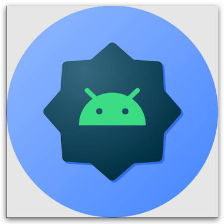

Android O 引入了**“自适应桌面图标”**，能在不同的设备型号上显示不同的图标形状。比如同一个桌面图标在一家 OEM 厂商的设备上显示为圆形，在另一家则可以显示为方形。各个 OEM 厂商可提供一个标准形状，交给系统将所有应用的自适应图标渲染为相同形状。新的桌面图标还将应用在快捷方式、“设置”应用、分享对话框等地方。
<!--more-->

## 介绍

### 为什么要进行应用图标适配？

可能有些朋友觉得困惑，应用图标这种东西从Android远古时代就已经有了，而且功能格外的简单，就是放张图片而已，这有什么好适配的呢？但实际上，在当前Android环境下，应用图标功能是极其混乱的。因此，在2007年一代iPhone诞生的时候，所有应用程序的图标都毫不出乎意料地使用了圆角矩形图标，即使是第三方应用也被强制要求使用圆角矩形图标，并且这一规则一直延续到了今天。相反，Android系统在设计的时候就不喜欢苹果这样的封闭与强制，而是选择了自由与开放，对应用图标的形状不做任何强制要求，开发者们可以自由进行选择，在Android上，应用图标可以是方形、圆形、圆角矩形、或者是其他任意不规则图形。

本来就是两家公司不同的设计理念，也说不上孰高孰低。但由于Android操作系统是开源的，国内一些手机厂商在定制操作系统的时候就把这一特性给改了。比如小米手机，就选择了向苹果靠拢，强制要求应用图标圆角化。如果某些应用的图标不是圆角矩形的呢？小米系统会自动给它加上一个圆角的效果

### 8.0系统的应用图标适配

这个问题对于Google来说还是挺难解决的。因为Google一直在强调自由与开放，那么小米强制要求所有应用图标都必须圆角化也是人家的自由呀，你不准人家这么干是不是本身就违背了自由和开放的理念呢？当然我们在这里讨论这个，有点像讨论先有鸡还是先有蛋的感觉，不过Google还是想出了一套完美的解决方案。

从Android 8.0系统开始，应用程序的图标被分为了两层：前景层和背景层。也就是说，我们在设计应用图标的时候，需要将前景和背景部分分离，前景用来展示应用图标的Logo，背景用来衬托应用图标的Logo。需要注意的是，背景层在设计的时候只允许定义颜色和纹理，但是不能定义形状。

那么应用图标的形状由谁来定义呢？Google将这个权利就交给手机厂商了。不是有些手机厂商喜欢学习苹果的圆角图标吗？没问题，由于应用图标的设计分为了两层，手机厂商只需要在这两层之上再盖上一层mask，这个mask可以是圆角矩形、圆形或者是方形等等，视具体手机厂商而定，就可以瞬间让手机上的所有应用图标都变成相同的规范。原理示意图如下：


### 一定要适配吗？

有些朋友可能会觉得这种分成两层的应用图标设计太过于麻烦，不适配可以吗？也有些朋友可能会说，自己的APP并没有做过应用图标适配，在Android 8.0手机上也照样跑得好好的。

事实上，这个新功能Google是准备让它慢慢过渡的，而不是一次性就强推给所有的开发者。如果你的APP中的targetSdkVersion是低于26的，那么就可以不用进行应用图标适配，Android 8.0系统仍然是向下兼容的。但是如果你将targetSdkVersion指定到了26或者更高，那么Android系统就会认为你的APP已经做好了8.0系统的适配工作，当然包括了应用图标的适配。

如果你将targetSdkVersion指定到了26，但是却没有进行Android 8.0系统的应用图标适配，那么会出现什么样的效果呢？这里我举几个反面示例：


### 官方相关文档

自适应图标：https://developer.android.com/develop/ui/views/launch/icon_design_adaptive?hl=zh-cn

在以前的 Android 版本中，桌面图标大小定义为 48 x 48 dp。从 Android 13（API 级别 33）开始，用户可以设置主题 自适应图标。如果用户通过打开 系统设置中的**带主题的图标**切换开关，启动器支持此功能 功能时，系统会使用用户所选壁纸的颜色，并 主题来确定色调颜色。设计自适应图标：为确保自适应图标支持不同的形状、视觉效果和 用户主题设置，则设计必须符合以下要求：


- 两张图层大小都必须为 **108 x 108 dp**。
- 使用尺寸至少为 48x48 dp 的徽标。尺寸不得超过 66x66dp， 因为图标的内部 66x66 dp 显示在遮罩内 视口。

层四条边外侧的 18dp 分别是 以及创建视差或脉冲等视觉效果。




## CocosCreator适配图标

### Cocos构建安卓项目

我们这里的项目是使用Cocos Creator生成的，那么如何适配呢？

我们发现长这样：


### 配置文件 mipmap-anydpi-v26

此时我们需要添加一个新目录：mipmap-anydpi-v26


ic_launcher_round.xml 内容如下：

```xml
<?xml version="1.0" encoding="utf-8"?>
<adaptive-icon xmlns:android="http://schemas.android.com/apk/res/android">
    <background android:drawable="@color/ic_launcher_background"/>
    <foreground android:drawable="@mipmap/ic_launcher_foreground"/>
</adaptive-icon>
```

ic_launcher.xml 内容如下：

```xml
<?xml version="1.0" encoding="utf-8"?>
<adaptive-icon xmlns:android="http://schemas.android.com/apk/res/android">
    <background android:drawable="@color/ic_launcher_background"/>
    <foreground android:drawable="@mipmap/ic_launcher_foreground"/>
</adaptive-icon>
```

### 使用图标生成工具

AndroidStudio生成图标，经试验，AS 的 Image Asset 生成的图标主要保存在以下5个文件夹中，每个文件夹下都保存着名称为 ic_launcher.png（圆角方形）、ic_launcher_round.png（圆形）两个图标，各文件夹下的图标尺寸分别为：
mipmap-mdpi: 48X48
mipmap-hdpi: 72X72
mipmap-xhdpi: 96X96
mipmap-xxhdpi: 144X144
mipmap-xxxhdpi: 192X192
对于很多对美术不是很熟悉的朋友，肯定觉得制作起来比较麻烦，于是想到聊第三方在线制作，这些网站生成和AndroidStudio生成的效果几乎没有差别，能够生成在线图标网址如下:

https://romannurik.github.io/AndroidAssetStudio/
https://makeappicon.com/
http://iconion.com/

我这里选择第二个：https://makeappicon.com/


```
.
├── mipmap-hdpi
│   ├── ic_launcher.png
│   ├── ic_launcher_foreground.png
│   └── ic_launcher_round.png
├── mipmap-mdpi
│   ├── ic_launcher.png
│   ├── ic_launcher_foreground.png
│   └── ic_launcher_round.png
├── mipmap-xhdpi
│   ├── ic_launcher.png
│   ├── ic_launcher_foreground.png
│   └── ic_launcher_round.png
├── mipmap-xxhdpi
│   ├── ic_launcher.png
│   ├── ic_launcher_foreground.png
│   └── ic_launcher_round.png
├── mipmap-xxxhdpi
│   ├── ic_launcher.png
│   ├── ic_launcher_foreground.png
│   └── ic_launcher_round.png
└── playstore-icon.png

6 directories, 16 files
```

修改AndroidManifest.xml文件，代码如下所示：

```xml
<manifest xmlns:android="http://schemas.android.com/apk/res/android"
    package="com.example.icontest">

    <application
        android:allowBackup="true"
        android:icon="@mipmap/ic_launcher"
        android:label="@string/app_name"
        android:roundIcon="@mipmap/ic_launcher_round"
        android:supportsRtl="true"
        android:theme="@style/AppTheme">
        <activity android:name=".MainActivity">
            <intent-filter>
                <action android:name="android.intent.action.MAIN" />
                <category android:name="android.intent.category.LAUNCHER" />
            </intent-filter>
        </activity>
    </application>

</manifest>
```


## 参考

- [Android 8.0 系统应用图标适配](https://objectville.github.io/2018/05/16/Android-8-0-%E7%B3%BB%E7%BB%9F%E5%BA%94%E7%94%A8%E5%9B%BE%E6%A0%87%E9%80%82%E9%85%8D/)
- [Android应用图标微技巧，8.0系统中应用图标的适配](https://blog.csdn.net/guolin_blog/article/details/79417483)
- [Android生成app应用图标（转）](https://www.cnblogs.com/c2soft/articles/16038114.html)
- [一键生成所有尺寸的应用图标](https://icon.wuruihong.com/)