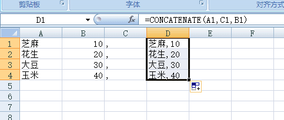
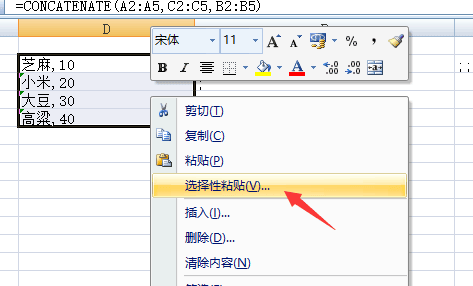
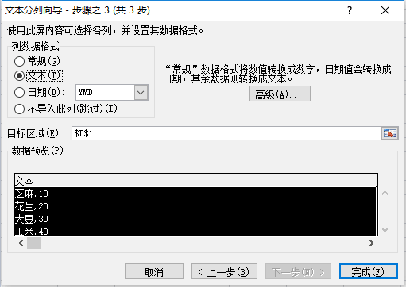
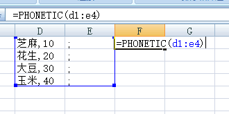
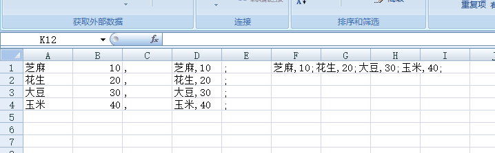

以前做技术的时候，配置表用过XMl用过MySQL数据，现在做小游戏了，很多时候使用JSON格式作为配置文件还是很方便的，但是对于策划同学来讲使用JSON 就必须先用EXCEL 转换一下，前几天遇到了一个问题，我们游戏内程序最可能需要的是类似100,20;300,50;600,60 这样的数据，但是策划同学对于怎么把多列数据做成这样的格式有点为难，于是我上网搜索出了这样的教程，今天记下来，方便以后查阅。

<!-- more -->

### 两列合并成一列

1. 选择D1单元格，`=CONCATENATE(A1,C1,B1)`输入按回车。D1的内容显示为A1和C1和B1合并后的内容。
   

2. 选择D1单元格，点击并拖动光标向下填充公式至D4单元格。填充后，如下图所示

3. 把函数公式的答案改成 数值 文本格式

4. 选择 选择性粘贴

选择 数值格式，这样就可以了

### 一列改成一个单元格

1. 添加一个辅助列

2. PHONETIC函数不能用于数字的合并，会把数字和吞吃掉的，所以如果用上面的数据来做的话，你要先分列，将数字转换成文本，再用PHONETIC函数合并，所以我们要转换一下
3. 第一步选择数据下面的 分列

然后 开始分列我们 的D列

4. 连续两个下一步 后 选择文本格式

   

   5. 然后用我们的函数 =PHONETIC(D1:E4) 回车搞定

      

      

   6. 最后效果如下图

      

   

   ### 总结

   总的来说里面的细节还是很多的，不过学习之后还是很开心的。

   