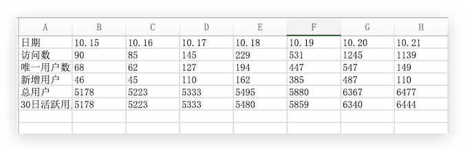
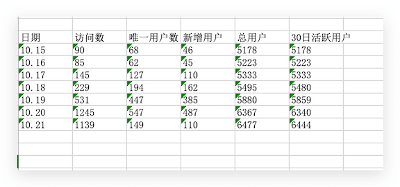
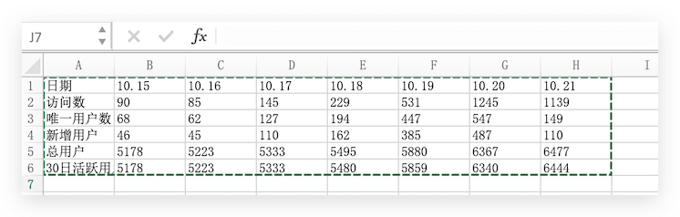
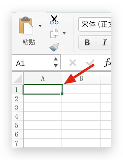
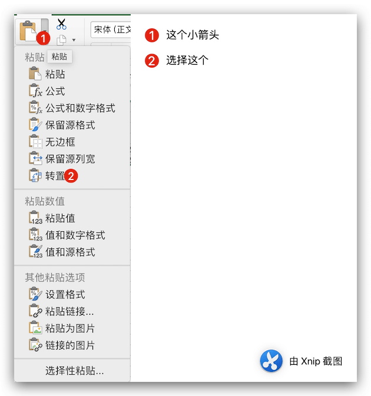
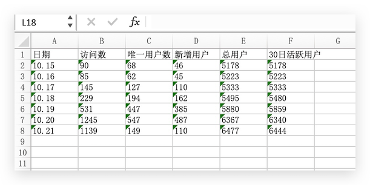

如果一个要旋转的列中的数据的工作表，使其按行重新排列，您可以使用 TRANSPOSE 功能。 它允许您旋转到行的列中的数据，反之亦然。
<!--more-->

### 效果图

例如，如果您的数据的外观如下所示：

可以旋转，例如：

### 具体步骤

- 选择要重新排列的数据区域，包括任何行或列标签，然后在“**开始**”选项卡上选择“**复制**”  ，或按 CONTROL + C。

  

  **注意:** 确保复制的数据执行此操作。使用“**剪切**”命令或按 CONTROL+X 将不起作用。

- 选择要在其中粘贴数据的第一个单元格，在“**开始**”选项卡上单击“**粘贴**”旁边的箭头，然后单击“**转置**”。

​     **具有足够的空间以粘贴数据的工作表中选择一个位置。 您复制的数据将覆盖已存在的任何数据。**

- 旋转成功的数据之后，您可以 删除 原始数据。

以上： 全部搞定，如果列变换成行，反之亦然。