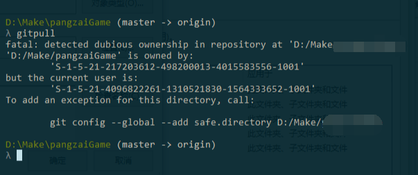
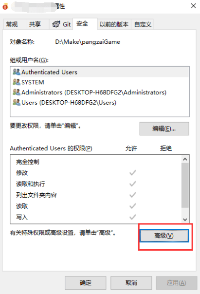
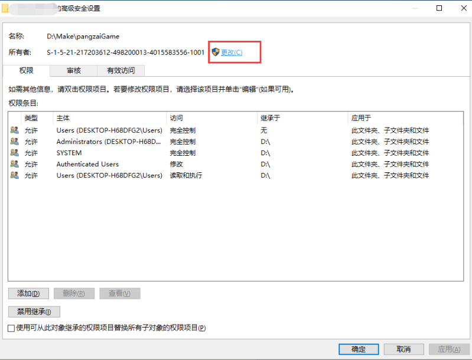
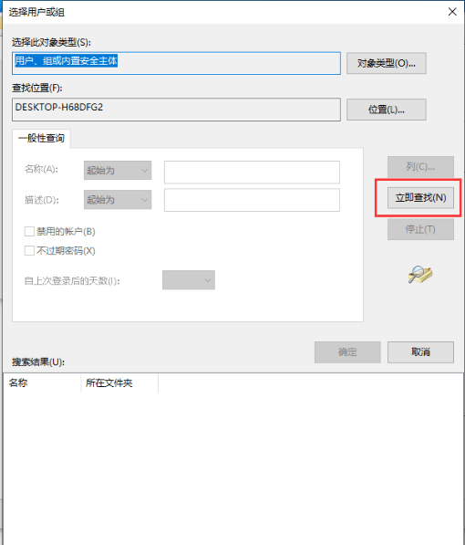
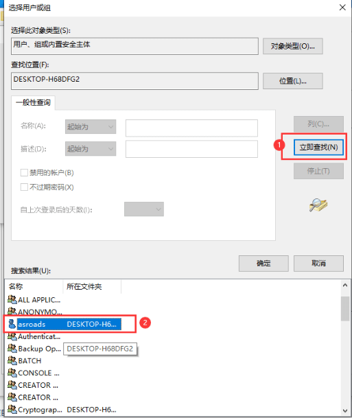

前几天趁着春节期间，把电脑系统重装了一下，重装电脑前`git`工作项目本地有没有提交到远程的资源，结果重装后使用git的时候报错`fatal: detected dubious ownership in repository`无法正常提交和更新，于是网上找了一下找到了解决方案，下面记录一下，日后遇到问题方便查阅
<!--more-->

## 问题

首先看一下报错日志：

```bash
fatal: detected dubious ownership in repository at 'D:/Make/demoxxxxxxx'
'D:/Make/pangzaiGame' is owned by:
        'S-1-5-21-217203612-498200013-4015583556-1001'
but the current user is:
        'S-1-5-21-4096822261-1310521830-1564333652-1001'
To add an exception for this directory, call:

        git config --global --add safe.directory D:/Make/demoxxxxxxx
```



## 解决方案

### 临时解决方法

临时的解决方法就是按照提示， 在 `git bash` 中输入`git config --global --add safe.directory D:/Make/demoxxxxxxx`，但是这只能解决当前的 git 仓库，其他的git 仓库，都要这么做，并且 `git config -l`，会发现一大串的这些操作，看着很不爽

### 其他解决方法

其实这个是`git` 仓库 用户名问题，如之前是 `Administrator`，现在改为了 `admin`，之前的目录所有者需要改为现在的用户，所以解决这种问题的根本方法就是【更改`git` 仓库文件夹的所有者】，改为当前的`windows` 登录的用户

#### 操作步骤

1. 选择 `git` 仓库的文件夹，如果这个文件夹下全是`git` 仓库，可以选择整个文件夹，鼠标右键【属性】 【安全】【高级】

   

2. 所有者与当前的`windows`登录的账号不一样，【更改】



3. 选择【高级】通过【立即查找】，找到当前登录的账号

   

   



4. 选择当前的账号



5. 选择当前账号后，点击【确定】


6. 点击【确定】后，目录文件较多，会操作一会 子文件夹等一起更改


7. 更改 `git` 仓库 文件夹的所有者为当前账号，`git` 的操作正常