游戏开发中，字体是很重要的一个展现方式，好的字体总是能做到锦上添花的效果，位图字体是一种常用的解决方案，常用的位图字体设计工具有[Hiero](https://github.com/libgdx/libgdx/wiki/Hiero)、[shoebox](http://renderhjs.net/shoebox/)、[littera](http://kvazars.com/littera/)、[Bitmap Font Generator](http://www.angelcode.com/products/bmfont/)、[Glyph Designer](https://www.71squared.com/en/glyphdesigner)，我们今天说说[Glyph Designer](https://www.71squared.com/en/glyphdesigner) 怎么开发字体。

<!-- more -->

 ### 知识背景

- [Bitmap Font Generator - Documentation](http://www.angelcode.com/products/bmfont/documentation.html)
- [Glyph Designer](https://www.71squared.com/en/glyphdesigner)

### 开发步骤

1. 首先我们需要下载 Glyph Designer  然后打开软件

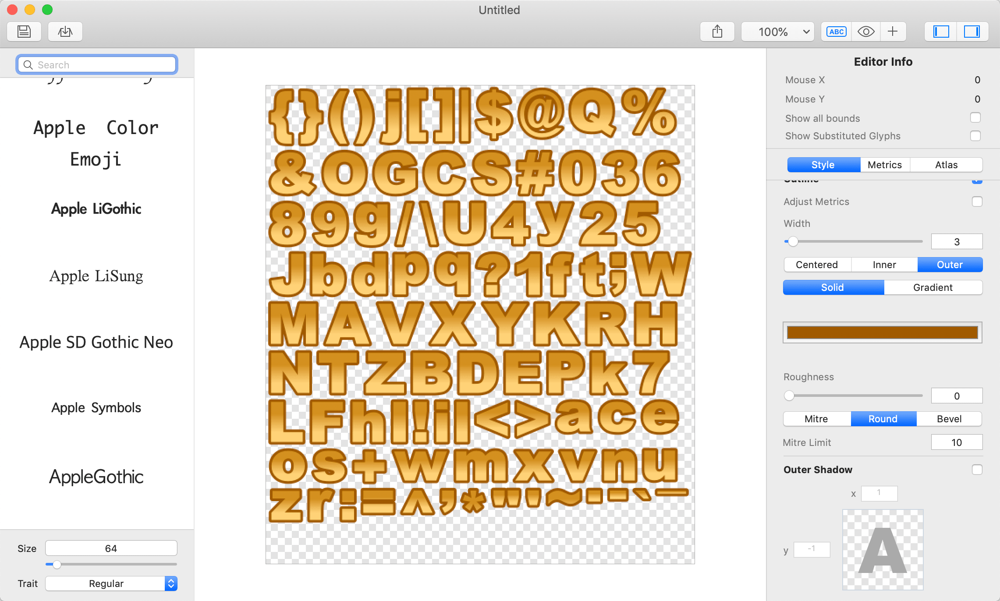

2. 开始看里面各项的参数，比如 字号 颜色等，我们接下来说如何加载自己自定义的字体，先去网上下载一个字体，比如我们的是 FZQiTi-S14S.TTF ，华康勘亭流W9.TTF这个放到桌面上。

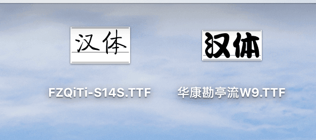

3. 我们选择菜单下面的 load font  然后选择我们 存放字体的位置，比如 我的在桌面

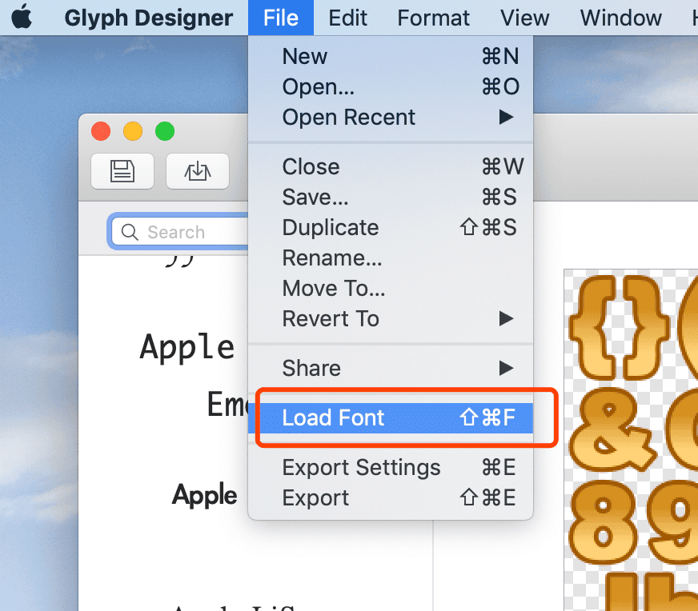

4. 稍等几秒，然后就可以看到我们字体被加载成功

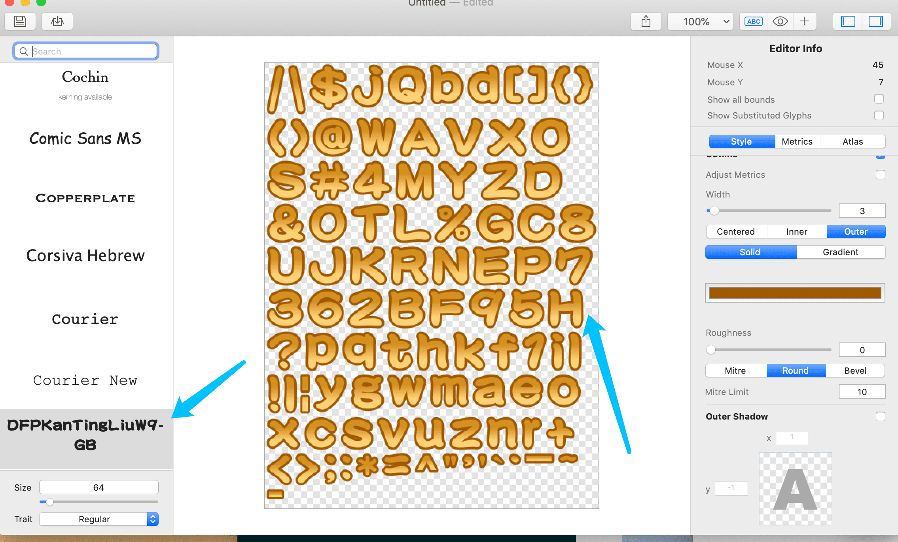

5. 我们点击 上面的+号 

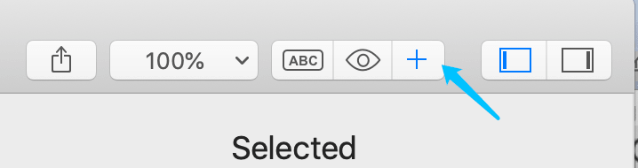

6. 可以使用这三个选项 添加和 取消我们的字体 内容

   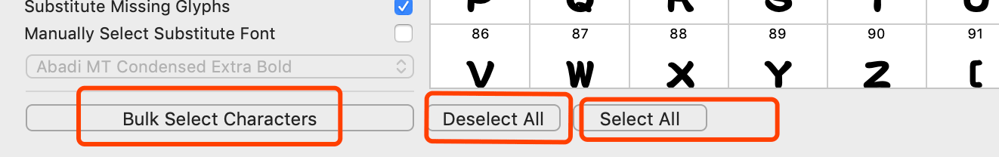

7. 比如我想用 `最高成绩0123456789`作为内容那么就是

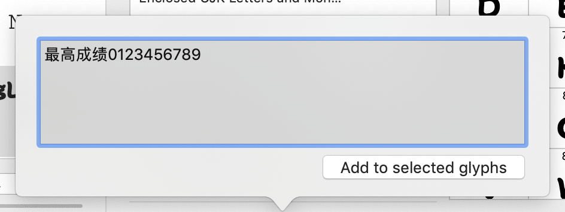

8. 回到主界面 我们看到已经生效

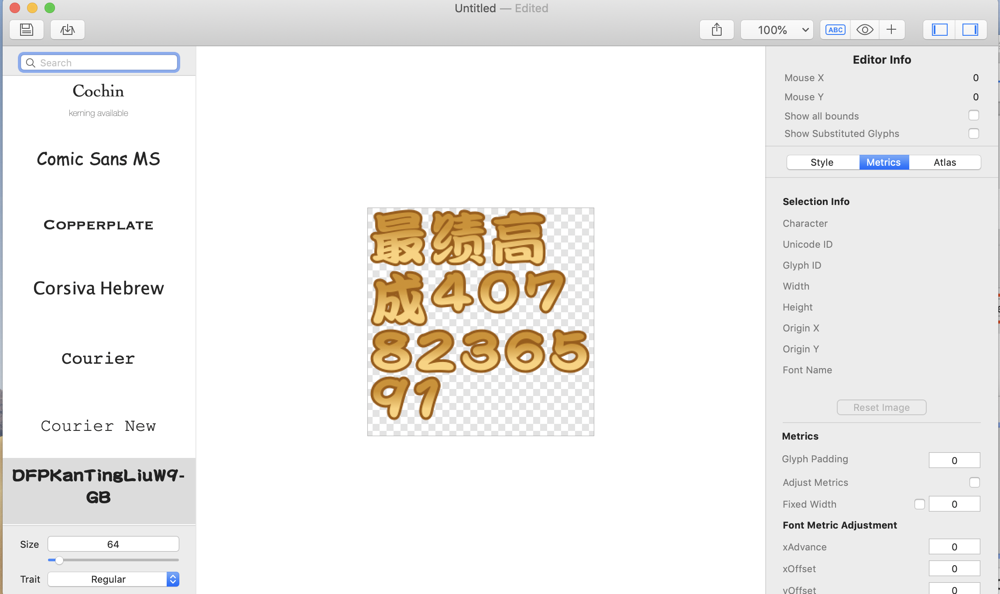

9. 此时我们可以保存我们的项目，方便以后修改编辑打开

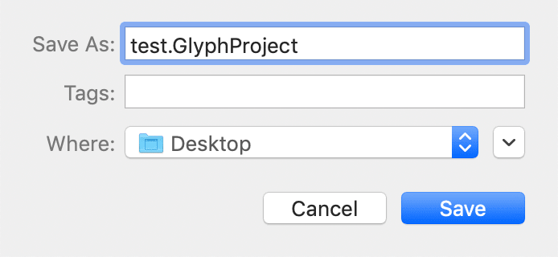

10. 我们打开菜单下面的 输出设置 

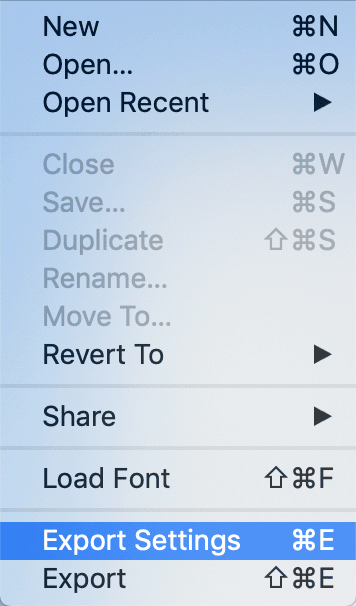

11. 设置我们输出的格式，输出大小，输出名字

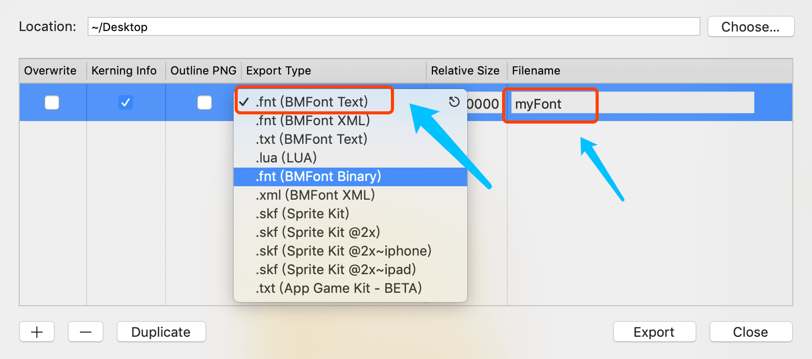

12. 最后我们选择输出我们的字体

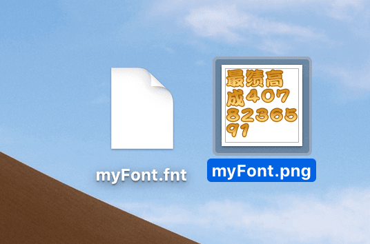

**以上已经完成位图的制作**

### 可能用到的工具 

- [文本去重工具](https://www.qqxiuzi.cn/zh/quchong/)