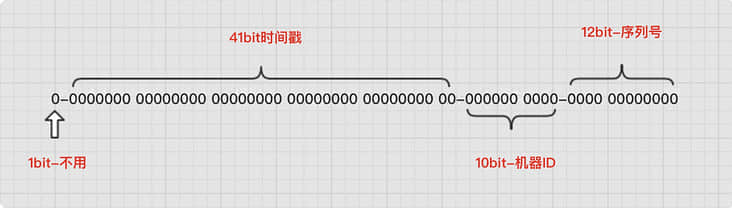

生成唯一性ID是几乎在每个系统中都会有的场景，对其生成算法不仅要保证全局唯一性、趋势递增性，还要保证信息安全，要保证算法的高可用性。这就对ID生成的算法有一定的要求，那如何生成这个唯一的 ID 呢，下面说说自己这些天了解的一些知识，做了一个简单梳理，供后续功能用到的时候，上车比较快。
<!--more-->
先说说几种常见的做法：

## 数据库自增

最简单，使用最广泛的场景：单表设置一个自增 ID，很多情况下的数据查询、获取都是通过该方式。比如从1000开始一个个递增即可，如果需要带上时间，可以考虑用浮点型数据，比如：

1024.1646188137234  --- 1024 表示唯一id 1646188137234 表示时间戳 毫秒 

当然，我们还可以加入其他元素，比如性别等。缺点很明显，单表数据越来越大， 后期分库分表会存在压力，拓展能力差。

## UUID

UUID是指在一台机器上生成的数字，它保证对在同一时空中的所有机器都是唯一的。UUID（Universally Unique Identifier, 通用唯一识别码，也叫GUID（Globally Unique IDentifier，全局唯一识别码）。在互联网工程任务组发布的[RFC4122](https://link.segmentfault.com/?enc=Q1hN8nv6MB%2BsSU9fWL%2BizA%3D%3D.kwv1%2FoSESq9YS830uqcGkBMq%2FbnSJdi%2F4w6pwd9FqqR04RvAEevPhEcmFST54ylx)文档中介绍，UUID是一种不需要中央机构分配而产生唯一标识符的方式在时间和空间上保持其唯一性。UUID是由128位的二进制数据组成，通常使用32位的十六进制数据表示，并使用连字符连接。其表示格式为8-4-4-4-12。

```basic
示例：b6489592-4726-4d68-a52b-63e2bbddfbf3
1~8位采用系统时间，在系统时间上精确到毫秒级保证时间上的惟一性；
9~16位采用底层的IP地址，在服务器集群中的惟一性；
17~24位采用当前对象的HashCode值，在一个内部对象上的惟一性；
25~32位采用调用方法的一个随机数，在一个对象内的毫秒级的惟一性。复制代码
```

缺点也很明显 生成的结果串会比较长。

## 雪花算法（snowflake）

> SnowFlake算法是Twitter开源的分布式ID生成算法。核心思想就是：使用一个64 bit的 long 型的数字作为全局唯一ID。算法中还引入了时间戳，基本上保证了自增特性。
>
> 最初的版本的雪花算法是基于scala写的，当然，不同的编程语言都可以根据其算法逻辑进行实现。
>
> 
>
> **算法解析**：
>
> - 第一个部分：1个bit，无意义，固定为0。二进制中最高位是符号位，1表示负数，0表示正数。ID都是正整数，所以固定为0。
> - 第二个部分：41个bit，表示时间戳，精确到毫秒，可以使用69年。时间戳带有自增属性。
> - 第三个部分：10个bit，表示10位的机器标识，最多支持1024个节点。此部分也可拆分成5位datacenterId和5位workerId，datacenterId表示机房ID，workerId表示机器ID。
> - 第四部分：12个bit，表示序列化，即一些列的自增ID，可以支持同一节点同一毫秒生成最多4095个ID序号。
>
> 由于在Java中64bit的整数是long类型，所以在Java中SnowFlake算法生成的id就是long来存储的。
>
> 使用雪花算法时，由于生成的ID是64位，在传递给前端时，需要考虑以字符串的类型进行传递，否则可能会导致前端类型溢出，再回传到服务器时已经变成另外一个值。
>
> 这是因为Number类型的ID在JS中最大只支持53位，直接将雪花算法的生成的ID传递给JS，会导致溢出。

**优势：**

1、可以按照时间趋势递增

2、中间的机器位可以配合业务灵活的分配到其它位上，也可以借用其它区块的bit位

3、分布式系统内不会存在相同的两个id，因为有datacenterId、workerId来保证

**缺点：**

1、单机器出现时钟回拨，可能会出现 ID 冲撞。如何解决？可利用拓展位进行回拨记录。

## ULID

[ULID](https://link.segmentfault.com/?enc=qDEfnZ19KCKTsgOGe6Ze7Q%3D%3D.1cXk4BaChCz9%2B7xrL%2Fzcd4tAHrOTO2HS2IQyWIyedGRJVP3iFW9EcseKNXSeCvq3) 代表通用唯一按字母顺序排序的标识符。它每周有超过 271K 的 NPM 下载和 1.9K 的 GitHub Stars。

**优势：**

同时使用时间戳和随机性

ULID 可以排序，UILD 是按字典顺序排序的

随机数的高安全性

ULID 支持近 50 种语言，包括 JavaScript、Java、C++、Dart、Python 和 .NET。

**缺点：**

根据 StackOverflow 中的许多人的见解，使用 ULID 没有明显的缺点或限制。

使用方法：

```typescript
import {ulid } from "../libs/ulid";
let id = ulid();
console.log("id:" + JSON.stringify(id));
//id:"01FX48CF3983HGJGSP94Z0C1FW"
```

ULID 允许创建一系列值不断增加的 ID。您需要做的就是使用 `monotonicFactory` 创建一个 `ulid` 对象并传递相同的时间种子。

```typescript
import { monotonicFactory } from "../libs/ulid";
 for (let i = 0; i < 5; i++) {
       let itel = ulidFactory();
       console.log("itel:" + JSON.stringify(itel));
}
//itel:"01FX48CF39V1V9GKSNG95EZ4TN"
//itel:"01FX48CF39V1V9GKSNG95EZ4TP"
//itel:"01FX48CF39V1V9GKSNG95EZ4TQ"
//itel:"01FX48CF39V1V9GKSNG95EZ4TR"
//itel:"01FX48CF39V1V9GKSNG95EZ4TS"
```

## 参考

- [ID生成器 & 雪花算法](https://juejin.cn/post/6844904153894879239)
- [ULID 与 UUID：用于 JavaScript 的可排序随机 ID 生成器](https://segmentfault.com/a/1190000041439197)
- [用户UID的几种生成方案](https://segmentfault.com/a/1190000023588832)
- [雪花算法：分布式唯一ID生成利器](https://segmentfault.com/a/1190000041445831)

## 总结

对于自己产品用户的量级有个相对的估量，关注业务对于UID的依赖的需求，使用随机成产-普通查重模式，选择合适的方案。基本上可以解决大部分的业务需求。