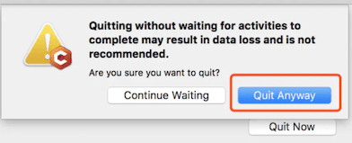
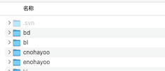
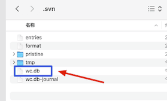

自从用了Mac下的SVN GUI软件就从来没有一款软件可以和windows下的[TortoiseSVN](https://tortoisesvn.net/downloads.zh.html)好用，但是没办法只能选择相对来讲比较好用的软件，Cornerstone这个软件就成了Mac下的[TortoiseSVN](https://tortoisesvn.net/downloads.zh.html)的替代品，但是有时候遇到一些棘手的问题，操作起来还是很不方便，比如遇到clean 命令操作失败，此时我们发现在根目录执行命令也无效的时候该怎么办，下面就说说这个问题的解决办法。
<!--more-->

## 报错原因

这些错误一般是因为我们操作失误或者软件崩溃引起的，以前都是把这个目录删掉，重新更新，再次导出项目，很麻烦的操作，下面就采用一种比较推荐的简单的方法。

## 报错现象



这个点击后，发现很多命令都无法操作了，无论是更新，还原 提交都会报错。

### 尝试方法一：

mac 终端键入 svn “清理”命令的方式

```bash
svn cleanup
```

发现依旧不能使用：

```
svn: E155037: Cleanup with an older 1.7 client before upgrading with this client
svn: E155037: Previous operation has not finished; run 'cleanup' if it was interrupted
```

大概意思是：

```
svn: E155037: 在升级客户端之前，使用早期 1.7 版本的客户端进行了清理操作
svn: E155037: 之前的操作尚未结束；如果之前的操作是意外中断，运行 'cleanup' 命令
```

此时这个方法放弃。

### 尝试方法二

工作拷贝的根目录下有一个 .svn 文件夹，里面有一个 wc.db 文件，如下图：





如果我们要修改wc.db 文件，您需要一个 [SQLite](https://links.jianshu.com/go?to=https%3A%2F%2Fwww.sqlite.org%2Findex.html) 软件。如果您使用 macOS，那么系统本身已经帮您预安装了，可直接使用；如果您使用 Windows 操作系统，那么需要先下载适合您系统的安装包，然后安装此软件，官方下载地址是：[https://www.sqlite.org/download.html](https://links.jianshu.com/go?to=https%3A%2F%2Fwww.sqlite.org%2Fdownload.html)

#### 首先进入我们的工作拷贝目录

```bash
cd /Users/smile/work/CDN/railway
```

#### 键入下面的命令并执行，查找未完成的记录：

```bash
sqlite3 .svn/wc.db "select * from work_queue"
```

我这边输出内容如下 ，这个自己操作会有不同的显示

```
84635|(file-commit wx/2.0.44/remote/resources/native/04/04b376a7-5b38-49c6-bea3-08278d142ad8.bad96.png)
84636|(file-commit wx/2.0.44/remote/resources/native/31/31d49fc0-df50-44b4-8152-eb4616d97986.75d47.png)
84637|(file-commit wx/2.0.44/remote/resources/native/40/4003a843-8fec-46f9-8a27-fb450fa132c7.fc04f.png)
84638|(file-commit wx/2.0.44/remote/resources/native/71/71fdbb3c-1945-4da1-a54f-5041c87ede06.9db4c.png)
84639|(file-commit wx/2.0.44/remote/resources/native/76/76596bba-e271-40e8-a0aa-d89cbcd296d7.4fee8.png)
84640|(file-commit wx/2.0.44/remote/resources/native/b6/b6ef2b54-cbea-4ec2-8e5d-a7e0f44ce657.714c6.png)
84641|(file-commit wx/2.0.44/remote/resources/native/d9/d9d425ed-0906-47f3-b50c-b360c53ca04f.b1e51.png)
```

#### 键入下面的命令并执行，删除未完成的记录：

```bash
sqlite3 .svn/wc.db "delete from work_queue"
```

如果一切顺利，mac 终端什么都不会输出，心安理得。此时回到 Cornerstone ，已经允许您对工作拷贝执行“更新”、“提交”、“解决冲突”、“清理”等操作了。

**PS:建议先对SVN工作项目根目录进行 clean 命令。我这边如果先还原和更新依旧不能操作。**

## 参考链接

- [macOS 中 Cornerstone 的"Clean"操作和终端的"svn cleanup"命令无效了怎么办-简书](https://www.jianshu.com/p/b7faf41d89a3)
- [Cornerstone SVN: The working copy is locked due to a previous error](https://blog.csdn.net/lijuan3203/article/details/52033690)

