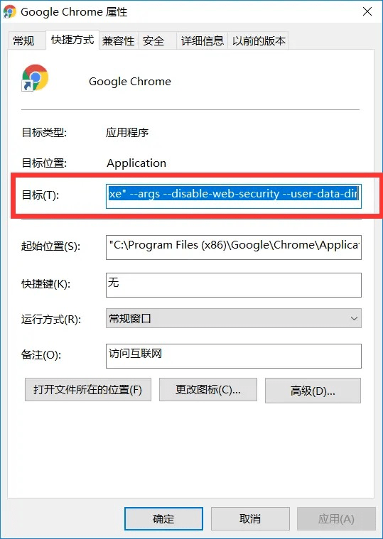

以前开发游戏的时候都是单机游戏呀，现在开发有服务器的游戏。调试的时候，就发现了跨域的问题。非安全模式要才可以，但是很网上给的例子，当时一试运行，每次都带打开命令有点麻烦。                                                                                                                                                                       

<!-- more -->

```bash
# Chrome < 48
open /Applications/Google\ Chrome.app --args -disable-web-security

# Chrom > 48
open -a Google\ Chrome --args --disable-web-security --user-data-dir
```

## webstorm  打开Chome 非安全模式

- 打开 webstorm

  

- 设置 如下 


内容是：

```
--args --disable-web-security --user-data-dir 
```

然后重启Chome  就搞定了


### 附上 windows 和Mac 简易 操作

#### windows

第一步：确保所有chrome浏览器都已经关闭
第二步：打开你的chrome浏览器（快捷方式）的属性窗口，再路径后面添加

```shell
--args --disable-web-security --user-data-dir
```

效果如下：

```
C:\Program Files (x86)\Google\Chrome\Application\chrome.exe" --args --disable-web-security --user-data-dir
```



第三步：打开浏览器，如果出现这个横幅，就说明非安全模式开启完成。


#### MAC 解除chrome安全模式

打开终端输入


```kotlin
open -a /Applications/Google\ Chrome.app --args --disable-web-security --user-data-dir
```

OK  输入地址即可 。

### Chome 插件

1. LocalStorage Manager

   https://chrome.google.com/webstore/detail/localstorage-manager/fkhoimdhngkiicbjobkinobjkoefhkap

2. Clear Cache

   https://chrome.google.com/webstore/detail/clear-cache/cppjkneekbjaeellbfkmgnhonkkjfpdn

3. octotree

   https://www.octotree.io/

4. GitZip for github

   https://chrome.google.com/webstore/detail/gitzip-for-github/ffabmkklhbepgcgfonabamgnfafbdlkn

### Chrome的插件扩展程序安装目录是什么？在哪个文件夹？

正常情况下，Chrome插件扩展程序的默认安装目录如下：

1. windows xp中chrome插件默认安装目录位置:  `C:\Documents and Settings\用户名\Local Settings\Application Data\Google\Chrome\User Data\Default\Extensions`

2. windows7中chrome插件默认安装目录位置:  `C:\Users\用户名\AppData\Local\Google\Chrome\User Data\Default\Extensions`

3. MAC中chrome插件默认安装目录位置：`~/Library/Application Support/Google/Chrome/Default/Extensions`

4. Ubuntu中chrome插件默认安装目录位置：      `~/.config/google-chrome/Default/Extensions`

#### 如果在这些不同操作系统中的chrome插件默认安装位置，没有找到插件。那么请通过下面的方式查看,如下图所示：

1. 地址栏输入chrome:version 回车

2. 用资源管理器打开"个人资料路径"栏的路径,该路径下的Extensions文件夹即默认的扩展安装路径

   

## 参考文章

- [Mac下开启Chrome非安全模式](https://github.com/callmelaoda/communicate/issues/8)
- [Mac上解决Chrome浏览器跨域问题](https://www.jianshu.com/p/2db73311fcbe)
- [WebStorm中配置浏览器方法](https://blog.csdn.net/fd214333890/article/details/39401677)
- [chrome 非安全模式解决开发跨域问题(windows与mas)](https://www.jianshu.com/p/935a37d9af8b)