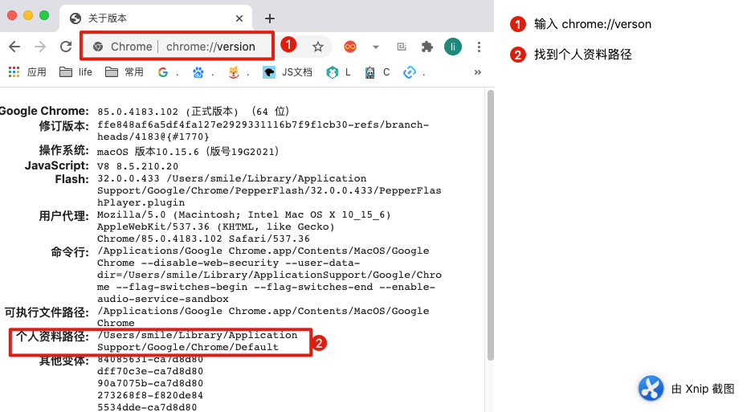
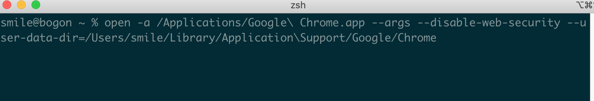
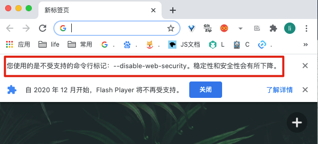
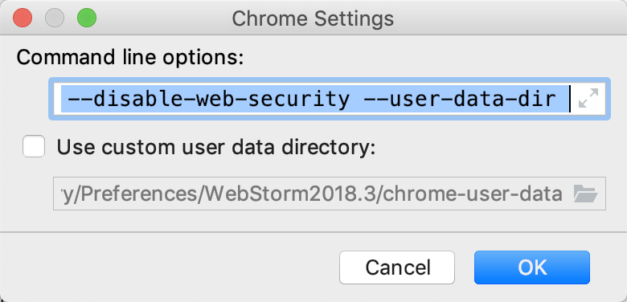
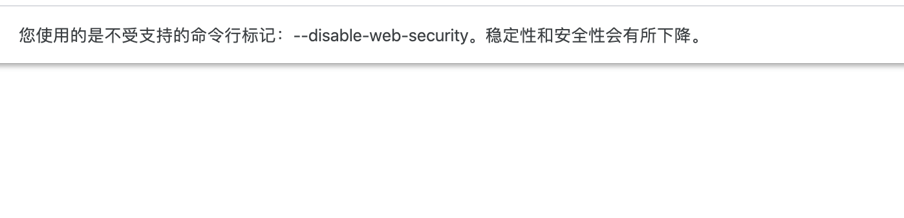
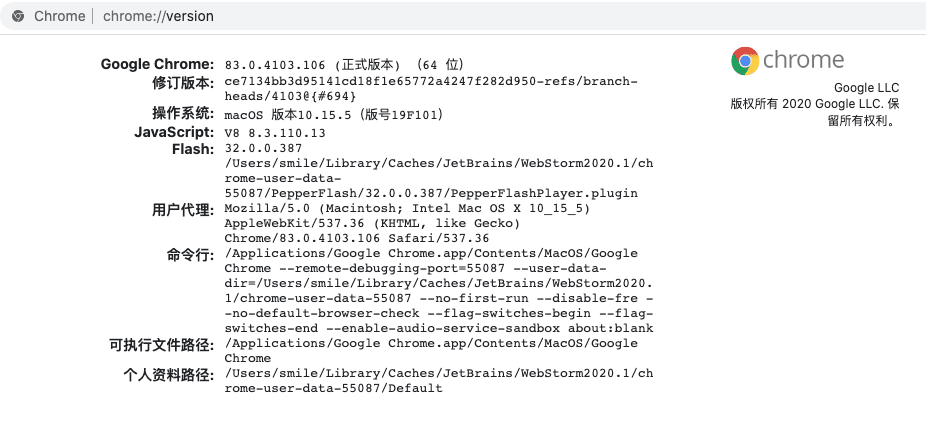

以前开发游戏的时候都是单机游戏呀，现在开发有服务器的游戏。调试的时候，就发现了跨域的问题。非安全模式要才可以，但是很网上给的例子，当时一试运行，每次都带打开命令有点麻烦。                                                                                                                                                                       

<!-- more -->

### Mac环境打开非安全模式

```bash
# Chrome < 48
open /Applications/Google\ Chrome.app --args -disable-web-security

# Chrom > 48
open -a Google\ Chrome --args --disable-web-security --user-data-dir
```


**2020年9月22更新:**

#### 后续更新步骤

1. 先打开我们的Chrome 输入：

```
chrome://version
```



找到个人路径:

```bash
/Users/smile/Library/Application Support/Google/Chrome/Default
```

简单修改一下：

```bash
/Users/smile/Library/Application\Support/Google/Chrome
```

最后组装一下：

```bash
open -a Google\ Chrome --args --disable-web-security --user-data-dir=/Users/smile/Library/Application\Support/Google/Chrome
```

其中 `smile` 是你 Mac电脑的名字 比如 `admin` 或者 xxx

输入 查看效果：



成功出现 非安全模式：




小插曲：

如果大家觉得 这样干扰了自己的Chrome 那么 可以这样

如果代码编辑器是 Webstorm  可以这样:

```bash
open -n /Applications/Google\ Chrome.app/ --args --disable-web-security --user-data-dir=/Users/smile/Library/Application Support/JetBrains/WebStorm2020.1/chrome-user-data
```

如果是 VSCode可以这样:

```bash
open -a /Applications/Google\ Chrome.app --args --disable-web-security --user-data-dir=/Users/smile/Library/Application\Support/Code/User/workspaceStorage/6085425d9b8abe60ebddec525bacfa5d/ms-vscode.js-debug/.profile
```

*里面的路径的信息 一定修改成自己电脑本地环境的真实路径！！*

**注意：一定要关闭所有的 Chrome 浏览器和Chome 再打开**

## webstorm  打开Chome 非安全模式

- 打开 webstorm

  

- 设置 如下 




内容是：

```bash
--args --disable-web-security --user-data-dir 
```

然后重启Chome  就搞定了

#### 2022-11-28 更新

1. 打开终端
2. 输入命令后，会自动打开可跨域浏览器

```bash
open -n /Applications/Google\ Chrome.app/ --args --disable-web-security --user-data-dir=/Users/XXX/MyChromeDevUserData
```

其中：`/Users/XXX/MyChromeDevUserData` 为跨域浏览器数据存储的地方，XXX为用户名，**根据实际修改**。

### 附上 Windows 和Mac 简易 操作

#### Windows

1. 克隆Chrome应用，重命名为 `【跨域】Google Chrome` 或任意一个容易识别的名字。


2. 右击打开属性，找到 `目标` 字段，并在目标字段后面加上参数：

```bash
--disable-web-security --user-data-dir=D:\ChromeData\MyChromeDevUserData
```

其中 `D:\ChromeData\MyChromeDevUserData` 为跨域浏览器数据存储的地方，可以根据需要修改。


```bash
"C:\Program Files\Google\Chrome\Application\chrome.exe" --disable-web-security --user-data-dir=D:\ChromeData\MyChromeDevUserData
```

第三步：打开浏览器，如果出现这个横幅，就说明非安全模式开启完成。



#### MAC 解除chrome安全模式

打开终端输入

```kotlin
open -a /Applications/Google\ Chrome.app --args --disable-web-security --user-data-dir
```

OK  输入地址即可 。

### Chome 插件

1. LocalStorage Manager

   https://chrome.google.com/webstore/detail/localstorage-manager/fkhoimdhngkiicbjobkinobjkoefhkap

2. Clear Cache

   https://chrome.google.com/webstore/detail/clear-cache/cppjkneekbjaeellbfkmgnhonkkjfpdn

3. octotree

   https://www.octotree.io/

4. GitZip for github

   https://chrome.google.com/webstore/detail/gitzip-for-github/ffabmkklhbepgcgfonabamgnfafbdlkn

### Chrome的插件扩展程序安装目录是什么？在哪个文件夹？

正常情况下，Chrome插件扩展程序的默认安装目录如下：

1. windows xp中chrome插件默认安装目录位置:  `C:\Documents and Settings\用户名\Local Settings\Application Data\Google\Chrome\User Data\Default\Extensions`

2. windows7中chrome插件默认安装目录位置:  `C:\Users\用户名\AppData\Local\Google\Chrome\User Data\Default\Extensions`

3. MAC中chrome插件默认安装目录位置：`~/Library/Application Support/Google/Chrome/Default/Extensions`

4. Ubuntu中chrome插件默认安装目录位置：      `~/.config/google-chrome/Default/Extensions`

#### 如果在这些不同操作系统中的chrome插件默认安装位置，没有找到插件。那么请通过下面的方式查看,如下图所示：

1. 地址栏输入chrome:version 回车

2. 用资源管理器打开"个人资料路径"栏的路径,该路径下的Extensions文件夹即默认的扩展安装路径

   


#### 快捷键

`⌘+⌥+J` 快速打开 Console 界面

`⌘+⌥+I` 快速打开开发者工具

## 参考文章

- [Mac下开启Chrome非安全模式](https://github.com/callmelaoda/communicate/issues/8)
- [Mac上解决Chrome浏览器跨域问题](https://www.jianshu.com/p/2db73311fcbe)
- [WebStorm中配置浏览器方法](https://blog.csdn.net/fd214333890/article/details/39401677)
- [chrome 非安全模式解决开发跨域问题(windows与mas)](https://www.jianshu.com/p/935a37d9af8b)
- [解决Chrome浏览器的跨域问题](https://juejin.cn/post/7019171779478290463)