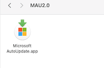

macOS安装Microsoft Office for Mac后，最近经常弹出Microsoft Auto Update应用自动更新工具。就如下面这样：占用我的任务栏，关键还带个小红点很烦人，于是乎想到要把这个关闭。
<!--more-->
先看看图吧：


### 解决办法：

#### 方案一：设置权限关闭：

切换到目录

```bash
cd /Library/Application\ Support/Microsoft/MAU2.0
```

设置权限

```bash
sudo chmod 000 Microsoft\ AutoUpdate.app
```

输入电脑密码。Microsoft AutoUpdate.app就没有执行权限，一切都安静了。

#### 方案二：删除运行文件

1. 按键盘快捷键：command（⌘）+⇧+G，或者顶部菜单，选中前往，前往文件夹


2. 输入路径 ：`/Library/Application Support/Microsoft/` 后点击前往

```
/Library/Application Support/Microsoft/
```

3. 删除 `MAU2.0/Microsoft AutoUpdate.app`文件



以上 彻底解决这个烦人的更新提示的烦恼。

### 参考

- [关闭Mac的Microsoft AutoUpdate弹框提示](https://zhuanlan.zhihu.com/p/132658872)

