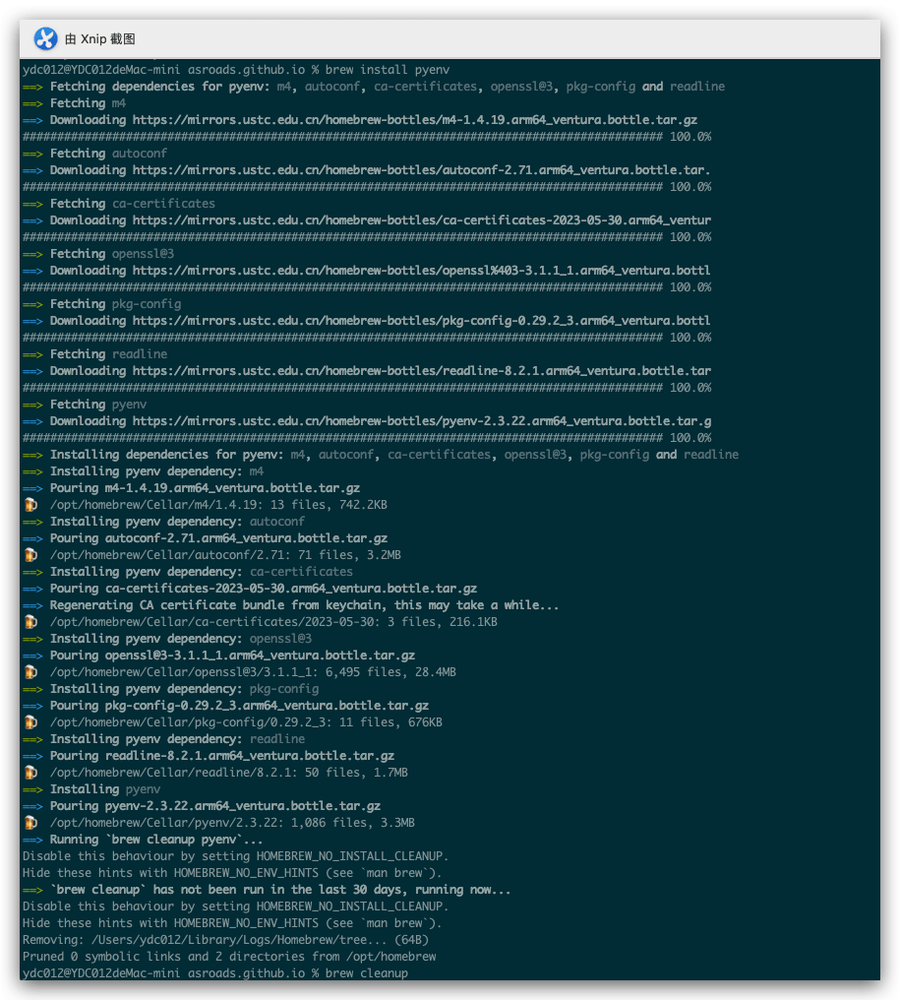
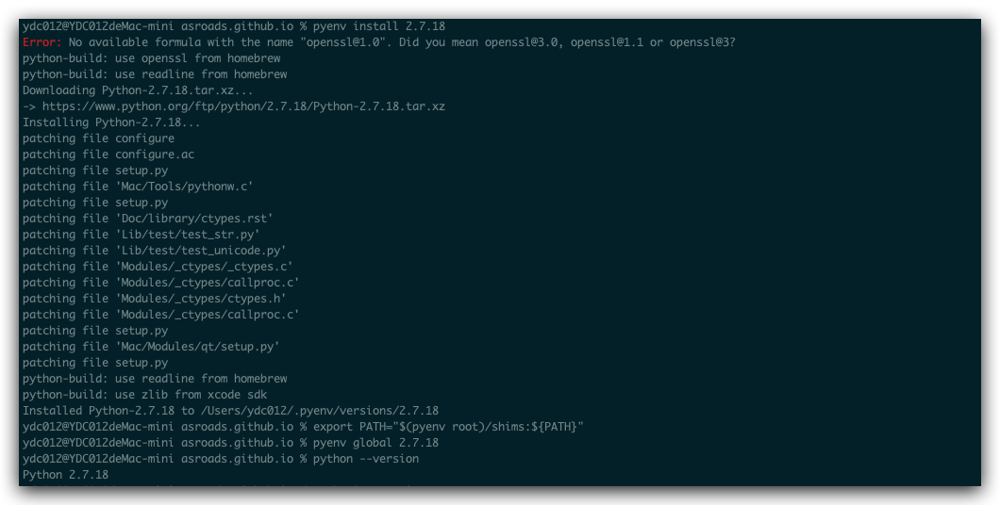
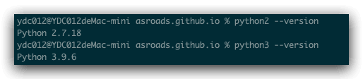

之前的文章里介绍过如何在windows10环境下同时安装Python2和Python3，最近的工作重新换回了Mac环境办公，虽然有一年多没有使用Mac电脑，重新换回，还是有些环境的变化和生疏，下面说说如何让同时共存。
<!--more-->

## 关于Python3

1. 以前的安装都是直接去官网选择对应的Python3版本之间安装，然后配置环境变量等细节操作，这次安装我这里选择了一个比较简单方式，我使用Homebrew直接安装，这样省去了很多麻烦，也管理起来方便了许多。

## 关于Python2

现在关于Homebrew 网上查到很多信息说已经不能直接安装，后面找到了一个安装方法：

> 从MacOS 12.4 Beta版(21F5048e) 开始，可以通过`pyenv`在intel和Apple芯片中安装python2。
>
> 例如在M1中安装 2.7.18 版本的 python2。
>
> ```python
> brew install pyenv
> pyenv install 2.7.18
> export PATH="$(pyenv root)/shims:${PATH}"
> pyenv global 2.7.18
> python --version
> ```
>
> 如果一切顺利，将可以看到`Python 2.8.18`的输出。
>
> 需要将上述路径添加到环境变量里面，例如：
>
> ```python
> echo 'PATH=$(pyenv root)/shims:$PATH' >> ~/.zshrc
> ```
>
> 此方法可以与`brew install python3`方式安装的`python3`共存。

按照上面的操作，我这边安装成功：





最后验证 共存：



## 参考

- [brew安装python2](https://www.wyr.me/post/658)