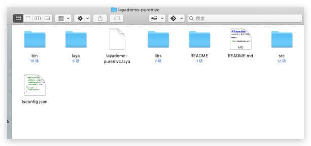
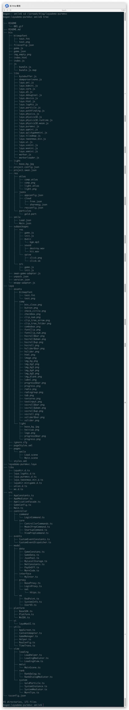
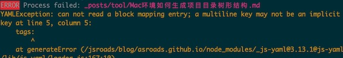

以前见别人写技术博客的时候，总是会先把最后的项目结构目录显示出来，一直不知道那些代码似的的图形结构如何生成的，今天得以有机会，寻得此招，于是乎拿来分享一下。
<!--more-->

### 环境

- homebrew 
- Mac环境

### 步骤

1. 首先我们用我们的 homebrew 安装我们的 插件

```shell
# 安装 tree
brew install tree
```

2. 安装结束后打开我们的目录



3. 在我们的项目目录运行我们的插件

```shell
tree
```

4. 效果如下



我们常见的文本结构出炉了！

```json
.
├── README
│   └── 001.gif
├── README.md
├── bin
│   ├── bitmapfont
│   │   ├── test.fnt
│   │   └── test.jpeg
│   ├── fileconfig.json
│   ├── game.js
│   ├── game.json
│   ├── img_empty.jpeg
│   ├── index.html
│   ├── index.js
│   ├── js
│   │   ├── bundle.js
│   │   └── bundle.js.map
│   ├── libs
│   │   ├── bytebuffer.js
│   │   ├── domparserinone.js
│   │   ├── laya.ani.js
│   │   ├── laya.bdmini.js
│   │   ├── laya.core.js
│   │   ├── laya.d3.js
│   │   ├── laya.debugtool.js
│   │   ├── laya.device.js
│   │   ├── laya.html.js
│   │   ├── laya.log4ts.js
│   │   ├── laya.particle.js
│   │   ├── laya.pathfinding.js
│   │   ├── laya.physics.js
│   │   ├── laya.physics3D.js
│   │   ├── laya.physics3D.runtime.js
│   │   ├── laya.physics3D.wasm.js
│   │   ├── laya.puremvc.js
│   │   ├── laya.qqmini.js
│   │   ├── laya.quickgamemini.js
│   │   ├── laya.tiledmap.js
│   │   ├── laya.tweenmax.min.js
│   │   ├── laya.ui.js
│   │   ├── laya.vvmini.js
│   │   ├── laya.wxmini.js
│   │   ├── laya.xmmini.js
│   │   ├── worker.js
│   │   └── workerloader.js
│   ├── light
│   │   └── base_bg.jpg
│   ├── project.config.json
│   ├── project.swan.json
│   ├── res
│   │   ├── atlas
│   │   │   ├── comp.atlas
│   │   │   ├── comp.jpeg
│   │   │   ├── light.atlas
│   │   │   └── light.jpeg
│   │   ├── jsons
│   │   │   ├── appconfig.json
│   │   │   ├── cloud
│   │   │   │   ├── free.json
│   │   │   │   └── sharemsg.json
│   │   │   └── resconfig.json
│   │   └── particles
│   │       └── gold.part
│   ├── smile
│   │   ├── Load.json
│   │   └── Main.json
│   ├── subpackages
│   │   ├── res
│   │   │   ├── game.js
│   │   │   ├── init.js
│   │   │   ├── music
│   │   │   │   └── bgm.mp3
│   │   │   ├── sound
│   │   │   │   ├── destroy.wav
│   │   │   │   └── hit.wav
│   │   │   └── spine
│   │   │       ├── click.jpeg
│   │   │       └── click.sk
│   │   └── src
│   │       ├── game.js
│   │       └── init.js
│   ├── swan-game-adapter.js
│   ├── unpack.json
│   ├── version.json
│   └── weapp-adapter.js
├── laya
│   ├── assets
│   │   ├── bitmapfont
│   │   │   ├── test.fnt
│   │   │   └── test.jpeg
│   │   ├── comp
│   │   │   ├── btn_close.jpeg
│   │   │   ├── button.jpeg
│   │   │   ├── check_circle.jpeg
│   │   │   ├── checkbox.jpeg
│   │   │   ├── clip_num.jpeg
│   │   │   ├── clip_tree_arrow.jpeg
│   │   │   ├── clip_tree_folder.jpeg
│   │   │   ├── combobox.jpeg
│   │   │   ├── fontClip.jpeg
│   │   │   ├── fontClip_num.jpeg
│   │   │   ├── hscroll$bar.jpeg
│   │   │   ├── hscroll$down.jpeg
│   │   │   ├── hscroll$up.jpeg
│   │   │   ├── hscroll.jpeg
│   │   │   ├── hslider$bar.jpeg
│   │   │   ├── hslider.jpeg
│   │   │   ├── html.jpeg
│   │   │   ├── image.jpeg
│   │   │   ├── img_bg.jpeg
│   │   │   ├── img_bg2.jpeg
│   │   │   ├── img_bg3.jpeg
│   │   │   ├── img_bg4.jpeg
│   │   │   ├── img_bg5.jpeg
│   │   │   ├── img_blank.jpeg
│   │   │   ├── label.jpeg
│   │   │   ├── progress$bar.jpeg
│   │   │   ├── progress.jpeg
│   │   │   ├── radio.jpeg
│   │   │   ├── radiogroup.jpeg
│   │   │   ├── tab.jpeg
│   │   │   ├── textarea.jpeg
│   │   │   ├── textinput.jpeg
│   │   │   ├── vscroll$bar.jpeg
│   │   │   ├── vscroll$down.jpeg
│   │   │   ├── vscroll$up.jpeg
│   │   │   ├── vscroll.jpeg
│   │   │   ├── vslider$bar.jpeg
│   │   │   └── vslider.jpeg
│   │   └── light
│   │       ├── base_bg.jpg
│   │       ├── heitiao.jpeg
│   │       ├── logo.jpeg
│   │       ├── progress$bar.jpeg
│   │       └── progress.jpeg
│   ├── ignore.cfg
│   ├── pageStyles.xml
│   ├── pages
│   │   └── smile
│   │       ├── Load.scene
│   │       └── Main.scene
│   └── styles.xml
├── layademo-puremvc.laya
├── libs
│   ├── LayaAir.d.ts
│   ├── laya.log4ts.d.ts
│   ├── laya.puremvc.d.ts
│   ├── laya.tweenmax.min.d.ts
│   ├── layaAir.minigame.d.ts
│   ├── union.d.ts
│   └── wx.d.ts
├── src
│   ├── AppConstants.ts
│   ├── AppMediator.ts
│   ├── ApplicationFacade.ts
│   ├── GameConfig.ts
│   ├── Main.ts
│   ├── controller
│   │   ├── command
│   │   │   └── LoginCommand.ts
│   │   └── core
│   │       ├── ControllerCommands.ts
│   │       ├── ModelPrepCommand.ts
│   │       ├── StartupCommand.ts
│   │       └── ViewPrepCommand.ts
│   ├── events
│   │   ├── CustomEventConstants.ts
│   │   └── CustomEventDispatcher.ts
│   ├── model
│   │   ├── data
│   │   │   ├── GameConstans.ts
│   │   │   ├── GameData.ts
│   │   │   ├── JsonPool.ts
│   │   │   ├── MyLocalStorage.ts
│   │   │   ├── NetConstants.ts
│   │   │   ├── PayOnOff.ts
│   │   │   └── WarnCode.ts
│   │   ├── interface
│   │   │   └── MyInter.ts
│   │   ├── proxy
│   │   │   ├── BaseProxy.ts
│   │   │   ├── LoginProxy.ts
│   │   │   └── net
│   │   │       └── Https.ts
│   │   └── vo
│   │       ├── RedPoint.ts
│   │       ├── SystemInfo.ts
│   │       └── UserVO.ts
│   ├── platform
│   │   ├── BaseSDK.ts
│   │   ├── Platform.ts
│   │   └── WxSDK.ts
│   ├── ui
│   │   └── layaMaxUI.ts
│   ├── utils
│   │   ├── AppScreen.ts
│   │   ├── ContentAdapter.ts
│   │   ├── GameManager.ts
│   │   ├── Helper.ts
│   │   ├── ResConfig.ts
│   │   └── TimeTrans.ts
│   └── view
│       ├── loading
│       │   ├── LoadHelper.ts
│       │   ├── LoadingMadiator.ts
│       │   └── LoadingView.ts
│       ├── maiui
│       │   └── MainScene.ts
│       ├── rank
│       │   ├── RankDalog.ts
│       │   └── RankDialogMediator.ts
│       └── system
│           ├── GoldParticle.ts
│           ├── SystemInstance.ts
│           ├── SystemMediator.ts
│           └── WarnTips.ts
└── tsconfig.json
```

这样以后再写技术文章的时候，读者很容易有个清晰的结构了！

PS: 今天编译的时候遇到一个Hexo错误



```shell
YAMLException: can not read a block mapping entry; a multiline key may not be an implicit key at line 5, column 5:
```

原因：YUML语法要求key:后面需要加一个空格，然后再接上vlue

这个原来是写 分类的时候 ":" 后没有空格 加上空格就解决了。