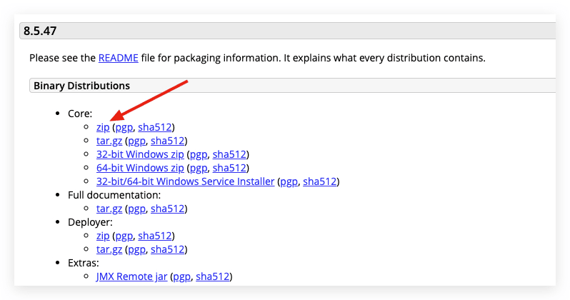
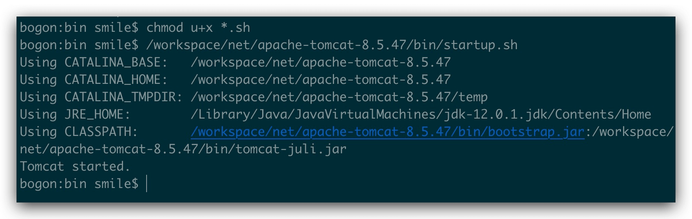
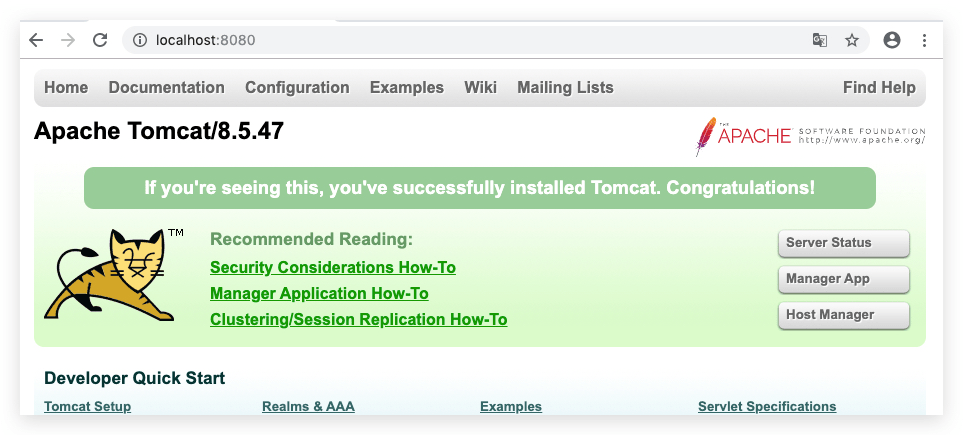
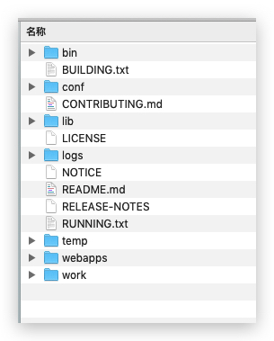
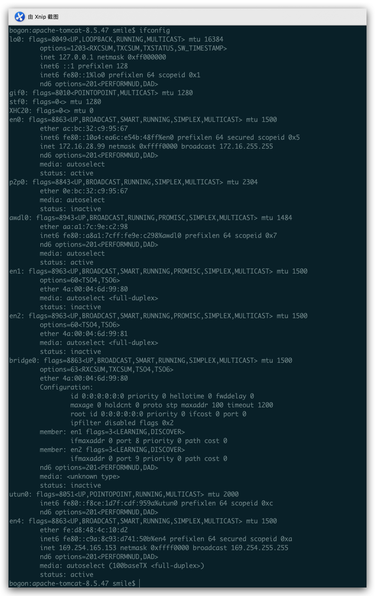
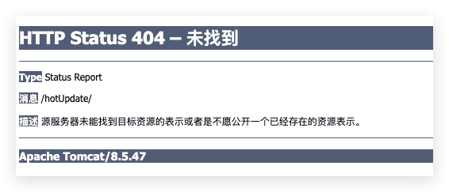
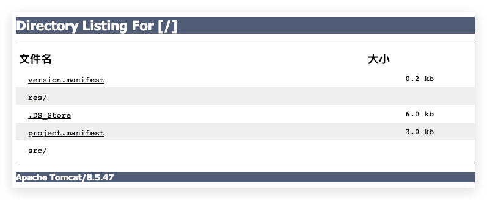

之前也简单的介绍过 Tomcat的功能，只是没有详细说安装遇到的问题，这次 做热更新 用到了本机搭建服务器，期间也遇到了几个问题，就顺便记录下来
<!--more-->

大概的步骤就是 下载--->解压--->配置--->启动

### 下载 TomCat

- 打开[Apache Tomcat](http://tomcat.apache.org/download-80.cgi)官网 下载



- 解压到自己的本地目录 比如我的 是

```
/workspace/net/apache-tomcat-8.5.47
```

### 启动 Tomcat

- 运行 /workspace/net/apache-tomcat-8.5.47/bin/startup.sh
- 如果出现 -bash: /workspace/net/apache-tomcat-8.5.47/bin/startup.sh: Permission denied 则需要

```
chmod u+x *.sh
```




```
bogon:bin smile$ chmod u+x *.sh
bogon:bin smile$ /workspace/net/apache-tomcat-8.5.47/bin/startup.sh
Using CATALINA_BASE:   /workspace/net/apache-tomcat-8.5.47
Using CATALINA_HOME:   /workspace/net/apache-tomcat-8.5.47
Using CATALINA_TMPDIR: /workspace/net/apache-tomcat-8.5.47/temp
Using JRE_HOME:        /Library/Java/JavaVirtualMachines/jdk-12.0.1.jdk/Contents/Home
Using CLASSPATH:       /workspace/net/apache-tomcat-8.5.47/bin/bootstrap.jar:/workspace/net/apache-tomcat-8.5.47/bin/tomcat-juli.jar
```

### 验证安装是否成功

在浏览器地址栏输入:`http://localhost:8080`(或者在手机浏览器中输入电脑IP+端口号也可以访问)显示如下界面:



能够打开 表示已经成功

### 关闭Tomcat

```shell
/workspace/net/apache-tomcat-8.5.47/bin/shutdown.sh
```

### 查看Tomcat版本信息

```bash
/workspace/net/apache-tomcat-8.5.47/bin/catalina.sh version
```



1>bin:存放tomcat命令
2>conf:存放tomcat配置信息,里面的server.xml文件是核心的配置文件
3>lib:支持tomcat软件运行的jar包和技术支持包(如servlet和jsp)
4>logs:运行时的日志信息
5>temp:临时目录
6>webapps:共享资源文件和web应用目录
7>work:tomcat的运行目录.jsp运行时产生的临时文件就存放在这里

### 启动tomcat报错 Permission denied

问题的关键字：Permission denied。

解决方法：在tomcat目录下打开终端

```shell
chmod u+x *.sh
```

### 修改端口号

修改端口号
服务器的默认端口是8080,也可以将其改成自定义的端口,为了避免与系统端口冲突,必须设置为1024以上,例如设置为 8888 用记事本打开ApacheTomcat的conf目录下的server.xml文件,将以下语句的port值8080改为自定义的端口号:(例如8020)

```xml
<Connector port="8090" protocol="HTTP/1.1"
          connectionTimeout="20000"
          redirectPort="8443" />
```

xml的标签都要关闭,还要重启tomcat. 重新打开`http://localhost:xxxx`到Tomcat主界面,点击 Manager App等按钮账号和密码输入tomcat即可登陆

### 访问host-manager出现403问题解决

Tomcat部署启动之后，在Tomcat首页访问host-manager或者manager app的时候会提示403错误，这是因为没有权限！

1、查看是否添加用户和角色：
进入到tomcat的conf目录下，编辑tomcat-users.xml配置文件
添加manager-script角色，并赋予角色给admin

```xml
<role rolename="admin-gui"/>
<role rolename="manager-gui"/>
<role rolename="manager-script"/>
<user username="admin" password="admin" roles="admin-gui,manager-gui,manager-script"/>
```

2、查看是否IP做了限制

打开webapps下的host-manager和manager，都有一个共同的文件夹META-INF，里面都有context.xml，这个文件的内容是：

```xml
<Context antiResourceLocking="false" privileged="true" >
  <Valve className="org.apache.catalina.valves.RemoteAddrValve"
         allow="127.d+.d+.d+|::1|0:0:0:0:0:0:0:1" />
</Context>
```

Mac 查看自己IP 命令 `ifconfig`




这个就是自己的ip地址（局域网）

### 服务器目录文件夹 404  错误

描述：源服务器未能找到目标资源的表示或者是不愿公开一个已经存在的资源表示




原因是我们的项目不完整造成的，其实可以忽略，因为单个文件是直接可以正常访问的，只是查看列表的时候，看着不舒服，如果需要正常显示文件列表，需要修改  conf -->web.xml 文件 里面的  listings  改为 true 然后 重启 Tomcat 

修改前 位置：

```xml
 <servlet>
        <servlet-name>default</servlet-name>
        <servlet-class>org.apache.catalina.servlets.DefaultServlet</servlet-class>
        <init-param>
            <param-name>debug</param-name>
            <param-value>0</param-value>
        </init-param>
        <init-param>
            <param-name>listings</param-name>
            <param-value>false</param-value>
        </init-param>
        <load-on-startup>1</load-on-startup>
    </servlet>

```

修改后：

```xml
 <init-param>
            <param-name>listings</param-name>
            <param-value>true</param-value>
        </init-param>
```



### 配置问题 403 Access Denied

`**管理页面如：http://172.16.28.99:8080/manager/html出现如下错误：**`

403 Access Denied

**需要配置：**

Tomcat/conf/tomcat-users.xml加入：

 ``` xml
<role rolename="manager"/>   
 <role rolename="admin"/> 
 <role rolename="admin-gui"/>
 <role rolename="manager-gui"/>
 <user username="xxx" password="***" roles="admin-gui,manager-gui"/>
 ```

以上配置好后本地可以访问

**另外，需要修改Tomcat/webapps/manager/META-INF/context.xml文件：**

```xml
<Context antiResourceLocking="false" privileged="true" >
 <!--
  Remove the comment markers from around the Valve below to limit access to
  the manager application to clients connecting from localhost
 -->
 <Valve className="org.apache.catalina.valves.RemoteAddrValve"
    allow="127\.\d+\.\d+\.\d+|::1|0:0:0:0:0:0:0:1|\d+\.\d+\.\d+\.\d+" />
 -</Context>
```

**或注释Value节点（tomcat9.0以下默认是注释的，所以不需修改）**

```xml
<!--
 <Valve className="org.apache.catalina.valves.RemoteAddrValve"
     allow="127\.\d+\.\d+\.\d+|::1|0:0:0:0:0:0:0:1" />
 -->
```

详情见 http://tomcat.apache.org/tomcat-9.0-doc/config/valve.html#Remote_Address_Filter

### 参考文章

- [tomcat 安全配置文档](https://www.cnblogs.com/heaven-xi/p/9961354.html)
- [Mac系统安装和配置tomcat步骤详解](https://blog.csdn.net/feng2qing/article/details/60968548)
- [tomcat访问host-manager出现403问题解决](https://blog.csdn.net/vtopqx/article/details/81051418)
- [苹果电脑怎么查看本机IP与MAC地址](https://jingyan.baidu.com/article/b0b63dbf3fefd14a48307013.html)

