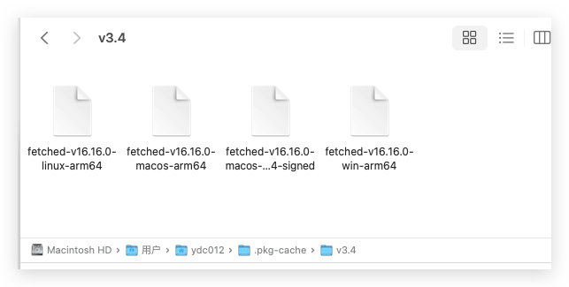

有时候写了一个`Node.js` 脚本，工作中一般需要给项目内的其他同事使用，对于一些非技术的同事，使用工具相对来讲学习成本比较高，特别是需要安装`Node.js`和其相关的依赖，此时，一个打包工具的需求就出现了，那么有没有好的解决方法呢？答案是肯定的，下面就介绍一个工具[pkg](https://github.com/vercel/pkg) 用于构建`Node.js` 项目为可执行文件，这里的 `Node.js`  打包 exe 是不带 `GUI` 界面的命令行程序。如果你想要使用 `JavaScript` 开发带 `GUI` 界面的程序，可以考虑使用 `Electron`。
<!--more-->

## 工具介绍

`Node.js` 脚本需要有`Node.js` 运行环境才能运行，把 Node 项目打包为 exe 就是把 `Node.js` 运行环境打包到项目中。因为程序中包含了 `Node.js` 运行环境，所以一个没有 `node_modules` 模块的 `console.log` 单文件，打包为 `exe` 后，文件体积也在 30M 以上。这里使用的打包工具是 [pkg](https://github.com/vercel/pkg),，它可以把 `Node.js` 项目打包为 `Windows`、`Linux`、`Mac` 的可执行程序。[pkg](https://github.com/vercel/pkg) 打包的时候需要到 Node.js 的服务器（nodejs.org）下载对应版本的 Node.js，为了能顺利打包，需要有一个稳定的国际互联网连接。

- https://github.com/vercel/pkg
- https://github.com/vercel/pkg/releases 构建版本
- https://github.com/vercel/pkg-fetch/releases 对于的缓存工具下载

### 注意事项

#### 支持的 Node.js 版本如下

- v19.8.1
- v18.15.0
- v16.19.1
- v14.21.3
- v12.22.11
- v10.24.1
- v8.17.0

注意：目前版本 `Node.js 20` 以上就不再支持了 可以考虑 [Single executable applications](https://nodejs.org/api/single-executable-applications.html)

## 安装

### 使用 npm 全局安装 pkg：

```bash
npm install pkg -g
```


安装完成后可以输入：

```bash
pkg -h
```

或输入：

```bash
pkg -v
```

比如我这边输出如下：

```bash
YDC012deMac-mini~(:|✔) % pkg -v
5.8.1
YDC012deMac-mini~(:|✔) % pkg -h

  pkg [options] <input>

  Options:

    -h, --help           output usage information
    -v, --version        output pkg version
    -t, --targets        comma-separated list of targets (see examples)
    -c, --config         package.json or any json file with top-level config
    --options            bake v8 options into executable to run with them on
    -o, --output         output file name or template for several files
    --out-path           path to save output one or more executables
    -d, --debug          show more information during packaging process [off]
    -b, --build          don't download prebuilt base binaries, build them
    --public             speed up and disclose the sources of top-level project
    --public-packages    force specified packages to be considered public
    --no-bytecode        skip bytecode generation and include source files as plain js
    --no-native-build    skip native addons build
    --no-dict            comma-separated list of packages names to ignore dictionaries. Use --no-dict * to disable all dictionaries
    -C, --compress       [default=None] compression algorithm = Brotli or GZip

  Examples:

  – Makes executables for Linux, macOS and Windows
    $ pkg index.js
  – Takes package.json from cwd and follows 'bin' entry
    $ pkg .
  – Makes executable for particular target machine
    $ pkg -t node14-win-arm64 index.js
  – Makes executables for target machines of your choice
    $ pkg -t node12-linux,node14-linux,node14-win index.js
  – Bakes '--expose-gc' and '--max-heap-size=34' into executable
    $ pkg --options "expose-gc,max-heap-size=34" index.js
  – Consider packageA and packageB to be public
    $ pkg --public-packages "packageA,packageB" index.js
  – Consider all packages to be public
    $ pkg --public-packages "*" index.js
  – Bakes '--expose-gc' into executable
    $ pkg --options expose-gc index.js
  – reduce size of the data packed inside the executable with GZip
    $ pkg --compress GZip index.js

```

若能显示使用说明和版本信息就说明安装成功。

## 简单使用

### 打包环境

- Mac
- `Node.js`  v16.20.2

### 如何打包

创建一个 `index.js` 文件，随便写几行代码：

```javascript
console.log('我的技术博客 https://blog.asroads.com/');

setTimeout(() => {
  console.log('完成');
}, 3000);
```

如果你在资源管理器里直接运行打包的 `exe` 文件的话，代码执行完成后命令行会直接关闭，也就是说你只能看到命令行闪一下。如果要让程序不自动关闭可以使用定时器或 `readline` 接收输入。

我使用的是全局安装，打包前需要先进入项目目录，输入 `pkg 文件名.js` ，例如：

```bash
pkg index.js
```

首次打包会去下载对应的文件， 若下载失败 请去下载[pkg-fetch](https://github.com/vercel/pkg-fetch/releases)后 放到本地`/Users/用户名/.pkg-cache`目录下



```
Last login: Tue Aug  6 18:53:45 on ttys001
YDC012deMac-mini~/TestCase/node/pkg-demo(:|✔) % pkg index.js
> pkg@5.8.1
> Targets not specified. Assuming:
  node16-linux-arm64, node16-macos-arm64, node16-win-arm64
> Fetching base Node.js binaries to PKG_CACHE_PATH
  fetched-v16.16.0-linux-arm64        [====================] 100%

  fetched-v16.16.0-macos-arm64        [====================] 100%

  fetched-v16.16.0-win-arm64          [====================] 100%

YDC012deMac-mini~/TestCase/node/pkg-demo(:|✔) %
```

打包完成后默认会在项目目录生成三个文件，其中 `win.exe` 结尾的就是 Windows 的程序，其它两个是 Linux 和 Mac 的。


我们选择自己的环境，我这个是MAC环境


上面的 `pkg` 里的 `targets` 是目标平台和版本配置，`targets` 的配置项包含三个参数，参数之间用 `-` 连接，下面是用到的参数说明：

- `node14`：Node.js 的版本，支持 node8、10、12、14、16、`latest` （最新版本）
- `win`：操作系统平台，支持`alpine`、 `linux`、`win`、`macos`、`linuxstatic` 、`freebsd`
- `x64`：架构，支持 `x64`、`arm64`、`armv6`、`armv7`

## 进阶使用 

如果你的程序中包含第三方的 Node 模块，使用 `require` 引入后 pkg 也能在 `node_modules` 查找打包，下面是包含 Express 的项目：

```javascript
const express = require('express');
const app = express();

app.get('/', (req, res) => {
  res.send(`<h1>Hello World</h1>`);
});

app.listen('8888', () => {
  console.log('浏览器访问 http://localhost:8888');
});
```

打包后运行程序，在浏览器中也能访问 HTTP 服务。


### 配置文件

pkg 支持很多自定义打包配置，`package.json` 可以作为 pkg 的配置文件，下面是一些配置说明：

#### 入口文件和输出位置

你可以直接在 `package.json` 中设置 pkg 的入口文件和输出位置：

```json
{
  "name": "express-test",
  "version": "1.0.0",
  "main": "index.js",
  "scripts": {
    "test": "echo \"Error: no test specified\" && exit 1"
  },
  "author": "",
  "license": "ISC",
  "pkg": {
    "outputPath": "dist"
  },
  "bin": "index.js"
}
```

上面主要看 `pkg` 和 `bin` ，`bin` 设置的 `index.js` 就是 pkg 的入口文件。`pkg` 就是 pkg 相关的配置，`outputPath` 就是设置 pkg 打包完成后的存放位置。

使用了配置文件后，打包也需要使用：

```bash
pkg .
```


#### 静态文件

pkg 默认只会打包 `require` 引入的模块，如果你的项目中还包含 HTML、CSS、图片之类的静态文件的话，pkg 是不会打包的。

下面配置 pkg 打包 `public` 目录里的文件：

```json
{
  "pkg": {
    "assets": ["public/**/*"],
    "outputPath": "dist"
  },
  "bin": "index.js"
}
```

`assets` 就是静态文件打包配置，数组里的 `public/**/*` 就是打包 `public` 目录的所有文件，静态文件可以配置多个目录。

pkg 会把所有的静态文件都打包到一个 exe 程序里，运行的时候才会释放文件，程序关闭后释放的文件也会被销毁。


#### 目标平台配置

目标平台配置可以配置集成的 Node 版本、操作系统、架构，下面是一组简单的配置：

```json
{
  "pkg": {
    "assets": ["public/**/*"],
    "outputPath": "dist",
    "targets": ["node14-win-x64", "node14-win-arm64"] 
  },
  "bin": "index.js"
}
```

上面的 `pkg` 里的 `targets` 是目标平台和版本配置，`targets` 的配置项包含三个参数，参数之间用 `-` 连接，下面是用到的参数说明：

- `node14`：Node.js 的版本，支持 node8、10、12、14、16、`latest` （最新版本）
- `win`：操作系统平台，支持`alpine`、 `linux`、`win`、`macos`、`linuxstatic` 、`freebsd`
- `x64`：架构，支持 `x64`、`arm64`、`armv6`、`armv7`

### 文件路径处理

pkg 打包的程序就像 Electron 一样，执行的时候 JS 脚本才会被释放。pkg 的 Windows 程序执行的时候会释放到 `C:\snapshot\项目目录` ，程序关闭后，释放的 JS 也会被销毁。

对于打包到 exe 程序里的静态文件来说，你可以使用 `__dirname` 当前脚本目录来查找文件，但是如果你要查找 exe 程序的所在位置就不能使用 `__dirname` 。

要获取当前的 exe 程序位置可以使用 `process.cwd()` ，要获取 exe 程序目录下的其它文件可以使用 `path.join(process.cwd(), '文件名')` 。

## 其他参数-压缩

在打包的时候加入 `--compress Brotli` 或 `--compress GZip` 选项可以减小文件体积，使用方式如下：

```bash
pkg . --compress
```

或者：

```bash
pkg index.js --compress
```

使用压缩后，程序的启动时间可能会稍微增加。

## 参考

- [Node.js 项目打包为 exe 可执行文件](https://www.misterma.com/archives/936/)