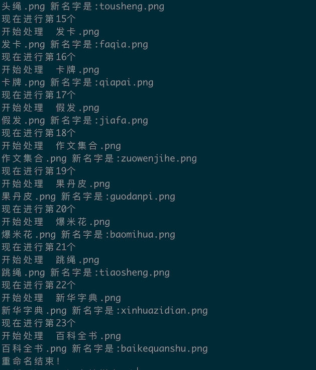

游戏开发中项目内大家沟通基本都是使用汉字，但是程序内基本使用英文，很多游戏道具或者物品，这个时候有时候为了便于查找都是用拼音配置图标名字或者人物图片等，这个时候我们需要对文件重新命名，把汉字一个个修改成拼音，此时问题来了，这样道具要存两份吗，显然是不必要的，那么一个需求就产生了，如何批量修改文件的名字的呢，下面就说说使用`Python`如何操作。
<!--more-->

## 使用xpinyin

- 确保 `Python3`环境
- pip 安装 [xpinyin](https://pypi.org/project/xpinyin/) 

首先确保 `pip install xpinyin`

下面是我们ReName.py 的代码：

```python
# -*-coding=utf8-*-
from xpinyin import Pinyin
import os
import sys
def renameCurrentDirectory():
    resume_rootdir = '.'
    renameDirectoryByPath(resume_rootdir)
def renameDirectoryByPath(dirPath):
    print(u'dirPath：'+dirPath)
    print(u'重命名开始！')
    pin = Pinyin()
    llist = os.listdir(dirPath)
    for i in range(0, len(llist)):
        print(u'现在进行第{}个'.format(i))
        resume = os.path.join(dirPath, llist[i])
        if os.path.isfile(resume):
            obj = os.path.basename(resume)
            if obj[0] == '.':
                continue
            print(u'开始处理  {}'.format(obj))
            pinyin_name = pin.get_pinyin(obj, "")
            print(u'{} 新名字是:{}'.format(obj, pinyin_name))
            Newdir = os.path.join(dirPath, pinyin_name)  # 新的文件路径
            os.rename(resume, Newdir)  # 重命名
    print(u'重命名结束！')

if __name__ == '__main__':
    args = sys.argv
    if len(args) == 1:
        print("没有传入路径，当前目录执行")
        renameCurrentDirectory()
        # sys.exit()
    else:
        print("传入路径:",args[1])
        execel_path = args[1]
        renameDirectoryByPath(execel_path)

```

### 用法

不传入路径参数  直接修改当前目录

```python
python3 ReName.py # ReName.py 为脚本名称
```

或者 传入路径参数  修改传入路径的目录

```python
python3 ReName.py /Users/smile/work/文档/我的小镇/trunk/美术/ui/物品图标 

# ReName.py 为脚本名称
# /Users/smile/work/文档/我的小镇/trunk/美术/ui/物品图标 为修改的目录路径
```

### 执行结果：



### 多音字问题

`xpinyin` 带来一个问题 就是 多音字的问题

比如：

```python
p = Pinyin()
print(p.get_pinyin("卡牌",splitter=' '))
```

会输出结果：

```python
qia pai # 我们想要的是 kapai
```

此时我们可以用第二个方案：

## 使用pypinyin

- 确保 `Python3`环境
- pip 安装 [pypinyin](https://pypi.org/project/pypinyin/) 

首先确保 `pip install pypinyin`

下面是我们ReName2.py 的代码：

```python
# -*-coding=utf8-*-
from pypinyin import pinyin, lazy_pinyin, Style
import os
import sys
def renameCurrentDirectory():
    resume_rootdir = '.'
    renameDirectoryByPath(resume_rootdir)
def renameDirectoryByPath(dirPath):
    print(u'dirPath：'+dirPath)
    print(u'重命名开始！')
    llist = os.listdir(dirPath)
    for i in range(0, len(llist)):
        print(u'现在进行第{}个'.format(i))
        resume = os.path.join(dirPath, llist[i])
        if os.path.isfile(resume):
            obj = os.path.basename(resume)
            if obj[0] == '.':
                continue
            print(u'开始处理  {}'.format(obj))
            pinyin_name = "".join(lazy_pinyin(obj))
            print(u'{} 新名字是:{}'.format(obj, pinyin_name))
            Newdir = os.path.join(dirPath, pinyin_name)  # 新的文件路径
            os.rename(resume, Newdir)  # 重命名
    print(u'重命名结束！')

if __name__ == '__main__':
    args = sys.argv
    if len(args) == 1:
        print("没有传入路径，当前目录执行")
        renameCurrentDirectory()
        # sys.exit()
    else:
        print("传入路径:",args[1])
        execel_path = args[1]
        renameDirectoryByPath(execel_path)
```

### 用法

不传入路径参数  直接修改当前目录

```python
python3 ReName.py # ReName.py 为脚本名称
```

或者 传入路径参数  修改传入路径的目录

```python
python3 ReName.py /Users/smile/work/文档/我的小镇/trunk/美术/ui/物品图标 

# ReName.py 为脚本名称
# /Users/smile/work/文档/我的小镇/trunk/美术/ui/物品图标 为修改的目录路径
```

### 执行结果：


使用xpinyin 带来一个问题 就是 多音字的问题

比如：

```python
p = "".join(lazy_pinyin("卡牌"))
print(p)
```

会输出结果：

```python
kapai # 正确输出 kapai
```

> ## 风格转换
>
> 我们可以对结果进行一些风格转换，比如不带声调风格、标准声调风格、声调在拼音之后、声调在韵母之后、注音风格等等，比如我们想要声调放在拼音后面，可以这么来实现：
>
> ```python
> from pypinyin import lazy_pinyin, Style
> 
> style = Style.TONE3
> print(lazy_pinyin('聪明的小兔子', style=style))
> ```
>
> 运行结果：
>
> ```python
> ['cong1', 'ming2', 'de', 'xiao3', 'tu4', 'zi']
> ```
>
> 可以看到运行结果每个拼音后面就多了一个声调，这就是其中的一个风格，叫做 TONE3，其实还有很多风格，下面是我从源码里面找出来的定义：
>
> ```python
> #: 普通风格，不带声调。如： 中国 -> ``zhong guo``
> NORMAL = 0
> #: 标准声调风格，拼音声调在韵母第一个字母上（默认风格）。如： 中国 -> ``zhōng guó``
> TONE = 1
> #: 声调风格2，即拼音声调在各个韵母之后，用数字 [1-4] 进行表示。如： 中国 -> ``zho1ng guo2``
> TONE2 = 2
> #: 声调风格3，即拼音声调在各个拼音之后，用数字 [1-4] 进行表示。如： 中国 -> ``zhong1 guo2``
> TONE3 = 8
> #: 声母风格，只返回各个拼音的声母部分（注：有的拼音没有声母，详见 `#27`_）。如： 中国 -> ``zh g``
> INITIALS = 3
> #: 首字母风格，只返回拼音的首字母部分。如： 中国 -> ``z g``
> FIRST_LETTER = 4
> #: 韵母风格，只返回各个拼音的韵母部分，不带声调。如： 中国 -> ``ong uo``
> FINALS = 5
> #: 标准韵母风格，带声调，声调在韵母第一个字母上。如：中国 -> ``ōng uó``
> FINALS_TONE = 6
> #: 韵母风格2，带声调，声调在各个韵母之后，用数字 [1-4] 进行表示。如： 中国 -> ``o1ng uo2``
> FINALS_TONE2 = 7
> #: 韵母风格3，带声调，声调在各个拼音之后，用数字 [1-4] 进行表示。如： 中国 -> ``ong1 uo2``
> FINALS_TONE3 = 9
> #: 注音风格，带声调，阴平（第一声）不标。如： 中国 -> ``ㄓㄨㄥ ㄍㄨㄛˊ``
> BOPOMOFO = 10
> #: 注音风格，仅首字母。如： 中国 -> ``ㄓ ㄍ``
> BOPOMOFO_FIRST = 11
> #: 汉语拼音与俄语字母对照风格，声调在各个拼音之后，用数字 [1-4] 进行表示。如： 中国 -> ``чжун1 го2``
> CYRILLIC = 12
> #: 汉语拼音与俄语字母对照风格，仅首字母。如： 中国 -> ``ч г``
> CYRILLIC_FIRST = 13
> ```
>
> 有了这些，我们就可以轻松地实现风格转换了。 好，再回到原来的问题，为什么 pinyin 的方法默认带声调，而 lazy_pinyin 方法不带声调，答案就是：它们二者使用的默认风格不同，我们看下它的函数定义就知道了： pinyin 方法的定义如下：
>
> ```python
> def pinyin(hans, style=Style.TONE, heteronym=False, errors='default', strict=True)
> ```
>
> lazy_pinyin 方法的定义如下：
>
> ```python
> def lazy_pinyin(hans, style=Style.NORMAL, errors='default', strict=True)
> ```
>
> 这下懂了吧，因为 pinyin 方法默认使用了 TONE 的风格，而 lazy_pinyin 方法默认使用了 NORMAL 的风格，所以就导致二者返回风格不同了。 好了，有了这两个函数的定义，我们再来研究下其他的参数，比如定义里面的 errors 和 strict 参数又怎么用呢？

关于更多[pypinyin](https://pypi.org/project/pypinyin/) 的用法可以看这里：[Python 中拼音库 PyPinyin 的用法](https://cuiqingcai.com/6519.html)

## 参考

- [Python将文件夹内文件名汉字转拼音](https://blog.csdn.net/weixin_44870139/article/details/109541704)
- [python-pinyin](https://github.com/mozillazg/python-pinyin)
- [Python 中拼音库 PyPinyin 的用法](https://cuiqingcai.com/6519.html)

