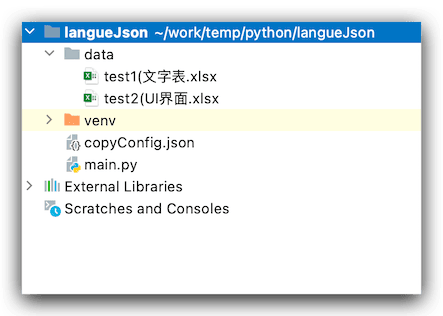
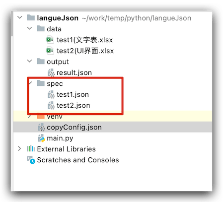
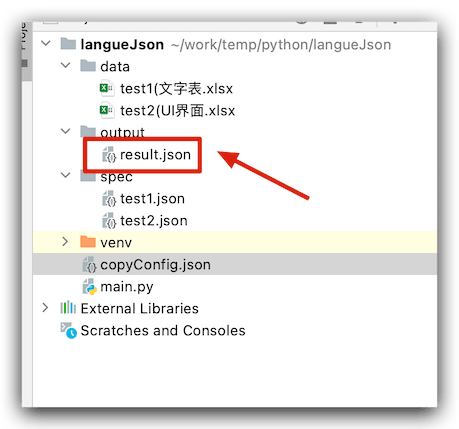
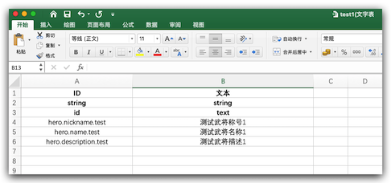
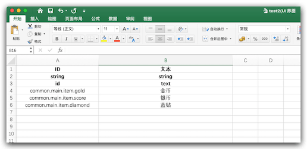

游戏用到多语言配置，一般来说,流行的都是`json`格式，走配置表，平时团队维护一个表显然容易冲突，不同的模块，最终放到一起即可，这样处理起来省事，这样以来，就有了这篇文章。下面说说详细操作：
<!--more-->
首先游戏主要分为两大步骤，1.处理`Excel`文件 2. 处理`json`

## 全部代码

```python
#!/usr/bin/env python
# -*- coding: UTF-8 -*-
__author__ = 'jsroads'

import codecs
import os
import importlib, sys
import json
import shutil

import xlrd

importlib.reload(sys)
ext_name = ['xls', 'xlsx']
# 读取excel数据
def open_excel(path):
    try:
        data = xlrd.open_workbook(path)
        return data
    except Exception as e:
        print(str(e))


# 字典数据转成json
def revert_to_json(data_list, source_path, csPath):
    encode_json = json.dumps(data_list, ensure_ascii=False, sort_keys=True)
    if not os.path.isdir(csPath):
        os.makedirs(csPath)
    jsonPath = os.path.join(csPath, source_path)
    with codecs.open(jsonPath, 'wb', "utf-8") as f:
        f.write(encode_json)


def process_type_row(fieldNames, fieldTypes, row):
    data = dict()
    data["status"] = True
    for i in range(len(fieldNames)):
        try:
            key = fieldNames[i]
            if len(fieldTypes) < i:
                break
            if key:
                filetype = fieldTypes[i]
                if type(row[key]) == float:
                    if int(row[key]) == row[key]:
                        row[key] = int(row[key])
                if filetype == "int":
                    if row[key] == "":
                        row[key] = 0
                    else:
                        row[key] = int(row[key])
                elif filetype == "float":
                    if row[key] == "":
                        row[key] = 0.0
                    else:
                        row[key] = float(row[key])
                elif filetype == "string":
                    if row[key]:
                        row[key] = str(row[key])
                    else:
                        row[key] = ""
                else:
                    row[key] = str(row[key])
        except Exception as err:
            data["status"] = False
            data["errmsg"] = fieldNames[i]
    return data


def merge_JsonFiles(filename,outfileName):
    result = {}
    for f1 in filename:
        with open(f1, 'r') as infile:
            dJson = json.load(infile)
            for key in dJson:
                result[key] = dJson[key]
    if os.path.exists(outfileName):
        print(os.path.dirname(outfileName),"路径已经存在")
    else:
        dir = os.path.dirname(outfileName)
        os.mkdir(dir)
        print(dir)
    with open(outfileName, 'w') as output_file:
        json.dump(result, output_file, ensure_ascii=False, sort_keys=True)


def process_excel_table(path, key=None, by_index=0, cs=[]):
    data = open_excel(path)
    table = data.sheets()[by_index]
    nrows = table.nrows
    param_type_cs = table.row_values(1)
    param_name_cs = table.row_values(2)
    data_dict = {"data": {}, "status": True}
    param_name_c = []
    param_type_c = []
    for n in range(len(param_name_cs)):
        if param_name_cs[n] and param_type_cs[n]:
            param_name_c.append(param_name_cs[n])
            param_type_c.append(param_type_cs[n])
    for k in key:
        if k not in param_name_cs:
            data_dict["status"] = False
            data_dict["errmsg"] = k
            return data_dict
    for rownum in range(3, nrows):
        row_data = table.row_values(rownum)
        c_temp_dict = {}
        for p in range(len(param_name_cs)):
            if param_name_cs[p]:
                c_temp_dict[param_name_cs[p]] = row_data[p]
        tag_data = process_type_row(param_name_c, param_type_c, c_temp_dict)
        data_dict["status"] = tag_data["status"]
        if tag_data["status"]:
            data_dict["data"][str(c_temp_dict[key[0]])] = c_temp_dict["text"]
        else:
            data_dict["errmsg"] = tag_data["errmsg"]
            break
    return data_dict


if __name__ == "__main__":
    key_str = "id"
    file_path, file_name = "", ""
    json_path = ""
    # 读取 配置 json
    cwd = os.getcwd()
    configPath = os.path.join(cwd, "copyConfig.json")
    f = open(configPath, encoding='utf-8')  # 打开‘copyConfig.json’的json文件
    res = f.read()  # 读文件
    specList = json.loads(res)["specList"]
    outfileName = json.loads(res)["outfileName"]
    targetOurDir = json.loads(res)["targetOurDir"]
    outPutJsonList = []
    for source in specList:
        try:
            file_path, file_name = os.path.split(source)
            file_name = file_name.split("(")[0]
            json_path = os.path.join(file_path, file_name.split(".")[0] + ".json")
        except:
            print("excel path is error")
        if key_str.find(",") >= 0:
            key_str_list = key_str.split(",")
        else:
            key_str_list = [key_str]
        data_c = process_excel_table(source, key_str_list, 0, ["cs", "sc", "c"])
        if data_c["status"]:
            jsondir = json_path.split("/")[1]
            outPutJsonList.append(os.path.join(cwd, "spec", jsondir))
            revert_to_json(data_c["data"], jsondir, "spec")
    merge_JsonFiles(outPutJsonList,outfileName)
    print("转换成功！！")
    shutil.copyfile(outfileName, os.path.join(targetOurDir,outfileName))
    print("拷贝成功！！")

```

## 功能介绍

## 目录结构

#### 文件目录



#### 配置文件

```json
{
  "specList": [
    "data/test1(文字表.xlsx",
    "data/test2(UI界面.xlsx"
  ],
  "outfileName": "output/result.json",
  "targetOurDir": "/Users/smile/work/temp"
}

```

运行结果

```bash
(venv) smile@bogon langueJson % python3 main.py
output
转换成功！！
拷贝成功！！
(venv) smile@bogon langueJson % 
```

#### 生成json 目录




#### 合并后json




### Excel数据

Test1数据内容



Test1数据内容



### Json数据

`test1.json` 数据

```json
{
  "hero.description.test": "测试武将描述1",
  "hero.name.test": "测试武将名称1",
  "hero.nickname.test": "测试武将称号1"
}
```

`test2.json` 数据

```json
{
  "common.main.item.diamond": "蓝钻",
  "common.main.item.gold": "金币",
  "common.main.item.score": "银币"
}
```

合并后 最终数据 `output/result.json`数据

```json
{
  "common.main.item.diamond": "蓝钻",
  "common.main.item.gold": "金币",
  "common.main.item.score": "银币",
  "hero.description.test": "测试武将描述1",
  "hero.name.test": "测试武将名称1",
  "hero.nickname.test": "测试武将称号1"
}
```

运行命令：

```shell
python3 main.py
```

最后 项目地址 [点击进入](https://github.com/jsroads/mytooldemos/tree/git/langueJson)

## 总结

总的来讲没有什么难点，主要是几个知识点的拼凑，由于作为辅助脚本来用，代码质量在此就不优化了。

### 参考

- [用python实现将文件拷贝到指定目录](https://blog.csdn.net/zd147896325/article/details/79870131)
- [如何在python中将多个json文件合并为一个文件](https://www.opsask.com/post/11490/wenjian-python-json-zhongjiang-hebing.html)

