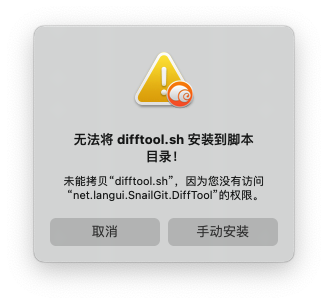
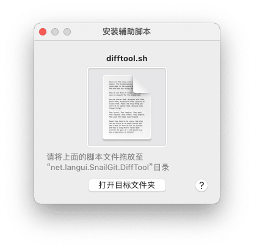

Mac系统中SVN能和[TortoiseSVN](https://tortoisesvn.net/downloads.html)（Windows环境）版本控制软件媲美的软件不多，很多都是收费的，Git有[Sourcetree](https://www.sourcetreeapp.com/)免费可以用来代替，[SnailGitLite](https://langui.net/snailgit/)或[SnailSVN](https://langui.net/snailsvn/) 这两款软件操作起来很像TortoiseSVN特别是文件可以有红绿蓝三色标识 更改 无变动 添加的状态，这里说说Mac上用这俩软件遇到的问题：无法将 **difftool.sh** 安装到脚本目录！未能拷贝“difftool.sh”，因为您没有访问“net.langui.SnailSVN.DiffTool”的权限。
<!--more-->现象



无法将 **difftool.sh** 安装到脚本目录！未能拷贝“difftool.sh”，因为您没有访问“net.langui.SnailSVN.DiffTool”的权限。



请将上面的脚本文件拖放至“net.langui.SnailSVN.DiffTool”目录

## 解决办法

### SnailSVN

将：

```bash
/Applications/SnailSVNLite.app/Contents/Applications/DiffTool.app/Contents/Resources/difftool.sh
```

拷贝到

```bash
/Users/xxxx/Library/Application Scripts/net.langui.SnailSVN.DiffTool/difftool.sh
```

xxxx 为用户名字 

如果目标目录 /Users/xxxx/Library/Application Scripts/net.langui.SnailSVN.DiffTool 尚未存在，请先创建目录：

```bash
mkdir ~/Library/Application\ Scripts/net.langui.SnailSVN.DiffTool/
```

### SnailGitLite

将：

```bash
/Applications/SnailGitLite.app/Contents/Applications/DiffTool.app/Contents/Resources/difftool.sh
```

拷贝到

```bash
/Users/xxxx/Library/Application Scripts/net.langui.SnailGit.DiffTool/difftool.sh
```

xxxx 为用户名字 

如果目标目录 /Users/xxxx/Library/Application Scripts/net.langui.SnailSVN.DiffTool 尚未存在，请先创建目录：

```bash
mkdir ~/Library/Application\ Scripts/net.langui.SnailGit.DiffTool/
```

### 其他

顺便推荐两个文件对比工具

**免费**：[perforce-visual-merge-and-diff-tools](https://www.perforce.com/product/components/perforce-visual-merge-and-diff-tools)

**收费** 免费使用30天 [Araxis Merge](https://www.araxis.com/merge/documentation-os-x/release-notes)

## 参考

- [在Mojave中打开DiffMerge SnailSVN的问题](https://xbuba.com/questions/52896991)
- [Langui.net](https://langui.net/snailsvn/)


