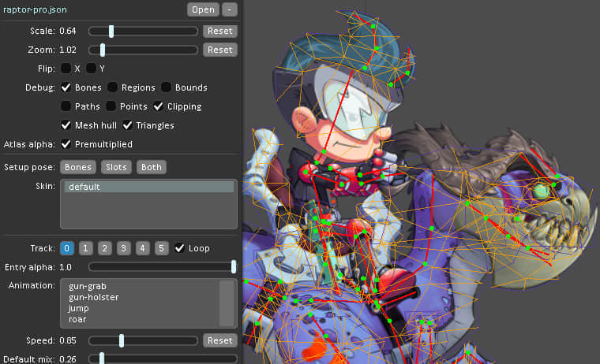
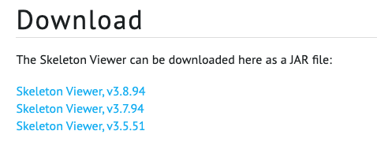

骨骼查看器（Skeleton Viewer）是一个加载和显示骨骼数据的工具。它能用于测试 Spine 导出的骨骼数据在实际运行时的渲染效果。在项目开发的时候，有时候需要预览特效给出的效果，这个软件就能查看动作。
<!--more-->
Skeleton Viewer 使用 [[spine-libgdx\]](https://github.com/EsotericSoftware/spine-runtimes/tree/3.6/spine-libgdx)运行库，这是 Spine 其它运行库的参考基础。即使你不使用 spine-libgdx，如果你想知道如何在其它运行库上渲染一套骨骼，Skeleton Viewer 也可以帮你搞清楚问题是出在 spine-libgdx 上，还是你使用的运行库上，还是你自已的代码上。
Skeleton Viewer 的源码可以在 [[here\]](https://github.com/EsotericSoftware/spine-runtimes/blob/3.6/spine-libgdx/spine-skeletonviewer/src/com/esotericsoftware/spine/SkeletonViewer.java)查看。



### 下载

Skeleton Viewer 是一个 JAR 文件，可以从这里下载：[点击进入](http://zh.esotericsoftware.com/spine-skeleton-viewer)



注意：如果 最新的 3.8.94 运行报错 就使用低版本的 试试看  这边使用 3.7.94版本是正常的

### 运行

根据官方提示  需要Java 支持 格式 如下

```bash
java -jar skeletonViewer.jar
```

或者：

```bash
java -jar skeletonViewer.jar path\to\skeleton.json
```

例如 ：

```bash
java -jar /Users/smile/my/work/skeletonViewer/skeletonViewer-3.7.94.jar /Users/smile/my/work/skeletonViewer/jiejie.json
```

### 使用骨骼查看器（Using Skeleton Viewer）

被选中的骨架加截并显示在右边的黑色区域。点击并拖拽可以移动骨骼。缩放Scale, 翻转Flip 和调试Debug用于更好地显示骨架的各个部分。

如果图片有脏边或其它什么显示异常的情况，请尝试勾选或取消 Premultiplied。如果勾选后渲染正常，那导出 atlas 时应该使用 premultiplied alpha 设置。

在 Animation 列表中选中的动画会被播放。当选中不同的动画时将使用[AnimationState]过度到新的动画。Mix 滑动条控制混合动画的时间长度。

Setup Pose 按钮可以将骨骼（bones）、资源槽（slots）或两者重置为装配动作（setuppose）。它与调用setBonesToSetupPose 或 setSlotsToSetupPose 是一样的。当一个动画改变了某个骨骼后，此变动将一直持续到下一次你用代码或另一个动画改动它。由于动画只修改的骨架具有关键帧的部分，其结果可能会无意中影响到另一个动画。解决方案看这里[Animationchanges]。


**遗憾的地方是 ，无法知道当前的动画持续的时间。**