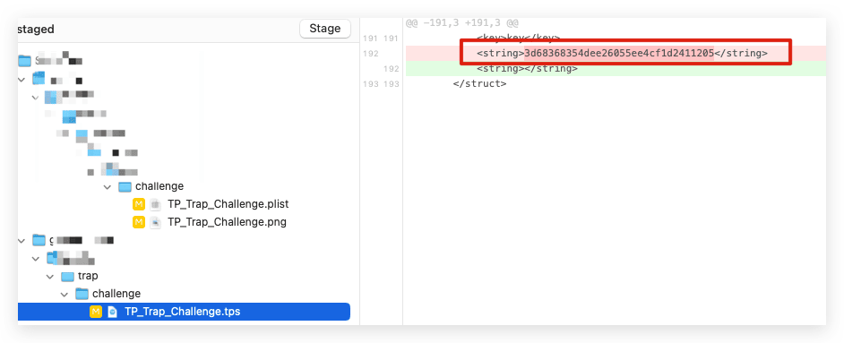
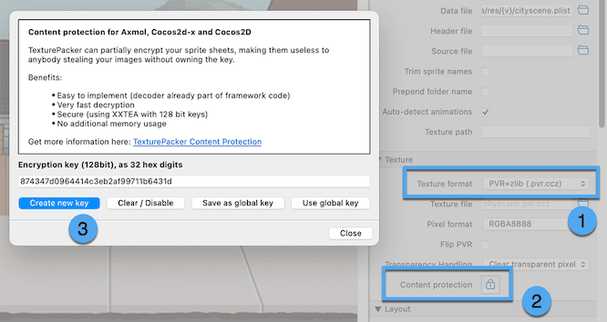
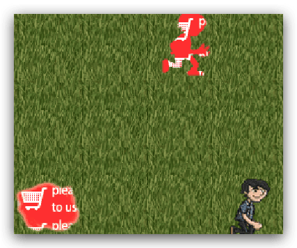
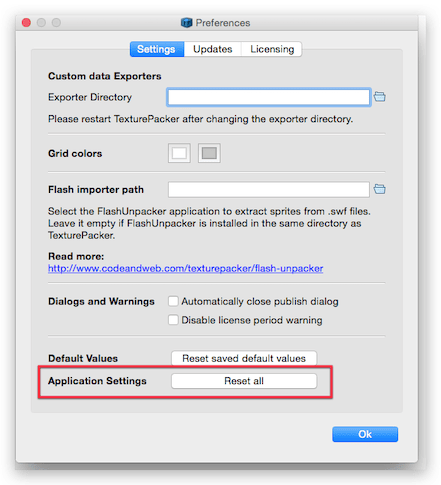

在制作游戏时候，当场景内元素多了之后，游戏的渲染性能显得特别重要，其中一个有效手段就是减少DrawCall（Draw Call是**一条命令，由CPU向GPU发送的一条命令，去渲染一个网格（Mesh）**。）此时，许多开发者都会使用合图，静态合图的工具里比较优秀的佼佼者就是[TexturePacker](https://www.codeandweb.com/texturepacker)，下面简单的介绍一下如何使用这个工具的命令行使用和自己遇到的问题解决方法。
<!--more-->

## 工具环境

- [TexturePacker](https://www.codeandweb.com/texturepacker)
- Mac

## 介绍


简单的说**TexturePacker功能就是将多张图片整合成一张大图的工具，并且生成一个图片元素相应位置和大小的json文件**。

关于如何使用`TexturePacker`生成图片这个后续再补充，下面说一下关于命令行如何使用。

### 命令行运行TexturePacker

#### 安装命令行

##### Windows

安装了`TexturePacker`，则必须将此路径添加到命令行

```shell
C:\Program Files\CodeAndWeb\TexturePacker\bin
```

```shell
SET "PATH=C:\Program Files\CodeAndWeb\TexturePacker\bin;%PATH%"
```

要在 `Windows` 上永久添加路径，请导航至 **设置**->**系统**->**关于**->**高级系统设置**->**环境变量**。选择**Path**变量并添加`C:\Program Files\CodeAndWeb\TexturePacker\bin`.

##### 苹果系统

使用菜单**TexturePacker** / **Install Command Line Tool**来获取此对话框：


命令行运行

```shell
sudo ln -s "/Applications/TexturePacker.app/Contents/MacOS/TexturePacker" "/usr/local/bin/TexturePacker"
```

在用户文件夹下的 .zshrc或.bashrc 添加设置

```shell
export PATH="/Applications/TexturePacker.app/Contents/MacOS/:$PATH"
```

#### 查看帮助

```shell
TexturePacker --help
```

#### 构建纹理

打包精灵表（例如用于移相器），您可以使用以下命令行：

```shell
TexturePacker --format phaser --sheet out.png --data out.json spritefolder
```

- `--format <name>`设置输出格式/您使用的游戏引擎
- `--sheet <file>`设置精灵表图像的文件名
- `--data <file>`设置数据文件的文件名
- `spritefolder`是包含所有精灵的文件夹的名称

使用 `tps`文件并调用：

```shell
TexturePacker sheet.tps
```

多个纹理调用

```shell
TexturePacker sheet1.tps sheet2.tps sheet3.tps ....
```

命令行按顺序处理所有 .tps 文件（Windows 不支持）

```shell
TexturePacker *.tps
```

更多参考：https://www.codeandweb.com/texturepacker/documentation/commandline

### 构建报错

####  ContentProtection currently only supported for .pvr.ccz

使用命令行构建的时候部分文件出现了报错：

```shell
ydc012@YDC012deMac-mini 2 % TexturePacker *.tps
Processing TP_Trap_2.tps...
TexturePacker:: error: ContentProtection currently only supported for .pvr.ccz
ydc012@YDC012deMac-mini 2 %
```

原因：`tps`文件内有`contentProtection`加密文件



具体查看：**纹理格式**为**`pvr.ccz`**非常重要 - 这是目前唯一支持加密的文件格式。就是说只有输出格式说 pvr.ccz 时候 加密才有效，我这里使用了 `png` 和`plist` 格式，可以选择去掉加密。




批量正则搜索替换：

```shell
<struct\s+type="ContentProtection">\s+<key>key<\/key>\s+<string>([^<>]+)<\/string>\s+<\/struct>
```

官方参考地址：https://www.codeandweb.com/texturepacker/tutorials/texturepacker-content-protection

#### 构建后出现未注册版本的标识




解决方案一：



解决方案二：

通过使用以下命令重新激活我的许可证密钥来修复它：

```shell
TexturePacker --activate-license <KEY>
```

笔者使用了方案一 无效 改为方案二 可以正常解决。

参考地址：[Texture Packer sprite red message error](https://stackoverflow.com/questions/28133144/texture-packer-sprite-red-message-error)