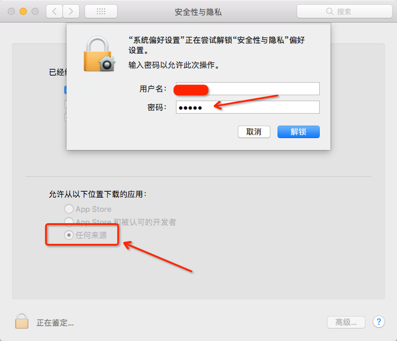

### 破解前准备

- 安装 [WebStorm2018](https://www.jetbrains.com/webstorm)
- 破解 WebStorm 破解文件 [JetbrainsCrack-2.9-release-enc.jar](http://idea.lanyus.com/jar/JetbrainsCrack-2.9-release-enc.jar)

<!-- more -->

### 安装 WebStorm

1.官网下载新版 [WebStorm2018](http://www.jetbrains.com/webstorm/)

下载地址： <http://www.jetbrains.com/webstorm/>

2.下载 破解文件 [JetbrainsCrack-2.9-release-enc.jar](http://idea.lanyus.com/)

下载地址 ：<<http://idea.lanyus.com/jar/JetbrainsCrack-2.9-release-enc.jar>

3.安装WebStorm


4.这步骤很重要，需要打开


5.然后 修改为 任何来源 这样 后面打开 WebStorm的时候 才不会报错



开始 安装 把 WebStorm 图片 拖动到 Applications 文件内 完成安装。


### 破解WebStorm

1.打开/Applications/Webstorm.app/Contents/bin/目录把下载的破解文件<http://idea.lanyus.com/jar/JetbrainsCrack-2.9-release-enc.jar>拖到这里。


2.编辑 /Applications/Webstorm.app/Contents/bin/webstorm.vmoptions


3.在头部加上指令。

```
-javaagent:/Applications/WebStorm.app/Contents/bin/JetbrainsCrack-2.9-release-enc.jar
```

或者是 写 （相对路径）到首行。

```
-javaagent:JetbrainsCrack.jar
```


### 查看是否破解成功

重启webstorm软件 ，在激活码区域随便输入点，就可以进入编辑页面了，在Help中选中Reginster…

之后会看到破解截止日期为2099年12月底，相信这些年应该够大家用的了！


### Windows系统

- PS：Windows系统中：找到WebStorm.exe.vmoptions 与 WebStorm64.exe.vmoptions 文件，之后，在头部加上-javaagent:/Applications/WebStorm.app/Contents/bin/JetbrainsCrack-2.9-release-enc.jar。
- 后面的是路径部分（/Applications/WebStorm.app/Contents/bin/JetbrainsCrack-2.9-release-enc.jar），每个人的都不样，就是你破解补丁在电脑中的路径！比如 D:JetbrainsCrack-2.9-release-enc.jar

```
-javaagent:C:\Program Files\JetBrains\WebStorm 2018.2\bin\JetbrainsCrack-2.9-release-enc.jar
```

#### 如果 上面的一切顺利 恭喜你成功了 如果 遇到打开的时候显示 已损坏 的提示 可以这样解决。方法来了!

### Mac提示App已损坏你应该将它移到废纸篓的解决方案

很多朋友们在安装软件时Mac OS系统出现提示“XXXApp 已损坏”或“不是Mac Appstore下载的。您应该将它一道废纸篓”这样的提示，怎么回事呢?要怎么解决呢？

其实很多时候往往这些软件可能是经过了汉化或者破解，所以被Mac认为「已损坏」，那么解决方法就是临时改变Mac系统安全设置。

1、首先需要点击左上角苹果标志打开系统偏好设置，选择安全性与隐私；然后点击左下角锁形按钮，这时会提示需要输入苹果系统用户密码，输入你的账号密码点击确定；　

2、选择“任何来源”，然后点击允许来自任何来源，这样就不会出现“软件已损坏”或“不是Mac Appstore下载的”的提示了。Mac安装软件的几种常见方式：


有些网友可能发现 自己的面板没有 “任何来源”这个选项那么请往下继续看

如果需要恢复允许“任何来源”的选项，即关闭 Gatekeeper(一些从互联网下载和安装的 app 可能对 Mac 产生不利影响， Gatekeeper 帮助保护 Mac 免受此类 app 的影响。)，我们可以在终端中使用 spctl 命令来实现:

```
sudo spctl --master-disable
```


 输入上述命令之后，我们可以发现，久违的“任何来源”回来了:


需要说明的是，如果在系统偏好设置的“安全与隐私”中重新选中允许 AppStore 和被认可的开发者 App，即重新打开 Gatekeeper 后，允许“任何来源”App 的选项会再次消失，可运行上述命令再次关闭 Gatekeeper。


