2018年9月15日，Layabox官方发布了全新的2.0系列，包括引擎和编辑器（`LayaAir2.0`），随后又发布了一个修复的版本。对于用Layabox引擎开发的小伙伴们，及时拥抱变化，学习新技能，让自己的项目或者游戏跑的更快，效率更高。

<!-- more -->

对于`Layabox1.0`，熟悉的人都应该很清楚，使用Typescript编码之后，在编译的时候，会在bin/js目录下面生成对应的后缀为`.js`文件。然后我们的代码是通过bin 目录下的 `index.html` 文件启动，通过加载对象的js类库，自定义的`.js`文件，运行游戏的。

习惯了`WebStorm`编码的同学，在写逻辑的时候，很多时候不管是界面还是快捷键或者是调试都感觉不太习惯，还好，二者可以很容易的兼容。

### Layabox1.X配置教程

- `LayaAir1.0` `webStorm`配置（默认你已经安装好了`npm`或者`cnpm`并且已经安装了`typescript`）

首先我们用LayaAir创建好了项目，打开我们根目录下面的tsconfig.json文件

```json
{
  "compilerOptions": {
    "module": "commonjs",
    "target": "es5",
    "outDir": "bin/js",
    "sourceMap": true
  },
  "exclude": [
    "node_modules"
  ]
}
```

看到什么变化没有？其实很简单了，就是添加了一行 `"outDir": "bin/js",`然后去设置一下Webstorm `Language&Frameworks` 下面的Typescript 设置就行，默认好像已经设置好了，你可以设置一下自己要编译的范围，这样在低配置的电脑上也可以很快，比如我的是 Current File，你看着自己设置即可。

### Layabox2.0配置教程

新发布的编辑器（Layabox2.0）在创建项目的时候，添加了一些新的配置，使用了 npm里面的 几个模块 有 gulp、browserify、vinyl-source-stream、tsify等，这样在构建编译项目的时候，只生成一个js 文件，位于“bin/js/bundle.js”,看来官方做了优化，官网也说了他们是用了gulp的技术我们看到在.laya 文件夹下面的

/test/laya/webstorm/.laya/compile.js 里面大概用了这几个插件

####  LayaAir 新建项目 观察结构和插件

```javascript
//引用插件模块
let gulp = require(ideModuleDir + "gulp");
let browserify = require(ideModuleDir + "browserify");
let source = require(ideModuleDir + "vinyl-source-stream");
let tsify = require(ideModuleDir + "tsify");

```

1. 首先我们新建项目  比如 我的项目叫做 "webstorm" 项目地址位于“D:\SystemTemp\wbtest”，语言选择Typescript，然后点击创建按钮。
1. 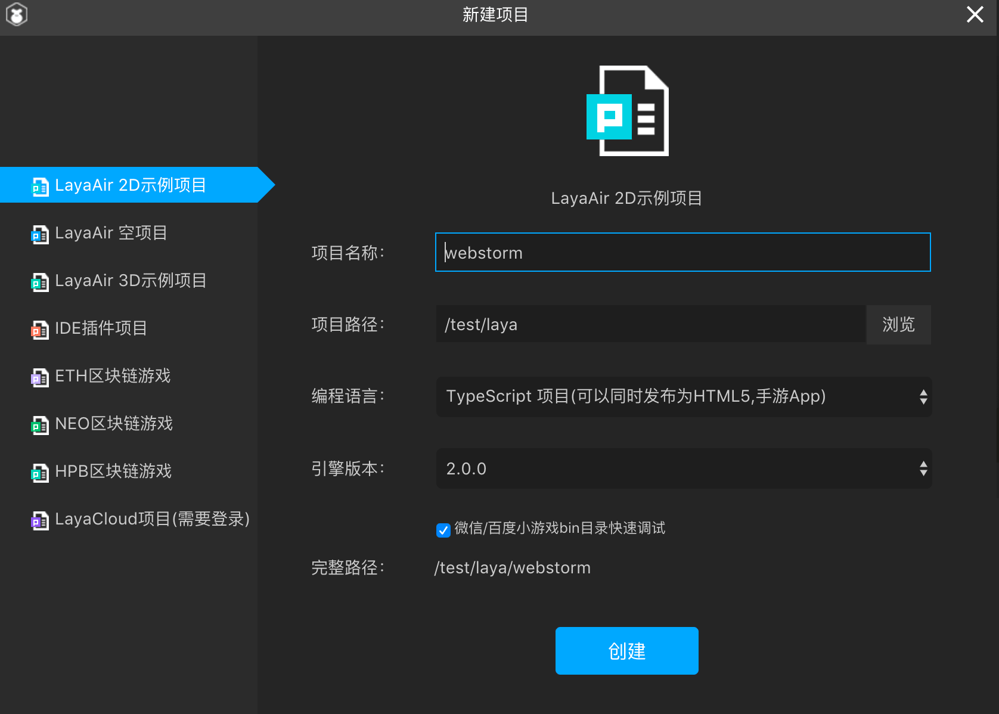
1. 我们看一下新建的目录。大概是这样子

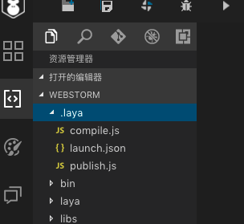


4. 此时 我们的bin 目录下面 没有js 目录，我们点击上面的编译按钮就会生成一个名字为“/test/laya/webstorm/bin/js/bundle.js”的文件。

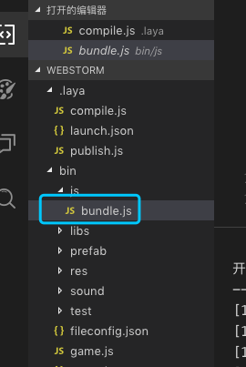

5. 我们可以打开看一下 编译后的文件，发现是编译后的js为了证明我们配置成功，我们需要在原来的代码里面添加一个输出比如`Main.ts`。

```typescript
onVersionLoaded(): void {
		//激活大小图映射，加载小图的时候，如果发现小图在大图合集里面，则优先加载大图合集，而不是小图
		Laya.AtlasInfoManager.enable("fileconfig.json", Laya.Handler.create(this, this.onConfigLoaded));
	}

	onConfigLoaded(): void {
		//加载IDE指定的场景
		GameConfig.startScene && Laya.Scene.open(GameConfig.startScene);
	}
```

6. 我们在`onConfigLoaded`函数里写上一行代码，比如

```typescript
console.log("Hello,WebStorm");
```

7. 原来的函数变成

```typescript
	onConfigLoaded(): void {
		//加载IDE指定的场景
		GameConfig.startScene && Laya.Scene.open(GameConfig.startScene);
		console.log("Hello,WebStorm");
	}
```

8. 截图如下


#### Webstorm 配置项目


首先我们用webstorm 打开项目 查看目录

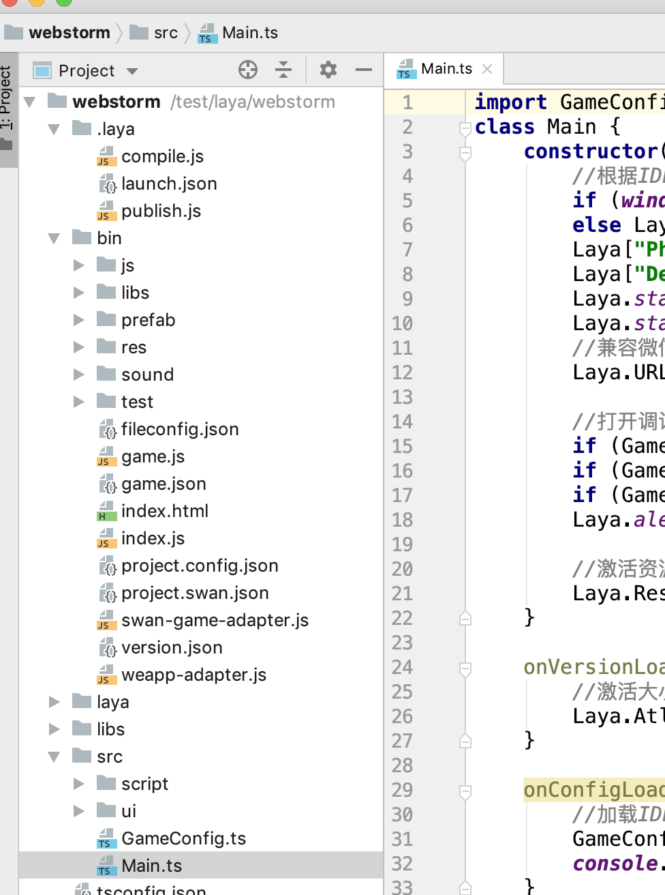

因为有时候在国内用npm命令有问题，我们可以选择用cnpm代替，此时我认为你已经安装好了cnpm环境。

- 首先我们需要安装一个全局的gulp(我是这样安装的，也许此步骤可以省去)

```
cnpm install gulp -g
```

- 然后全局安装 

```
 cnpm install browserify -g
```

```
cnpm install vinyl-source-stream -g
```

```
 cnpm install tsify -g
```

1. 此时我们的插件已经安装完毕，接下来需要我们调试 新建我们自己的`gulpfile.js`,选择`.laya/`目录下面 点击右键菜单选择 `新建命令` 

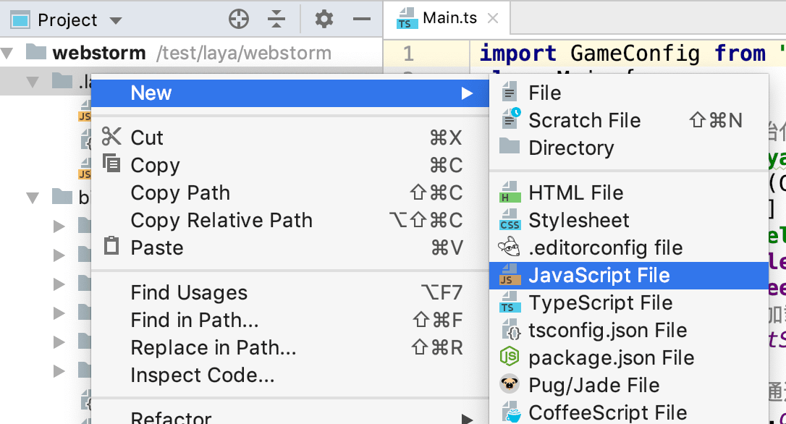


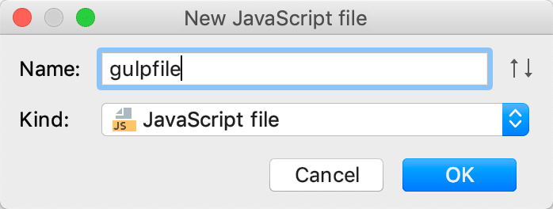

2. 我们此时 复制 `/test/laya/webstorm/.laya/compile.js` 路径下面的js 的内容 粘贴到我们新建的文件里面

```javascript
// v1.0.0
//是否使用IDE自带的node环境和插件，设置false后，则使用自己环境(使用命令行方式执行)
let useIDENode = process.argv[0].indexOf("LayaAir") > -1 ? true : false;
//获取Node插件和工作路径
let ideModuleDir = useIDENode ? process.argv[1].replace("gulp\\bin\\gulp.js", "").replace("gulp/bin/gulp.js", "") : "";
let workSpaceDir = useIDENode ? process.argv[2].replace("--gulpfile=", "").replace("\\.laya\\compile.js", "").replace("/.laya/compile.js", "") : "./../";

//引用插件模块
let gulp = require(ideModuleDir + "gulp");
let browserify = require(ideModuleDir + "browserify");
let source = require(ideModuleDir + "vinyl-source-stream");
let tsify = require(ideModuleDir + "tsify");

// 如果是发布时调用编译功能，增加prevTasks
let prevTasks = "";
if (global.publish) {
	prevTasks = ["loadConfig"];
}

//使用browserify，转换ts到js，并输出到bin/js目录
gulp.task("compile", prevTasks, function () {
	// 发布时调用编译功能，判断是否点击了编译选项
	if (global.publish && !global.config.compile) {
		return;
	} else if (global.publish && global.config.compile) {
		// 发布时调用编译，workSpaceDir使用publish.js里的变量
		workSpaceDir = global.workSpaceDir;
	}
	return browserify({
		basedir: workSpaceDir,
		//是否开启调试，开启后会生成jsmap，方便调试ts源码，但会影响编译速度
		debug: true,
		entries: ['src/Main.ts'],
		cache: {},
		packageCache: {}
	})
		//使用tsify插件编译ts
		.plugin(tsify)
		.bundle()
		//使用source把输出文件命名为bundle.js
		.pipe(source('bundle.js'))
		//把bundle.js复制到bin/js目录
		.pipe(gulp.dest(workSpaceDir + "/bin/js"));
});
```

3. 我们此时要修改上面的文件 我们要修改 路径和插件地址，下面是我修改好的文件内容

```javascript
// v1.0.0
//是否使用IDE自带的node环境和插件，设置false后，则使用自己环境(使用命令行方式执行)
// let useIDENode = process.argv[0].indexOf("LayaAir") > -1 ? true : false;
// //获取Node插件和工作路径
// let ideModuleDir = useIDENode ? process.argv[1].replace("gulp\\bin\\gulp.js", "").replace("gulp/bin/gulp.js", "") : "";
// let workSpaceDir = useIDENode ? process.argv[2].replace("--gulpfile=", "").replace("\\.laya\\compile.js", "").replace("/.laya/compile.js", "") : "./../";
//
// //引用插件模块
// let gulp = require(ideModuleDir + "gulp");
// let browserify = require(ideModuleDir + "browserify");
// let source = require(ideModuleDir + "vinyl-source-stream");
// let tsify = require(ideModuleDir + "tsify");

//引用插件模块
let ideModuleDir = process.argv[1].replace("gulp/bin/gulp.js", "");
let workSpaceDir = process.argv[4].replace("/.laya/gulpfile.js", "");
let gulp = require(ideModuleDir + "gulp");
let browserify = require(ideModuleDir + "browserify");
let source = require("/usr/local/lib/node_modules/" + "vinyl-source-stream");
let tsify = require("/usr/local/lib/node_modules/" + "tsify");

// 如果是发布时调用编译功能，增加prevTasks
let prevTasks = "";
if (global.publish) {
	prevTasks = ["loadConfig"];
}

//使用browserify，转换ts到js，并输出到bin/js目录
gulp.task("compile", prevTasks, function () {
	// 发布时调用编译功能，判断是否点击了编译选项
	if (global.publish && !global.config.compile) {
		return;
	} else if (global.publish && global.config.compile) {
		// 发布时调用编译，workSpaceDir使用publish.js里的变量
		workSpaceDir = global.workSpaceDir;
	}
	return browserify({
		basedir: workSpaceDir,
		//是否开启调试，开启后会生成jsmap，方便调试ts源码，但会影响编译速度
		debug: true,
		entries: ['src/Main.ts'],
		cache: {},
		packageCache: {}
	})
		//使用tsify插件编译ts
		.plugin(tsify)
		.bundle()
		//使用source把输出文件命名为bundle.js
		.pipe(source('bundle.js'))
		//把bundle.js复制到bin/js目录
		.pipe(gulp.dest(workSpaceDir + "/bin/js"));
});
```

**注意** 里面的地址 需要你根据自己电脑的路径 分析 去设置 比如我`process.argv`的路径是:

```json
["/usr/local/bin/node","/Applications/LayaAirIDE 2.app/Contents/Resources/app/node_modules/gulp/bin/gulp.js","--color","--gulpfile","/workspace/hotpot/.laya/gulpfile.js","compile"]
```

4. 我们选择 我们新建的 gulpfile.js 文件 鼠标右键 选择 Show Gulp Tasks 菜单

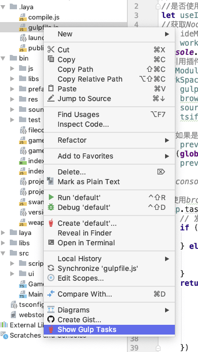

5. 我们看到报错  然后我们点击蓝色的文字 配置我们的路径 

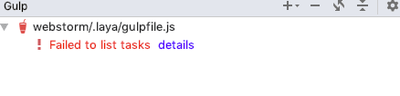

6. 然后继续点击蓝色的文字 选择

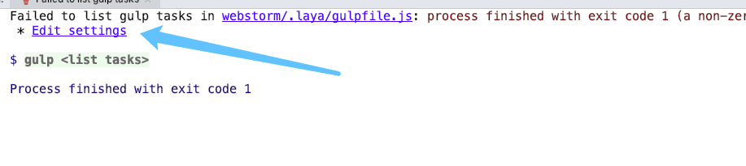

7. 此时出现一个对话框 

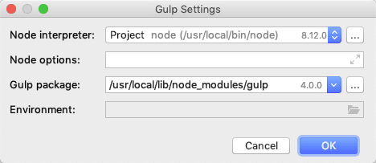

8.我们填入 本地机器上面 LayaAir 的里面的gulp的路径 比如我的是

```bash
/Applications/LayaAirIDE2.app/Contents/Resources/app/node_modules/gulp
```

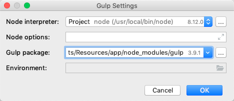

9. 点击确定 我们重新刷新我们的 gulp task 得到如下图所示

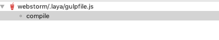

此时我们双击compile 文本 开始编译文件

```bash
/usr/local/bin/node "/Applications/LayaAirIDE 2.app/Contents/Resources/app/node_modules/gulp/bin/gulp.js" --color --gulpfile /test/laya/webstorm/.laya/gulpfile.js compile
laya_ide_time.require.single.gulp-util: 37.976ms
laya_ide_time.require.single.pretty-hrtime: 0.416ms
laya_ide_time.require.single.chalk: 3.029ms
laya_ide_time.require.single.semver: 1.742ms
laya_ide_time.require.single.archy: 0.407ms
laya_ide_time.require.single.liftoff: 44.879ms
laya_ide_time.require.single.tildify: 0.752ms
laya_ide_time.require.single.interpret: 0.491ms
laya_ide_time.require.single.v8flags: 0.632ms
laya_ide_time.require.single.../lib/completion: 0.272ms
laya_ide_time.require.single.minimist: 0.545ms
laya_ide_time.require.single.../lib/taskTree: 0.226ms
laya_ide_time.require.single.path: 0.008ms
laya_ide_time.gulp.all.require: 93.966ms
laya_ide_time.require.single.../package: 0.245ms
laya_ide_time.gulp.exec: 23.106ms
[20:15:22] Working directory changed to /Applications/LayaAirIDE 2.app/Contents/Resources/app
laya_ide_time.require.single./test/laya/webstorm/.laya/gulpfile.js: 120.108ms
[20:15:22] Using gulpfile /test/laya/webstorm/.laya/gulpfile.js
laya_ide_time.require.single./Applications/LayaAirIDE 2.app/Contents/Resources/app/node_modules/gulp/index.js: 0.040ms
[20:15:22] Starting 'compile'...
laya_ide_time.gulp.taskcompile: 2735.874ms
[20:15:25] Finished 'compile' after 2.74 s
laya.ide.complete

Process finished with exit code 0

```

发现我们已经 构建编译成功！！

### 验证结果

1. 我们全局搜索 `console.log("Hello,WebStorm")`发现已经被编译到了 bundle.js 里面

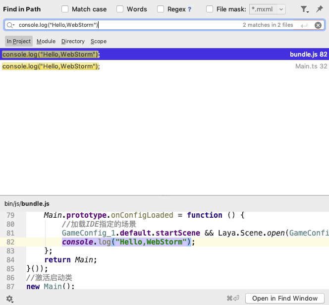

2. 我们选择 bin 目录下面的index.html 文件 debug 调试

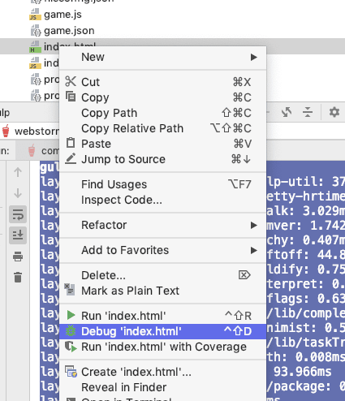

发现游戏可以正常玩，一切搞定。

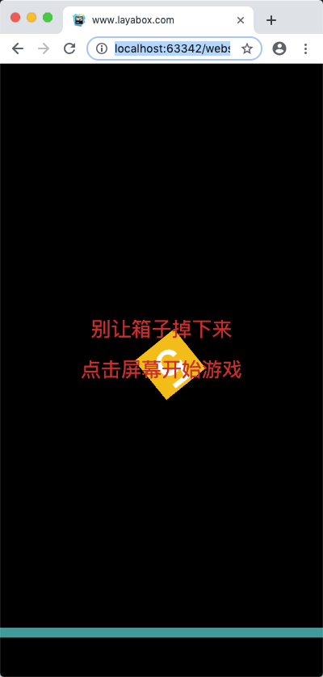

### LayaAir IDE 2.2.0beta4版本（更新于2019.08.24）

今天更新了引擎 这次发现官方更改了编译工具和插件需要新的配置。我鼓捣了半天，终于搞定，至于其中的根本内容我尚不清楚，目前先用一个可以编译的文件，我们知道 compile.js文件是官方的编译文件，我们的编译文件在同目录下面新建一个 名字为 gulpfile.js的文件。把compile.js 的全部内容复制过去。然后修改第一行代码

原代码

```javascript
let useIDENode = process.argv[0].indexOf("LayaAir") > -1 ? true : false;
```

修改为

```javascript
let addvalue = process.argv.splice(2,2)[1];
process.argv[process.argv.length-2] = addvalue+"="+process.argv[process.argv.length-2].replace("gulpfile","compile");
let useIDENode = process.argv[0].indexOf("node") > -1 ? true : false;
```

之所以这么修改是因为

layaIde 编译 compile.js 打印的 process.argv  内容是

```json
["/Applications/LayaAirIDE2.app/Contents/Frameworks/Code Helper.app/Contents/MacOS/Code Helper","/Applications/LayaAirIDE2.app/Contents/Resources/app/node_modules/gulp/bin/gulp.js","--gulpfile=/test/laya/ball/.laya/compile.js","compile"]
```

而我本地的 Webstorm 编译 gulpfile.js 打印的 process.argv  内容是

```json
["/usr/local/bin/node","/Applications/LayaAirIDE2.app/Contents/Resources/app/node_modules/gulp/bin/gulp.js","--color","--gulpfile","/test/laya/ball/.laya/gulpfile.js","compile"]
```

读者可以根据自己的环境  更改内容，以上便是如果使用Webstorm 编译Laya2.0项目.

注意: 这样编译后，我们发现在调试的时候，编译器总是指向编译后的JavaScript文件，这个是个很头疼的时候，上次因为忙，今天得以进一步了解，其实还是参数的问题

需要修改代码：

原代码：

```javascript
//使用browserify，转换ts到js，并输出到bin/js目录
gulp.task("compile", prevTasks, function () {
	// 发布时调用编译功能，判断是否点击了编译选项
	if (global.publish && !global.config.compile) {
		return;
	} else if (global.publish && global.config.compile) {
		// 发布时调用编译，workSpaceDir使用publish.js里的变量
		workSpaceDir = global.workSpaceDir;
	}

	return rollup.rollup({
		input: workSpaceDir + '/src/Main.ts',
		treeshake: true,//建议忽略
		plugins: [
			typescript({
				check: false, //Set to false to avoid doing any diagnostic checks on the code
				tsconfigOverride:{compilerOptions:{removeComments: true}}
			}),
			glsl({
				// By default, everything gets included
				include: /.*(.glsl|.vs|.fs)$/,
				sourceMap: false,
				compress:false
			}),
			/*terser({
				output: {
				},
				numWorkers:1,//Amount of workers to spawn. Defaults to the number of CPUs minus 1
				sourcemap: false
			})*/        
		]
	}).then(bundle => {
		return bundle.write({
			file: workSpaceDir + '/bin/js/bundle.js',
			format: 'iife',
			name: 'laya',
			sourcemap: false
		});
	});
});
```

把后面的代码 修改:

```javascript
return bundle.write({
			file: workSpaceDir + '/bin/js/bundle.js',
			format: 'iife',
			name: 'laya',
			sourcemap: true
		});
```

把 ”sourcemap“这个配置修改成为true 后 调试的文件就指向了我们编码的ts文。至此完美解决问题，升级引擎。

### 总结

总的来说，这次配置花费了我不少精力，之前一直找，没有遇到合适的方法，后面反复测试，查看官网Laya项目目录结构和文档，最后总算是配置成功了，当然里面也还有许多不足，比如个别路径不能改成 参数化，学习嘛，一点点进步，以后继续努力，继续加油！

### 后记

2019 年3月5日更新，今天在群里，有群友提醒 可以用另外一种办法 就是 官方给了 命令行工具

链接地址  ：https://npm.taobao.org/package/layaair2-cmd

整个 2.0 的介绍  https://mp.weixin.qq.com/s/AMS7xEqVbLpbfo2F5li3vw

> #### 1、layaair2-cmd 安装方式
>
> ```
> npm install layaair2-cmd -g
> ```
>
> > 如果有npm安装都不会用的开发者请面壁并跳过命令行发布文档，老老实实的用LayaAirIDE的界面发布。
>
> #### 2、layaair2-cmd 都支持哪些命令
>
> 我们通过输入 `layaair2-cmd -h` 回车后 可以查看到layaair2-cmd的帮助信息，
>
> 回车后输出内容如下：
>
> ```
> Usage: layaair2-cmd [command] [args]
> 
> Options:
>  -v, --version  output the version number
>  -h, --help     output usage information
> 
> Commands:
>  compile        compile project.
>  publish        publish project.
>  help [cmd]     display help for [cmd]
> ```
>
> #### layaair2-cmd的帮助说明：
>
> 帮助中首先给出了命令的使用范例：
>
> ```
> Usage: layaair2-cmd [command] [args]
> ```
>
> 说明：layaair2-cmd 后面先是 具体对应命令，然后是该命令的参数。
>
> ```
> Options:
>  -v, --version  output the version number
>  -h, --help     output usage information
> ```
>
> 说明：不输入命令的时候 `-h` 打印输出的是刚刚看到的layaair2-cmd帮助说明。`-v`  打印输出的是layaair2-cmd版本号。当然，如果输入具体命令，那 -h 和 -v 就是对应命令的帮助说明和版本号了。
>
> ```
> Commands:
>  compile        compile project.
>  publish        publish project.
>  help [cmd]     display help for [cmd]
> ```
>
> 说明：那layaair2-cmd都支持哪些命令呢，-h的帮助说明里也直接给出了三个命令，compile、publish、help。
>
> `compile`是项目编译命令，该命令会生成编译后的JavaScript文件，相当于IDE里的F8编译。这里需要注意的是，如果发布面板那里勾选了`是否重新编译项目`，那开发者在自己的命令行发布流程里就不要再调用这个命令了，否则会导致项目被编译两次，浪费发布时间。
>
> `publish`是项目发布，相当于发布面板里点击了发布按钮。这块比较重要，一会拿出来单独介绍。
>
> `help`是layaair2-cmd的帮助说明，与 `layaair2-cmd -h`显示效果一样。
>
> #### 3、项目发布命令的使用与注意事项
>
> 我们还是先通过`layaair2-cmd publish -h`查看一下发布命令的帮助。
>
> 回车后输入内容如下：
>
> ```
>    Usage: layaair2-cmd publish [options]
> 
>    Options:
>    -v, --version              output the version number
>    -c, --config <configPlatform>  Set the publishing platform name[web|wxgame|qqw
>    anyiwan|bdgame]
>    -h, --help                     output usage information
> ```
>
> 我们通过帮助可以看到，最关键的参数是 `-c` ，目前支持web、wxgame、qqwanyiwan、bdgame这四个参数。
>
> `web`是发布HTML5的web版本。
>
> `wxgame`是发布微信小游戏平台。
>
> `qqwanyiwan`是发布QQ轻游戏平台（也叫QQ玩一玩）。
>
> `bdgame`是发布百度小游戏平台。
>
> ##### 使用示例如下：
>
> ```
> layaair2-cmd publish -c wxgame
> ```
>
> #### 发布注意事项
>
> 1. layaair2-cmd的项目编译（compile）与项目发布（publish）命令必须要在项目的根目录来执行使用。
> 2. 在调用项目发布命令行前要检查一下，是否有发布平台对应的json，比如发布web版，项目文件夹`.laya`目录下，应该有web.json。发布微信小游戏要有wxgame.json。同理，其它小游戏也要有对应的json。如果没有的，那先用LayaAirIDE的发布3.0工具选择对应的平台手工发布一次（特别提醒，一定要用3.0发布工具），发布工具会自动生成对应的json。json中保存的是发布工具中那些发布筛选规则与发布配置信息。

我自己在电脑上运行了由于一些包的更新和不支持没有成功，但是群里有人是成功的，大家可以借鉴这些办法。

**注意**：

- layaair2-cmd依赖于gulp，使用前请确保已经正确安装全局gulp。

- 所有命令都要在项目所在根目录运行。

  

### 参考文章

- [gulp详细入门教程](http://www.ydcss.com/archives/18)
- [Typescript构建工具集成](https://www.tslang.cn/docs/handbook/integrating-with-build-tools.html)
- [webstrom下运行gulp初试](https://blog.csdn.net/fc0511/article/details/78077035)
