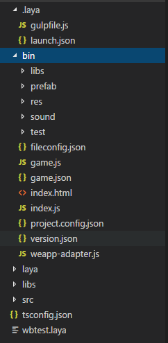
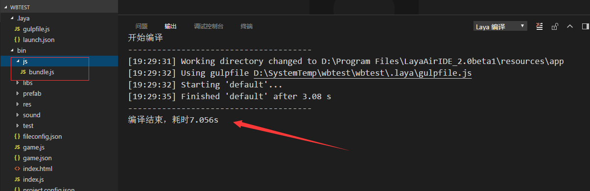
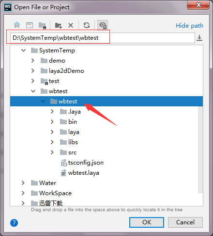
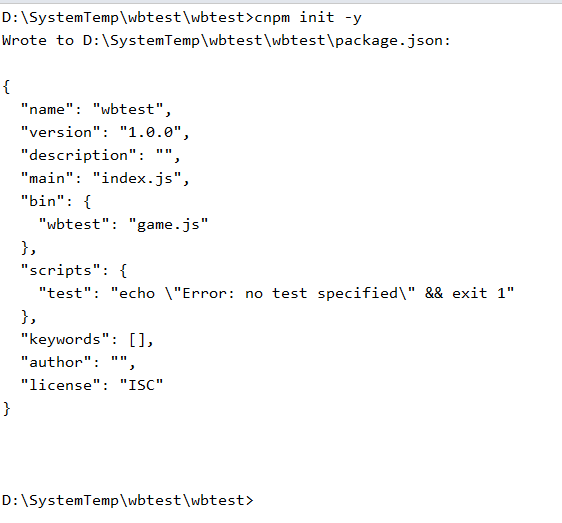
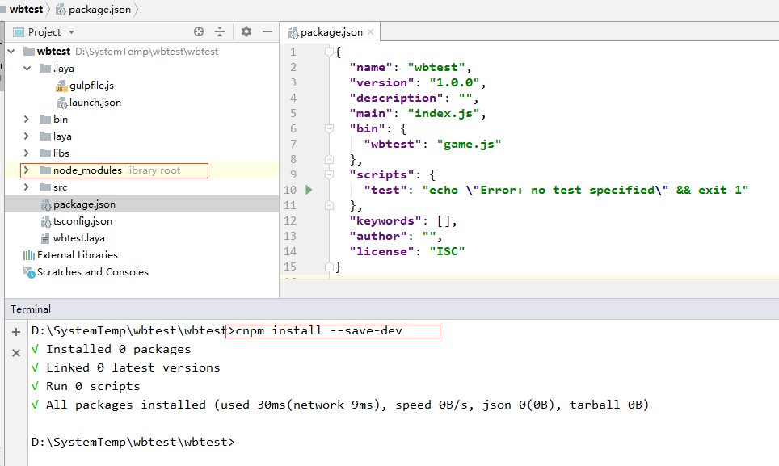
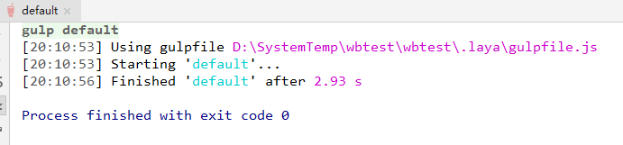
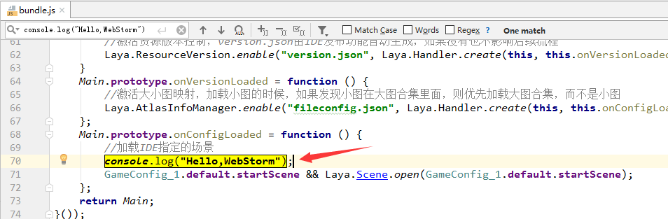

2018年9月15日，Layabox官方发布了全新的2.0系列，包括引擎和编辑器（`LayaAir2.0`），随后又发布了一个修复的版本。对于用Layabox引擎开发的小伙伴们，及时拥抱变化，学习新技能，让自己的项目或者游戏跑的更快，效率更高。

<!-- more -->

对于`Layabox1.0`，熟悉的人都应该很清楚，使用Typescript编码之后，在编译的时候，会在bin/js目录下面生成对应的后缀为`.js`文件。然后我们的代码是通过bin 目录下的 `index.html` 文件启动，通过加载对象的js类库，自定义的`.js`文件，运行游戏的。

习惯了`WebStorm`编码的同学，在写逻辑的时候，很多时候不管是界面还是快捷键或者是调试都感觉不太习惯，还好，二者可以很容易的兼容。

### Layabox1.X配置教程

- `LayaAir1.0` `webStorm`配置（默认你已经安装好了`npm`或者`cnpm`并且已经安装了`typescript`）

首先我们用LayaAir创建好了项目，打开我们根目录下面的tsconfig.json文件

```json
{
  "compilerOptions": {
    "module": "commonjs",
    "target": "es5",
    "outDir": "bin/js",
    "sourceMap": true
  },
  "exclude": [
    "node_modules"
  ]
}
```

看到什么变化没有？其实很简单了，就是添加了一行 `"outDir": "bin/js",`然后去设置一下Webstorm `Language&Frameworks` 下面的Typescript 设置就行，默认好像已经设置好了，你可以设置一下自己要编译的范围，这样在低配置的电脑上也可以很快，比如我的是 Current File，你看着自己设置即可。

### Layabox2.0配置教程

新发布的编辑器（Layabox2.0）在创建项目的时候，添加了一些新的配置，使用了 npm里面的 几个模块 有 gulp、browserify、vinyl-source-stream、tsify等，这样在构建编译项目的时候，只生成一个js 文件，位于“bin/js/”

```javascript
.laya/gulpfile.js文件里有详细 比如下面
//引用插件模块
let gulp = require(ideModuleDir + "gulp");
let browserify = require(ideModuleDir + "browserify");
let source = require(ideModuleDir + "vinyl-source-stream");
let tsify = require(ideModuleDir + "tsify");
```

1. 首先我们新建项目  比如 我的项目叫做 "wbtest" 项目地址位于“D:\SystemTemp\wbtest”，语言选择Typescript，然后点击创建按钮。

   


1. 我们看一下新建的目录。大概是这样子




此时 我们的bin 目录下面 没有js 目录，我们点击上面的编译按钮就会生成一个名字为“bandle.js”的文件。



我们可以打开看一下 编译后的文件，发现是编译后的js为了证明我们配置成功，我们需要在原来的代码里面添加一个输出比如`Main.ts`。

```typescript
onVersionLoaded(): void {
		//激活大小图映射，加载小图的时候，如果发现小图在大图合集里面，则优先加载大图合集，而不是小图
		Laya.AtlasInfoManager.enable("fileconfig.json", Laya.Handler.create(this, this.onConfigLoaded));
	}

	onConfigLoaded(): void {
		//加载IDE指定的场景
		GameConfig.startScene && Laya.Scene.open(GameConfig.startScene);
	}
```

我们在`onConfigLoaded`函数里写上一行代码，比如

```typescript
console.log("Hello,WebStorm");
```

原来的函数变成

```typescript
	onConfigLoaded(): void {
		//加载IDE指定的场景
		console.log("Hello,WebStorm");
		GameConfig.startScene && Laya.Scene.open(GameConfig.startScene);
	}
```

1. 因为有时候在国内用npm命令有问题，我们可以选择用cnpm代替，此时我认为你已经安装好了cnpm环境。

   - 首先我们需要安装一个全局的gulp(我是这样安装的，也许此步骤可以省去)

   ```bash
   cnpm install gulp -g
   ```

   - 我们此时用webstorm 打开我们的项目，选择我们的项目根目录即可。

   

   - 我们打开项目后 输入"cnpm init -y" 命令生成 package.json

   ```bash
   cnpm init -y
   ```

   


- 此时我们的项目里生成了一个文件

   

```json
   //json文件不能写注释，所以我以下的只为说明
   {
     "name": "wbtest",//项目名称（必须）
     "version": "1.0.0", //项目版本（必须）
     "description": "",//项目描述（必须）
     "main": "index.js",//项目主页
     "bin": {
       "wbtest": "game.js"
     },
     "scripts": {
       "test": "echo \"Error: no test specified\" && exit 1"
     },
     "keywords": [],
     "author": "",//项目作者信息
     "license": "ISC" //项目许可协议
   }
   
```

- 然后，我们需要在项目本地安装插件（gulp、gulp-less、gulp-sass、browserify、vinyl-source-stream、tsify）
- 

```bash
   cnpm install --save-dev
```

- 然后安装 gulp、gulp-less、gulp-sass

```bash
   cnpm install gulp --save-dev
```

```bash
   cnpm install gulp-less --save-dev
```

```bash
   cnpm install gulp-sass --save-dev
```

   我的输出如下：

```bash
   √ Installed 1 packages
   √ Linked 196 latest versions
   √ Run 0 scripts
   deprecate gulp@3.9.1 › gulp-util@^3.0.0 gulp-util is deprecated - replace it, following the guidelines at https://medium.com/gulpjs/gulp-util-ca3b
   1f9f9ac5
   deprecate gulp@3.9.1 › vinyl-fs@0.3.14 › graceful-fs@^3.0.0 please upgrade to graceful-fs 4 for compatibility with current and future versions of
   Node.js
   deprecate gulp@3.9.1 › vinyl-fs@0.3.14 › glob-stream@3.1.18 › minimatch@^2.0.1 Please update to minimatch 3.0.2 or higher to avoid a RegExp DoS is
   sue
   deprecate gulp@3.9.1 › vinyl-fs@0.3.14 › glob-watcher@0.0.6 › gaze@0.5.2 › globule@0.1.0 › minimatch@~0.2.11 Please update to minimatch 3.0.2 or h
   igher to avoid a RegExp DoS issue
   deprecate gulp@3.9.1 › vinyl-fs@0.3.14 › glob-watcher@0.0.6 › gaze@0.5.2 › globule@0.1.0 › glob@3.1.21 › graceful-fs@~1.2.0 please upgrade to grac
   eful-fs 4 for compatibility with current and future versions of Node.js
   √ All packages installed (224 packages installed from npm registry, used 2s(network 2s), speed 397.32kB/s, json 197(899.13kB), tarball 0B)
   
   D:\SystemTemp\wbtest\wbtest>cnpm install gulp-less --save-dev
   √ Installed 1 packages
   √ Linked 107 latest versions
   √ Run 0 scripts
   √ All packages installed (97 packages installed from npm registry, used 3s(network 3s), speed 350.76kB/s, json 108(1.05MB), tarball 0B)
   
   D:\SystemTemp\wbtest\wbtest>cnpm install gulp-sass --save-dev
   √ Installed 1 packages
   √ Linked 147 latest versions
   Cached binary found at C:\Users\asroads\.npminstall_tarball\node-sass\4.9.3\win32-x64-57_binding.node
   Binary found at D:\SystemTemp\wbtest\wbtest\node_modules\_node-sass@4.9.3@node-sass\vendor\win32-x64-57\binding.node
   Testing binary
   Binary is fine
   √ Run 1 scripts
   √ All packages installed (111 packages installed from npm registry, used 4s(network 3s), speed 354.04kB/s, json 148(940.7kB), tarball 0B)
   
   D:\SystemTemp\wbtest\wbtest>
   
```

- 继续安装其他插件
- 

```bash
   cnpm install browserify --save-dev
```

```bash
   cnpm install vinyl-source-stream --save-dev
```

```bash
   cnpm install tsify --save-dev
```

   我的本地输出结果如下

```bash
   D:\SystemTemp\wbtest\wbtest>cnpm install browserify --save-dev
   √ Installed 1 packages
   √ Linked 117 latest versions
   √ Run 0 scripts
   Recently updated (since 2018-09-20): 2 packages (detail see file D:\SystemTemp\wbtest\wbtest\node_modules\.recently_updates.txt)
   √ All packages installed (108 packages installed from npm registry, used 3s(network 3s), speed 455.88kB/s, json 118(1.2MB), tarball 0B)
   
   D:\SystemTemp\wbtest\wbtest>cnpm install vinyl-source-stream --save-dev
   √ Installed 1 packages
   √ Linked 11 latest versions
   √ Run 0 scripts
   √ All packages installed (6 packages installed from npm registry, used 614ms(network 601ms), speed 114kB/s, json 12(68.52kB), tarball 0B)
   
   D:\SystemTemp\wbtest\wbtest>cnpm install tsify --save-dev
   √ Installed 1 packages
   √ Linked 11 latest versions
   √ Run 0 scripts
   peerDependencies WARNING tsify@* requires a peer of typescript@>= 2.x but none was installed
   √ All packages installed (4 packages installed from npm registry, used 1s(network 1s), speed 469.4kB/s, json 12(635.1kB), tarball 0B)
   
   
```

- 我们还要给项目安装一个 Typescript模块

```bash
   cnpm install typescript --save-dev
```

   输出如下

```bash
   D:\SystemTemp\wbtest\wbtest>cnpm install typescript --save-dev
   √ Installed 1 packages
   √ Linked 0 latest versions
   √ Run 0 scripts
   √ All packages installed (1 packages installed from npm registry, used 1s(network 1s), speed 80.38kB/s, json 1(83.44kB), tarball 0B)
   
   D:\SystemTemp\wbtest\wbtest>
   
```


   此时我们的插件已经安装完毕，接下来需要我们调试 `gulpfile.js`

1. 我们选择`.laya/gulpfile.js`点击右键菜单选择 `Show gulp Tasks`

   

2. 此时我们调出了一个gulp面板


1. 点击这个default 开始构建项目



1. 我们去 生成的文件 搜索 `console.log("Hello,WebStorm");`




发现我们已经 构建编译成功！！

### 总结

总的来讲这中间，是要理解layabox 项目的结构和构造，在尽量少的情况下更改我们的项目，然后此时我们的根目录下面多了一个`package.json` 和一个你`npm` 生成的`node_modules`目录，我们可以参加我前面写的文章“[git忽略而不提交文件的3种情形](http://www.asroads.com/2018/08/19/tool/git忽略而不提交文件的3种情形/index.html)” 可以在团队开发的时候，保留自己的个性，不必把自己的个性化，强加给其他开发的伙伴们。


#### 后期发现

后面发现 上面的配置虽然能够正确的编译代码，但是运行的时候有问题，具体原因是 因为我们的.laya/gulpfile.js文件，里面的路径参数不同，我们这个时候有两种一种办法是 直接 在layaair 里面输出路径，然后给 上面的对应 变量赋值，另外一种办法是，把文件里面 每个对应的变量 的路径，设置成自己电脑环境的变量（最近比较忙，以后有空了再细细研究）。我用直接在layabair 里输出变量赋值的办法 成功解决了。亲测有效，也欢迎你去尝试自己设置，这样彻底解决的问题。

### 参考文章

- [gulp详细入门教程](http://www.ydcss.com/archives/18)
- [Typescript构建工具集成](https://www.tslang.cn/docs/handbook/integrating-with-build-tools.html)
- [webstrom下运行gulp初试](https://blog.csdn.net/fc0511/article/details/78077035)

