### Webstorm 常用的一些技巧

从2015年开始使用Webstorm有几年了，很多时候遇到问题总是去网上搜索，显得麻烦，顺便记录一些，常用的技巧，这样以后重装电脑系统了，换环境了，可以一并找到，不用每次遇到问题都重新搜索一遍。（持续更新）

<!-- more -->

### Mac彻底删除WebStorm 

#### 背景原因：

有时候不小心点击了某个地方，或者执行了某些操作，回不到正常的编程环境,或者错误设置了某些选项回不到最初的设置了

#### 步骤:

###### 一. 删除程序应用

1. 点击Finder
2. 选择左侧栏中的**Applcations**选项
3. 找到webstrom应用，点击右键，选择**Move to Trash(移入到垃圾箱)**
4. 将垃圾箱清空

###### 二. 删除目录下的App文件夹

1. 打开终端
2. **cd ~/Library/Preferences/**
3. ls 查看该目录下所有App文件夹,找到webstrom的文件夹(我的是WebStrom2018.3)
4. rm -rf WebStrom2018.3
5. **cd ~/Library/Caches/**
6. ls 查看该目录下所有App文件夹,找到webstrom的文件夹(我的是WebStrom2018.3)
7. rm -rf WebStrom2018.3
8. **cd ~/Library/Application Support/**
9. ls 查看该目录下所有App文件夹,找到webstrom的文件夹(我的是WebStrom2018.3)
10. rm -rf WebStrom2018.3
11. **~/Library/Logs/**
12. ls 查看该目录下所有App文件夹,找到webstrom的文件夹(我的是WebStrom2018.3)
13. rm -rf WebStrom2018.3
14. 当前已完全卸载了
     注：如果命令不能进入目录，利用Command + Shift + G 快捷键跳转到某个目录，以此删除即可
15. 原文链接：https://juejin.im/post/5ce20342e51d4510bf1d65d2

**注意：如果是最新版的 Webstorm 需要删除 的是 `jetbrains` 这个名字开头 或者含有 jetbrains 的文件夹 即可**

**~/Library/Application Support/**  有两个文件夹

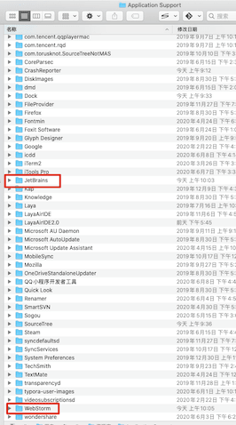

**记得 重置后 要 重置缓存 必要的话 **

- 删除项目下面的 .idea 文件夹
- Invalidate Cache/Restart

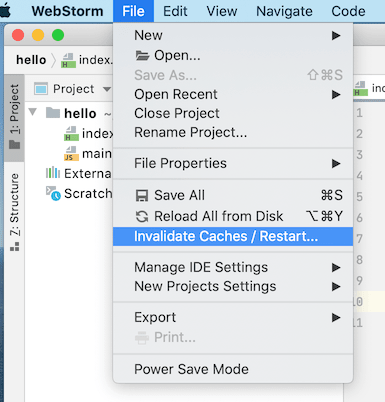

### JavaScript 项目跨域

#### 详细步骤

- 做游戏需要连接服务器调试，有时候访问需要跨域

- 解决办法：

  	- 在Webstorm 设置的 Web Browsers 下 大家自己调试的浏览器 点击编辑 在命令行里输入

  ```bash
  
  --args --disable-web-security --user-data-dir
  ```
  
  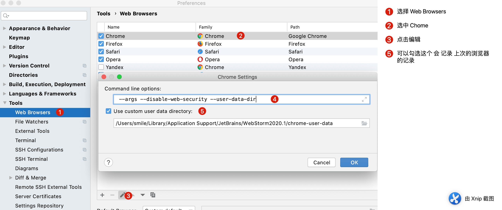

顺便推荐一款Chome 清缓存和本地数据的插件：

#### Clear Cache


地址：https://chrome.google.com/webstore/detail/clear-cache/cppjkneekbjaeellbfkmgnhonkkjfpdn

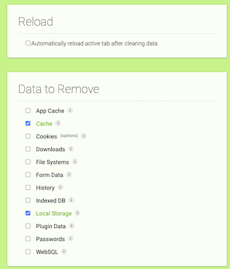


选择上面两项即可。

#### LocalStorage Manager

地址：https://chrome.google.com/webstore/detail/localstorage-manager/fkhoimdhngkiicbjobkinobjkoefhkap


#### 如何去掉 拓展程序按钮 

地址：http://blog.asroads.com/post/bc9dfd0b.html

### 忽略隐藏指定类型的文件指定文件(如.meta)不显示

Cocos 项目 在Webstorm 里面打开后 每个文件都佩带一个 .meta 文件，想忽略不显示

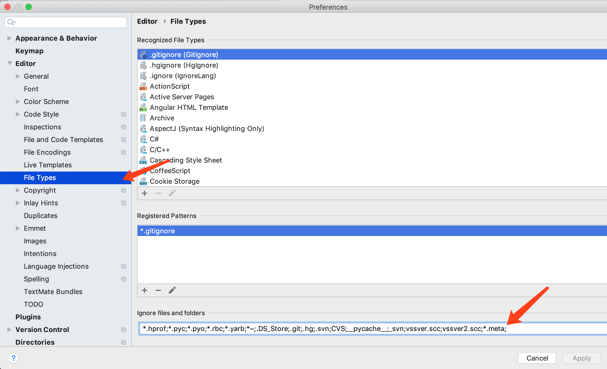

忽略文件加入:

```javascript
*.meta;
```

以上即可。

Webstorm 2020.3 升级后 界面更改  2020-12-01 更新

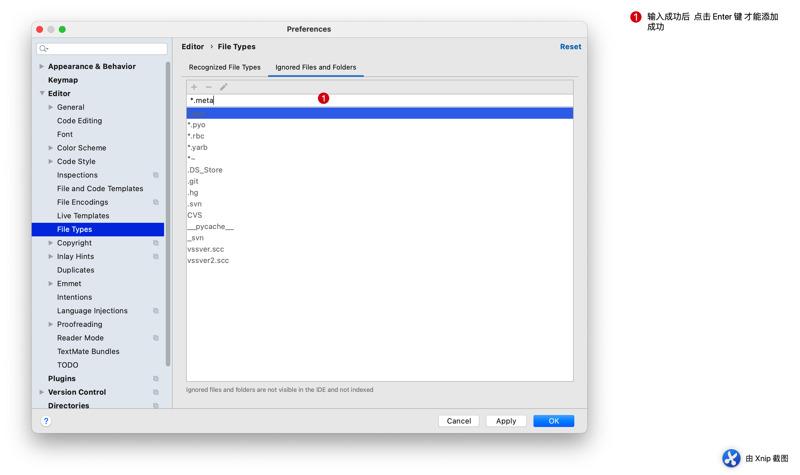

此时我们添加后无论是 点击 Apply 或者 OK 都不生效 或者是 Apply 按钮灰色  此时要按照下面操作

**注意： 此时应该在添加自己忽略的类型后 键盘操作 `Enter（回车）` 键**


### 搜索忽略指定的文件夹

有时候项目内很多文件和我们研发调试代码无关，比如素材或者派生文件，此时我们需要忽略这些文件，这样在查找问题的生活就极大的缩小了范围。

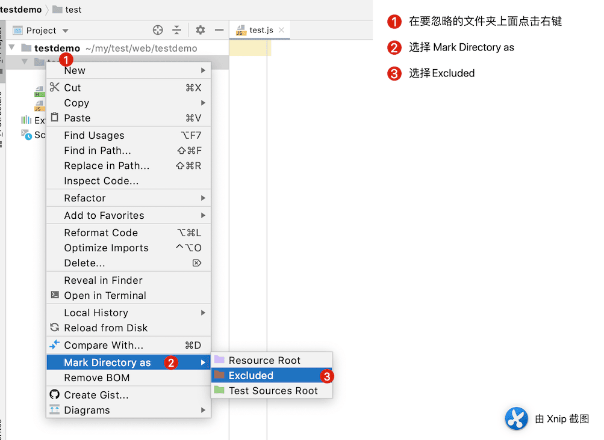

同理 想要取消忽略 再次选择 设置即可

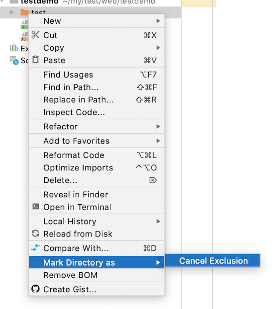

### Webstorm Consloe 面板 中文不能输出

有时候我们安装了新的版本 Webstorm 后发现 控制面板 不能输出 中文

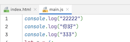

结果这样显示：

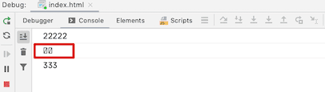

先说说 网上搜索的方法（经查看设置后 问题依然存在）

首先 采用 本地安装目录中bin文件夹下的webstorm.vmoptions   -Dfile.encoding=UTF-8
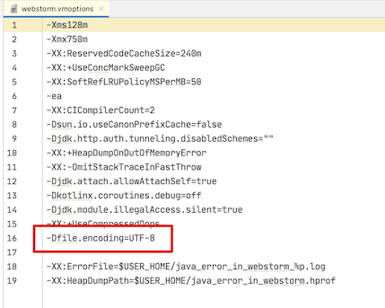

File>Setting>Editor>File Encodings，将Global Encoding、Project Encoding、Default encodeing for properties files这三项都设置成UTF-8，点击OK或者Apply

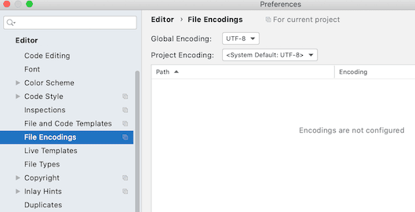

问题依然存在，怎么办，自己摸索了很久。终于找到原因，就是字体问题。

我们设置字体（能显示中文的字体）

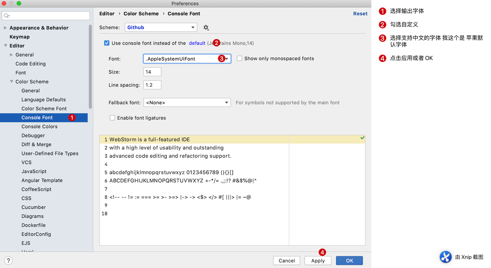

最后成功了！

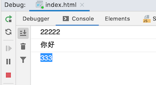

最后 重启 Webstorm 即可解决乱码问题。(注意 一定是完全退出，不是关闭项目打开 是退出Webstorm 重新打开)

### 文件Size过大无法格式化

起因：我本地有个压缩后的Javascript文件特别大，大于20MB了，此时无法使用WebStorm自带的代码格式化工具格式化代码

查找：经过一番查找才知道原因是：

Users often change the location of the [default IDE directories](https://www.jetbrains.com/help/webstorm/directories-used-by-the-ide-to-store-settings-caches-plugins-and-logs.html). For more information, refer to [Change the location of IDE directories](https://www.jetbrains.com/help/webstorm/directories-used-by-the-ide-to-store-settings-caches-plugins-and-logs.html#change-ide-dirs).

Limits that can affect performance:

| Property                         | Description                                                  |
| -------------------------------- | ------------------------------------------------------------ |
| `idea.max.content.load.filesize` | Maximum size of files (in kilobytes) that WebStorm is able to open. Working with large files can affect editor performance and increase memory consumption. The default value is `20000`. |
| `idea.max.intellisense.filesize` | Maximum size of files (in kilobytes) for which WebStorm provides coding assistance. Coding assistance for large files can affect editor performance and increase memory consumption. The default value is `2500`. |
| `idea.cycle.buffer`              | Maximum size of the console cyclic buffer (in kilobytes). If the console output size exceeds this value, the oldest lines are deleted. To disable the cyclic buffer, set `idea.cycle.buffer.size=disabled`. |
| `idea.max.vcs.loaded.size.kb`    | Maximum size (in kilobytes) that WebStorm loads for showing past file contents when [comparing changes](https://www.jetbrains.com/help/webstorm/comparing-files-and-folders.html). The default value is `20480`. |

解决方法：

1. 打开webstorm 的 help菜单

   

   找到 Edit Custom Properties 选项。

2. 设置为：

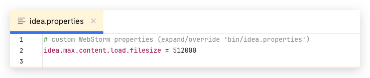

```
idea.max.content.load.filesize = 512000
```

3. 重启Webstorm 可以正常格式化

 如果不能正常生效 去 APP 配置文件下 修改同名文件 idea.properties 

```
#---------------------------------------------------------------------
idea.max.intellisense.filesize=512000

#---------------------------------------------------------------------
# Maximum file size (in KiB) the IDE is able to open.
#---------------------------------------------------------------------
idea.max.content.load.filesize=512000
```

参考链接 https://www.jetbrains.com/help/webstorm/tuning-the-ide.html#configure-platform-properties

### "More than 100 matches" in search 搜索结果超过100个内容时，如何显示更多

当搜索内容超过100个时候，webstorm 默认只显示100个，如何显示更多呢？

在setting->advanced Setting 中可以找到这个值，直接修改。

### 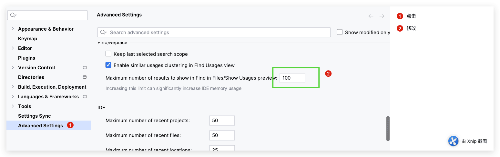

参考地址：[webstorm 2021.2 linux版本设置搜索文件匹配最大条数](https://blog.csdn.net/qielanyu_/article/details/119924981) 

#### webstorm 删除 最近项目列表

比如我的路径是：

```
/Users/ydc012/Library/Application Support/JetBrains/WebStorm2024.1/options/recentProjects.xml
```

使用文本编辑器打开 `recentProjects.xml` 文件。

1. **清空最近项目列表**：
2. 在  `recentProjects.xml` 文件中，删除  标签及其所有子标签的内容，确保文件格式正确。例如：

```xml
<application>
  <component name="RecentProjectsManager">
    <!-- 清空此处内容 -->
  </component>
</application>
```

3. **保存并关闭文件**。

4. **重新打开 WebStorm**：你会发现最近项目列表已经被清空。
