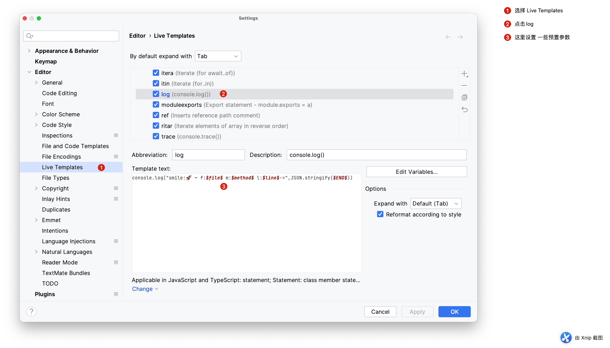
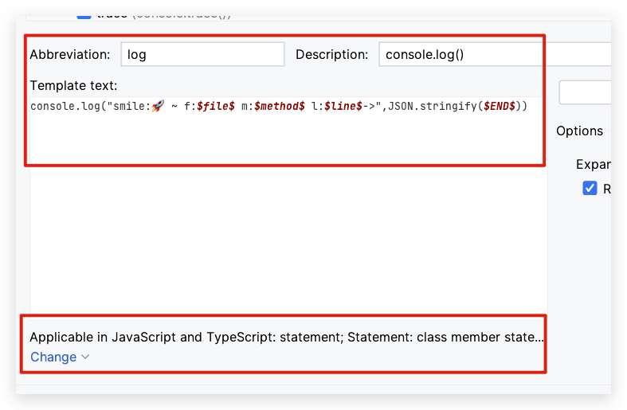
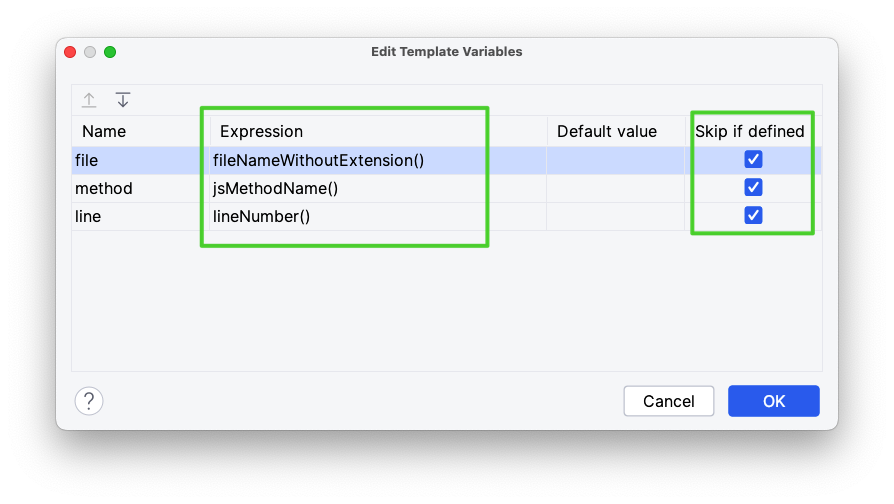
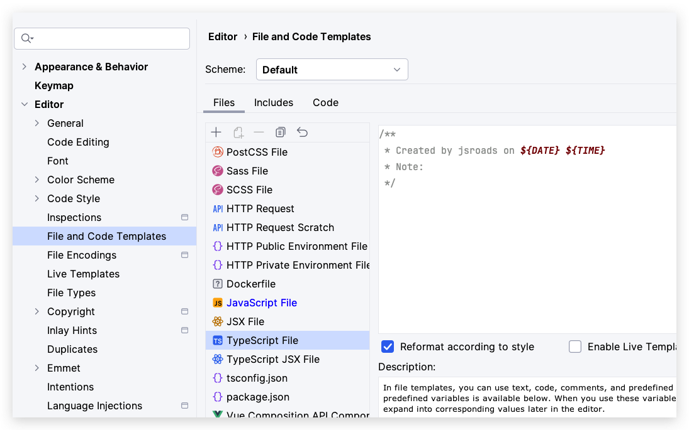

程序开发一直以来都是使用Webstorm，平时常用的调试技巧除了断点调试就是输出日志，之前自己也设置过console的格式，但是里面添加参数一直没有仔细研究过，下面说一下具体的一些步骤操作。
<!--more-->

1. 打开设置面板(windows 快捷键： ctrl + alt + s) ，找到 编辑器 -> 实时模板 --> JavaScript （如图）



2. 找到 **log** 修改模板为 `console.log("smile:🚀 ~ f:$file$ m:$method$ l:$line$->",JSON.stringify($END$))`



3. 点击模板右边的 ***编辑变量*** 按钮，选择变量表达式（说到自定义嘛，大家就懂了吧，我这里是加了个小火箭 🚀 ）



4. 输入 ***log*** 然后 ***tab*** 直接生成打印模板信息最后上图，说一下打印信息中包含，文件名 方法名 行数


#### 其他



```javascript
/**
 * Created by jsroads on ${DATE} ${TIME} 
 * Note:
 */
```

### 参考

- [webstorm 一键 console.log](https://blog.csdn.net/simpleDDDu/article/details/118418413)