游戏上线后难免会出现一些意料之外的`bug`，网络问题是常见的问题之一，有时候因为本地环境测试正常，线上环境却返回异常数据，此时如何没有办法获取网络日志和数据对于解决问题来说难度增加了不少，于是抓包工具成为了解决问题的桥梁。下面就简单的说一下如何在Windows 10如何使用`Charles`抓包PC微信小游戏
<!--more-->

## 环境和软件

- Windows 10
- PC微信小游戏
- Charles 4.6.3

## 具体步骤

### 安装软件

1. 首先安装我们的抓包软件 `Charles` 

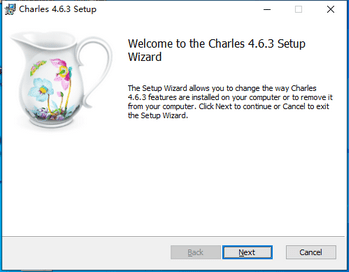

2. 安装完毕后，需要进一步骤设置，然后启动我们的软件

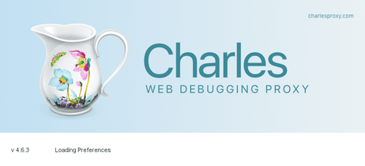

### 安装证书

1. windows下证书的安装 点击 Help -> SSL Proxying -> Install Charies Root Certificate

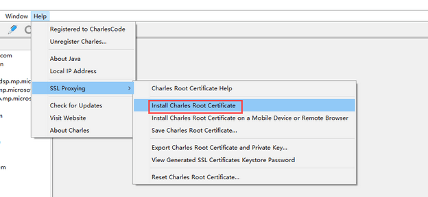

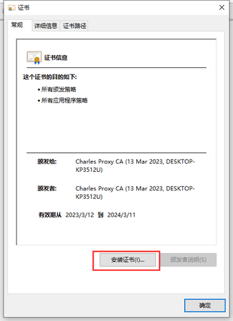

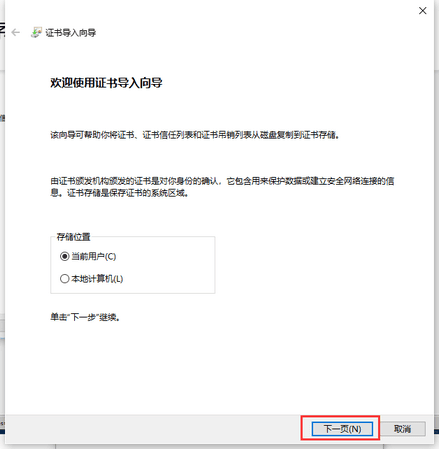

2. 接下来是重要的一步 ，一定要选择第二个安装地址，将证书安装到受信任的根证书下，不要使用第一个自动选择证书存储

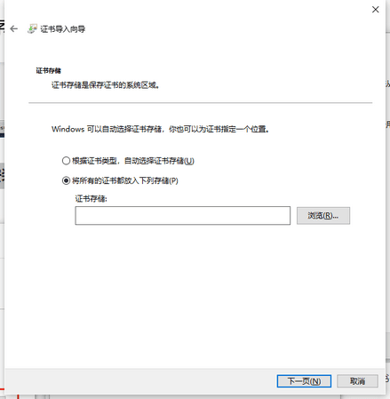

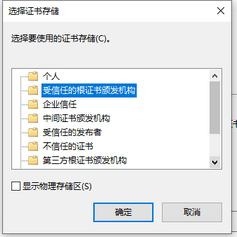

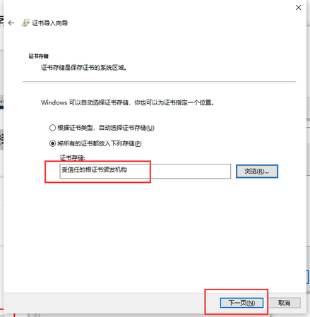

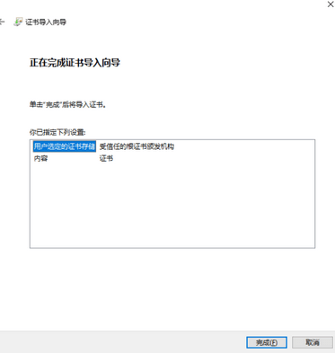

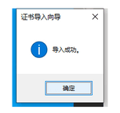

至此，证书安装完毕，如果这样我们开始抓包的话会遇到下面的情况，所以我们要继续设置 SSL Proxying Settings

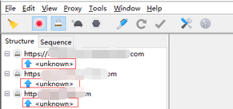

### 设置 SSL Proxying Settings

进入Charles - 》 Proxy - 》 SSL Proxying Settings

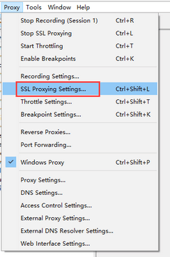

2. 打开SSL设置界面，将图上所示复选框选中，点击“Add”按钮，在弹出框的 “Host” 和 “Port” 都输入“*”，最后点击OK，根据提示，这样配置可以抓取所有的`https`包

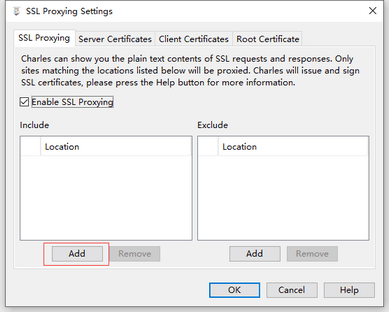

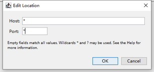

到此配置完毕，再次抓取`https`报文，就不会全部都是`unknown`了

## 测试结果

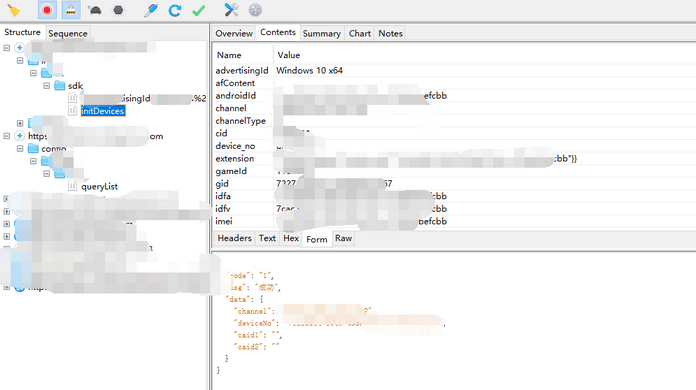

正常拿到数据，爽歪歪

## 参考

- [windows下PC端小程序抓包--Fiddler&Charles](https://cloud.tencent.com/developer/article/1833882)
- [Charles问题之Windows10下抓取https包，出现unknown](https://www.jianshu.com/p/0c95595e928d)

