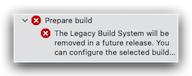
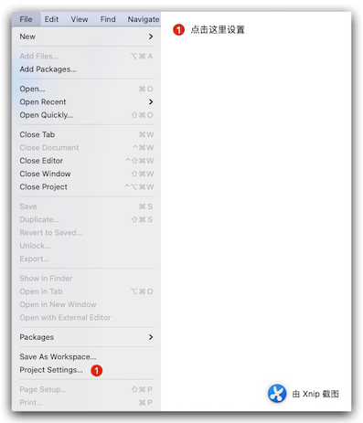
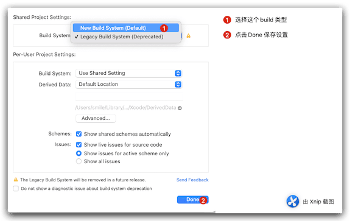

这几天刚刚升级了Xcode13在编译原来正常的项目的时候突然遇到错误：`The Legacy Build System will be removed in a future release. You can configure the selected build system and this deprecation message in File > Project Settings`. 很是疑惑，经过查找和搜索，终于解决了这个问题，下面简单的记录一下。
<!--more-->
原来正常编译的项目突然编译就报错了，此时内心各种 卧槽经过！！

## 报错现象

报错图片长这样：



信息内容这样：

```bash
The Legacy Build System will be removed in a future release. You can configure the selected build system and this deprecation message in File > Project Settings.
```

借助翻译软件得到结果：

```bash
旧版构建系统将在未来版本中删除。您可以在 文件 --> 项目设置 中配置选定的构建系统和此弃用消息。
```

既然查到了信息 说干就干 ：

## 解决步骤

1. 打开 `File` ---> `Project Setting`  面板



2. 修改Build System 类型



3. 设置完成后 重新编译项目。


4. 以上 正常解决。